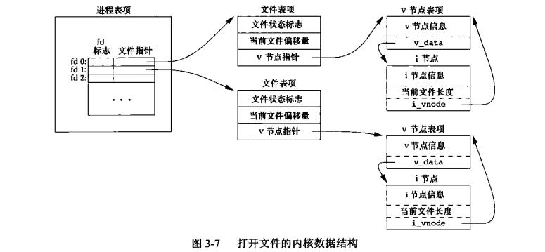
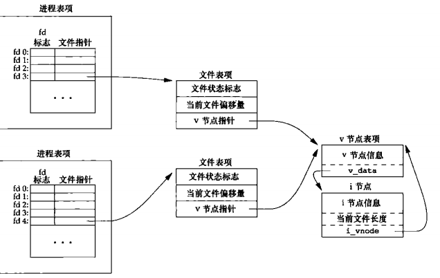

## 文件 I/O

### 文件描述符

对于内核而言，所有打开的文件都是通过文件描述符引用。文件描述符是一个非负整数。当打开一个现有文件或创建一个新文件时，内核向进程返回一个文件描述符。当读写一个文件时，使用 open 或 create 返回的文件描述符标识该文件，将其作为参数传送给 read 和 write,文件描述符的变化范围是 `0-OPEN_MAX-1` 

### 文件共享

`unix` 系统支持在不同进程间共享打开文件。内核使用 3 种数据结构表示打开文件，它们之间的关系决定了在文件共享方面一个进程对另一个进程产生的影响

1.每个进程在进程表中都有一个记录项，记录项中包含一张打开文件描述符表，每个描述符占用一项。与每个文件描述符相关联的是

a.文件描述符标志

b.指向一个文件表项的指针

2.内核为所有打开文件维持一张文件表。每个文件表项包含

a.文件状态标志（读，写，添写，同步和非阻塞）

b.当前文件偏移量

c.指向该文件 v 节点表项的指针

3.每个打开文件（或设备）都有一个 （v-node) 结构。包含文件类型和对此文件进行各种操作函数的指针。对于大多少文件，v 节点还包含该文件的 i 节点（i-node).这些信息是在打开文件时从磁盘读入内存的

进程对应的三张表之间的关系。（该进程有两个不同的打开文件，一个文件从标准输入打开，另一个从标准输出打开）



两个独立进程各自打开了同一文件



### 文件类型

`unix` 系统大多数文件时普通文件或目录。文件类型包含

- **普通文件：**这种数据是文本还是二进制数据，对 `unix` 内核而言并无区别。对普通文件内容的解释由处理该文件的应用程序进行
- **目录文件:**这种文件包含了其他文件的名字以及指向与这些文件有关信息的指针。
- **块特殊文件:**这种类型的文件提供对设备带缓冲的访问，每次访问以固定长度为单位进行
- **字符特殊文件：**这种类型的文件提供对设备不带缓冲的访问，每次访问长度可变。系统中的所有设备要么是字符特殊文件，要么是块特殊文件
- **FIFO:** 命名管道。用于进程间通信
- **套接字：**用于进程间的网络通信，也可以用于在一台主机上进程之间的非网络通信
- **符号连接：**这种类型的文件指向另一个文件。

### 设置用户 ID 和设置组 ID

与一个进程相关联的 ID有６个

- **实际用户 ID 和实际组 ID：**取自口令文件中的登录项，标识我们究竟是谁。通常在一个登录会话期间这些值并不改变，但是超级用户进程有方法改变它们。
- **有效用户ID，有效组ID，附属组ID：**决定了我们的文件访问权限
- **保存的设置用户ID和保存的设置组ID:** 在执行一个程序时包含了有效用户ID和有效组ID的副本

### 新文件和目录的所有权

- 新文件或目录的用户 ID 设置为进程的有效用户 ID。
- 新文件或目录的组 ID 可以是它所在目录的组 ID
- 新文件或目录的组 ID 可以是它所在目录的组 ID

### 流和 FILE 对象

对于 I/O 函数是围绕文件描述符的，当打开一个文件时，即返回一个文件描述符，然后该文件描述符就用于后续的 I/O 操作。而对于标准 I/O 库，它们的操作时围绕流（stream) 进行的。当用标准 I/O 库打开或创建一个文件时，就已使一个流与一个文件相关联。

对于 ASCII 字符集，一个字符用一个字节表示。对于国际字符集，一个字符可用多个字节表示。标准 I/O 文件流可用于单字节或多字节字符集。流的定向决定了所读，写的字符是单字节还是多字节的。当一个流最初被创建时，它并没有定向。若在未定向的流上使用一个多字节 I/O 函数，则将该流定义设置未宽定向的。若在未定向的流上使用一个单字节 I/O 函数，则将该流的定向设未字节定向的。

### 缓冲

标准 I/O 库提供缓冲的目的是尽可能减少使用 read 和 write 调用的次数。它也对每个 `I/O` 流自动地进行缓冲管理，标准 I/O 提供 3 种类型地缓冲

* **全缓冲：**在这种情况下，在填满标准 I/O 缓冲区后才进行实际 I/O 操作。对于驻留在磁盘上的文件通常是由标准 I/O 库实施全缓冲。在一个流上执行第一次 I/O 操作时，相关标准 I/O 函数通常调用 `malloc` 获得需使用的缓冲区
* **行缓冲:** 在这种情况下，当在输入和输出种遇到换行符时，标准 I/O 库执行 I/O 操作。这允许我们一次输出一个字符（用标准I/O 函数 `fputc`）但只有在写了一行之后才进行实际 I/O 操作。当流涉及一个终端时，通常使用行缓冲。行缓冲有两个限制。第一，因为标准 I/O 库用来收集每一行的缓冲区的长度时固定的。只要填满了缓冲区，即使还没有写一个换行符，也进行 I/O 操作。第二，任何时候只要通过标准 I/O 库要求从一个不带缓冲的流，或者一个行缓冲的流得到输入数据，那么就会冲洗所有行缓冲输出流。
* **不带缓冲：**标准 I/O 库不对字符进行缓冲存储。

### 缓冲特征

* 当且仅当标准输入和标准输出并不指向交互式设备时，它们才是全缓冲的

* 标准错误决不会时全缓冲的

* 标准错误是不带缓冲的

* 若是指向终端设备的流，则是行缓冲；否则是全缓冲

### 非阻塞 I/O

* 非阻塞 I/O 使 `open` `read` `write` 这样的 I/O 操作永远不会阻塞。如果这种操作不能完成，则调用立即出错返回，表示该操作如继续执行将阻塞
* 对于一个给定的描述符，有两种为其指定非阻塞 I/O 的方法：如果调用 `open`  获得描述符，则可指定 `O_NONBLOCK` 标志；对于已经打开的一个描述符，则可指定 `fcntl` ,由该函数打开 `O_NONBLOCK` 文件状态标志

### 记录锁

记录锁的功能是:当第一个进程正在读或修改文件的某个部分时，使用记录锁可以阻止其他进程修改同一文件区。即字节范围锁，它锁定的只是文件中的一个区域（也可能是整个文件）

* `fcntl` 记录锁

  ```c
  #include <fcntl.h>
  // 返回值：若成功，依赖于 cmd，否则，返回 -1
  int fcntl(int fd, int cmd, .../ * struct flock *flockptr */);
  ```

  对于记录锁，`cmd` 是 `F_GETLK` ，`F_SETLK`，`F_SETLKW`

  `F_GETLK`  判断由 `flockptr` 所描述的锁是否会被另外一把锁阻塞。如果存在一把锁，它阻止创建由 `flockptr` 所描述的锁，则该现有锁的信息将重写 `flockptr` 指向的信息。如果不存在这种情况，则除了将 `l_type` 设置为 `F_UNLCK` 之外，`flockptr` 所指向结构中的其他信息保持不变。

  `F_SETLK` 设置由 `flockptr` 所描述的锁。如果试图获得一把读锁（`l_typr` 为 `F_RDLCK`) 或写锁 (`l_type ` 为 `F_WRLCK` ) ，而兼容性规则阻止系统给我们这把锁，那么 `fcntl` 会立即出错返回，此时 `errno` 设置为`EACCES` 或 `EAGAIN`

  `F_SETLKW` 这个命令是 `F_SETLK` 的阻塞版本。如果锁请求的读锁或写锁因另一个进程当前已经对所请求区域的某部分进行了加锁而不能授予，那么调用进程会被设置为休眠。如果请求创建的锁已经可用，或休眠由信号中断，则该进程被唤醒。

  用 `F_GETLK` 测试能否建立一把锁，然后用 `F_SETLK` 或 `F_SETLKW` 企图建立那把锁，这两者不是一个原子操作。不能保证在这两次 `fcntl` 调用之间不会有另一个进程插入并建立一把相同的锁。如果不希望在等待锁变为可用时产生阻塞，就必须处理由 `F_SETLK` 返回的可能的出错。

  第三个参数是一个指向 `flock` 结构的指针

  ```c
  struct flock {
      short l_type;   /** F_RDLCK 共享读锁，F_WRLCK 独占性写锁，F_UNLCK 解锁一个区域 */
      short l_whence;    
      off_t l_start; 
      off_t l_len;   /** 区域的字节长度 */
      pid_t l_pid;  /** 进程的 ID 持有的锁能阻塞当前进程（仅由 F_GETLK返回）*/
  }
  ```

  共享读锁和独占性写锁的基本规则是：任意多个进程在一个给定的字节上可以有一把共享的读锁，但在一个给定字节上只能有一个进程有一个独占写锁。如果在一个给定字节上已经有一把或多把读锁，则不能在该字节上再加写锁；如果在一个字节上已经有一把独占性写锁，则不能再对它加任何读锁。如果一个进程对一个文件区间已经有了一把锁，后来该进程又企图在同一文件区间再加一把锁，那么新锁将替换已有锁。

  加读锁时，该描述符必须是读打开的，加写锁时，该描述符必须是写打开的

* 锁的隐含继承和释放

  锁与进程和文件两者相关联。这有两重含义：1.当一个进程终止时，它所建立的锁全部释放；2.无论一个描述符何时关闭，该进程通过这一描述符引用的文件上的任何一把锁都会释放（这些锁都是该进程设置的）

  由 `fork` 产生的子进程不继承父进程所设置的锁。这意味着：当一个进程得到一把锁，然后调用 `fork` ,那么对于父进程得到的锁而言，子进程被视为另一个进程。对于通过 `fork` 从父进程处继承过来的描述符，子进程需要调用 `fcntl` 才能获得它自己的锁。

  在执行 `exec` 后，新程序可以继承原执行程序的锁。但是，如果对一个文件描述符设置了执行时关闭标志，那么当作为 `exec` 的一部分关闭该文件描述符时，将释放相应文件的所有锁。

### I/O 多路转接

* 轮询：在所有支持非阻塞 I/O 的系统上都可以使用。将描述符都设置为非阻塞的，对第一个描述符发一个 `read` ，如果该输入上有数据，则读数据并处理它。如果无数据可读，则该调用立即返回。缺点是浪费 CPU 时间。
* 异步 I/O：当描述符准备好进行 I/O 时，用一个信号通知它。
* I/O 多路转接：先构造一张感兴趣的描述符的列表，然后调用一个函数，直到这些描述符中的一个已准备好进行 I/O 时，该函数才返回 `poll`，`pselect` ，`select` 这 3 个函数使我们能够执行 I/O 多路转接。在从这些函数返回时，进程会被告知哪些描述符已准备好可以进行 I/O 了。

#### `select`

```c
#include <sys/select.h>
// 返回值：准备就绪的描述符数目；若超时，返回 0；若出错，返回 -1
int select(int maxfdpl, fd_set *restrict readfds, fd_set *restrict writefds, fd_set *restrict exceptfds struct timeval *restrict tvptr);
```

`tvptr` 即愿意等待的时间长度，单位为秒和微秒。

`tvptr == NULL` 永远等待，如果捕捉到一个信号则中断此无限等待。当所指定的描述符中的一个已准备好或捕捉到一个信号则返回。如果捕捉到一个信号，则 `select` 返回 -1，`errno` 设置为 `EINTR`

`tvptr->tv_sec == 0 && tvptr->tv_usec == 0` 根本不等待。测试所有的描述符并立即返回。这是轮询系统找到多个描述符状态而不阻塞 `select` 函数的方法

`tvptr->tv_sec ！= 0 && tvptr->tv_usec != 0` 等待指定的秒数和微秒数。当指定的描述符之一已准备好，或当指定的时间值已经超过时立即返回。如果在超时到期时还没有一个描述符准备好，则返回值 0.（如果系统不提供微妙级别的精度，则 `tvptr->tv_usec` 值取整到最近的支持值）这种等待可被捕捉到的信号中断。 

`readfds`，`writefds`，`exceptfds` 是指向描述符集的指针。每个描述符集存储在一个 `fd_set` 数据类型中。这个数据类型是由实现选择的，它可以为每一个可能的描述符保持一位。对于 `fd_set` 数据类型，唯一可以进行的处理是：分配一个这种类型的变量，将这种类型的一个变量值赋给同类型的另一个变量，或对这种类型的变量使用下列 4 个函数中的一个

```c
#include <sys/select.h>
// 返回值：若 fd 在描述符集中，返回非 0 值；否则，返回 0
int FD_ISSET(int fd, fd_set *fdset);  
void FD_CLR(int fd, fd_set *fdset);
void FD_SET(int fd,fd_set *fdset);
void FD_ZERO(fd_set, *fdset);
```

这些接口可实现为宏或函数。调用 `FD_ZERO` 将一个 `fd_set` 变量的所有位设置为 0，要开启描述符集中的一位，可以调用 `FD_SET`，调用 `FD_CLR` 可以清除一位。可以调用 `FD_ISSET` 测试描述符集中的一个指定位是否已打开。在声明了一个描述符集之后，必须用 `FD_ZERO` 将这个描述符集置为 0，然后在其中设置我们关心的各个描述符的位。

`select` 的中间 3 个参数（指向描述符集的指针）中的任意一个（或全部）可以是空指针，这表示对相应条件并不关心。如果所有 3 个指针都是 NULL，则 `select` 提供了比 `sleep` 更精确的定时器。

`select` 第一个参数 `maxfdpl` 的意思是：最大文件描述符编号值加 1，考虑所有 3 个描述符集，在 3 个描述符集中找出最大描述符编号值，然后加 1，这就是第一个参数值。也可将第一个参数设置为 `FD_SETSIZE` ,这是`<sys/select.h>` 中的一个常量，它指定最大描述符数（经常是 1024），通过指定我们所关注的最大描述符，内核就只需在此范围内寻找打开的位，而不必在 3 个描述符集中的数百个没有使用的位内搜索。

返回值 -1 表示出错。在所指定的描述符一个都没有准备好时捕捉到一个信号。此种情况下，一个描述符集都不修改；返回值 0 表示没有描述符准备好。若指定的描述符一个都没有准备好，指定的时间就过了，则返回 0，此时所有的描述符集都会置为 0；一个正返回值说明了已经准备好的描述符数。该值是 3 个描述符集中已准备好的描述符数之和，所有如果同一描述符已准备好读和写，那么在返回值中会对其计两次数。在这种情况下，3 个描述符集中仍旧打开的位对应于已准备好的描述符（若对读集 `readfds` 中的一个描述符进行的 `read` 操作不会阻塞，则认为此描述符是准备好的。若对写集`writefd` 中的一个描述符进行的 `write` 操作不会阻塞，则认为此描述符是准备好的。若对异常条件集`execptfds` 中的一个描述符有一个未决异常条件，则认为此描述符是准备好的。异常条件包括：在网络连接上到达带外的数据，或者在处于数据包模式的伪终端上发生了某些条件。对于读写和异常条件，普通文件的文件描述符总是返回准备好）

一个描述符阻塞与否并不影响 `select` 是否阻塞，如果希望读一个非阻塞描述符，并且以超时值 5 秒调用 `select` ，则 `select` 最多阻塞 5s，如果指定一个无限的超时值，则在描述符数据准备好，或捕捉到一个信号之前，`select` 会一直阻塞。

### poll

`poll` 函数可用于任何类型的文件描述符。与 `select` 不同，`poll` 不是为每个条件（可读性，可写性和异常条件）构造一个描述符集，而是构造一个 `pollfd` 结构的数组，每个数组元素指定一个描述符编号以及对该描述符感兴趣的条件。

```c
#include <poll.h>
// 返回值：准备就绪的描述符数目；若超时，返回 0；若出错，返回 -1
int poll(struct pollfd fdarray[], nfds_t nfds, int timeout);
struct pollfd {
    int fd;
    short events;
    short revenet;
}
```

设置 `event` 成员的值一个或多个，告诉内核我们关心的是每个描述符的那些事件。返回时，`revents` 成员由内核设置，用于说明每个描述符发生了哪些事件。

*poll 的 events 和 revents 标志*


当一个描述符被挂断后（`POLLHUP`) 后，就不能再写该描述符，但是有可能仍然可以从该描述符读取到数据。

`timeout` 指定愿意等待的时

`timeout == -1` ，永远等待。当所指定的描述符中的一个已准备好，或捕捉到一个信号时返回。如果捕捉到一个信号，则 `poll` 返回 `-1` ，`errno` 设置为 `EINTR`

`timeout == 0` ，不等待。测试所有的描述符并立即返回。这是一种轮询系统的方法，可以找到多个描述符的状态而不阻塞 `poll` 函数

`timeout > 0`，等待 `timeout` 毫秒。当指定的描述符之一已准备好，或 `timeout` 到期时立即返回。如果 `timeout` 到期时还没有一个描述符准备好，则返回值 0

一个描述符是否阻塞不会影响 `poll` 是否阻塞

