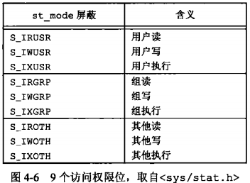
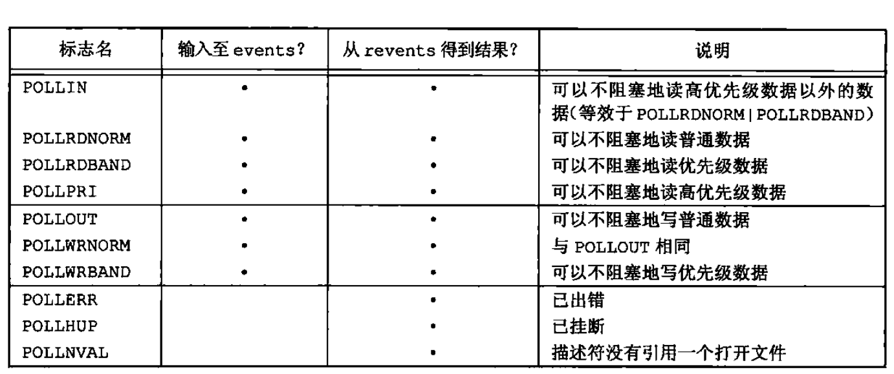

# 文件 I/O与文件目录

## 文件 I/O

### 文件描述符

对于内核而言，所有打开的文件都是通过文件描述符引用。文件描述符是一个非负整数。当打开一个现有文件或创建一个新文件时，内核向进程返回一个文件描述符。当读写一个文件时，使用 `open` 或 `create` 返回的文件描述符标识该文件，将其作为参数传送给 `read` 和 `write`,文件描述符的变化范围是 `0-OPEN_MAX-1` 

### 函数 `open` 和 `openat`

调用 `open` 或 `openat` 函数可以打开或创建一个文件

```c
#include <fcntl.h>
/** ..., ISO C 用这种方式表面余下的参数的数量及类型是可变的。对以下函数而言，仅当创建新文件时才使用最后这个参数。两个函数的返回值，若成功，返回文件描述符；若出错，返回 -1
**/
int open(const char *path, int oflag, .../* mode_t mode */);
int openat(int fd, const char *path, int oflag, .../* mode_t mode */);
```

* `path` 参数时要打开或创建文件的名字。

* `oflag` 参数可用来说明此函数的多个选项。用下列一个或多个常量进行 ”或“ 运算构成 `oflag` 参数

  **下列 5 个常量必须指定一个，且只能指定一个**

  `O_RDONLY`  只读打开

  `O_WRONLY`  只写打开

  `O_RDWR` 读，写打开

  `O_EXEC` 只执行打开

  `O_SEARCH` 只搜索打开（应用于目录）

  **下列常量是可选的：**

  `O_APPEND` 每次写时都追加到文件的尾端。

  `O_CLOEXEC` 把 `FD_CLOEXEC` 常量设置位文件描述符标志。

  `O_CREAT` 若此文件不存在则创建它。使用此选项时，`open` 函数需同时说明第 3 个参数 `mode` （`openat` 为第 4 个参数），用 `mode` 指定该新文件的访问权限位。

  `O_DIRECTORY` 如果 `path` 引用的不是目录，则出错。

  `O_EXCL` 如果同时指定了 `O_CREAT` ,而文件已经存在，则出错，因此可以测试一个文件是否存在，如果不存在，则创建此文件，这使测试和创建两者成为一个原子操作。

  `O_NOCTTY` 如果 `path` 引用的是终端设备，则不将该设备分配作为此进程的控制终端

  `O_NOFOLLOW` 如果 `path` 引用的是一个符号连接，则出错

  `O_NONBLOCK` 如果 `path` 引用的是一个 `FIFO`，一个块特殊文件或字特殊文件，则此选项为文件的本次打开操作和后续的 I/O 操作设置非阻塞方式。

  `O_SYNC` 使每次 `write` 等待物理 I/O 操作完成，包括由该 `write` 操作引起的文件属性更新所需的 I/O。

  `O_TRUNC` 如果此文件存在，而且为只写或读-写成功打开，则将其长度截断为 0

  `O_TTY_INIT` 如果打开一个还未打开的终端设备，设置非标准 `termios` 参数值，使其符合 SUS.

  **下列两个标志也是可选的。它们是 SUS 中同步输入和输出选项的一部分**

  `O_DSYNC` 使每次 `write` 要等待物理 I/O 操作完成，但是如果该写操作并不影响读取刚写入的数据，则不需等待文件属性被更新

  `O_RSYNC` 使每一个以文件描述符作为参数进行的 `read` 操作等待，直至所有对文件同一部分挂起的写操作都完成

* 由 `open` 和 `openat` 函数返回的文件描述符一定是最小的未用描述符数值。这一点被某些应用程序用来在标准输入，标准输出或标准错误上打开新的文件。（一个应用程序可以先关闭标准输出，通常文件描述符1，然后打开另一个文件，执行打开操作前就能了解该文件一定会在文件描述符 1 上打开。
* `fd` 参数把 `open` 和 `openat` 函数区分开，共有 3 种可能性
  1. `path` 参数指定的是绝对路径名，在这种情况下，`fd` 参数被忽略，`openat` 函数就相当于 `open` 函数
  2. `path` 参数指定的是相对路径名，`fd` 参数指出了相对路径名在文件系统中的开始地址。`fd` 参数是通过打开相对路径名所在的目录来获取
  3. `path` 参数指定了相对路径名，`fd` 参数具有特殊值 `AT_FDCWD` ，在这种情况下，路径名在当前工作目录中获取，`openat` 函数在操作上与 `open` 函数类似

### creat

使用 `creat` 函数可以创建一个新文件，等效于 `open(path, O_WRONLY | O_TRUNC, mode)`

```c
#include <fcntl.h>
// 返回值：若成功，返回为只写打开的文件描述符；若出错，返回 -1
int creat(const char *path, mode_t mode);
```

`creat` 的一个不足是它以只写方式打开所创建的文件。在提供 `open` 的新版本之前，如果要创建一个临时文件，并要先写该文件，然后又读该文件，则必须先调用 `creat` , `close` ,然后再调用 `open` 。现在则可用 `open(path, O_RDWR|O_CREAT|O_TRUNC, mode)`

### close

可调用 `close` 函数关闭一个打开文件

```c
#include <unistd.h>
// 返回值：若成功，返回 0；若出错，返回 -1
int close (int fd);
```

### lseek

每个打开文件都有一个与其关联的“当前文件偏移量”。它通常是一个非负整数，用以度量从文件开始处计算的字节数。通常读，写操作都从当前文件偏移量处开始，并使偏移量增加所读写的字节数。按照系统默认的情况，当打开一个文件时，除非指定 `O_APPEND` 选项，否则该偏移量被设置为 0.

可用调用 `lseek` 显示地为一个打开文件设置偏移量

```c
#include <unistd.h>
// 返回值：若成功，返回新的文件偏移量；若出错，返回 -1
off_t lseek(int fd, off_t offset, int whence);
```

对参数 `offset` 地解释与参数 `whence` 的值有关

若 `whence` 是 `SEEK_SET` ，则将该文件的偏移量设为距文件开始处 `offset` 个字节

若 `whence` 是 `SEEK_CUR`，则将该文件的偏移量设置为当前值加 `offset` ,`offset` 可为正或负

若 `whence` 是 `SEEK_END` , 则将该文件的偏移量设置为文件长度加 `offset` ，`offset` 可正可负

若 `lseek` 成功执行，则返回新的文件偏移量。

```c
// 获取打开文件的当前偏移量
off_t currpos;
currpos = lseek(fd, 0, SEEK_CUR);
```

如果文件描述符指向的是一个管道，FIFO 或网络套接字，则 `lseek` 返回 -1，并将 `errno` 设置为 `ESPIPE`

### read

调用 `read` 函数从打开文件中读数据

```c
#include <unistd.h>
// 返回值：读到的字节数，若已到文件尾，返回 0；若出错，返回 -1
ssize_t read(int fd, void *buf, size_t nbytes);
```

以下情况可使实际读到的字节数少于要求读的字节数

* 读普通文件时，在读到要求字节数之前已到达了文件尾端。（返回实际字节数，再次调用，返回 0）
* 当从终端设备读时，通常一次最多读一行
* 当从网络读时，通常一次最多读一行
* 当从网络读时，网络中的缓冲机制可能造成返回值小于所要求读的字节数
* 当从管道或 FIFO 读时，如若管道包含的字节数少于所需要的数量，那么 `read` 将只返回实际可用的字节数
* 当从某些面向记录的设备读时，一次最多返回一个记录
* 当一信号造成中断，而已经读了部分数据量时。

### write

调用 `write` 函数向打开文件写数据

```c
#include <unistd.h>
// 返回值：若成功，返回已写的字节数；若出错，返回 -1
ssize_t write(int fd, const void *buf, size_t nbytes);
```

返回值通常与参数 `nbytes` 的值相同，否则表示出错。`write` 出错的一个常见原因是磁盘已写满，或者超过了一个给定进程的文件长度限制。对于普通文件，写操作从文件的当前偏移量处开始。如果在打开该文件时，指定了 `O_APPEND` 选项，则在每次写操作之前，将文件偏移量设置在文件的当前结尾处。在一次成功写之后，该文件偏移量增加实际写的字节数

### 文件共享

`unix` 系统支持在不同进程间共享打开文件。内核使用 3 种数据结构表示打开文件，它们之间的关系决定了在文件共享方面一个进程对另一个进程产生的影响

* 每个进程在进程表中都有一个记录项，记录项中包含一张打开文件描述符表，可将其视为一个矢量，每个描述符占用一项。与每个文件描述符相关联的是

    a.文件描述符标志
    
    b.指向一个文件表项的指针

* 内核为所有打开文件维持一张文件表。每个文件表项包含

    a.文件状态标志（读，写，添写，同步和非阻塞）

    b.当前文件偏移量

    c.指向该文件 v 节点表项的指针

* 每个打开文件（或设备）都有一个 （v-node) 结构。包含文件类型和对此文件进行各种操作函数的指针。对于大多数文件，v 节点还包含该文件的 i 节点（i-node)，这些信息是在打开文件时从磁盘读入内存的

进程对应的三张表之间的关系。（该进程有两个不同的打开文件，一个文件从标准输入打开，另一个从标准输出打开）


两个独立进程各自打开了同一文件


### 复制现有的文件描述符

```
#include <unistd.h>
// 两个函数的返回值：若成功，返回新的文件描述符；若出错，返回 -1
int dup(int fd);
int dup2(int fd, int fd2);
```

由 `dup` 返回的新文件描述符一定是当前可用文件描述符中的最小数值。对于 `dup2` ，可以用 `fd2` 参数指定新描述符的值。如果 `fd2` 已经打开，则先将其关闭。若 `fd` 等于 `fd2` ，则 `dup2` 返回 `fd2` ，而不关闭它。否则，`fd2` 的 `FD_CLOEXEC` 文件描述符标志就被清除，这样 `fd2` 在进程调用 `exec` 时时打开状态


### `sync`、`fsync`、`fdatasync` 

传统的 UNIX 系统实现在内核中设有缓冲区高速缓存或页高速缓存，大多数磁盘 `I/O` 都通过缓冲区进行。当我们向文件写入数据时，内核通常先将数据复制到缓冲区中，然后排入队列，晚些时候再写入磁盘。这种方式被称为**延迟写**。通常，当内核需要重写缓冲区来存放其他磁盘块数据时，它会把所有延迟写数据写入磁盘。为了保证磁盘上实际文件系统与缓存区内容的一致性，UNIX 系统提供了 `sync`，`fsync` ，`fdatasync` 三个函数

```c
#include <unistd.h>
// 返回值：若成功，返回 0；若出错，返回 -1
int fsync(int fd);
int fdatasync(int fd);
void sync(void);
```

`sync` 只是将所有修改过的块缓冲区排入写队列，然后就返回，它并不等待实际写磁盘操作结束。通常，称为 `update` 的系统守护进程周期性地调用(一般每隔 30 秒) `sync` 函数。这就保证了定期冲洗内核地块缓冲区。命令 `sync(1)` 也调用 `sync` 函数

`fsync` 函数只对由文件描述符 `fd` 指定地一个文件起作用，并且等待写磁盘操作结束才返回。`fsync` 可用于数据库这样地应用程序，这种应用程序需要确保修改过地块立即写到磁盘上。

`fdatasync` 函数类似于 `fsync` ，但它只影响文件地数据部分。而除数据外，`fsync` 还会用步更新文件地属性。

### fcntl

```c
#include <fcntl.h>
// 返回值：若成功，则依赖于 cmd;若出错，返回 -1
int fcntl(int fd, int cmd, .../* int arg */);
```

`fcntl` 函数可以改变已经打开文件地属性。`fcntl` 函数有以下 5 种功能

1. 复制一个已有地描述符（`cmd = F_DUPFD` 或 `F_DUPFD_CLOEXEC`)
2. 获取/设置文件描述符标志（`cmd=F_GETFD` 或 `F_SETFD`)
3. 获取/设置文件标志状态（`cmd=F_GETFL` 或 `F_SETFL`)
4. 获取/设置异步 I/O 所有权（`cmd=F_GETOWN` 或 `F_SETOWN`)
5. 获取/设置记录锁（`cmd=F_GETLK`,`F_SETLK` ,`F_SETLKW`)

以下文件状态标志与进程表项中各文件描述符相关联，及与每个文件表项中的文件状态标志相关联

* `F_DUPFD` 复制文件描述符 `fd` 。新文件描述符作为函数值返回。它是尚未打开的各描述符中大于或等于第 3 个参数值（取为整型值）中各值的最小值。新描述符与 `fd` 共享同一个文件表项。但是，新描述符有它自己的一套文件描述符标志，其 `FD_CLOEXEC` 文件描述符被清除（这表示该描述符在 `exec` 时仍保持有效）
* `F_DUPFD_CLOEXEC` 复制文件描述符，设置与新描述符关联的 `FD_CLOEXEC` 文件描述符标志的值，返回新文件描述符
* `F_GETFD`  对应于 `fd` 的文件描述符标志作为函数值返回。当前只定义了一个文件描述符标志 `FD_CLOEXEC`
* `F_SETFD`  对于 `fd` 设置文件描述符标志。新标识值按第 3 个参数（取为整型值）设置
* `F_GETFL`  对应于 `fd` 的文件状态标志作为函数值返回。（`open` 函数的文件状态标志）
* `F_SETFL`  将文件状态标志设置为第 3 个参数的值（取为整型值）。可以更改的几个标志是：`O_APPEND`，`O_NOBLOCK`，`O_SYNC`，`O_DSYNC`，`O_RSYNC`，`O_FSYNC`，`O_ASYNC`
* `F_GETOWN`  获取当前接收 `SIGIO` 和 `SIGURG` 信号的进程 ID 或进程组 ID。
* `F_SETOWN`  设置接收 `SIGIO` 和 `SIGURG` 信号的进程 ID 或进程组 `ID`。正的 `arg` 指定一个进程 ID，负的 `arg` 表示等于 `arg` 绝对值的一个进程组 ID 

`fcntl` 的返回值与命令有关。如果出错，所有命令都返回 -1，如果成功则返回某个其他值。`F_DUPFD` 返回新的文件描述符，`F_GETFD`，`F_GETFL` 返回相应的标志，`F_GETOWN` 返回一个正的进程 ID 或负的进程组 ID

## 文件和目录

`stat`，`fstat`，`fstatat` ，`lstat`

```c
#include <sys/stat.h>
int stat(const char *restrict pathname, struct *restrict buf);
int fstat(int fd, struct stat *buf);
int lstat(const char *restrict pathname, struct stat *restrict buf);
int fstatat(int fd,const char *restrict pathname,struct stat *restrict buf, int flag);
```

* 当给出 `pathname`, `stat` 函数将返回与此命名文件有关的信息结构。

* `fstat` 函数获得已在描述符 `fd` 上打开文件的有关信息。

* `lstat` 函数类似于 `stat`,但是当命名的文件是一个符号链接是，`lstat` 返回该符号链接的有关信息，而不是由该符号链接引用的文件的信息

* `fstatat` 函数为一个相对于当前打开目录（由 `fd` 参数指向）的路径名返回文件统计信息。`flag` 参数控制着是否跟随着一个符号链接。当 `AT_SYMLINK_NOFOLLOW` 标志被设置时，`fstatat` 不会跟随符号链接，而是返回符号链接本身的信息。否则，在默认情况下，返回的是符号链接所指向的实际文件的信息。如果 `fd` 参数的值是 `AT_FDCWD` ，并且 `pathname` 参数是一个相对路径名，`fstatat` 会计算相对于当前目录的 `pathname` 参数。如果 `pathname` 是一个绝对路径，`fd` 参数就会被忽略。在这两种情况下，根据 `flag` 的取值，`fstatat` 的作用就跟 `stat` 或 `lstat` 一样。第 2 个参数 `buf` 是一个指针，它指向一个我们必须提供的结构。函数来填充由 `buf` 指向的结构。

  ```c
  struct stat {
      mode_t st_mode;
      ino_t  st_ino;
      dev_t  st_dev;
      nlink_t  st_rdev;
      uid_t 	st_uid;
      gid_t  st_gid;
      off_t   st_size;
      struct   timespec  st_atime;
      struct   timespec  st_mtime;
      struct   timespec  st_ctime;
      blksize_t  st_blksize;
      blkcnt_t	st_blocks;
  }
  ```

### 文件访问权限

`st_mode`  值包含了对文件的访问权限位。当提及文件时，值得是任何类型文件。所有文件类型都有访问权限。

每个文件都有 9 个访问权限位



9 个常量可分成 3 组

```c
S_IRWXU = S_IRUSR|S_IWUSR|S_IXUSR
S_IRWXG = S_IRGRP|S_IWGRP|S_IXGRP
S_IRWXO = S_IROTH|S_IWOTH|S_IXOTH
```

*文件权限位对文件和目录的影响*


**用户：** 指的是文件所有者 （owner）。`chmod` 命令用于修改这 9 个权限位。

读写执行的访问权限以各种方式由不同的函数使用。使用方式如下：

* 用名字打开任一类型的文件时，对该名字中包含的每一个目录，包括它可能隐含的当前工作目录都应具有执行权限。（目录执行权限位一般称为搜索位）。对于目录的读权限和执行权限的意义是不相同的。读权限允许读目录，获得在该目录中所有文件名的列表。当一个目录是我们要访问文件的路径名的一个组成部分时，对该目录的执行权限使我们可通过该目录。
* 对于一个文件的读权限决定了是否能够打开现有文件进行读操作。这与 `open` 函数的 `O_RDONLY` 和 `O_RDWR` 标志相关
* 对于一个文件的写权限决定了是否能够打开现有文件进行写操作。这与 `open` 函数的 `O_WRONLY` 和 `O_RDWR` 标志相关
* 为了在 `open` 函数中对一个文件指定 `O_TRUNC` 标志，必须对该文件具有写权限
* 为了在一个目录中创建一个新文件，必须对该目录具有写和执行权限
* 为了删除一个现有文件，必须对包含该文件的目录具有写权限和执行权限。对该文件本身不需要读，写执行权限
* 如果用 7 `exec` 函数中的任何一个执行某个文件，都必须对该文件具有执行权限。且该文件必须是一个普通文件

进程每次打开，创建和删除一个文件时，内核就进行文件访问权限测试，而这种测试可能涉及文件的所有者（`st_uid` 和 `st_gid`），进程的有效 ID （有效用户 ID 和有效组 ID）以及进程的附属组 ID （若支持的话）。两个所有者 ID 是文件的性质，而两个有效 ID 和附属组 ID 则是进程的性质。内核进行的测试具体如下：

1. 若进程的有效用户 ID 是 0（超级用户），则允许访问。这给予了超级用户对整个文件系统进行处理的最充分的自由
2. 若进程的有效用户 ID 等于文件的所有者 ID (即进程拥有此文件)，那么如果所有者适当的访问权限位被设置，则允许访问；否则拒绝访问。适当的访问权限位指的是：若进程为读而打开该文件，则用户读位应为 1；若进程为写而打开该文件，则用户写位应为 1；若进程将执行该文件，则用户执行位应为 1。
3. 若进程的有效组 ID 或进程的附属组 ID 之一等于文件的组 ID，那么如果组适当的访问权限位被设置，则允许访问；否则拒绝访问
4. 若其他用户适当的访问权限位被设置，则允许访问；否则拒绝访问；

按顺序执行这 4 步。注意。如果进程拥有此文件（第 2 步），则按用户访问权限批准或拒绝该进程对文件的访问--不查看组访问权限。类似的，若进程并不拥有该文件。但进程属于某个适当的组，则按组访问权限批准或拒绝该进程对文件的访问--不查看其他用户的访问权限。

### access 和 `faccessat`

`access` 和 `faccessat` 函数是按实际用户 ID 和实际组 ID 进行访问权限测试的，该测试同由进程有效用户 ID 测试步骤一样。

```c
#include <unistd.h>
// 两个函数的返回值：若成功，返回 0；若出错，返回 -1
int access(const char *pathname, int mode);
int faccessat(int fd, const char *pathname, int mode, int flag);
```

`faccessat` 函数与 `access` 函数在下面两种情况下是相同的：一种是 `pathname` 参数为绝对路径，另一种是`fd` 参数取值为 `AT_FDCWD` 而 `pathname` 参数为相对路径。否则，`faccessat` 计算相对于打开目录（由`fd` 参数指向）的 `pathname`

`flag` 参数可以用于改变 `faccessat` 的行为，如果 `flag` 设置为 `AT_EACCESS`, 访问检查用的是调用进程的有效用户 ID 和有效组 ID，而不是实际用户 ID 和实际组 ID。

### 文件类型

`unix` 系统大多数文件是普通文件或目录。文件类型包含

- **普通文件:** 这种数据是文本还是二进制数据，对 `unix` 内核而言并无区别。对普通文件内容的解释由处理该文件的应用程序进行
- **目录文件:** 这种文件包含了其他文件的名字以及指向与这些文件有关信息的指针。
- **块特殊文件:** 这种类型的文件提供对设备带缓冲的访问，每次访问以固定长度为单位进行
- **字符特殊文件:** 这种类型的文件提供对设备不带缓冲的访问，每次访问长度可变。系统中的所有设备要么是字符特殊文件，要么是块特殊文件
- **FIFO:** 命名管道。用于进程间通信
- **套接字:** 用于进程间的网络通信，也可以用于在一台主机上进程之间的非网络通信
- **符号连接:** 这种类型的文件指向另一个文件。

### 设置用户 ID 和设置组 ID

与一个进程相关联的 ID有６个

- **实际用户 ID 和实际组 ID:** 取自口令文件中的登录项，标识我们究竟是谁。通常在一个登录会话期间这些值并不改变，但是超级用户进程有方法改变它们。

- **有效用户ID，有效组ID，附属组ID:** 决定了我们的文件访问权限（用于文件访问权限检查）

- **保存的设置用户ID和保存的设置组ID:** 在执行一个程序时包含了有效用户ID和有效组ID的副本

  通常，有效用户 ID 等于实际用户 ID，有效组 ID 等于实际组 ID。

  每个文件有一个所有者和组所有者，所有者由 `stat` 结构中的 `st_uid` 指定，组所有者则由 `st_gid` 指定。

  当执行一个程序文件时，进程的有效用户 ID 通常就是实际用户 ID，有效组 ID 通常就是实际组 ID。但是可以在文件模式字（`st_mode`)中设置一个特殊标志，其含义是”当执行文件时，将进程的有效用户 ID 设置为文件所有者的用户 ID (`st_uid`) “，与此相类似，在文件模式中可以设置另一位，它将执行此文件的进程的有效组 ID　设置位文件的组所有者 ID (`st_gid`)，在文件模式字中的这两位被称为 **设置用户ID位** 和 **设置组ID位** 

  例如，若文件所有者是超级用户，而且设置了该文件的设置用户 ID 位，那么当该程序文件由一个进程执行时，该进程具有超级用户权限。不管执行此文件的进程的实际用户 ID 是什么，都会是这样。

### 新文件和目录的所有权

用 `open` 或 `create` 创建新文件时

- 新文件或目录的用户 ID 设置为进程的有效用户 ID。
- 新文件或目录的组 ID 可以是它所在目录的组 ID

### 函数 umask

`umask` 函数为进程设置文件模式创建屏蔽字，并返回之前的值，没有出错返回值

```c
#include <sys/stat.h>
// 返回值：之前的文件模式创建屏蔽字
mode_t umask(mode_t cmask);
```

参数 `cmask` 是 9 个文件权限位（`S_IRUSR`, `S_IWUSR` 等）中的若干个按位或构成的。

在进程创建一个新文件或新目录时，就一定会使用文件模式创建屏蔽字。`open` 和 `creat` 函数。这两个函数都有一个参数 `mode` ，它指定了新文件的访问权限位

### 更改现有文件的访问权限

`chmod`，`fchmod`，`fchmodat` 这 3 个函数使我们可以更改现有文件的访问权限。

```c
#include <sys/stat.h>
// 返回值：若成功，返回 0；若出错，返回 -1
int chmod(const char *pathname, mode_t mode);
int fchmod(int fd, mode_t mode);
int fchmodat(int fd, const char *pathname, mode_t mode, int flag);
```

* `chmod` 函数在指定的文件上进行操作，而 `fchmod` 函数则对已打开的文件进行操作。`fchmodat` 函数与 `chmod` 函数在下面两种情况下是相同的：一种是 `pathname` 参数位绝对路径，另一种是 `fd` 参数取值为 `AT_FDCWD` 而 `pathname` 参数为相对路径。否则，`fchmodat` 计算相对于打开目录（`fd` 参数指向）的 `pathname` 。`flag` 参数可以用于改变 `fchmodat` 的行为，当设置了 `AT_SYMLINK_NOFOLLOW` 标志，`fchmodat` 并不会跟随符号链接。

* 为了改变一个文件的权限位，进程的有效用户 ID 必须等于文件的所有者 ID，或者该进程必须具有超级用户权限。

* 参数 `mode` 是下列常量的按位或

  

### 粘着位

如果对一个目录设置了粘着位，只有对该目录具有写权限的用户并且满足下列条件之一，才能删除或重命名该目录下的文件：

* 拥有此文件
* 拥有此目录
* 是超级用户

### 更改文件的用户 ID 和组 ID。

```c
#include <unistd.h>
// 4 个函数的返回值：若成功，返回 0：若出错，返回 -1
int chown(const char *pathname, uid_t owner, gid_t group);
int fchown(int fd, uid_t owner, gid_t group);
int fchownat(int fd, const char *pathname, uid_t owner, git_t group, int flag);
int lchown(const char *pathname, uid_t owner, gid_t group);
```

如果 `owner` 或 `group` 中的任意一个是 -1，则对应的 ID不变。除了所引用的文件是符号链接以外，这 4 个函数的操作类似。在符号链接情况下，`lchown` 和 `fchownat` （设置了 `AT_SYMLINK_NOFOLLOW` 标志）更改符号链接本身的所有值，而不是该符号链接所指向的文件的所有值

`fchown` 函数改变 `fd` 参数指向的打开文件的所有者，既然它在一个已打开的文件上操作，就不能用于改变符号链接的所有者。

`fchownat` 函数与 `chown` 或者 `lchown` 函数在下面两种情况下是相同的：一种是 `pathname` 参数为绝对路径，另一种是 `fd` 参数取值为 `AT_FDCWD` 而 `pathname` 参数为相对路径。在这两种情况下，如果 `flag` 参数中设置了 `AT_SYMLINK_NOFOLLOW` 标志，`fchownat` 和 `lchown` 行为相同，如果 `flag` 参数中清除了 `AT_SYMLINK_NOFOLLOW` 标志，则 `fchownat` 与 `chown` 行为相同。如果 `fd` 参数设置为打开目录的文件描述符，并且`pathmane` 参数是一个相对路径名，`fchownat` 函数计算相对于打开目录的 `pathname`

### 文件系统

i 节点是固定长度的记录项，它包含有关文件的大部分信息

*磁盘，分区和文件系统*


*柱面组的 i 节点和数据块*


* 每个 i 节点中都有一个链接计数，其值是指向该 i 节点的目录项数。只有当链接计数减少至 0 时，才可删除该文件（释放该文件占用的数据块）。在 `stat` 结构中，链接计数包含在 `st_nlink` 成员中，其基本系统数据类型是 `nlink_t` 。这种链接类型称为**硬链接**
* **符号链接**，符号链接文件的实际内容（在数据块中）包含了该符号链接所指向的文件的名字。该 i 节点中的文件类型是 `S_IFLNK` 
* i 节点包含了文件有关的所有信息：文件类型、文件访问权限位、文件长度和指向文件数据块的指针等。`stat` 结构中的大多数信息都取自 i 节点。只有两项重要数据存放在目录项中：文件名和 i 节点编号。i 节点编号的数据类型是 `ino_t`
* 目录项中的 i 节点编号指向同一文件系统中的相应 i 节点，一个目录项不能指向另一个文件系统的 i 节点。
* 当在不更换文件系统的情况下为一个文件重命名时，该文件的实际内容并未移动，只需构造一个指向现有 i 节点的新目录项，并删除老的目录项。链接计算不会改变

### `link` 、`linkat`、`unlink`、`unlinkat`、`remove`

任何一个文件可以有多个目录项指向其 i 节点。创建一个指向现有文件的链接的方法是使用 `link` 函数或 `linkat` 函数

```c
#include <unistd.h>
// 两个函数的返回值：若成功，返回 0；若出错，返回 -1
int link(const char *existingpath, const char *newpath);
int linkat(int efd, const char *existingpath, int nfd, const *newpath, int flag);
```

这两个函数创建一个新目录项 `newpath` ,它引用现有文件 `existingpath` ，如果 `newpath` 已经存在，则返回出错。只创建 `newpath` 中的最后一个分量，路径中的其他部分应当已经存在。

对于 `linkat` 函数，现有文件是通过 `efd` 和 `existingpath` 参数指定的，新的路径名是通过 `nfd` 和 `newpath` 参数指定的。默认情况下，如果两个文件描述符中的任一个设置为 `AT_FDCWD` , 那么相应的路径名（如果它是相对路径）就通过相对于当前目录进行计算。如果任一路径名是绝对路径，相应的文件描述符参数就会被忽略。

当现有文件时符号链接时，由 `flag` 参数来控制 `linkat` 函数是创建指向现有符号链接的链接还是创建指向现有符号链接所指向的文件的链接。如果在 `flag` 参数中设置了 `AT_SYMLINK_FOLLOW` 标志，就创建指向符号链接目标的链接。如果这个标志被清楚了，则创建一个指向符号链接本身的链接

删除一个现有的目录项

```c
#include <unistd.h>
// 两个函数的返回值：若成功，返回 0；若出错，返回 -1
int unlink(const char *pathname);
int unlinkat(int fd, const char *pathname, int flag);
```

这两个函数删除目录项，并将由 `pathname` 所引用文件的链接计数减 1，如果对该文件还有其他链接，则仍可通过其他链接访问该文件的数据。如果出错，则不对该文件做任何更改。

只有当链接计数达到 0 时，该文件的内容才可以被删除。另一个条件也会阻止删除文件的内容--只要有进程打开了该文件，其内容也不能删除。关闭一个文件时，内核首先检查打开该文件的进程个数；如果这个计数达到 0，内核再去检查其链接计数；如果计数也是 0，那么就删除该文件的内容。

如果 `pathname ` 参数是相对路径名，那么 `unlinkat` 函数计算相对于由 `fd` 文件描述符参数代表的目录的路径名。如果 `fd` 参数设置为 `AT_FDCWD`,那么通过相对于调用进程的当前工作目录来计算路径名。如果 `pathname` 参数是绝对路径名，那么 `fd` 参数被忽略

`flag` 参数给出了一种方法，使调用进程可以改变 `unlinkat` 函数的默认行为。当 `AT_REMOVEDIR` 标志被设置时，`unlinkat` 函数可以类似于 `rmdir` 一样删除目录。如果这个标志被清除，`unlinkat` 与 `unlink` 执行同样的操作。

进程用 `open` 或 `creat` 创建一个文件，然后立即调用 `unlink` ,因为该文件仍旧是打开的，所以不会将其内容删除。只有当进程关闭该文件或终止时（这种情况下，内核关闭该进程所打开的全部文件），该文件的内容才被删除

如果 `pathname` 是符号链接，那么 `unlink` 删除该符号链接，而不是删除由该链接所引用的文件。给出符号链接名的情况下，没有一个函数能阐述由该链接所引用的文件

```c
#include <stdio.h>
// 返回值：若成功，返回 0；若出错，返回 -1
int remove(const char *pathname);
```

对于文件，`remove` 的功能与 `unlink` 相同，对于目录，`remove` 的功能与 `rmdir` 相同

### 重命名文件或目录

文件和目录可以用`rename` 函数或者 `renameat` 函数进行重命名

```c
#include <stdio.h>
// 两个函数的返回值：若成功，返回 0；若出错，返回 -1
int rename(const char *oldname, const char *newname);
int renameat(int oldfd, const char *oldname, int newfd, const char *newname);
```

根据 `oldname` 是指文件、目录还是符合链接，有几种情况

1. 如果 `oldname` 指的是一个文件而不是目录，那么为该文件或符合链接重命名。在这种情况下，如果 `newname` 已存在，则它不能引用一个目录。如果 `newname` 已存在，而且不是一个目录，则先将该目录项删除然后将 `oldname` 重命名为 `newname`。对包含 `oldname` 的目录以及包含 `newname` 的目录，调用进程必须具有写权限，因为将更改这两个目录
2. 如果 `oldname` 指的是一个目录，那么为该目录重命名。如果 `newname` 已存在，则它必须引用一个目录，而且该目录应当是空目录。如果 `newname` 存在（而且是一个空目录），则先将其删除，然后将 `oldname` 重命名为`newname`。另外当为一个目录重命名时，`newname` 不能包含 `oldname` 作为其路径前缀。（因为旧名字是新名字的路径前缀，因而不能将其删除。
3. 如果 `oldname` 或 `newname` 引用符号链接，则处理的是符号链接本身，而不是它所引用的文件
4. 不能对 `.` 和 `..` 重命名。`.` 和 `..` 不能出现在 `oldname`和 `newname` 的最后部分。
5. 如果 `oldname` 和 `newname` 引用同一文件，则函数不做任何更改而成功返回

如若 `newname` 已经存在，则调用进程对它需要有写权限。调用进程将删除 `oldname` 目录项，并可能要创建 `newname` 目录项，所以它需要对包含 `oldname` 及包含 `newname` 的目录具有写和指向权限。

除了当 `oldname` 或 `newname` 指向相对路径名时，其他情况下 `renameat` 函数与 `rename` 函数功能相同。如果 `oldname` 参数指定了相对路径，就相对于 `oldfd` 引用的目录来计算 `newname`。`oldfd` 或 `newfd` 参数（或两者）都能设置成 `AT_FDCWD`,此时相对于当前目录来计算相应的路径名。

### 符号链接

符号链接时对一个文件的简洁指针（硬链接直接指向文件的 i 节点）

* 硬链接通常要求链接和文件位于同一文件系统中
* 只有超级用户才能创建指向目录的硬链接（在底层文件系统支持的情况下）

对符号链接以及它指向何种对象并无任何文件系统限制，任何用户都可以创建指向目录的符号链接/符号链接一般用于将一个文件或整个目录结构移到系统中另一个位置

当使用以名字引用文件的函数时，应当了解该函数是否处理符号链接（即该函数是否跟随符号链接到达它所链接的文件）如果该函数具有符号链接的功能，则其路径名参数引用由符号链接指向的文件。否则，一个路径名参数引用链接本身，而不是由该链接指向的文件。

*各函数对符号链接的支持*


### 创建和读取符号链接

使用 `symlink` 或 `symlinkat` 函数创建一个符号链接

```c
#include <unistd.h>
// 两个函数的返回值：若成功，返回 0；若出错，返回 -1
int symlink(const char *actualpath, const char *sympath);
int symlinkat(const char *actualpath, int fd, const char *sympath);
```

函数创建了一个指向 `actualpath` 的新目录项 `sympath` 。在创建此符号链接时，并不要求 `actualpath` 已经存在，也不要求 `actualpath` 和 `sympath` 并不需要位于同一文件系统中

`symlinkat` 函数与 `symlink` 函数类似，但 `sympath` 参数根据相对于打开文件描述符引用的目录（由 `fd` 参数指定）进行计算。如果 `sympath` 参数指定的是绝对路径或 `fd` 参数设置了 `AT_FDCWD` 值，那么 `symlinkat` 就等同于 `symlink` 函数

因为 `open` 函数跟随符号链接，所以需要有一种方法打开链接本身，并读该链接中的名字。`readlink` 和 `readlinkat` 函数提供了这种功能

```c
#include <unistd.h>
// 两个函数的返回值：若成功，返回读取的字节数；若出错，返回 -1
ssize_t readlink(const char *restrict pathname, char *restrict buf, size_t bufsize);
ssize_t readlink(int fd, const char* restrict pathname, char *restrict buf, size_t bufsize);
```

两个函数组合了 `open` ，`read` 和 `close` 的所有操作。如果函数成功指向，则返回读入 `buf` 的字节数。在 `buf` 中返回的符号链接的内容不以 null 字节终止。

当 `pathname` 参数指定的是绝对路径名或者 `fd` 参数的值为 `AT_FDCWD`, `readlinkat` 函数的行为与 `readlink` 相同。但是，如果 `fd` 参数是一个打开目录的有效文件描述符并且 `pathname` 参数是相对路径名，则 `readlinkat` 计算相对于由 `fd` 代表的打开目录的路径名

### 文件的时间

每个文件属性所保存的实际精度依赖于文件系统的实现。对于把时间戳记录在秒级的文件系统来说，纳秒这个字段就会被填充为 0。对于时间戳的记录精度高于秒级的文件系统来说，不足秒的值被转换成纳秒并记录在纳秒这个字段中

*每个文件维护 3 个时间字段*


修改时间 `st_mtim` 是文件内容最后一次被修改的时间。状态更改时间是该文件 i 节点最后一次被修改的时间。

### 修改文件时间

一个文件的访问和修改时间可以用以下几个函数修改。`futimens` 和 `utimensat` 函数可以指定纳秒级精度的时间戳。用到的数据结构是与 `stat` 函数族相同的 `timespec` 结构

```c
#include <sys/stat.h>
// 两个函数返回值：若成功，返回 0；若出错，返回 -1
int futimens(int fd, const struct timespec times[2]);
int utimensat(int fd, const char *path, const struct timespec times[2], int flag);
```

这两个函数的 `times` 数组参数的第一个元素包含访问时间，第二元素包含修改时间。这两个时间是日历时间，这是标准时间以来所经过的秒数

时间戳可以按以下 4 种方式之一进行指定

1. 如果 `times` 参数是一个空指针，则访问时间和修改时间两者都设置为当前时间

2. 如果 `times` 参数是指向两个 `timespec` 结构的数组，任一数组元素的 `tv_nsec` 字段的值为 `UTIME_NOW` ，相应的时间戳就设置为当前时间，忽略相应的 `tv_sec` 字段

3. 如果`times` 参数指向两个 `timespec` 结构的数组，任一数组元素的 `tv_nsec` 字段的值为 `UTIME_OMIT` ，相应的时间戳保持不变，忽略相应的 `tv_sec` 字段

4. 如果 `times` 参数指向两个 `timespec` 结构的数组，且 `tv_nsec` 字段的值既不是 `UTIME_NOW` 也不是 `UTIME_OMIT`,在这种情况下，相应的时间戳设置为相应的 `tv_sec` 和 `tv_nsec` 字段的值

   执行这些函数所要求的优先权取决于 `times` 参数的值

   如果 `times` 是一个空指针，并且任一 `tv_nsec` 字段的值既不是 `UTIME_NOW` 也不是 `UTIME_OMIT`，则进程的有效用户 ID 必须等于该文件的所有者 ID，或者进程必须是一个超级用户进程。对文件只具有写权限是不够的

   如果 `times` 是非空指针，并且两个 `tv_nsec` 字段的值都为 `UTIME_OMIT`, 就不执行任何的权限检查。

`futimens` 函数需要打开文件来更改它的时间，`utimensat` 函数提供了一种使用文件名更改文件时间的方法。`pathname` 参数是相对于 `fd` 参数进行计算的，`fd` 要么是打开目录的文件描述符，要么设置为特殊值 `AT_FDCWD` （强制通过相对于调用进程的当前目录计算 `pathname`)。如果`pathname` 指定了绝对路径，那么 `fd` 参数被忽略

`utimensat` 的 `flag` 参数可以进一步修改默认行为。如果设置了 `AT_SYMLINK_NOFOLLOW` 标志，则符号链接本身的时间就会被修改（如果路径名指向符号链接）。默认的行为是跟随符号链接，并把文件的时间改成符号链接的时间

```c
#include <sys/time.h>
// 返回值，成功，返回 0；出错返回 -1
int utimes(const char *pathname, const struct timeval times[2]);
```

`utimes` 函数对路径名进行操作。`times` 参数是指向包含两个时间戳（访问时间和修改时间）元素的数组的指针，两个时间戳是用秒和微秒表示的

```c
struct timeval {
    time_t tv_sec;  /* seconds */
    long tv_usec; 	/* microseconds */
}
```

不能对状态更改时间 `st_ctim` (i 节点最近被修改的时间) 指定一个值，因为调用 `utimes` 函数时，此字段会被自动更新。

## I/O

### 流和 FILE 对象

对于 I/O 函数是围绕文件描述符的，当打开一个文件时，即返回一个文件描述符，然后该文件描述符就用于后续的 I/O 操作。而对于标准 I/O 库，它们的操作时围绕流（stream) 进行的。当用标准 I/O 库打开或创建一个文件时，就已使一个流与一个文件相关联。

对于 ASCII 字符集，一个字符用一个字节表示。对于国际字符集，一个字符可用多个字节表示。标准 I/O 文件流可用于单字节或多字节字符集。流的定向决定了所读，写的字符是单字节还是多字节的。当一个流最初被创建时，它并没有定向。若在未定向的流上使用一个多字节 I/O 函数，则将该流定义设置未宽定向的。若在未定向的流上使用一个单字节 I/O 函数，则将该流的定向设未字节定向的。

使用 `freopen` 函数清除一个流的定向；使用 `fwide` 函数设置流的定向

```c
#include <stdio.h>
#include <wchar.h>
// 返回值：若流是宽定向的，返回正值；若流是字节定向的，返回负值；若流未定向，返回 0；
int fwide(FILE *fd, int mode);
```

根据 `mode` 参数的不同值，`fwide` 函数执行不同的工作。

* 若 `mode` 参数值为负，`fwide` 将试图使指定的流是字节定向的
* 若 `mode` 参数值为正，`fwide` 将试图使指定的流是宽定向的。
* 若 `mode` 参数值为 0，`fwide` 将不试图设置流的定向，但返回表示该流定向的值

`fwide` 并不改变已定向流的定向。且无出错返回。

### 缓冲

标准 I/O 库提供缓冲的目的是尽可能减少使用 read 和 write 调用的次数。它也对每个 `I/O` 流自动地进行缓冲管理，标准 I/O 提供 3 种类型地缓冲

* **全缓冲：**在这种情况下，在填满标准 I/O 缓冲区后才进行实际 I/O 操作。对于驻留在磁盘上的文件通常是由标准 I/O 库实施全缓冲。在一个流上执行第一次 I/O 操作时，相关标准 I/O 函数通常调用 `malloc` 获得需使用的缓冲区
* **行缓冲:** 在这种情况下，当在输入和输出种遇到换行符时，标准 I/O 库执行 I/O 操作。这允许我们一次输出一个字符（用标准I/O 函数 `fputc`）但只有在写了一行之后才进行实际 I/O 操作。当流涉及一个终端时，通常使用行缓冲。行缓冲有两个限制。第一，因为标准 I/O 库用来收集每一行的缓冲区的长度时固定的。只要填满了缓冲区，即使还没有写一个换行符，也进行 I/O 操作。第二，任何时候只要通过标准 I/O 库要求从一个不带缓冲的流，或者一个行缓冲的流得到输入数据，那么就会冲洗所有行缓冲输出流。
* **不带缓冲：**标准 I/O 库不对字符进行缓冲存储。

### 缓冲特征

* 当且仅当标准输入和标准输出并不指向交互式设备时，它们才是全缓冲的

* 标准错误决不会时全缓冲的

* 标准错误是不带缓冲的

* 若是指向终端设备的流，则是行缓冲；否则是全缓冲

### 非阻塞 I/O

* 非阻塞 I/O 使 `open` `read` `write` 这样的 I/O 操作永远不会阻塞。如果这种操作不能完成，则调用立即出错返回，表示该操作如继续执行将阻塞
* 对于一个给定的描述符，有两种为其指定非阻塞 I/O 的方法：如果调用 `open`  获得描述符，则可指定 `O_NONBLOCK` 标志；对于已经打开的一个描述符，则可指定 `fcntl` ,由该函数打开 `O_NONBLOCK` 文件状态标志

### 记录锁

记录锁的功能是:当第一个进程正在读或修改文件的某个部分时，使用记录锁可以阻止其他进程修改同一文件区。即字节范围锁，它锁定的只是文件中的一个区域（也可能是整个文件）

* `fcntl` 记录锁

  ```c
  #include <fcntl.h>
  // 返回值：若成功，依赖于 cmd，否则，返回 -1
  int fcntl(int fd, int cmd, .../ * struct flock *flockptr */);
  ```

  对于记录锁，`cmd` 是 `F_GETLK` ，`F_SETLK`，`F_SETLKW`

  `F_GETLK`  判断由 `flockptr` 所描述的锁是否会被另外一把锁阻塞。如果存在一把锁，它阻止创建由 `flockptr` 所描述的锁，则该现有锁的信息将重写 `flockptr` 指向的信息。如果不存在这种情况，则除了将 `l_type` 设置为 `F_UNLCK` 之外，`flockptr` 所指向结构中的其他信息保持不变。

  `F_SETLK` 设置由 `flockptr` 所描述的锁。如果试图获得一把读锁（`l_typr` 为 `F_RDLCK`) 或写锁 (`l_type ` 为 `F_WRLCK` ) ，而兼容性规则阻止系统给我们这把锁，那么 `fcntl` 会立即出错返回，此时 `errno` 设置为`EACCES` 或 `EAGAIN`

  `F_SETLKW` 这个命令是 `F_SETLK` 的阻塞版本。如果锁请求的读锁或写锁因另一个进程当前已经对所请求区域的某部分进行了加锁而不能授予，那么调用进程会被设置为休眠。如果请求创建的锁已经可用，或休眠由信号中断，则该进程被唤醒。

  用 `F_GETLK` 测试能否建立一把锁，然后用 `F_SETLK` 或 `F_SETLKW` 企图建立那把锁，这两者不是一个原子操作。不能保证在这两次 `fcntl` 调用之间不会有另一个进程插入并建立一把相同的锁。如果不希望在等待锁变为可用时产生阻塞，就必须处理由 `F_SETLK` 返回的可能的出错。

  第三个参数是一个指向 `flock` 结构的指针

  ```c
  struct flock {
      short l_type;   /** F_RDLCK 共享读锁，F_WRLCK 独占性写锁，F_UNLCK 解锁一个区域 */
      short l_whence;    
      off_t l_start; 
      off_t l_len;   /** 区域的字节长度 */
      pid_t l_pid;  /** 进程的 ID 持有的锁能阻塞当前进程（仅由 F_GETLK返回）*/
  }
  ```

  共享读锁和独占性写锁的基本规则是：任意多个进程在一个给定的字节上可以有一把共享的读锁，但在一个给定字节上只能有一个进程有一个独占写锁。如果在一个给定字节上已经有一把或多把读锁，则不能在该字节上再加写锁；如果在一个字节上已经有一把独占性写锁，则不能再对它加任何读锁。如果一个进程对一个文件区间已经有了一把锁，后来该进程又企图在同一文件区间再加一把锁，那么新锁将替换已有锁。

  加读锁时，该描述符必须是读打开的，加写锁时，该描述符必须是写打开的

* 锁的隐含继承和释放

  锁与进程和文件两者相关联。这有两重含义：1.当一个进程终止时，它所建立的锁全部释放；2.无论一个描述符何时关闭，该进程通过这一描述符引用的文件上的任何一把锁都会释放（这些锁都是该进程设置的）

  由 `fork` 产生的子进程不继承父进程所设置的锁。这意味着：当一个进程得到一把锁，然后调用 `fork` ,那么对于父进程得到的锁而言，子进程被视为另一个进程。对于通过 `fork` 从父进程处继承过来的描述符，子进程需要调用 `fcntl` 才能获得它自己的锁。

  在执行 `exec` 后，新程序可以继承原执行程序的锁。但是，如果对一个文件描述符设置了执行时关闭标志，那么当作为 `exec` 的一部分关闭该文件描述符时，将释放相应文件的所有锁。

### I/O 多路转接

* 轮询：在所有支持非阻塞 I/O 的系统上都可以使用。将描述符都设置为非阻塞的，对第一个描述符发一个 `read` ，如果该输入上有数据，则读数据并处理它。如果无数据可读，则该调用立即返回。缺点是浪费 CPU 时间。
* 异步 I/O：当描述符准备好进行 I/O 时，用一个信号通知它。
* I/O 多路转接：先构造一张感兴趣的描述符的列表，然后调用一个函数，直到这些描述符中的一个已准备好进行 I/O 时，该函数才返回 `poll`，`pselect` ，`select` 这 3 个函数使我们能够执行 I/O 多路转接。在从这些函数返回时，进程会被告知哪些描述符已准备好可以进行 I/O 了。

#### `select`

```c
#include <sys/select.h>
// 返回值：准备就绪的描述符数目；若超时，返回 0；若出错，返回 -1
int select(int maxfdpl, fd_set *restrict readfds, fd_set *restrict writefds, fd_set *restrict exceptfds struct timeval *restrict tvptr);
```

`tvptr` 即愿意等待的时间长度，单位为秒和微秒。

`tvptr == NULL` 永远等待，如果捕捉到一个信号则中断此无限等待。当所指定的描述符中的一个已准备好或捕捉到一个信号则返回。如果捕捉到一个信号，则 `select` 返回 -1，`errno` 设置为 `EINTR`

`tvptr->tv_sec == 0 && tvptr->tv_usec == 0` 根本不等待。测试所有的描述符并立即返回。这是轮询系统找到多个描述符状态而不阻塞 `select` 函数的方法

`tvptr->tv_sec ！= 0 && tvptr->tv_usec != 0` 等待指定的秒数和微秒数。当指定的描述符之一已准备好，或当指定的时间值已经超过时立即返回。如果在超时到期时还没有一个描述符准备好，则返回值 0.（如果系统不提供微妙级别的精度，则 `tvptr->tv_usec` 值取整到最近的支持值）这种等待可被捕捉到的信号中断。 

`readfds`，`writefds`，`exceptfds` 是指向描述符集的指针。每个描述符集存储在一个 `fd_set` 数据类型中。这个数据类型是由实现选择的，它可以为每一个可能的描述符保持一位。对于 `fd_set` 数据类型，唯一可以进行的处理是：分配一个这种类型的变量，将这种类型的一个变量值赋给同类型的另一个变量，或对这种类型的变量使用下列 4 个函数中的一个

```c
#include <sys/select.h>
// 返回值：若 fd 在描述符集中，返回非 0 值；否则，返回 0
int FD_ISSET(int fd, fd_set *fdset);  
void FD_CLR(int fd, fd_set *fdset);
void FD_SET(int fd,fd_set *fdset);
void FD_ZERO(fd_set, *fdset);
```

这些接口可实现为宏或函数。调用 `FD_ZERO` 将一个 `fd_set` 变量的所有位设置为 0，要开启描述符集中的一位，可以调用 `FD_SET`，调用 `FD_CLR` 可以清除一位。可以调用 `FD_ISSET` 测试描述符集中的一个指定位是否已打开。在声明了一个描述符集之后，必须用 `FD_ZERO` 将这个描述符集置为 0，然后在其中设置我们关心的各个描述符的位。

`select` 的中间 3 个参数（指向描述符集的指针）中的任意一个（或全部）可以是空指针，这表示对相应条件并不关心。如果所有 3 个指针都是 NULL，则 `select` 提供了比 `sleep` 更精确的定时器。

`select` 第一个参数 `maxfdpl` 的意思是：最大文件描述符编号值加 1，考虑所有 3 个描述符集，在 3 个描述符集中找出最大描述符编号值，然后加 1，这就是第一个参数值。也可将第一个参数设置为 `FD_SETSIZE` ,这是`<sys/select.h>` 中的一个常量，它指定最大描述符数（经常是 1024），通过指定我们所关注的最大描述符，内核就只需在此范围内寻找打开的位，而不必在 3 个描述符集中的数百个没有使用的位内搜索。

返回值 -1 表示出错。在所指定的描述符一个都没有准备好时捕捉到一个信号。此种情况下，一个描述符集都不修改；返回值 0 表示没有描述符准备好。若指定的描述符一个都没有准备好，指定的时间就过了，则返回 0，此时所有的描述符集都会置为 0；一个正返回值说明了已经准备好的描述符数。该值是 3 个描述符集中已准备好的描述符数之和，所有如果同一描述符已准备好读和写，那么在返回值中会对其计两次数。在这种情况下，3 个描述符集中仍旧打开的位对应于已准备好的描述符（若对读集 `readfds` 中的一个描述符进行的 `read` 操作不会阻塞，则认为此描述符是准备好的。若对写集`writefd` 中的一个描述符进行的 `write` 操作不会阻塞，则认为此描述符是准备好的。若对异常条件集`execptfds` 中的一个描述符有一个未决异常条件，则认为此描述符是准备好的。异常条件包括：在网络连接上到达带外的数据，或者在处于数据包模式的伪终端上发生了某些条件。对于读写和异常条件，普通文件的文件描述符总是返回准备好）

一个描述符阻塞与否并不影响 `select` 是否阻塞，如果希望读一个非阻塞描述符，并且以超时值 5 秒调用 `select` ，则 `select` 最多阻塞 5s，如果指定一个无限的超时值，则在描述符数据准备好，或捕捉到一个信号之前，`select` 会一直阻塞。

### poll

`poll` 函数可用于任何类型的文件描述符。与 `select` 不同，`poll` 不是为每个条件（可读性，可写性和异常条件）构造一个描述符集，而是构造一个 `pollfd` 结构的数组，每个数组元素指定一个描述符编号以及对该描述符感兴趣的条件。

```c
#include <poll.h>
// 返回值：准备就绪的描述符数目；若超时，返回 0；若出错，返回 -1
int poll(struct pollfd fdarray[], nfds_t nfds, int timeout);
struct pollfd {
    int fd;
    short events;
    short revenet;
}
```

设置 `event` 成员的值一个或多个，告诉内核我们关心的是每个描述符的那些事件。返回时，`revents` 成员由内核设置，用于说明每个描述符发生了哪些事件。

*poll 的 events 和 revents 标志*



当一个描述符被挂断后（`POLLHUP`) 后，就不能再写该描述符，但是有可能仍然可以从该描述符读取到数据。

`timeout` 指定愿意等待的时

`timeout == -1` ，永远等待。当所指定的描述符中的一个已准备好，或捕捉到一个信号时返回。如果捕捉到一个信号，则 `poll` 返回 `-1` ，`errno` 设置为 `EINTR`

`timeout == 0` ，不等待。测试所有的描述符并立即返回。这是一种轮询系统的方法，可以找到多个描述符的状态而不阻塞 `poll` 函数

`timeout > 0`，等待 `timeout` 毫秒。当指定的描述符之一已准备好，或 `timeout` 到期时立即返回。如果 `timeout` 到期时还没有一个描述符准备好，则返回值 0

一个描述符是否阻塞不会影响 `poll` 是否阻塞

