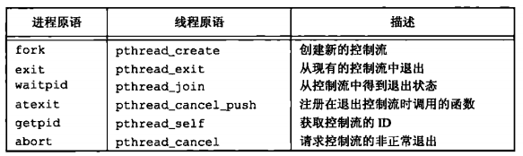
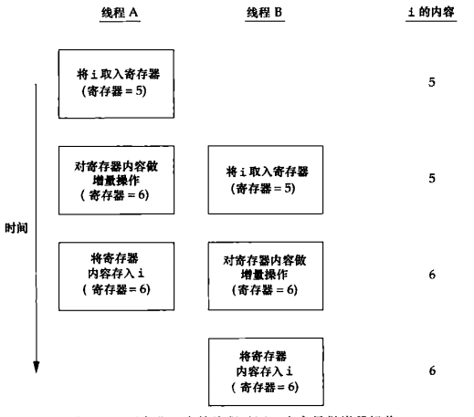

## 线程

### 线程概念

典型的 `UNIX` 进程可以看成只有一个控制线程：一个进程在某一时刻只能做一件事。有了多个控制线程后，在程序设计时就可以把进程设计成在某一时刻能够做不止一件事，每个线程处理各自独立的任务。

优点：

* 通过为每种事件类型分配单独的处理线程，可以简化处理异步事件的代码。每个线程在进行事件处理时可以采用同步编程模式，同步编程模式要比异步编程模式简单得多
* 多个进程必须使用操作系统提供的复杂机制才能实现内存和文件描述符的共享，而多个线程自动地可以访问相同地存储地址空间和文件描述符
* 可以分解而提高整个程序地吞吐量。在只有一个控制线程地情况下，一个单线程进程要完成多个任务，只需要把这些任务串行化。但有多个控制线程时，相互独立地任务地处理就可以交叉进行，只需为每个任务分配一个单独地线程。当然只有在两个任务地处理过程互不依赖地情况下，两个任务才可以交叉执行
* 交互地程序同样可以通过使用多线程来改善响应时间，多线程可以把程序中处理用户输入输出地部分与其他部分分开
* 每个线程都包含表示执行环境所必需的信息，其中包括进程中表示线程的线程 ID，一组寄存器值，栈，调度优先级和策略，信号屏蔽字，`errno` 变量以及线程私有数据。一个进程的所有信息对该进程的所有线程都是共享的，包括可执行程序的代码，程序的全局内存和堆内存，栈以及文件描述符

### 线程标识

每个线程有一个线程 ID。线程 ID 只有在它所属的进程上下文中才有意义。线程 ID 是用 `pthread_t` 数据类型来表示的，实现的时候可以用一个结构来代表 `pthread_t` 数据类型，所有可移植的操作系统实现不能把它作为整数处理。因此必须使用一个函数来对两个线程 ID　进行比较

```c
#include <pthread.h>
// 返回值：若相等，返回非 0 数值；否则返回 0
int pthread_equal(pthread_t tidl, pthread_t tid2);
```

### 线程创建

在 `posix` 线程的情况下，程序开始运行时，它也是以单进程中的单个控制线程启动的。在创建多个控制线程以前，程序的行为与传统的进程并没有什么区别。新增的线程可以通过调用 `pthread_create` 函数创建

```c
#include <pthread.h>
// 返回值：若成功，返回 0； 否则，返回错误编号
int pthread_create(pthread_t *restrict tidp, const pthread_attr_t *restrict attr, void *(*start_rtn)(void *), void *restrict arg);
```

当 `pthread_create` 成功返回时，新创建线程的线程 ID 会被设置成 `tidp` 指向的内存单元。`attr` 参数用于定制各种不同的线程属性。新创建的线程从 `start_rtn` 函数的地址开始运行，该函数只有一个无类别指针参数 `arg` 如果需要向 `start_rtn` 函数传递的参数有一个以上，那么需要把这些参数放到一个结构中，然后把这个结构的地址作为 `arg` 参数传入。线程创建时并不能保证那个线程会先运行：时新创建的线程，还是调用线程。新创建的线程可以访问进程的地址空间，并且继承调用线程的浮点环境和信号屏蔽字，但是该线程的挂起信号集会被清除。`pthread` 函数在调用失败时通常会返回错误码，不设置 `errno` ,每个线程提供 `errno` 的副本，这只是为了与使用 `errno` 的现有函数兼容。

### 线程终止

如果进程中的任意线程调用了 `exit`, `_Exit` 或 `_exit` ，那么整个进程就会终止。与此相类似，如果默认的动作时终止进程，那么发送到线程的信号就会终止整个进程

单个线程可以通过 3 种方式退出，因此可以在不终止整个进程的情况下，停止它的控制流

* 线程可以简单地从启动例程中返回，返回值时线程地推出码

* 线程可以被同一进程中地其他线程取消

* 线程调用 `pthread_exit`

  ```c
  #include <pthread.h>
  void pthread_exit(void *rval_ptr)
  ```

  `rval_ptr` 参数是一个无类型指针，与传给启动例程地单个参数类似。进程中地其他线程也可以通过调用 `pthread_join` 函数访问这个指针

  ```c
  #include <pthread.h>
  // 返回值：若成功， 返回0；否则，返回错误编码
  int pthread_join(pthread_t thread, void **rval_ptr)
  ```

  调用线程将一直阻塞，直到指定地线程调用 `pthread_exit` 从启动例程中返回或者被取消。如果线程简单地从它地启动例程返回，`rval_ptr` 就包含返回码。如果线程被取消，由 `rval_ptr` 指定地内存单元就设置为 `PTHREAD_CANCELED`, 可以通过调用 `pthread_join` 自动把线程置于分离状态，这样资源就可以恢复。如果线程已经处理分离状态，`pthread_join` 调用就会失败，返回 `EINVAL`,如果对线程的返回值并不感兴趣，可以把 `rval_ptr` 设置为 `null`,这种情况下，调用 `pthread_join` 函数可以等待指定的线程终止，但并不获取线程的终止状态。

  线程可以通过调用 `pthread_cancel` 函数来请求取消同一进程中的其他线程

  ```c
  #include <pthread.h>
  // 返回值：若成功，返回 0； 否则，返回错误编号
  int pthread_cancel(pthread_t tid);
  ```

  默认情况下，`pthread_cancel` 函数会使得由 `tid` 标识的线程的行为表现为如同调用了参数为 `PTHREAD_CANCELED` 的 `pthread_exit` 函数，但是，线程可以选择忽略取消或者控制如何被取消。线程可以安排它的退出时需要调用的函数，这与进程在退出时可以用 `atexit` 函数安排退出是类似的。这样的函数称为线程清理处理程序。一个线程可以建立多个清理处理程序。处理程序记录在栈中，它们的执行顺序与它们注册时相反。

  ```c
  #include <pthread.h>
  void pthread_cleanup_push(void (*rtn)(void *), void *arg);
  void pthread_cleanup_pop(int execute);
  ```

  当线程执行以下动作时，清理函数 `rtn` 是由 `pthread_cleanup_push` 函数调度的，调用时只有一个参数 `arg` 1.调用 `pthread_exit` 时；2.响应取消请求时；3.用非零 `execute` 参数调用 `pthread_cleanup_push` 调用建立的清理处理程序。如果线程时通过从它的启动例程中返回而终止的话，它的清理处理程序就不会调用。清理处理程序时按照与它们安装时相反的顺序被调用的。

  进程和线程原语的比较

  

  在默认情况下，线程的终止状态会保存直到对该线程调用 `pthread_join` ，如果线程已经被分离，线程的底层存储资源可以在线程终止时立即被回收。在线程已经被分离后，不能用 `pthread_join` 函数等待它的终止状态，因为对分离状态的线程调用 `pthread_join` 会产生未定义行为。可以调用 `pthread_detach` 分离线程

  ```c
  #include <pthread.h>
  int pthread_detach(pthread_t tid);   //返回值：成功，返回0；否则，返回错误编号
  ```

### 线程同步

当多个控制线程共享相同的内存时，需要确保每个线程看到一致的数据视图。如果每个线程使用的变量都是其他线程不会读取和修改的，那么就不存在一致性问题。同样，如果变量是只读的，多个线程同时读取该变量也不会有一致性问题。但是，当一个线程可以修改的变量，其他线程也可以读取或者修改的时候，就需要对这些线程进行同步，确保它们在访问变量的存储内容时不会访问到无效的值。

当一个线程修改变量时，其他线程在读取这个变量时可能会看到一个不一致的值。在变量修改时间多余一个存储器访问周期的处理器结构中，当存储器读与存储器写这两个周期交叉时，这种不一致就会出现。为了解决这个问题，线程不得不使用锁，同一时间只允许一个线程访问该变量。如果线程 B 希望读取变量，它首先要获取锁。同样，当线程 A 更新变量时，也需要获取同样的这把锁，这样，线程 B 在线程 A 释放锁以前就不能读取变量。

两个或多个线程试图在同一时间修改同一变量时，也需要进行同步。考虑变量增量操作的情况，增量操作通常分解为：

两个非同步的线程对同一个变量做增量操作



1.从内存单元读入寄存器，2.在寄存器种对变量做增量操作，3.把新的值写回内存单元。如果两个线程试图几乎在同一时间对同一个变量做增量操作而不进行同步的话，结果就可能出现不一致，变量可能比原来增加 1，也可能比原来增加 2，具体增加 1 还是 2 要取决于第二个线程开始操作时获取的值。如果第二个线程执行第一步要比第一个线程执行第 3 步要早，第二个线程读到的值与第一个线程一样，为变量加 1，然后写回去，事实上没有实际的效果，总的来说变量只增加了 1.如果修改操作是原子操作，那么就不存在竞争。在前面的例子种中，如果增加 1 只需要一个存储器周期，那么就没有竞争存在。如果数据总是以顺序一致出现的，就不需要额外的同步。当多个线程观察不到数据不一致时，那么操作就是顺序一致的。在现在计算机系统中，存储访问需要多个总线周期，多处理器的总线周期通常在多个处理器上时交叉的，所有并不能保证数据是顺序一致的

在顺序一致环境中，可以把数据修改操作解释为运行线程的顺序操作步骤。可以把这样的操作描述为 “线程 A 对变量增加了 1，然后线程 B 对变量增加了 1，所有变量的值就比原来的大 2” 或者描述为 “线程 B 对变量增加了 1，然后线程 A 对变量增加了 1，所以变量的值就比原来的大 2”。这两个线程的任何操作顺序都不可能让变量出现除了上述值以外的其他值。除了计算机体系结构以外，程序使用变量的方式也会引起竞争，也会导致不一致的情况发生。例如：我们可能对某个变量加 1，然后基于这个值做出某种决定。因为这个增量操作步骤和这个决定步骤的组合并非原子操作，所以就给不一致情况的出现提供了可能。

### 互斥量

可以使用 `pthread` 的互斥接口来保护数据，确保同一时间只有一个线程访问数据。`互斥量` 从本质上说是一把锁，在访问共享资源前对互斥量进行设置（加锁），在访问完成后释放（解锁）互斥量。对互斥量进行加锁以后，任何其他试图再次对互斥量加锁的线程都会被阻塞直到当前线程释放该互斥锁。如果释放互斥量时有一个以上的线程阻塞，那么所有该锁上的阻塞线程都会变成可运行状态，第一个变为运行的线程就可以对互斥量加锁，其他线程就会看到互斥量依然是锁着的，只能回去再次等待它重新变为可用。在这种方式下，每次只有一个线程可以向前执行。

互斥变量是用 `pthread_mutex_t` 数据类型表示的。在使用互斥变量以前，必须首先对它进行初始化，可以把它设置为常量 `PTHREAD_MUTEX_INITIALIZER` （只是用于静态分配的互斥量），也可以通过调用 `pthread_mutex_init` 函数进行初始化。如果动态分配互斥量（例如，调用 `malloc` 函数），在释放内存前需调用 `pthread_mutex_destroy`

```c
#include <pthread.h>
// 两个函数的返回值：若成功，返回 0；否则，返回错误编号
int pthread_mutex_init(pthread_mutex_t *restrict mutext, const pthread_mutexattr_t * restrict attr);
int pthread_mutex_destroy(pthread_mutex_t *mutext);
```

要用默认的属性初始化互斥量，只需要把 `attr` 设为 `null`, 对互斥量进行加锁，需要调用 `pthread_mutex_lock` ,如果互斥量已经上锁，调用线程将阻塞直到互斥量被解锁。对互斥量解锁，需要调用 `pthread_mutex_unlock`

```c
#include <pthread.h>
// 所有函数的返回值，成功，返回 0；否则，返回错误编号
int pthread_mutex_lock(pthread_mutex_t *mutex);
int pthread_mutex_trylock(pthread_mutex_t *mutex);
int pthread_mutex_unlock(pthread_mutex_t *mutex);
```

如果线程不希望被阻塞，它可以使用 `pthread_mutex_trylock` 尝试对互斥量进行加锁。如果调用 `pthread_mutex_trylock` 时互斥量处于未锁住状态，那么 `pthread_mutex_trylock` 将锁住互斥量，不会出现阻塞直接返回 0，否则 `pthread_mutex_trylock` 就会失败，不能锁住互斥量，返回 `EBUSY`

### 避免死锁

如果线程试图对同一个互斥量加锁两次，那么它自身就会陷入死锁状态，但是使用互斥量时，还有其他不太明显的方式也能产生死锁。例如：程序中使用一个以上的互斥量时，如果允许一个线程一直占用第一个互斥量，并且在试图锁住第二个互斥量时处于阻塞状态，但是拥有第二个互斥量的线程也在试图锁住第一个互斥量。因为两个线程都在相互请求另一个线程拥有的资源，所以这两个线程都无法向前运行，于是产生死锁

可以通过仔细控制互斥量加锁的顺序来避免死锁的发生。例如，假设需要对两个互斥量 A 和 B 同时加锁。如果所有线程总是在对互斥量 B 加锁前锁住互斥量 A，那么使用这两个互斥量就不会产生死锁（当然在其他资源上仍可能出现死锁）。类似的，如果所有的线程总是在锁住互斥量 A 之前锁住互斥量 B，那么也不会发生死锁。可能出现的死锁只会发生在一个线程试图锁住另一个线程以相反的顺序锁住的互斥量

有时候，应用程序的结构使得互斥量进行排序是很困难的，如果涉及了太多的锁和数据结构，可用的函数并不能把它转换成简单的层次，那么就需要采用另外的方法。在这种情况下，可以先释放占有的锁，然后过一段时间再试。这种情况可以使用 `pthread_mutex_trylock` 接口避免死锁。如果已经占有某些锁而且 `pthread_mutex_trylock` 接口返回成功，那么就可以前进。但是，如果不能获取锁，可以先释放已经占有的锁，做好清理工作，然后过一段时间再重复试。

### 函数 `pthread_mutex_timedlock`

当线程试图获取一个已加锁的互斥量，`pthread_mutex_timedlock` 互斥量原语允许绑定线程阻塞时间。`pthread_mutex_timedlock` 函数与 `pthread_mutex_lock` 是基本等价，但是再达到超时时间值时，`pthread_mutex_timedlock` 不会对互斥量进程加锁，而是返回错误码 `ETIMEDOUT`

```c
#include <pthread.h>
#include <time.h>
int pthread_mutex_timedlock(pthread_mutex_t *restrict mutex, const struct timespec *restrict tsptr);
```

超时指定愿意等待的绝对时间（与相对时间对比而言，指定在时间 x 之前可以阻塞等待，而不是说愿意阻塞 Y 秒）。这个超时时间是用 `timespec` 结构来表示的，它用秒和纳秒来描述时间。

### 读写锁

* 读写锁与互斥量类似，不过读写锁允许更高的并行性。互斥量要么是锁住状态，要么是不加锁状态，而且一次只有一个线程可以对其加锁。读写锁可以有 3 中状态：读模式下加锁状态，写模式下加锁状态，不加锁状态。一次只有一个线程可以占有写模式的读写锁，但多个线程可以同时占有读模式的读写锁。

* 当读写锁是写加锁状态时，在这个锁被解锁之前，所有试图对这个锁加锁的线程都会被阻塞。当读写锁在读加锁状态时，所有试图以读模式对它进行加锁的线程都可以得到访问权，但是任何希望以写模式对此进行加锁的线程都会阻塞，直到所有的线程释放它们的读锁为止。虽然各操作系统对读写锁的实现各不相同，但当读写锁处于读模式锁住的状态，而这是有一个线程试图以写模式获取锁时，读写锁通常会阻塞随后的读模式锁要求。这样可以避免读模式锁长期占有，而等待的写模式锁请求一直得不到满足。

* 读写锁非常适合于对数据结构读的次数大于写的情况。当读写锁在写模式下时，它所保护的数据结构就可以被安全地修改，因为一次只有一个线程可以在写模式下拥有这个锁。当读写锁在读模式下时，只要线程先获取了读模式下地读写锁，该锁所保护地数据结构就可以被多个获得读模式锁地线程读取。

* 读写锁也叫共享互斥锁。当读写锁是读模式锁住时，就可以说成是以共享模式锁住地。当它是写模式锁住时，就可以说成是以互斥模式锁住地。

* 与互斥量相比，读写锁在使用之前必须初始化，在释放它们底层地内存之前必须销毁

  ```c
  #include <pthread.h>
  // 两个函数地返回值：若成功，返回 0;否则返回错误编码
  int pthread_rwlock_init(pthread_rwlock_t *restrict rwlock, const pthread_rwlockattr_t *restrict attr);
  int pthread_rwlock_destroy(pthread_rwlock_t *rwlock);
  ```

  读写锁通过调用 `pthread_rwlock_init` 进行初始化。如果希望读写锁有默认地属性，可以传一个 null 指针给 `attr`, `Single UNIX Specification` 在 `XSI` 扩展中定义了 `PTHREAD_RWLOCK_INITIALIZER` 常量。如果默认属性就足够地话，可以用它对静态分配地读写锁进行初始化。

  在释放读写锁占用的内存之前，需要调用 `pthread_rwlock_destroy` 做清理工作。如果 `pthread_rwlock_init` 为读写锁分配了资源，`pthread_rwlock_destroy` 将释放这些资源。如果在调用 `pthread_rwlock_destroy` 之前就释放了读写锁占用的内存空间，那么分配给这个锁的资源就会丢失。

  要在读模式下锁定读写锁，需要调用 `pthread_rwlock_rdlock`,要在写模式下锁定读写锁，需要调用 `pthread_rwlock_wrlock` 不管以何种方式锁住读写锁，需要调用 `pthread_rwlock_unlock` 进行解锁

  ```c
  #include <pthread.h>
  // 所有函数的返回值：若成功，返回 0；否则返回错误编号
  int pthread_rwlock_rdlock(pthread_rwlock_t *rwlock);
  int pthread_rwlock_wrlock(pthread_rwlock_t *rwlock);
  int pthread_rwlock_unlock(pthread_rwlock_t *rwlock);
  ```

  各种实现可能会对共享模式下可获取的读写锁的次数进行限制，所以需要检查 `pthread_rwlock_rdlock` 的返回值。即使 `pthread_rwlock_wrlock` 和 `pthread_rwlock_unlock` 有错误返回，而且从技术上来讲，在调用函数时应该总是检查错误返回，但是如果锁设计合理的话，就不需要检查它们。错误返回值的定义只是针对不正确使用读写锁的情况（如未经初始化的锁），或者试图获取已拥有的锁从而可能产生死锁的情况。有些特定的实现可能会定义另外的错误返回

  ```c
  #include <pthread.h>
  // 两个函数返回值：若成功，返回0；否则，返回错误编号
  int pthread_rwlock_tryrdlock(pthread_rwlock_t *rwlock);
  int pthread_rwlock_trywrlock(pthread_rwlock_t *rwlock);
  ```

  可以获取锁时，这两个函数返回 0，否则，它们返回错误 `EBUSY`,这两个函数可以用于遵守某种锁层次但还不能完全避免死锁的情况。

* 带有超时的读写锁。`Single UNIX Specification` 提供带有超时的读写锁加锁函数，使应用程序在获取读写锁避免陷入永久阻塞状态。

  ```c
  #include <pthread.h>
  #include <time.h>
  int pthread_rwlock_timedrdlock(pthread_rwlock_t *restrict rwlock, const strcut timespec *restrict tsptr);
  int pthread_rwlock_timedwrlock(pthread_rwlock_t *restrict rwlock, const struct timespce *restrict tsptr);
  ```

### 条件变量


