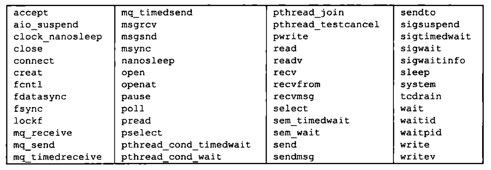

## 线程控制

### 线程限制

线程限制和 `sysconf` 的 `name` 参数

|            限制名称             |                         描述                         |             name 参数              |
| :-----------------------------: | :--------------------------------------------------: | :--------------------------------: |
| `PTHREAD_DESTRUCTOR_ITERATIONS` | 线程退出时操作系统实现试图销毁线程特定数据的最大次数 | `_SC_THREAD_DESTRUCTOR_ITERATIONS` |
|       `PTHREAD_KEYS_MAX`        |              进程可以创建的键的最大数目              |       `_SC_THREAD_KEYS_MAX`        |
|       `PTHREAD_STACK_MIN`       |             一个线程的栈可用的最小字节数             |       `_SC_THREAD_STACK_MIN`       |
|      `PTHREAD_THREADS_MAX`      |               进程可以创建的最大线程数               |      `_SC_THREAD_THREADS_MAX`      |

### 线程属性

`pthread` 接口允许通过设置每个对象关联的不同属性来细调线程和同步对象的行为。

* 每个对象与它自己类型的属性对象进行关联（线程与线程属性关联，互斥量与互斥量属性关联）。一个属性对象可以代表多个属性。属性对象对应用程序来说是不透明的。这意味着应用程序并不需要了解有关属性对象内部结构的详细细节，这样可以增强应用程序的可移植性。取而代之的是，需要提供相应的函数来管理这些属性对象
* 有一个初始化函数，把属性设置为默认值
* 销毁属性对象的函数。如果初始化函数分配了与属性对象关联的资源，销毁函数负责释放这些资源
* 每个属性都有一个从属性对象中获取属性值的函数。由于函数成功时会返回 0，失败时会返回错误编号，所以可以通过属性值存储在函数的某一个参数指定的内存单元中，把属性值返回给调用者
* 每个属性都有一个设置属性值的函数。属性值作为参数按值传递

### 线程同步对象属性

#### 互斥量属性

* 互斥量属性是用 `pthread_mutexattr_t` 结构表示。每次对互斥量进行初始化时，都是通过使用 `PTHREAD_MUTEX_INITIALIZER` 常量或者用指向互斥量属性结构的空指针作为参数调用 `pthread_mutex_init` 函数，得到互斥量的默认属性

* 对于非默认属性，可以用 `pthread_mutexattr_init` 初始化 `pthread_mutexattr_t` 结构，用 `pthread_mutexattr_destroy` 来反初始化

  ```c
  #include <pthread.h>
  // 两个函数的返回值：若成功，返回 0；否则返回错误编号
  int pthread_mutexattr_init(pthread_mutexattr_t *attr);
  int pthread_mutexattr_destroy(pthread_mutexattr_t *attr);
  ```

  `pthread_mutexattr_init` 函数将用默认的互斥量属性初始化 `pthread_mutexattr_t` 结构。值得注意的是 3 个属性：进程共享属性，健壮属性以及类型属性。`POSIX.1` 中，进程共享属性是可选的。可以通过检查系统中是否定义了 `_POSIX_THREAD_PROCESS_SHARED` 符号来判断这个平台是否支持进程共享这个属性，也可以在运行时把 `_SC_THREAD_PROCESS_SHARED` 参数传给 `sysconf` 函数进行检查。在进程中，多个线程可以访问同一个同步对象。这是默认行为。在这种情况下，进程共享互斥量属性需设置为 `PTHREAD_PROCESS_PRIVATE`

* 允许相互独立的多个进程把同一个内存数据映射到它们各自独立的地址空间中。就像多个线程访问共享数据一样，多个进程访问共享数据通常也需要同步。如果进程共享互斥量属性设置为 `PTHREAD_PROCESS_SHARED` ,从多个进程彼此之间共享的内存数据块中分配的互斥量就可以用于这些进程的同步

* 使用 `pthread_mutexattr_getpshared` 函数查询 `pthread_mutexattr_t` 结构，得到它的进程共享属性，使用 `pthread_mutexattr_setpshared` 函数修改进程共享属性

   ```c
  #include <pthread.h>
  // 两个函数的返回值，成功，返回 0；否则，返回错误编号
  int pthread_mutexattr_getpshared(const pthread_mutexattr_t *restict attr, int *restrict pshared);
  int pthread_mutexattr_setpshared(pthread_mutexattr_t *attr, int pshared);
   ```

  进程互斥量属性设置为 `PTHREAD_PROCESS_PRIVATE` 时，允许 `pthread` 线程库提供更有效的互斥量实现，这在多线程应用程序中时默认的情况。在多个进程共享多个互斥量的情况下，`pthread` 线程库可以限制开销较大的互斥量实现。

* 互斥量健壮属性与在多个进程间共享的互斥量有关。这意味着，当持有互斥量的进程终止时，需要解决互斥量状态恢复的问题。这种情况发生时，互斥量处于锁定状态，恢复起来很困难。其他阻塞在这个锁的进程将会一直阻塞下去

* 使用 `pthread_mutexattr_getrobust` 函数获取健壮的互斥量属性的值。可以调用 `pthread_mutexattr_setrobust` 函数设置健壮的互斥量属性的值

  ```c
  #include <pthread.h>
  // 两个函数的返回值，成功，返回 0；否则，返回错误编号
  int pthread_mutexattr_getrobust(const pthread_mutexattr_t *restrict attr, int *restrict robust);
  int pthread_mutexattr_setrobust(pthread_mutexattr_t *attr, int robust);
  ```

  健壮属性取值有两种可能的情况。默认值是 `PTHREAD_MUTEX_STALLED` ,这意味着持有互斥量的进程终止时不需要采取特别的动作。这种情况下，使用互斥量后的行为是未定义的，等待该互斥量解锁的应用程序会被有些地“拖住”，另一个值是 `PTHREAD_MUTEX_ROBUST` ,这个值将导致线程调用 `pthread_mutex_lock` 获取锁，而该锁被另一个进程持有，但它终止时并没有对该锁进行解锁，此时线程会阻塞，从 `pthread_mutex_lock` 返回的值为 `EOWNERDEAD` 而不是 0。应用程序可以通过这个特殊的返回值获知，若有可能（要保护状态的细节以及如何进行恢复会因不同的应用程序而异），不管它们保护的互斥量状态如何，都需要进行恢复。

  使用健壮的互斥量改变了我们使用 `pthread_mutex_lock` 的方式，因为现在必须检查 3 个返回值而不是之前的两个：不需要恢复的成功，需要恢复的成功以及失败。但是，即使不用健壮的互斥量，也可以只检查成功或者失败。如果应用状态无法恢复，在线程对互斥量解锁以后，该互斥量将处于永远用状态。为了避免这样的问题，线程可以调用 `pthread_mutex_consistent` 函数，指明与该互斥量相关的状态在互斥量解锁之前是一致的

  ```c
  #include <pthread.h>
  // 返回值：若成功，返回 0；否则返回，错误编号
  int pthread_mutex_consistent(pthread_mutex_t *mutex);
  ```

  如果线程没有先调用 `pthread_mutex_consistent` 就对互斥量进行了解锁，那么其他试图获取该互斥量的阻塞线程就会得到错误吗 `ENOTRECOVERABLE` ,如果发生这种情况，互斥量将不再可用。线程通过提前调用 `pthread_mutex_consistent` ,能让互斥量正常工作，这样它就可以持续被使用。

* 类型互斥量属性控制着互斥量的锁定特性

  `PTHREAD_MUTEX_NORMAL` 一种标准的互斥量类型，不做任何特殊的错误检查或死锁检测

  `PTHREAD_MUTEX_ERRORCHECK` 次互斥量类型提供错误检查

  `PTHREAD_MUTEX_RECURSIVE` 此互斥量类型允许同一线程在互斥量解锁之前对该互斥量进行多次加锁。递归互斥量维护锁的计数，在解锁次数和加锁次数不相同的情况下，不会释放锁。所以，如果对一个递归互斥量加锁两次，然后解锁一次，那么这个互斥量将依然处理加锁状态，对它再次解锁以前不能释放该锁

  `PTHREAD_MUTEX_DEFAULT` 此互斥量类型可以提供默认特性和行为。操作系统在实现它的时候可以把这种类型自由地映射到其他互斥量类型中的一种。

  可以用 `pthread_mutexattr_gettype` 函数得到互斥量类型属性，用 `pthread_mutexattr_settype` 函数修改互斥量类型属性

  ```c
  #include <pthread.h>
  // 两个函数的返回值：若成功，返回 0；否则返回错误编号
  int pthread_mutexattr_gettype(const pthread_mutexattr_t *restrict attr, int *restrict type);
  int pthread_mutexattr_settype(pthread_mutexattr_t *attr, int type);
  ```

#### 读写锁属性

读写锁与互斥量类似，也是有属性的。可以用 `pthread_rwlockattr_init` 初始化 `pthread_rwlockattr_t` 结构，用 `pthread_rwlockattr_destory` 反初始化结构

```c
#include <pthread.h>
// 两个函数的返回值，成功0，否则错误编号
int pthread_rwlockattr_init(pthread_rwlockattr_t *attr);
int pthread_rwlockattr_init(pthread_rwlockattr_t *attr);
```

读写锁的支持的唯一属性是进程共享属性。它与互斥量的进程共享属性是相同的。就像互斥量的进程共享属性一样，有一对函数用于读取和设置读写锁的进程共享属性。

```c
#include <pthread.h>
// 两个函数的返回值：成功，返回 0；否则，返回错误编号
int pthread_rwlockattr_getpshared(const pthread_rwlockattr_t *restrict attr, int *restrict pshared);
int pthread_rwlockattr_setpshared(pthread_rwlockattr_t *attr, int pshared);
```

#### 条件变量属性

SUS 目前定义了条件变量的两个属性：进程共享属性和时钟属性。与其他的属性对象一样，有一对函数用于初始化和反初始化条件变量属性

```c
#include <pthread.h>
// 两个函数返回值，成功 0；否则，返回错误编号
int pthread_condattr_init(pthread_condattr_t *attr);
int pthread_condattr_destory(pthread_condattr_t *attr);
```

条件变量支持进程共享属性。它控制着条件变量是可以被单进程的多个线程使用，还是可以被多进程的线程使用。要获取进程共享属性的当前值，可用 `pthread_condattr_getpshared` 函数。设置该值可用用 `pthread_condattr_setpshared` 函数

```c
#include <pthead.h>
// 两个函数的返回值：若成功，返回 0；否则，返回错误编号
int pthread_condattr_getpshared(const pthread_condattr_t * restrict attr,int *restrict pshared);
int pthread_condattr_setpshared(pthread_condattr_t *attr, int pshared);
```

SUS 并没有为其他有超时等待函数的属性对象定义时钟属性

#### 屏障属性

屏障也有属性。可用使用 `pthread_barrierattr_init` 函数对屏障属性对象进行初始化，用 `pthread_barrierattr_destroy` 函数对屏障属性对象进行反初始化

```c
#include <pthrea.h>
// 两个函数的返回值：若成功，返回 0；否则，返回错误编号
int pthread_barrierattr_init(pthread_barrierattr_t *attr);
int pthread_barrierattr_destroy(pthread_barrierattr_t *attr);
```

目前定义的屏障属性只有进程共享属性，它控制着屏障是可用被多进程的线程使用，还是只能被初始化屏障的进程内的多线程使用。与其他属性对象一样，一个获取属性值的函数 `pthread_barrierattr_getpshared` 和一个设置属性值的函数`pthread_barrierattr_setpshared`

```c
#include <pthread.h>
// 两个函数的返回值，成功，返回 0；否则返回错误编号
int pthread_barrieattr_getpshared(const pthread_barrierattr_t *restrict attr, int *restrict pshared);
int pthread_barrieattr_setpshared(pthread_barrierattr_t *attr, int pshared);
```

### 重入

如果一个函数在相同的时间点可以被多个线程安全的调用，就称该函数是线程安全的。如果一个函数对多个线程来说是可重入的，就说这个函数是线程安全的。但这并不能说明对信号处理程序来说该函数也是可重入的。如果函数对异步信号处理程序的重入是安全的，那么就可以说函数是异步信号安全的。

### 线程特定数据

线程特定数据即线程私有数据，是存储和查询某个特定线程相关数据的一种机制。每个线程可以访问它自己单独的数据副本，而不需要担心与其他线程的同步访问问题。

有时候需要维护基于每线程的数据。因为线程ID并不能保证小而连续的整数，所以不能简单地分配一个每线程数据数组，用线程 ID 作数组的索引。即使线程 ID 确实是小而连续的整数，还需要一些额外的保护，防止某个线程的数据与其他线程的数据相混淆

采用线程私有数据的第二个原因是，它提供了基于进程的接口适应多线程环境的机制。实例为 `errno` 线程出现之前，把 `errno` 定义为进程上下文中全局可访问的整数。系统调用和库例程在调用或执行失败时设置 `errno` ,把它作为操作失败时的附属结果。为了让线程也能够使用哪些原本基于进程的系统调用和库例程，`errno` 被重新定义为线程私有数据。这样，一个线程充值了 `errno` 的操作也不会影响进程中其他线程的 `errno` 值

一个进程中的所有线程都访问这个进程的整个地址空间。除了使用寄存器以外，一个线程没有办法阻止另一个线程访问它的数据。线程特定数据也不例外。虽然底层的实现部分并不能阻止这种访问能力，但管理线程特定数据的函数可以提高线程间的数据独立性，使得线程不太容易访问到其他线程的特定数据

在分配线程特定数据之前，需要创建与该数据关联的键。这个键用于获取对线程特定数据的访问。使用 `pthread_key_create` 创建一个键

```c
#include <pthread.h>
// 返回值：若成功，返回 0；否则，返回错误编号
int pthread_key_create(pthread_key_t *keyp, void (*destructor)(void *));
```

创建的键存储在 `keyp` 指向的内存单元中，这个键可以被进程中的所有线程使用，但每个线程把这个键与不同线程特定数据地址进行关联。创建新键时，每个线程的数据地址设为空值

除了创建键以外，`pthread_key_create` 可以为该键关联一个可选择的析构函数。当这个线程退出时，如果数据地址已经被设置为非空值，那么析构函数就会被调用，它唯一的参数就是该数据地址。如果传入的析构函数为空，就表明没有析构函数与这个键关联。当线程调用 `pthread_exit` 或者线程执行返回，正常退出时，析构函数就会被调用。同样，线程取消时，只有在最后的清理处理程序返回之后，析构函数才会被调用。如果线程调用了 `exit`,`_exit`,`_Exit` ,`abort` ,或者出现其他非正常的退出时，就不会调用析构函数。

线程通常使用 `malloc` 为线程特定数据分配内存。析构函数通常释放已分配的内存。如果线程在没有释放内存之前就退出了，那么这块内存就会丢失，即线程所属进程就出现了内存泄漏

线程可以为线程特定数据分配多个键，每个键都可以有一个析构函数与它关联。每个键的析构函数可以互不相同，当然所有键也可以使用相同的析构函数。每个操作系统实现可以对进程可分配的键的数量进行限制。

线程退出时，线程特定数据的析构函数将按照操作系统实现中定义的顺序被调用。析构函数可能会调用另一个函数，该函数可能会创建新的线程特定数据，并且把这个数据与当前的键关联起来。当所有的析构函数都调用完成以后，系统会检查是否还有非空的线程特定数据值与键关联，如果有的话，再次 调用析构函数。这个过程将会一直重复直到线程所有的键都为空线程特定数据值，或者已经做了 `PTHREAD_DESTRUCTOR_ITERATIONS` 中定义的最大次数的尝试

对所有的线程，可以通过调用 `pthread_key_delete` 来取消键与线程特定数据值之间的关联关系。

```c
#include <pthread.h>
// 返回值，成功 0；否则，错误编号
int pthread_key_delete(pthread_key_t key);
```

调用 `pthread_key_delete` 并不会激活与键关联的析构函数。要释放任何与键关联的线程特定数据值的内存，需要在应用程序中采取额外的步骤。需要确保分配的键并不会由于在初始化阶段的竞争而发生变动。解决竞争的办法是使用 `pthread_once` 

```c
#include <pthread.h>
// 返回值：若成功，返回 0；否则，返回错误编号
pthread_once_t initflag = PTHREAD_ONCE_INIT;
int pthread_once(pthread_once_t *initflag void(*initfn)(void));
```

`initflag` 必须是一个非本地变量（如全局变量或静态变量）。而且必须初始化为 `PTHREAD_ONCE_INIT` 

如果每个线程都调用 `pthread_once` ,系统就能保证初始化例程 `initfn` 只被调用一次，即系统首次调用 `pthread_once` 时。

键一旦创建以后，就可以通过调用 `pthread_setspecific` 函数把键和线程特定数据关联起来。可以通过 `pthread_getspecific` 函数获得线程特定数据的地址

```c
#include <pthread.h>
// 返回值：线程特定数据值；若没有值与该键关联，返回 null
void *pthread_getspecific(pthread_key_t key);
// 返回值：成功，返回 0；否则，返回错误编号
int pthread_setspecific(pthread_key_t key, const void *value);
```

如果没有线程特定数据值与键关联，`pthread_getspecific` 将返回一个空指针，可以用这个返回值来确定是否需要调用 `pthread_setspecific` 

### 取消选项

有两个线程属性并没有包含在 `pthread_attr_t` 结构中，它们是可取消状态和可取消类型。这两个属性影响着线程在响应 `pthread_cancel` 函数调用时的行为

* 可取消状态属性可以是 `PTHREAD_CANCEL_ENABLE` 或 `PTHREAD_CANCEL_DISABLE` 线程可通过调用 `pthread_setcancelstate` 修改它的可取消状态

  ```c
  #include <pthread.h>
  // 返回值，成功返回 0；否则返回错误编号
  int pthread_setcancelstate(int state, int *oldstate);
  ```

  `pthread_setcancelstate` 把当前的可取消状态设置为 `state` ，把原来的可取消状态设置为 `state`,把原来的可取消状态存储在由 `oldstate` 指向的内存单元，这两步是一个原子操作

  `pthread_cancel` 调用并不等待线程终止。在默认情况下，线程在取消请求发出以后还是继续运行，直到线程到达某个取消点。取消点事线程检查它是否被取消的一个位置，如果取消了，则按照请求行事。

  `POSIX.1` 定义的取消点

  

  线程启动时默认的可取消状态是 `PTHREAD_CANCEL_ENABLE` ,当状态设为 `PTHREAD_CANCEL_DISABLE` 时，对 `pthread_cancel` 的调用并不会杀死线程。相反，取消请求对这个线程来说还处于挂起状态，当取消状态再次变为 `PTHREAD_CANCEL_ENABLE` 时，线程将在下一个取消点上对所有挂起的取消请求进行处理。可以调用`pthread_testcancel` 函数在程序中添加自己的取消点。

  ```c
  #include <pthread.h>
  void pthread_testcancel(void);
  ```

  调用 `pthread_testcancel` 时，如果有某个取消请求正处于挂起状态，而且取消并没有设置为无效，那么线程就会被取消。但是，如果取消被设置为无效，`pthread_testcancel` 调用就没有任何效果了。

* 默认取消类型为推迟取消。调用 `pthread_cancel` 以后，在线程到达取消点之前，并不会出现真正的取消。可以调用 `pthread_setcanceltype` 来修改取消类型

  ```c
  #include <pthread.h>
  // 返回值：成功返回 0；否则，返回错误编号
  int pthread_setcanceltype(int type, int *oldtype);
  ```

  `pthread_setcanceltype` 函数把取消类型设置为 `type` (类型参数可以是 `PTHREADCANCEL_DEFERRED` 或 `PTHREAD_CANCEL_ASYNCHRONOUS` ),把原来的取消类型返回到 `oldtype` 指向的整型单元

  异步取消与推迟取消不同，因为使用异步取消时，线程可以在任意时间撤销，不是非得遇到取消点才能被取消。

### 线程和信号

* 每个线程都有自己的信号屏蔽字，但是信号的处理是进程中所有线程共享的。这意味着单个线程可以阻止某些信号，但当某个线程修改了与某个给定信号相关的处理行为以后，所有的线程都必须共享这个处理行为的改变。这样，如果一个线程选择忽略某个给定信号，那么另一个线程就可以通过以下两种方式撤销上述线程的信号选择：恢复信号的默认处理行为，或者为信号设置一个新的信号处理程序

* 进程中的信号是递送到单个线程的。如果一个信号与硬件故障有关，那么该信号一般会被发送到引起该事件的线程中去，而其他的信号则被发送到任意一个线程

  使用 `pthread_sigmask` 函数阻止信号发送。

  ```c
  #include <signal.h>
  // 返回值：成功，返回0；否则，返回错误编号
  int pthread_sigmask(int how, const sigset_t *restrict set, sigset_t *restrict oset);
  ```

  `set` 参数包含线程用于修改信号屏蔽字的信号集。`how` 参数可以取下列 3 个值之一：`SIG_BLOCK` ,把信号集添加到线程集合屏蔽字中，`SIG_SETMASK` ,用信号集替换线程的信号屏蔽字；`SIG_UNBLOCK` ,从线程信号屏蔽字中移除信号集。如果 `oset` 参数不为空，线程之前的信号屏蔽字就存储在它指向的 `sigset_t` 结构中。线程可以通过把 `set` 参数设置为 `null`,并把 `oset` 参数设置为 `sigset_t` 结构的地址，来获取当前的信号屏蔽字。这种情况中的 `how` 参数会被忽略

  线程可以通过调用 `sigwait` 等待一个或多个信号的出现

  ```c
  #include <signal.h>
  // 返回值。若成功，返回 0；否则，返回错误编号
  int sigwait(const sigset_t *restrict set, int *restrict signop);
  ```

  `set` 参数指定了线程等待的信号集。返回时，`signop` 指向的整数将包含发送信号的数量。如果信号集中某个信号在 `sigwait` 调用的时候处于挂起状态，那么 `sigwait` 将无阻塞地返回。在返回之前，`sigwait` 将从进程中移除哪些处于挂起等待状态的信号。如果具体实现支持排队信号，并且信号的多个实例被挂起，那么`sigwait` 将会移除该信号的一个实例，其他的实例还有继续排队。为了避免错误行为发生，线程在调用 `sigwait` 之前，必须阻塞那些它正在等待的信号。`sigwait` 函数会原子地取消信号集的阻塞状态，直到有新的信号被递送。在返回之前，`sigwait` 将恢复线程的信号屏蔽字。如果信号在`sigwait` 被调用的时候没有被阻塞，那么在线程完成对 `sigwait` 的调用之前会出现一个时间窗，在这个时间窗中，信号就可以被发送给线程。

  使用 `sigwait` 的好处在于它可以简化信号处理，允许把异步产生的信号用同步的方式处理。为了防止信号中断线程，可以把信号加到每个线程的信号屏蔽字中。然后可以安排专用线程处理信号。这些专用线程可以进行函数调用，不需要担心在信号处理程序中调用那些函数是安全的，因为这些函数调用来自正常的线程上下文，而非会中断线程正常执行的传统信号处理程序。

  如果多个线程在 `sigwait` 的调用中因等待同一个信号而阻塞，那么在信号递送的时候，就只有一个线程可以从 `sigwait` 中返回。如果一个信号被捕获（例如进程通过使用 `sigaction` 建立了一个信号处理程序），而且一个线程正在 `sigwait` 调用中等待同一信号，那么这时由操作系统实现来决定以何种方式递送信号。操作系统实现可以让 `sigwait` 返回，也可以激活信号处理程序，但这两种情况不会同时发生。

  要把信号发送给进程，可以调用 `kill` ,要把信号发送给线程，可以调用 `pthread_kill` 

  ```c
  #include <signal.h>
  // 返回值：若成功，返回 0；否则，返回错误编号
  int pthread_kill(pthread_t thread, int signo);
  ```

  可以传一个 0 值的 `signo` 来检查线程是否存在。如果信号默认处理动作是终止该进程，那么把信号传递给某个线程仍然会杀死整个进程。闹钟定时器是进程资源，并且所有的线程共享相同的闹钟。进程中多个线程不可能互不干扰地使用闹钟定时器

### 线程和 fork

* 当线程调用 `fork` 时，就为子进程创建了整个进程地址空间的副本。子进程通过继承整个地址空间的副本，还从父进程那儿继承了每个互斥量，读写锁和条件变量的状态。如果父进程包含一个以上的线程，子进程在 `fork` 返回以后，如果紧接着不是马上调用 `exec` 的话，就需要清理锁状态。

* 在子进程内部，只存在一个线程，它是由父进程中调用 `fork` 的线程的副本构成的。如果父进程中的线程占有锁，子进程将同样占有这些锁。子进程并不包含占有锁的线程的副本，所以子进程没有办法知道它占有了哪些锁，需要释放哪些锁。

* 如果子进程从 `fork` 返回以后马上调用其中一个 `exec` 函数，就可以避免这样的问题。这种情况下，旧的地址空间就被丢弃，所以锁的状态无关紧要。如果子进程需要继续做处理工作的话，这种策略就行不通，还需要其他的策略。

* 在多线程的进程中，为了避免不一致状态的问题，`POSIX.1` 声明，在 `fork` 返回和子进程调用其中一个 `exec` 函数之间，子进程只能调用异步信号安全的函数。这就限制了在调用 `exec` 之前子进程能做什么，但不涉及子进程锁状态的问题。

* 要清楚锁状态，可以调用 `pthread_atfork` 函数建立 `fork` 处理程序

  ```c
  #include <pthread.h>
  // 返回值，成功，返回 0；否则，返回错误编号
  int pthread_atfork(void (*prepare) (void), void (*parent)(void), void (*child)(void));
  ```

  用 `pthread_atfork` 函数最多可以安装 3 个帮助清理锁的函数。`prepare fork` 处理程序由父进程在 `fork` 创建子进程前调用。这个 `fork` 处理程序的任务时获取父进程定义的所有锁。`parent fork` 处理程序时在 `fork` 创建子进程以后，返回之前在父进程上下文调用的。这个 `fork` 处理程序的任务是对 `prepare fork` 处理程序获取的所有锁进行解锁。`child fork` 处理程序在 `fork` 返回之前在子进程上下文中调用。与 `parent fork` 处理程序一样，`child fork` 处理程序必须释放 `prepare fork` 处理程序获取的所有锁。

