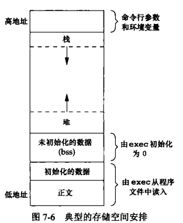
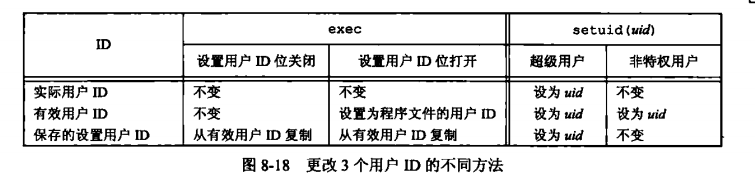
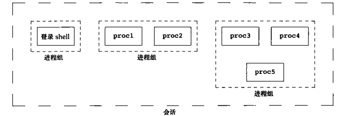
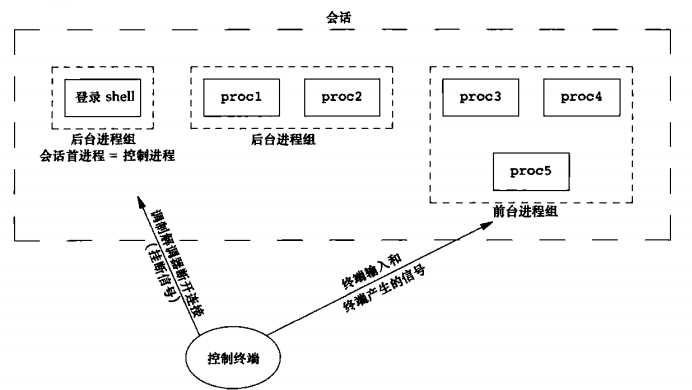
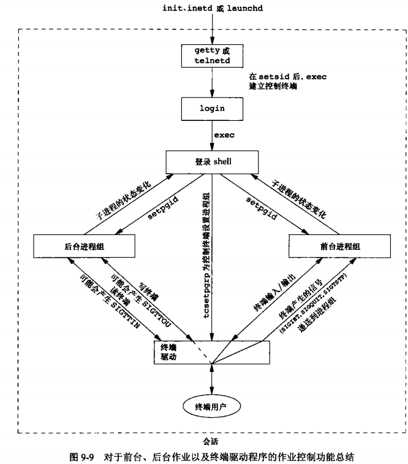

## 进程

### 进程终止

有 8 种方式使进程终止，其中 5 种为正常终止

* 从 `main` 返回
* 调用 `exit`
* 调用 `_exit` 或 `_Exit`
* 最后一个线程从其启动例程返回
* 从最后一个线程调用 `pthread_exit` 

异常终止 3 种

* 调用 abort
* 接到一个信号
* 最后一个线程对取消请求做出响应

### 进程标识

每个进程都有一个非负整数表示的唯一进程 ID。但是进程 ID 是可复用的。当一个进程终止后，其进程 ID 就成为复用的候选者。

### C程序的存储空间布局

* **正文段:**由 CPU 执行的机器指令部分。正文段一般是可共享的与只读的。
* **初始化数据段：**通常将此段称为数据段，它包含了程序中需明确地赋初值地变量
* **未初始化数据段：**通常将此段称为 `bss` 段，意思是由符号开始地块，在程序开始执行前，内核将此段中地数据初始化为 0 或空指针
* **栈：**自动变量以及每次函数调用时所需保存地信息都存放在此段中，每次函数调用时，其返回地址以及调用者的环境信息都存放在栈中。然后，最近被调用的函数在栈上为其自动和临时变量分配空间。
* **堆：**在堆中进行动态存储分配。堆位于初始化数据段和栈之间

存储空间图



### fork

一个现有的进程可以调用 fork 函数创建一个新进程（子进程返回 0，父进程返回子进程ID，出错返回 -1）由 `fork` 创建的新进程被称为子进程。`fork` 函数调用一次，返回两次。子进程和父进程继续执行 `fork` 调用之后的指令。子进程是父进程的副本（子进程获得父进程数据空间，堆和栈的副本）父进程和子进程并不共享这些存储空间部分。父进程和子进程共享正文段。由于在 `fork` 之后经常跟随者 `exec` 所以现在的很多实现并不执行一个父进程数据段，栈和堆的完全副本。作为替代，使用了写时复制，这些区域由父进程和子进程共享，而且内核将它们的访问权限改变为只读。如果父进程和子进程中的任一个视图修改这个区域，则内核只为修改区域的那块内存制作一个副本，通常时虚拟存储系统中的一页。(`linux` 提供了进程创建函数 clone 系统调用。允许调用者控制那些部分由父进程和子进程共享)


**父进程的很多其他属性由子进程继承:**文件描述符（父进程的所有打开文件描述符都被复制到子进程中，父进程和子进程每个相同的打开描述符共享一个文件表项），实际用户 ID，实际组 ID，有效用户 ID，有效组 ID，附属组 ID，进出租 ID会话 ID，控制终端，设置用户 ID标志和设置组ID标志，当前工作目录，根目录，文件模式创建屏蔽字，信号屏蔽和安排，对任一打开文件描述符的执行时关闭标志，环境，连接的共享存储段，存储映像，资源限制。**父进程和子进程之间的区别:** `fork` 的返回值不同，两个进程的父进程ID不同；子进程的父进程 ID是创建它的进程的 ID，而父进程ID则不必，子进程的 `tms_utimt`,`tms_stime`,`tms_cutime`,`tms_ustime` 的数值设置为0，子进程不继承父进程设置的文件锁，子进程的未处理闹钟被清除，子进程的未处理信号集设置为空集

### exit

* 在 `main` 函数内执行 `return` 语句。等效于调用 `exit`
* 调用 `exit` 函数，操作包括调用各终止处理程序（终止处理程序在调用 `atexit` 函数时登记），关闭所有的标准 I/O 流。
* 调用 `_exit` 或 `_Exit` 函数。目的是为进程提供一种无需运行时终止处理程序或信号处理程序而终止的方法。对标准 I/O 流是否冲洗，取决于实现。
* 进程的最后一个线程在其启动例程中执行 `return` 语句,但是，该线程的返回值不用作进程的返回值。当最后一个线程从其启动例程返回时，该进程以终止状态 0 返回
* 进程的最后一个线程调用 `pthread_exit` 函数。进程终止状态总是 0，这与传给 `pthread_exit` 的参数无关

### `init` 收养孤儿进程

如果子进程正常终止，则父进程可以获得子进程的退出状态。，如果父进程在子进程之前终止，对于父进程已经终止的所有进程，它们的父进程都改变为 `init` 进程。操作过程为：在一个进程终止时，内核逐个检查所有活动进程，以判断它是否是正要终止进程的子进程，如果是，则该进程的父进程就更改为 1 （`init` 进程 ID）。

### 僵尸进程（zombie)

如果子进程在父进程之前终止，如果子进程完全消失了，父进程在最终准备好检查子进程是否终止时是无法获取它的终止状态。内核为每个终止子进程保存了一定量的信息，所以当终止进程的父进程调用 `wait` 或 `waitpid` 时，可以得到这些信息。（进程ID，终止状态，CPU时间总量）。内核可以释放终止进程所使用的所有存储区，关闭其所有打开文件。一个已经终止，但其父进程尚未对其进行善后处理（获取终止子进程的有关信息，释放它仍占用的资源）的进程称为僵尸进程。

### wait 和 waitpid

当一个进程正常或异常终止时，内核就向其父进程发送 `SIGCHLD` 信号。因为子进程终止是个异步事件（可以发生在父进程运行的任何时候），所以这种信号也是内核向父进程发的异步通知。父进程可以选择忽略该信号，或者提供一个该信号发生时即被调用执行的函数（信号处理程序）。对于这种信号的系统默认动作是忽略它。

调用 `wait` 或 `waitpid` 时

* 如果其所有子进程都还在运行，则阻塞
* 如果一个子进程已终止，正等待父进程获取其终止状态，则取得该子进程的终止状态立即返回
* 如果它没有任何子进程，则立即出错返回

如果进程由于接收到 `SIGCHLD` 信号而调用 `wait` ，期望 `wait` 会立即返回。但是如果在随机时间点调用 `wait`,则进程可能会阻塞

```c
#include <sys/wait.h>
// 两个函数返回值：若成功，返回进程ID；若出错，返回 0 或 -1
pid_t wait(int *statloc);
pid_t waitpid(pid_t pid, int *statloc, int options);
```

区别是：

* 在一个子进程终止前，`wait` 使其调用者阻塞，而 `waitpid` 有选项，可使调用者不阻塞

* `waitpid` 并不等待在其调用之后的第一个终止子进程，它有若干选项，可以控制它所等待的进程

  如果子进程已经终止，并且是一个僵尸进程，则 `wait` 立即返回并取得该子进程的状态；否则 `wait` 使其调用者阻塞，直到一个子进程终止。如果调用者阻塞而且它有多个子进程，则在其某一个子进程终止时，`wait` 就立即返回。因为 `wait` 返回终止子进程的进程 `ID`,所以它总能了解是那个子进程终止了

  参数 `statloc` 是一个整型指针。如果 `statloc` 不是一个空指针，则终止进程的终止状态就存放在它所指向的单元内。如果不关心终止状态，则可将该参数指定为空指针

  `waitpid` 的 `pid` 参数 `pid == -1` 等待任一子进程。此种情况下，`waitpid` 和 `wait` 等效。`pid > 0` 等待进程 ID 与 `pid` 相等的子进程。`pid == 0` 等待组 ID 等于调用进出组 ID的任一子进程， `pid < -1` 等待组 ID 等于 `pid` 绝对值的任一子进程

  `waitpid` 的 `options` 参数控制 `waitpid` 的操作。`WCONTINUED` 若实现支持作业控制，那么由 `pid` 指定的任一子进程在停止后已经继续，但其状态尚未报告，则返回其状态。`WNOHANG` 若由 `pid` 指定的子进程并不是立即可用的，则 `waitpid` 不阻塞，此时其返回值为 0，`WUNTRACED` 若某实现支持作业控制，而由 `pid` 指定的任一子进程已处于停止状态，并且其状态自停止以来还未报告过，则返回其状态。

### 竞争条件

当多个进程都企图对共享数据进行某种处理，而最后的结果又取决于进程运行的顺序时，我们认为发生了竞争条件。如果在 `fork` 之后的某种逻辑显示或隐式地依赖于在 `fork` 之后时父进程先运行还是子进程先运行，就会竞争。

### 函数 exec

当进程调用一种 `exec` 函数时，该进程执行的程序完全替换为新程序，而新程序则从其 `main` 函数开始执行。因为调用 `exec` 并不创建新进程，所以前后的进程 ID 并未改变。`exec` 只是用磁盘上的一个新程序替换了当前程序的正文段，数据段，堆段和栈段。基本进程控制原语：`fork` 创建新进程，`exec` 初始执行新的程序。`exit` 函数和 `wait` 函数处理终止和等待终止。

### 更改用户 ID 和更改组 ID

在 `UNIX` 系统中，特权及访问控制是基于用户 ID 和组 ID。当程序需要提高或降低权限时，需要更换用户 ID 和组 ID，新 ID 不具有相应特权或访问这些资源的能力

```c
#include <unistd.h>
// 两个函数返回值，成功返回 0；出错，返回 -1
int setuid(uid_t uid);
int setgid(gid_t gid); 		
```

更改 ID 及 组 ID 

* 若进程具有超级用户特权，则 `setuid` 函数将实际用户 ID，有效用户 ID 以及保存的设置用户 ID 设置为 uid
* 若进程没有超级用户特权，但是 `uid` 等于实际用户 ID 或保存的设置用户 ID，则 `setuid` 只将有效用户设置为 `uid`，不更改实际用户 ID和保存的设置用户ID
* 如果上面两个条件不满足，则 `errno ` 设置为 `EPERM` ，并返回 -1

内核所维护的 3个用户 ID：

* 只有超级用户进程可以更改实际用户 ID。实际用户 ID 是在用户登录时。由 `login(1)` 程序设置的，而且绝不会改变它。`login` 是一个超级用户进程，当它调用 `setuid` 时，设置所有 3 个用户 ID
* 仅当对程序文件设置了设置用户 ID 位时，`exec` 函数才设置有效用户 ID。如果设置用户 ID 位没有设置，`exec` 函数不会改变有效用户 ID，而将维持其现有值。任何时候都可以调用 `setuid`,将有效用户 ID 设置为实际用户 ID 或保存的设置用户 ID。自然的，不能将有效用户 ID 设置为任一随机值
* 保存的设置用户 ID 是由 `exec` 复制有效用户 ID 而得到的。如果设置了文件的设置用户 ID 位，则在 `exec` 根据文件的用户 ID 设置了进程的有效用户 ID 以后，这个副本就被保存起来了。

更改 3 个用户 ID 的不同方法



### 进程会计

大多数 UNIX 系统提供了一个选项以进行进程会计处理，启用该选项后，每当进程结束时内核就写一个会计记录。典型的会计记录包含总量较小的二进制数据，一般包括命令名，所使用的 CPU 时间总量，用户 ID 和组 ID，启动时间等。

### 进程调度

UNIX 系统历史上对进程提供的只是基于调度优先级的粗粒度的控制。调度策略和调度优先级是由内核确定的。进程可以通过调整 `nice` 值选择以更低优先级运行（通过调整 `nice` 值越小，优先级越高，值降低它对 CPU 的占有，因此该进程是“友好的”）。只有特权进程允许提高调度权限。

### 进程组

每个进程除了有一进程 ID 之外，还属于一个进程组，进程组是一个或多个进程的集合，通常，它们是在同一作业中结合起来的，同一进程组中的各进程接收来自同一终端的各种信号。每个进程组有一个唯一的进程组 ID，它是一个正整数。每个进程组有一个组长进程。组长进程的进程组 ID 等于其进程 ID。进程组组长可以创建一个进程组，创建该组中的进程，然后终止。只要在某个进程组中有一个进程存在，则该进程组就存在，这与其组长进程是否终止无关。从进程组创建开始到其中最后一个进程离开为止的时间区间称为进程组的生命期。某个进程组中的最后一个进程可以终止，也可以转移到另一个进程组。进程调用 `setpgid` 可以加入一个现有的进程组或者创建一个新进程组。

```c
#include <unistd.h>
int setpgid(pid_t pid, pid_t pgid); 	// 返回值，成功，0；出错，返回 -1
```

`setpgid` 函数将 `pid` 进程的进程组 ID 设置为 `pgid` 如果这两个参数相等，则由 `pid` 指定的进程变成进程组组长。如果 `pid` 是 0，则使用调用者的进程 ID。如果 `pgid` 是 0，则由 `pid` 指定的进程 ID 用作进程组 ID。一个进程只能为它自己或它的子进程设置进程组 ID。在它的子进程调用了 `exec` 后，它就不再更改该子进程的进程组 ID。

### 会话

会话是一个或多个进程组的集合。通常是由 shell 的管道将几个进程编成一组的



```c
#include <unistd.h>
pid_t setsid(void); 		// 返回值，若成功，返回进程组 ID，若出错，返回 -1
```

如果调用此函数的进程不是一个进程组的组长，则此函数创建一个新会话。会发生以下 3 件事

1.该进程变成新会话的会话首进程（会话首进程是创建该会话的进程），此时，该进程是新会话中的唯一进程

2.该进程成为一个新进程组的组长进程 。新进程组组ID是该调用进程的进程ID

３.该进程没有控制终端。如果在调用 `setsid` 之前该进程有一个控制终端，那么这种联系也被切断

### 控制终端

* 一个会话可以有一个控制终端，通常是终端设备（在终端登录情况下）。或伪终端设备（在网络登录情况下）
* 建立与控制终端连接的会话进程被称为控制进程
* 一个会话中的几个进程组可以被分成一个前台进程组以及一个或多个后台进程组
* 如果一个会话有一个控制终端，则它有一个前台进程组，其他进程组为后台进程组
* 无论何时键入终端的中断键（`Delete`, `Ctrl+C`），都会将中断信号发送至前台进程组的所有进程
* 无论何时键入终端的退出键（`Ctrl+\`),都会将中断信号发送至前台进程组的所有进程
* 如果终端接口检测到调制解调器（或网络）已经断开连接，则将挂断信号发送至控制进程（会话首进程）

* 进程组，会话和控制终端

  

### 作业控制

允许在一个终端上启动多个作业（进程组），它控制哪一个作业可以访问该终端以及那些作用在后台运行



