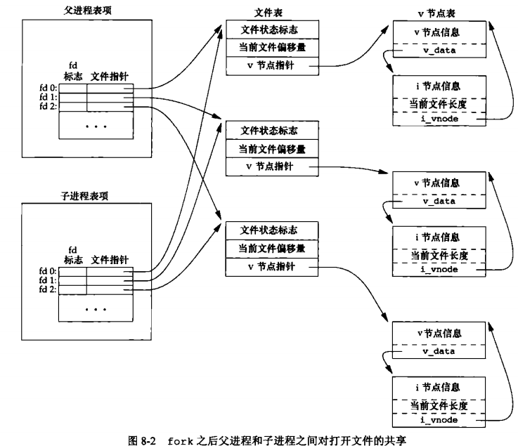

## 进程

### 进程终止

有 8 种方式使进程终止，其中 5 种为正常终止

* 从 `main` 返回
* 调用 `exit`
* 调用 `_exit` 或 `_Exit`
* 最后一个线程从其启动例程返回
* 从最后一个线程调用 `pthread_exit` 

异常终止 3 种

* 调用 abort
* 接到一个信号
* 最后一个线程对取消请求做出响应

### 进程标识

每个进程都有一个非负整数表示的唯一进程 ID。但是进程 ID 是可复用的。当一个进程终止后，其进程 ID 就成为复用的候选者。

### C程序的存储空间布局

* **正文段:**由 CPU 执行的机器指令部分。正文段一般是可共享的与只读的。
* **初始化数据段：**通常将此段称为数据段，它包含了程序中需明确地赋初值地变量
* **未初始化数据段：**通常将此段称为 `bss` 段，意思是由符号开始地块，在程序开始执行前，内核将此段中地数据初始化为 0 或空指针
* **栈：**自动变量以及每次函数调用时所需保存地信息都存放在此段中，每次函数调用时，其返回地址以及调用者的环境信息都存放在栈中。然后，最近被调用的函数在栈上为其自动和临时变量分配空间。
* **堆：**在堆中进行动态存储分配。堆位于初始化数据段和栈之间

存储空间图

### fork

一个现有的进程可以调用 fork 函数创建一个新进程（子进程返回 0，父进程返回子进程ID，出错返回 -1）由 `fork` 创建的新进程被称为子进程。`fork` 函数调用一次，返回两次。子进程和父进程继续执行 `fork` 调用之后的指令。子进程是父进程的副本（子进程获得父进程数据空间，堆和栈的副本）父进程和子进程并不共享这些存储空间部分。父进程和子进程共享正文段。由于在 `fork` 之后经常跟随者 `exec` 所以现在的很多实现并不执行一个父进程数据段，栈和堆的完全副本。作为替代，使用了写时复制，这些区域由父进程和子进程共享，而且内核将它们的访问权限改变为只读。如果父进程和子进程中的任一个视图修改这个区域，则内核只为修改区域的那块内存制作一个副本，通常时虚拟存储系统中的一页。(`linux` 提供了进程创建函数 clone 系统调用。允许调用者控制那些部分由父进程和子进程共享)

**父进程的很多其他属性由子进程继承:**文件描述符（父进程的所有打开文件描述符都被复制到子进程中，父进程和子进程每个相同的打开描述符共享一个文件表项），实际用户 ID，实际组 ID，有效用户 ID，有效组 ID，附属组 ID，进出租 ID会话 ID，控制终端，设置用户 ID标志和设置组ID标志，当前工作目录，根目录，文件模式创建屏蔽字，信号屏蔽和安排，对任一打开文件描述符的执行时关闭标志，环境，连接的共享存储段，存储映像，资源限制。**父进程和子进程之间的区别:** `fork` 的返回值不同，两个进程的父进程ID不同；子进程的父进程 ID是创建它的进程的 ID，而父进程ID则不必，子进程的 `tms_utimt`,`tms_stime`,`tms_cutime`,`tms_ustime` 的数值设置为0，子进程不继承父进程设置的文件锁，子进程的未处理闹钟被清除，子进程的未处理信号集设置为空集