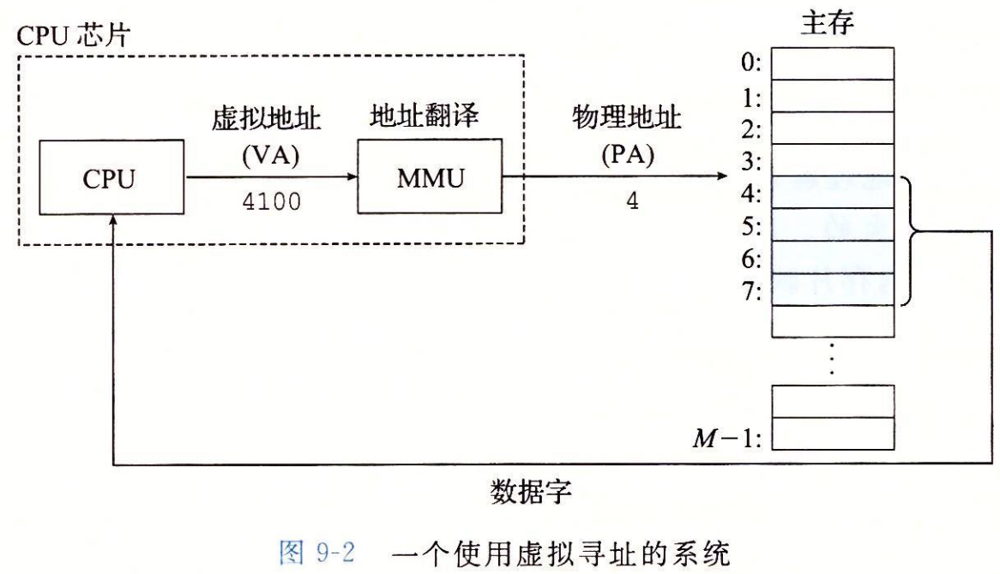
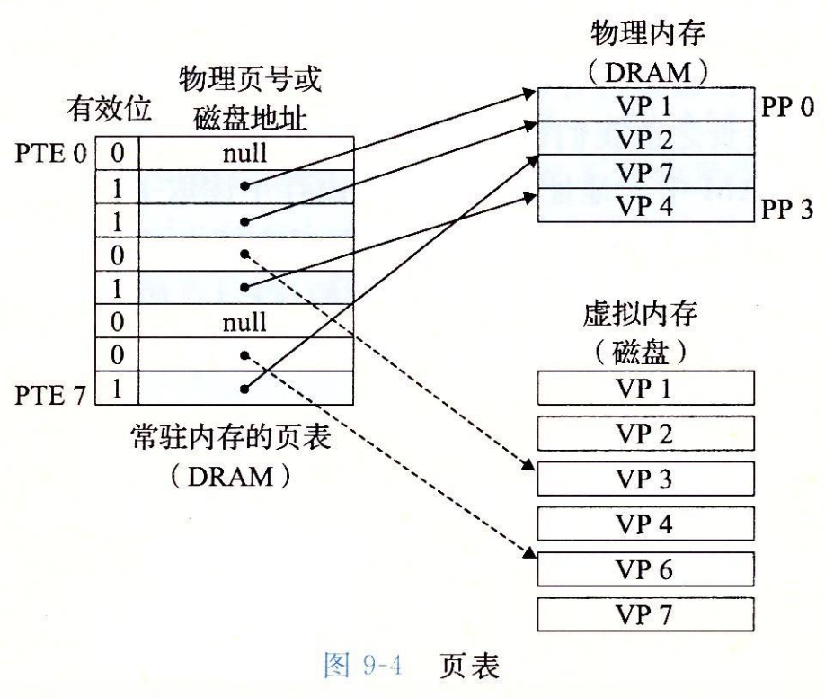
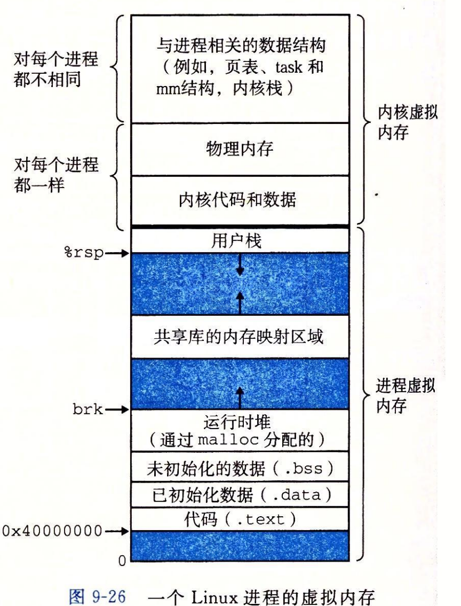

# 虚拟内存

一个系统中的进程是与其他进程共享 CPU 和主存资源的。然而，共享主存会形成一些特殊的挑战。随着对 CPU 需求的增长，进程以某种合理的平滑方式慢了下来。但是如果太多的进程需要大多的内存，那么它们中的一些根本就无法运行。当一个程序没有空间可用时，那就是它运气不好了，内存还很容易被破坏。如果某个进程不小心写了另一个进程使用的内存，它就可能以某种完全和程序逻辑无关的令人迷惑的方式失败。

为了更加有效地管理内存并且少出错，现代系统提供了一种对主存的抽象概念，叫做虚拟内存。虚拟内存是硬件异常、硬件地址翻译、主存、磁盘文件和内核软件的完美交互，它为每个进程提供了一个大的、一致的和私有的地址空间。通过一个很清晰的机制，虚拟内存提供了三个重要的能力：

1. 它将主存看成一个存储在磁盘上的地址空间的高速缓存，在主存中只保存活动区域，并根据需要在磁盘和主存之间来回传送，通过这种方式，它高效地使用了主存。
2. 它为每个进程提供了一致的地址空间，从而简化了内存管理
3. 它保护了每个进程的地址空间不被其他进程破坏

虚拟内存是计算机系统最重要的概念之一。它成功的一个主要原因是它是沉默地、自动地工作，不需要应用程序员的任何干涉。

* 虚拟内存是核心的。虚拟内存遍及计算机系统的所有层面，在硬件异常、汇编器、链接器、加载器、共享对象、文件和进程的设计中扮演着重要角色。
* 虚拟内存是强大的。虚拟内存给予应用程序强大的能力，可以创建和销毁内存片，将内存片映射到磁盘文件的某个部分，以及与其他进程共享内存。
* 虚拟内存是危险的。每次应用程序引用一个变量、间接引用一个指针，或者调用一个诸如 `malloc` 这样的动态分配程序时，它就会和虚拟内存发生交互。如果虚拟内存使用不当，应用将遇到复杂危险的与内存有关的错误。

### 物理和虚拟地址

计算机系统的主存被组织成一个由 M 个连续的字节大小的单元组成的数组。每字节都有一个唯一的物理地址（Physical Address PA)。第一个字节的地址为 0，接下来的字节地址为 1，再下一个为 2，依次类推。给定这种简单的结构， CPU 访问内存的最自然的方式就是使用物理地址。即物理寻址。

早期的 PC 使用物理寻址，而且诸如数字信号处理器、嵌入式微控制器以及 Cray 超级计算机这样的系统仍然继续使用这种寻址方式。然而，现代处理器使用的是一种称为虚拟寻址的寻址形式。

*虚拟寻址流程*

使用虚拟寻址，CPU 通过生成一个虚拟地址（Virtual Address）来访问主存，这个虚拟地址在被送到内存之前先转换成适当的物理地址。将一个虚拟地址转换为物理地址的任务叫做地址翻译（address translation)。就像异常处理一样，地址翻译需要 CPU 硬件和操作系统之间的紧密合作。CPU 芯片上的内存管理单元（Memory Management Unit）的专用硬件，利用存放在主存中的查询表来动态翻译虚拟地址，该表的内容由操作系统管理

### 地址空间

地址空间（address space）是一个非负整数地址的有序集合：

如果地址空间中的整数是连续的，那么说它是一个线性地址空间。假设使用的是线性地址空间。在一个带虚拟内存的系统中，CPU 从一个有 N = 2 的 n 次方个地址空间中生成虚拟地址，这个地址空间称为虚拟地址空间（virtual address space)

一个地址空间的大小是由表示最大地址所需要的位数来描述的。一个包含 N = 2 的 n 次方个地址的虚拟地址空间就叫做一个 n 位地址空间。现代系统通常支持 32 位或者 64 位虚拟地址空间

一个系统还有一个物理地址空间（physical address space)，对应于系统中物理内存的 M 个字节。M 不要求是 2 的幂。

地址空间的概念很重要，因为它清楚地区分了数据对象（字节）和它们的属性（地址）。一旦认识到了这种差别，那么我们就可以将其推广，允许每个数据对象有多个独立的地址，其中每个地址都选自一个不同的地址空间。这就是虚拟内存的基本思想。主存中的每字节都有一个选自虚拟地址空间的虚拟地址和一个物理地址空间的物理地址

### 虚拟内存作为缓存的工具

概念上而言，虚拟内存被组织成一个由存放在磁盘上的 N 个连续的字节大小的单元组成的数组。每字节都有一个唯一的虚拟地址，作为到数组的索引。磁盘上数组的内容被缓存在主存中。和存储器层次结构中其他缓存一样，磁盘（较低层）上的数据被分割成块，这些块作为磁盘和主存（较高层）之间传输单元。VM 系统通过将虚拟内存分割为称为虚拟页面（Virtual Page，VP）的大小固定的块来处理这个问题。每个虚拟页的大小为 P = 2 的 p 次方字节。类似的，物理内存被分割为物理页。大小也为 P 字节（物理页也被称为页帧）

在任意时刻，虚拟页面的集合都分为三个不相交的子集

* 未分配的：VM 系统还未分配（或创建）的页。未分配的块没有任何数据和它们相关联，因此也就不占用任何磁盘空间
* 缓存的：当前已缓存在物理内存中的已分配页
* 未缓存的：未缓存在物理内存中的已分配页

#### DRAM 缓存的组织结构

为了清晰理解存储层次结构中不同的缓存概念，术语 SRAM 缓存来表示位于 CPU 和主存之间的 L1、L2、L3 高速缓存，术语 DRAM 缓存表示虚拟内存系统的缓存，它在主存中缓存虚拟页

在存储层次结构中，DRAM 缓存的位置相对它的组织结构有很大的影响。DRAM 比 SRAM 要慢大约 10 倍，而磁盘要比 DRAM 慢大约 100000 多倍。因此，DRAM 缓存中的不命中比起 SRAM 缓存中的不命中要昂贵的多，这是因为 DRAM 缓存不命中要由磁盘来服务，而 SRAM 缓存不命中通常是由基于 DRAM 的主存来服务的。而且，从磁盘的一个扇区读取第一个字节的时间开销比起读这个扇区中连续的字节要慢大约 100000 倍。DRAM 缓存的组织结构完全是由巨大的不命中开销驱动的。

因为大的不命中处罚和访问第一个字节的开销，虚拟页往往很大，通常是 4kb～2mb。由于大的不命中处罚，DRAM 缓存是全相联的，即任何虚拟页都可以放置在任何的物理页中。不命中时的替换策略也很重要，因为替换错了虚拟页的处罚也非常之高。因此，与硬件对 SRAM 缓存相比，操作系统对 DRAM 缓存使用了更复杂精密的替换算法。因为对磁盘的访问时间很长，DRAM 缓存总是使用写回，而不是直写。

#### 页表

同任何缓存一样，虚拟内存系统必须有某种方法来判定一个虚拟页是否缓存在 DRAM 中的某个地方。如果是，系统还必须确定这个虚拟页存放在哪个物理页中。如果不命中，系统必须判断这个虚拟页存放在磁盘的哪个位置，在物理内存中选择一个牺牲页，并将虚拟页从磁盘复制到 DRAM 中，替换这个牺牲页。

这些功能是由软硬件联合提供的，包括操作系统软件、MMU（内存管理单元）中的地址翻译硬件和一个存放在物理内存中叫做页表的数据结构，页表将虚拟页映射到物理页面。每次地址翻译硬件将一个虚拟地址转换为物理地址时，都会读取页表。操作系统负责维护页表的内容，以及在磁盘与 DRAM 之间来回传送页。

*页表的基本组织结构*

页表就是一个页表条目的数组（Page Table Entry）。虚拟地址空间中的每个页在页表中一个固定偏移量处都有一个 PTE。假设每个 PTE 是由一个有效位（valid bit）和一个 n 位地址字段组成的。有效位表明了该虚拟页当前是否被缓存在 DRAM 中。如果设置了有效位，那么地址字段就表示 DRAM 中相应的物理页的起始位置，这个物理页中缓存了该虚拟页。如果没有设置有效位，那么一个空地址表示这个虚拟页还未被分配。否则，这个地址就指向该虚拟页在磁盘上的起始位置。

## Linux 虚拟内存系统

Linux 为每个进程维护了一个单独的虚拟地址空间，如下图

* 内核虚拟内存包含内核中的代码和数据结构。内核虚拟内存的某些区域被映射到所有进程共享的物理页面。每个进程共享内核的代码和全局数据结构。有趣的是，`lunux` 也将一组连续的虚拟页面（大小等于系统 DRAM 的总量）映射到相应的一组连续的物理页面。这就为内核提供了一种便利的方法来访问物理内存中任何特定的位置。