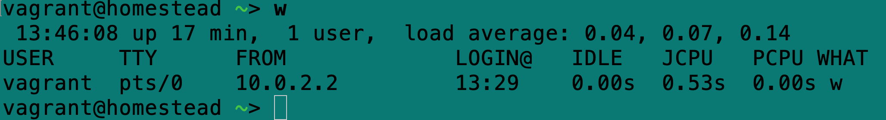

# 进程相关操作命令

## 进程查看相关

### ps 命令

* 查看自己当前运行的进程

  `ps -ux`

* 查看用户 `www-data` 的所有进程

  `ps -U www-data`

* 一个程序的所有进程

  `ps -C program_name`

* 在终端 N 上的各个进程

  `ps -tN`

* 显示特定进程号进程

  `ps -p958,959`

* 输出所有进程的信息，输出信息的宽度会根据屏幕宽度截取

  `ps -ef`

* 输出所有进程的完整信息，避免详细参数被截断

  `ps -efww`

* 输出所有进程的信息，并根据线程的角度，对隶属于同一个父进程之下的子进程进行缩进处理

  `ps -efH`

### uptime 命令相关

`uptime`

`uptime` 命令可以指出从上次启动以来系统已经运行了多长时间

 

这些信息从左至右分别是：

当前时间（13:35:06），系统正常运行时间（6 min），登录用户数（1），以及三个时间段内的系统负载平均值

1 分钟（0.01），5 分钟（0.38），15 分钟（0.27）。

负载平均值是该时间间隔内准备即将运行的进程的平均数

### w 命令

`w [username]`

w 命令显示所有登录用户在每个 shell 中运行的当前进程

最上面的内容与 `uptime` 命令的输出相同。输出中的各列分别表示用户的终端，发起主机或 X 显示器，登录时间、空闲时间、CPU 时间的两个度量指标。如果提供了用户名的话，只输出该用户的有关信息

* `-h` 

  不显示标题行

* `-f`

  不显示 `FROM` 列

* `-s`

  不显示 `JCPU` 和 `PCPU` 列

### top 命令

`top [option]`

top 命令用来监视最活跃的进程，并能够定期更新信息（如每个一秒更新一次）。top 运行过程中可以通过按键来改变其行为，设置更新速度（s），隐藏空闲进程（i），杀死进程（k）

，h 查看完整的列表，q 退出。类似 `iotop` 和 `iftop`

* `-nN`

  执行 N 次更新，然后退出

*  `-dN`

  每 N 秒更新一次显示内容

* `-pN-PM` 

  仅显示 PID 为 N，M…的进程的信息。最多显示 20 个进程的信息

* `-c`

  显示进程的命令后参数

* `-b`

  将信息以非交互式显示到标准输出，所以无需使用与屏幕显示方面的交互技巧。

  `top -b n1> outfile` 将快照保存到文件中

### free 命令

`free [option]`

free 命令可用来显示内存的使用情况（以千字节为单位）

对于上次输出的空闲内存的最佳估计，应该根据 `buffers/cache` 行和 `free` 列来计算

* `-s N` 

  连续运行，每 N 秒更新一个显示内容

* `b`

  显示字节数

* `-m`

  显示m数量

* `-t`

  在底部添加总行数

* `-o`

  不显示 `buffers/cache` 行

### pidof

`pidof nginx`

获取进程 ID

## 进程控制相关

### kill 命令

`kill [options] [precess_ids]`

kill 命令可以向进程发送信号，从而终止进程（默认动作），中断进程，挂起进程，使其崩溃等目的。但是必须有权限。

* `kill -9` 等价 `kill -KILL` 终止进程（可能无法释放所占用的资源）

* `killall nginx`  终止给定程序的所有进程

### timeout 命令

`timeout [options] seconds command ...`

`timeout` 命令可以用来限制另一个程序的运行时间，以秒为单位。如果程序运行时间超过规定范围，`timeout` 将终止其运行。

* `-s signal`

  发送除默认值之外的信号。

* `-k seconds`

  如果程序在第一个信号之后没有终止。那么么在等待规定秒数之后，发送致命的 Kill 信号

### nice 命令

`nice [-n level] command_line`

运行程序时，设置其进程优先级，如果不指定优先级默认 10，正常为 0

`sudo nice -n -10 nginx`

### renice 命令

`renice [-n N] [options] pid`

修改已运行的进程的优先级。范围为 -20 ～ 20，修改进程优先级必须具有权限，且避免使用较大负数（可能会干扰系统进程的调度）

`renice -n 5 -p 28734`

### flock 命令

确保在同一时刻只有一个进程副本在运行，会使用锁。`flock` 命令的参数引用的 `lockfile` 必须相同。

`flock -n /tmp/mylock ls`

* `-n`

  如果另外一个命令已经运行，则立即失败

* `-w N`

  如果另外一个命令已经在运行，则等待 N 秒后失败

* `-s`

  使用共享锁而不是排他锁。使用该选项可以同时运行多个命令，但如果省略该选项，则 `flock` 将失败。这个选项对于允许有限数量的命令同时运行是非常有用的

### 查杀系统自启动进程

* 查询端口

  `fuser -n tcp port`

* 停止系统自启动

  `systemctl stop kibana`

  `systemctl disable kibana`

  