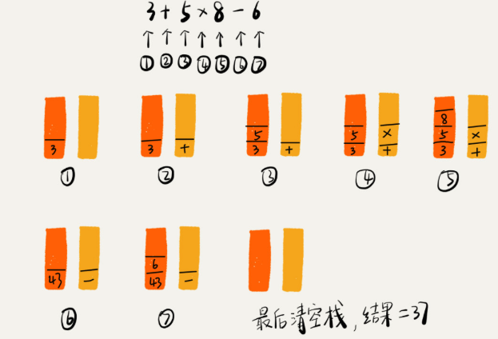

## 栈

### 概述

后进者先出，先进者后出，就是典型的"栈"结构。从栈的操作特性上来看，栈是一种"操作受限"的线性表，只允许在一端插入和删除数据。

从功能上，数组或链表完全可以替代栈，但，特定的数据结构是对特定场景的抽象，而且，数组或链表暴露了太多的操作接口。当某个数据集只涉及在一端插入和删除数据，并且满足后进先出，先进后出的特性，就应该首选栈这种数据结构

### 实现一个栈

栈主要包含两个操作，入栈和出栈，即在栈顶插入一个数据和从栈顶删除一个数据。栈可以用数组来实现，也可以用链表来实现，用数组实现的栈，即**顺序栈**，用链表实现的栈，即**链式栈**。不管是顺序栈还是链式栈，存储数据只需要一个大小为 n 的数组就可以，在入栈和出栈过程中，只需要一两个临时变量存储空间，所以**空间复杂度是 `O(1)`**。（存储数据需要一个大小为 n 的数组，并不是空间复杂度是 `O(n)`。因为，这 n 个空间是必须的，无法省掉，所以说空间复杂度的时候，是指除了原本的数据存储空间外，算法运行还需要的额外的存储空间）入栈、出栈只涉及栈顶个别数据的操作，时间复杂度是 `O(1)`

### 栈的应用

#### 栈的经典应用场景函数调用栈

操作系统给每个线程分配了一块独立的内存空间，这块内存被组织成"栈"这种结构，用来存储函数调用时的临时变量。每进入一个函数，就会将临时变量作为一个栈帧入栈，当被调用函数执行完成，返回之后，将这个函数对应的栈帧出栈。

不一定非要用栈来保存临时变量，只不过如果这个函数调用符合后进先出的特性，用栈这种数据结构来实现，是最方便的选择。从调用函数进入被调用函数，对于数据来说，变化的是作用域。根本上，只要能保证每进入一个新的函数，都是一个新的作用域就可以。实现的话，用栈这种数据结构，在进入被调用函数的时候，分配一段栈空间给这个函数的变量，在函数结束的时候，将栈顶复位，正好回到调用函数的作用域内

#### 栈在表达式求值中的应用

编译器利用栈实现表达式求值，如 `3 + 5 * 8 - 6`

编译器利用两个栈来实现，一个保存操作数的栈，另一个保存运算符的栈。从左到右遍历表达式，当遇到数字，就压入操作数栈；当遇到运算符就与运算符栈的栈顶元素进行比较。如果比运算符栈顶元素的优先级高，就将当前运算符压入栈；如果比运算符栈顶元素的优先级低或者相同，从运算符栈中取栈顶运算符，从操作数栈的栈顶取 2 个操作数，然后进行计算，再把计算完的结果压入操作数栈，继续比较。

#### 栈在括号匹配中的应用

借助栈可以实现检查表达式中的括号是否匹配。假定表达式中包含 `()`,`[]`,`{}`，并且可以任意嵌套。此时要要检查嵌套的合法格式。可以使用栈。

用栈来保存未匹配的左括号，从左到右依次扫描字符串。当扫描到左括号时，则将其压入栈中；当扫描到右括号时，从栈顶取出一个左括号。如果能够匹配，则继续扫描，如果扫描的过程中，遇到不能配对的右括号，或者栈中没有数据，则说明为非法格式。

### JVM中堆栈与数据结构堆栈

JVM内存中的堆栈和数据结构的堆栈不是一个概念，内存中的堆栈式真是存在的物理区，数据结构中的堆栈是抽象的数据存储结构。

JVM 内存空间在逻辑上分为三部分：代码区，静态数据区和动态数据区，动态数据区又分为栈区和堆区。

代码区：存储方法体的二进制代码。高级调度（作业调度），中级调度（内存调度），低级调度（进程调度）控制代码区执行代码的切换。

静态数据区：存储全局变量，静态变量，常量，常量包括 final 修饰的常量和 String 常量，系统自动分配和回收

栈区：存储运行方法的形参，局部变量，返回值。由系统自动分配和回收

堆区：new一个对象的引用或地址存储在栈区，指向该对象存储在堆区中的真实数据

