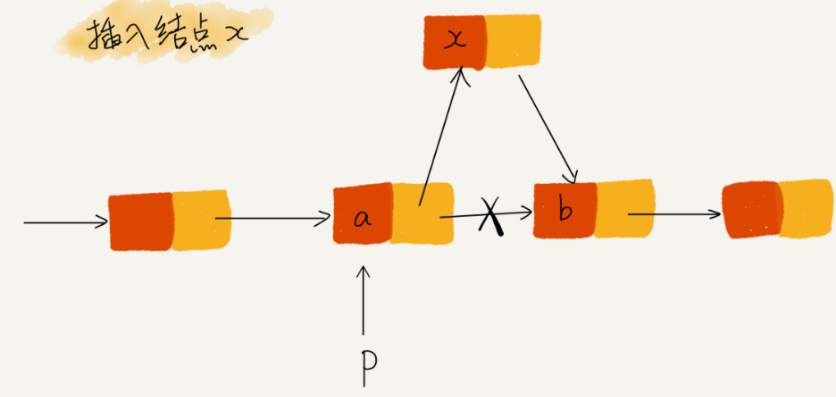

## 链表

### 链表与数组区别

#### 底层存储结构区别：

*内存分布*


* 数组需要一块连续的内存空间来存储，对内存的要求比较高。如果申请一个 100MB 大小的数组，当内存中没有连续的、足够大的存储空间时，即便内存的剩余总可以空间大于 100mb，仍然会申请失败
* 链表不需要一块连续的内存空间，它通过指针将一组零散的内存块串联起来使用。
* 数组的随机访问时间复杂度是 `O(1)`，插入删除的时间复杂度是 `O(n)`，链表的随机访问时间复杂度是 `O(n)`，插入删除的时间复杂度是 `O(1)`

数组和链表的对比，不能局限于时间复杂度。而且，在实际的开发中，不能仅仅利用复杂度分析就决定使用哪个数据结构来存储数据。

数组的缺点是大小固定，一经声明就要占用整块连续内存空间。如果声明的数组过大，系统可能没有足够的连续内存空间分配给它，导致 “内存不足(out of memory)”  。如果声明的数组过小，则可能出现不够用的情况。只能再申请一个更大的内存空间，把原数组拷贝进去，非常费时。链表本身没有大小限制，天然地支持动态扩容。

如果代码对内存的使用非常苛刻，数组更适合。因为链表中的每个节点都需要消耗额外的存储空间去存储指向下一个节点的指针，内存消耗更大。对链表进行频繁的插入、删除操作，会导致频繁的内存申请和释放，容易造成内存碎片，如果是 java 语言，就可能导致频繁的 GC。

### 单链表

*单链表结构*


* 链表通过指针将一组零散的内存块串联在一起。其中，内存块称为链表的 **节点**。为了将所有的节点串起来，每个链表的结点除了存储数据之外，还需要记录链上的下一个节点的地址。记录下个节点的指针为 **后继指针 next**

* 头节点用来记录链表的基地址。有了它，可以遍历得到整条链表。而尾节点不是指向下一个节点，而是指向一个空地址 null，表示这是链表上最后一个节点

* 在链表中插入或者删除一个数据，不需要保持内存的连续性而搬移结点，因为链表的存储空间本身就不是连续的。对链表的插入和删除操作，只需要考虑相邻节点的指针改变，对应的时间复杂度为 `O(1)`

  *链表的插入与删除*

  

  但链表的随机访问第 k 个元素，需要根据指针一个节点一个节点地依次遍历，直到找到相应的节点。时间复杂度为 `O(n)`

### 循环链表

循环链表是一种特殊的单链表。与单链表唯一的区别在于尾节点：单链表的尾节点指针指向空地址，表示这就是最后的节点。而循环链表的尾节点指针时指向链表的头节点。

与单链表相比，循环链表的优点是从链尾到链头比较方便。当要处理的数据具有环型结构特点时，就适合采用循环链表。

### 双向链表

单向链表只有一个方向，节点只有一个后继指针 `next` 指向后面的节点。而双向链表，它支持两个方法，每个节点除了有后继指针 `next` 指向后面的节点，还有一个前驱指针 `prev` 指向前面的节点


双向链表需要额外的两个空间来存储后继节点和前驱节点的地址，所以，如果存储同样多的数据，双向链表要比单链表占用更多的内存空间。虽然两个指针比较浪费存储空间，但可以支持双向遍历。

* 双向链表可以支持常数时间复杂度的情况下找到前驱结点，在某些情况下，双向链表的插入、删除等操作比单链表简单、高效。

#### 链表的删除操作

在实际的软件开发中，从链表中删除一个数据有以下两种情况：

* 删除结点中 “值等于某个给定值” 的节点
* 删除给定指针指向的节点

对第一种情况，不管是单链表还是双向链表，为了查找到值等于给定值的节点，都需要从头结点开始一个一个依次遍历，直到找到值等于给定值的节点，然后再通过指针操作将其删除。

尽管单纯的删除操作时间复杂度是 `O(1)`，但遍历查找的时候是主要的耗时点，对应的时间复杂度为 `O(n)`。根据时间复杂度分析中的加法法则，删除值等于给定值的节点对应的链表操作的总时间复杂度为 `o(n)`

对于第二种情况，已经找到了要删除的结点，但是删除某个结点 q 需要知道其前驱结点，而单链表并不支持直接获取前驱结点，所以，为了找到前驱结点，还是要从头开始遍历链表，直到 `p->next = q`，说明 p 是 q 的前驱结点。但对于双向链表来说，因为双向链表比单链表有很大的优势。双向链表可以在常数数据复杂度完成。

### 经典的链表应用场景

#### 链表实现 `LRU` 缓存淘汰算法

​	缓存是一种提高数据读取性能的技术，在硬件设计、软件开发中都有着非常广泛的应用（CPU 缓存、数据库缓存、浏览器缓存等）。缓存的大小有限，当缓存被用满时，哪些数据应该被清理出去，哪些数据应该被保留？这就需要缓存淘汰策略来决定。常见的策略是：先进先出策略 FIFO（First In，First Out）、最少使用策略 `LFU` （Least Frequently Used）、最近最少使用策略 `LRU`（Least Recently Used）

### 链表代码关键点

#### 理解指针或引用的含义

有些语言有指针，有些语言没有指针，取而代之的是引用。不管指针还是引用，它们的意思都是一样的，都是存储所指对象的内存地址。**将某个变量赋值给指针，实际上就是将这个变量的地址赋值给指针，即，指针中存储了这个变量的内存地址， 指向了这个变量，通过指针就能找到这个变量**

在编写链表代码的时候，`p->next = q`。这行代码是，p 结点中的 `next` 指针存储了 q 节点的内存地址；`p->next = p->next->next`，这表示，p 结点的 `next` 指针存储了 p 结点的下下一个结点的内存地址

#### 警惕指针丢失和内存泄漏

*单链表插入操作，插入结点x*



希望在结点 a 和相邻的结点 b 之间插入结点 x，假设当前指针 p 指向结点 a。如果使用以下代码则会发生指针丢失，内存泄漏

```c++
// 错误指针引用
p->next = x;		// 将 p 的 next 指针指向 x 结点
x->next = p->next;	// 将 x 的结点的 next 指针指向 b 结点
```

以上代码在 `p->next` 指针在第一步操作之后，已经不再指向结点 b 了，而是指向结点 x。而后的 `x->next = p->next`，等于是将 `x` 赋值给 `x->next`，自己指向自己。因此，整个链表也就断成了两半，从结点 b 往后的所有结点都无法访问到了。有些语言，内存管理是由程序员负责的，如果没有手动释放结点对应的内存空间，就会产生内存泄漏。插入结点时，一定要注意操作的顺序，要先将结点 x 的 `next` 指针指向结点 `b`，再把结点 `a` 的指针指向结点 `x`，这样才不会丢失指针，导致内存泄漏。

```c
// 正确指针引用
x->next = p->next;
p->next = x;
```

删除链表结点时，要释放内存空间，否则，也会发生内存泄漏的问题。

#### 哨兵机制简化实现

单链表中，在结点 p 后面插入一个新的结点

```
new_node->next = p->next;
p->next = new_node;
```

但是，要向一个空链表插入第一个结点，刚刚的逻辑就不能用了。使用下面的代码处理，其中 `head` 表示链表的头结点。对于单链表的插入操作，第一个结点和其他结点的插入逻辑不一样

```
if (head == null) {
    head = new_node;
}
```

单链表结点删除操作，删除结点 p 的后继结点

```
p->next = p->next->next;
```

但是，删除链表中的最后一个结点，前面的删除代码不能正常工作，特殊处理如下

```
if (head->next == null) {
    head = null
}
```

即，对链表的插入、删除操作，需要对插入第一个结点和删除最后一个结点的情况进行特殊处理。这样代码实现起来很繁琐，不简洁，也容易因为考虑不全而出错。。

引入哨兵结点，在任何时候，不管链表是不是空，`head` 指针都会一直指向这个哨兵结点。这种带有哨兵结点的链表是**带头链表**，没有哨兵结点的链表是**不带头链表**。

#### 边界条件处理

软件开发中，代码在一些边界或者异常情况下，最容易产生 bug。链表代码也一样，检查链表代码是否正确的边界条件：

* 如果链表为空，代码能够正常工作
* 如果链表只包含一个结点时，代码能否正常工作
* 如果链表只包含两个结点时，代码能否正常工作
* 代码逻辑在处理头结点和尾结点时，能否正在工作

### 常见链表操作

* 单链表反转
* 链表中环检测
* 两个有序链表合并
* 删除链表倒数第 n 个结点
* 求链表的中间结点