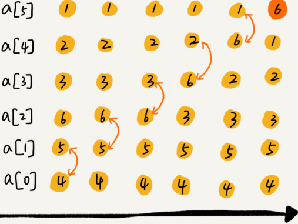
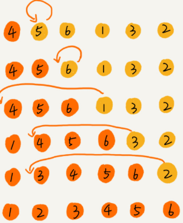
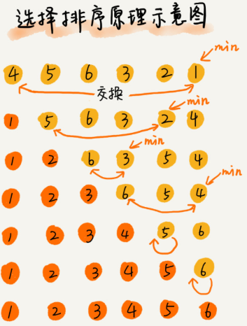
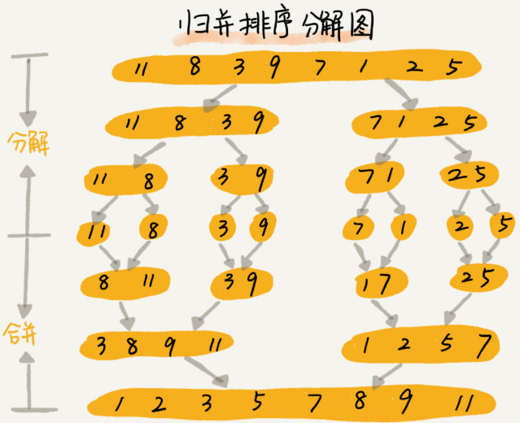
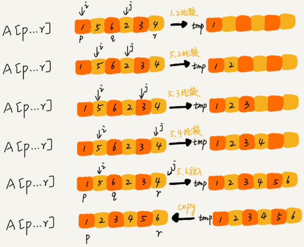
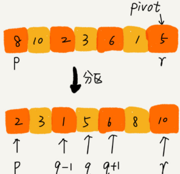
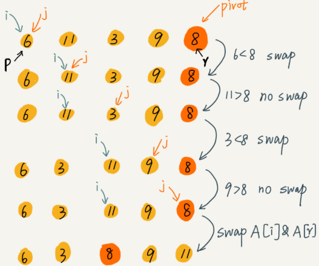
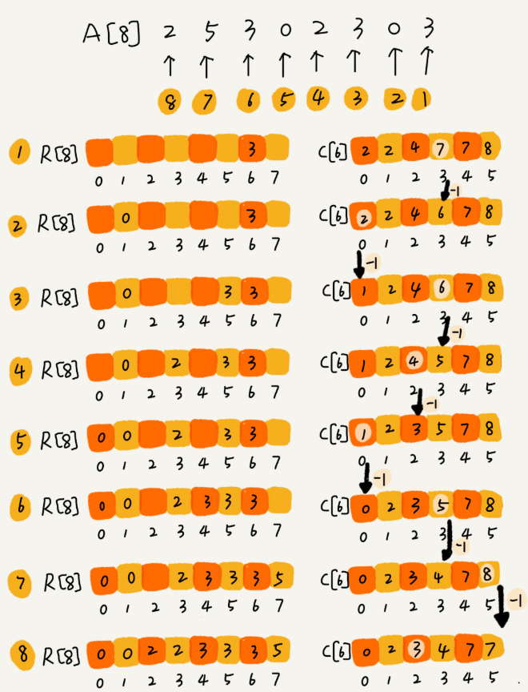

## 常用数组排序

### 分析排序算法

#### 排序算法的执行效率

对于排序算法执行效率的分析，一般会从这几个方面来衡量：

* 最好情况、最坏情况、平均情况时间复杂度
  对于要排序的数据，有的接近有序，有的完全无序。有序度不同的数据，对于排序的执行时间肯定有影响的，要考虑排序算法在不同数据下的性能表现

* 时间复杂度的系数、常数、低阶
  时间复杂度反应的是数据规模 n 很大的时候的一个增长趋势，所以它表示的时候会忽略系数、常数、低阶。但是实际的软件开发中，在对同一阶时间复杂度的排序算法性能对比的时候，要把系数、常数、低阶也考虑进来

* 比较次数和交换次数
  基于比较的排序算法的执行过程，会涉及两种操作，一种是元素比较大小，另一种是元素交互或移动。在分析排序算法的执行效率的时候，应该把比较次数和交换次数也考虑进去

#### 排序算法的内存消耗

针对排序算法的空间复杂度，有一个新的概念，原地排序（Sorted in place)。原地排序算法，是特指空间复杂度是 `O(1)` 的排序算法

#### 排序算法的稳定性

针对排序算法，还有一个重要的度量指标，稳定性。这个概念是说，如果待排序的序列中存在值相等的元素，经过排序之后，相等元素之间原有的先后顺序不变。

如果有一组数据：2，9，3，4，8，3。按照大小排序之后就是：2，3，3，4，8，9。这组数据里有两个三。经过某种排序算法排序之后，如果两个 3 的前后顺序没有改变，那么这种排序算法即是**稳定的排序算法**；如果前后顺序发生变化，那对应的排序算法即是**不稳定的排序算法**

#### 有序度

有序度是数组中具有有序关系的元素对的个数。有序元素对用数据表达式是：
```
如果 i < j，则有序元素对：a[i] <= a[j]
```
完全有序的数组的有序度叫做满有序度，计算公式：`n*(n-1)/2`
逆序度：满有序度 - 有序度
排序的过程即增加有序度，减少逆序度的过程，最后达到满有序度，即排序完成

### 时间复杂度 O(n^2)

#### 冒泡排序 （Bubble Sort)

冒泡排序只会操作相邻的两个数据。每次冒泡操作都会对相邻的两个元素进行比较，看是否满足大小关系要求。如果不满足就让它俩互换。一次冒泡会让至少一个元素移动到它应该在的位置，重复 n 次，就完成了 n 个数据的排序工作

* **冒泡排序空间复杂度**：冒泡过程只涉及相邻数据的交换操作，只需要常量级的临时空间，所以它的空间复杂度为 `O(1)`，是一个原地排序算法
* **冒泡排序是稳定的排序算法**：在冒泡排序中，只有交换才可以改变两个元素的前后顺序。为了保证冒泡排序算法的稳定性，当有相邻的两个元素大小相等的时候，不做交换，相同大小的数据在排序前后不会改变顺序。即是稳定的排序算法
* **冒泡排序的时间复杂度是**：最好情况下，待排序的数据已经是有序的，只需要进行一次冒泡操作，就可以结束。即最好是 `O(n)`。而最坏的情况是，要排序的数据刚好是倒序排列的，需要进行 n 次冒泡操作，即最坏情况时间复杂度是 `O(n^2)`。平均情况下：假定有序度为一半， 需要 `n*(n-1)/4` 次交换操作，比较操作肯定比交换操作多，而复杂度的上限是 `O(n^2)`，所以平均情况下的时间复杂度是 `O(n^2)`

*冒泡排序过程*



*冒泡排序*

```java
public void bubbleSort(int[] ints) {
    if (ints.length <= 1) {
        return;
    }
    for (int i = 0; i < ints.length; ++i) {
        boolean isExchange = false;
      	for (int l = i + 1; l < ints.length; ++l) {
            if (ints[i] > ints[l]) {
                int tmp = ints[i];
                ints[i] = ints[l];
                ints[l] = tmp;
                isExchange = true;
            }
        }
        if (!isExchange) {
            break;
        }
    }
}
```

#### 插入排序 （Insertion Sort)

首先将数组中的数据分为两个区间，已排序区间和未排序区间。初始已排序区间只有一个元素，就是数组的第一个元素。插入算法的核心思想是取未排序区间的元素，在已排序区间中找到合适的插入位置将其插入，并保证已排序区间数据一直有序。重复这个过程，直到未排序区间中元素为空，算法结束

插入排序也包含两种操作，一种是元素的比较，一种是元素的移动。当需要将一个数据 a 插入到已排序区间时，需要拿 a 与已排序区间的元素依次比较大小，找到合适的插入位置。找到插入点之后，还需要将插入点之后的元素往后移动一位，这样才能腾出位置给元素 a 插入。对于不同的查找插入点方法（从头到尾，从尾到头），元素的比较次数是有区别的。但对于一个给定的初始序列，移动操作的次数总是固定的，就等于逆序度。

*插入排序过程*



*插入排序*

```java
public void insertionSort(int[] ints) {
    if (ints.length <= 1) {
        return;
    }
    for (int i = 1; i < ints.length; ++i) {
        int tmp = ints[i];
        int j = i - 1;
        for (; j >= 0; --j) {
          	if (ints[j] > tmp) {
              	ints[j + 1] = ints[j];
            } else {
              	break;
            }
        }
        ints[j + 1] = tmp;
    }
}
```
* **插入排序是原地排序**空间复杂度是 `O(1)`

* **插入排序是稳定排序**，对于值相同的元素，可以选择将后面出现的元素，插入到前面出现元素的后面，这样就可以保持原有的前后顺序不变

* **插入排序的时间复杂度**：如果要排序的数据已经是有序的，并不需要搬移任何数据。如果从尾到头在有序数据组里查找插入位置，每次只需要比较一个数据就能确定插入的位置。在这种情况下，最好是时间复杂度 `O(n)`; 如果数组是倒序的，每次插入都相当于在数组的第一个位置插入新的数据，所以需要移动大量的数据，所以最坏情况时间复杂度 `O(n^2)`; 对于插入排序来说，每次插入操作都相当于在数组中插入一个数据，循环执行 n 次插入操作，所以平均时间复杂度 `o(n^2)`

冒泡排序不管怎么优化，元素交换的次数是一个固定值，是原始数据的逆序度。插入排序是同样的，不管怎么优化，元素移动的次数也等于原始数据的逆序度。但是，实现上，冒泡排序的数据交换要比插入排序的数据移动要复杂，冒泡排序需要 3 个赋值操作，而插入排序只需要一个。

#### 选择排序 （Selection Sort)

选择排序算法的实现思路类似插入排序，也分已排序区间和未排序区间。但是选择排序每次会从未排序区间中找到最小的元素，将其放到已排序区间的末尾

* **选择排序空间复杂度为：** `O(1)`，是一种原地排序算法。
* **选择排序时间复杂度为：**最好情况时间复杂度、最坏情况和平均情况时间复杂度都为 `O(n^2)`.
* **选择排序不是稳定的排序算法：**如一组数据：`5,8,5,2,9`，使用选择排序算法来排序的话，第一次找到最小元素 2，与第一个 5 交换位置，那第一个  5 和中间的 5 顺序就变了，所以就不稳定了。正是如此，相对于冒泡排序和插入排序，选择排序应用较少

*选择排序过程*



*选择排序*

```java
public static void selectionSort(int[] a) {
	if (a.length <= 1) {
        return;
    }
    for (int i = 0; i < a.length; ++i) {
      	int minIndex = i;
      	for (int l = i + 1; l < ints.length; ++l) {
          	if (int[l] < ints[minIndex]) {
              	minIndex = l;
            }
        }
      	int tmp = ints[i];
      	ints[i] = ints[minIndex];
      	ints[minIndex] = tmp;
    }
}
```

### 时间复杂度 O(nlogn)

#### 归并排序 (Merge Sort)

如果要排序一个数组，先把数组从中间分成前后两部分，然后对前后两部分分别排序，再将排好序的两部分合并在一起，这样整个数组就有序了



归并排序使用的是分治思想。即将一个大问题分解成小的子问题来解决。分支算法一般都是用递归来实现的。**分治是一种解决问题的思想，递归是一种编程技巧**

**归并排序流程：**`merge_sort(p...r)` 表示：给下标从 p 到 r 之间的数组排序。将这个排序问题转化为两个子问题，`merge_sort(p..q)` 和 `merge_sort(q+ 1...r)`，其中下标 q 等于 p 和 r 的中间位置。当下标从 `p` 到 `q` 和 从 `q + 1` 到 `r` 这两个子数组都排好序之后，再将两个有序的子数组合并在一起，这样从 p 到 r 之间的数据也就排好序了。

**合并流程：** 申请一个临时数组 `tmp` ，大小与 `A[p...r]` 相同。用两个游标 `i` 和 `j`，分别指向 `A[p...q]` 和 `A[q+1...r]` 的第一个元素。比较这两个元素 `A[i]` 和 `A[j]`，如果 `A[i] <= A[j]`，就把 `A[i]` 放入临时数组 `tmp` ，并且 `i` 后移一位，否则将 `A[j]` 放入到数组 `tmp` ，`j` 后移一位

*归并排序合并*



* **归并排序是稳定的排序算法**：是否稳定取决于 `merge` 过程，如果 `A[p...q]` 和 `A[q+1...r]` 之间有值相同的元素，如果先把 `A[p...q]` 中的元素放入 `tmp` 数组，这样就保证了值相同的元素在合并前后的先后顺序不变。
* **归并排序的时间复杂度**：`T(n)=Cn+nlog2n`。用大 O 标记为 `O(nlogn)`
* **归并排序的空间复杂度**：归并排序并不是原地排序，因为需要 `tmp`，空间复杂度为 `O(logn)`

*合并排序，递归实现*

```java
static void mergeSortRecursive(int arr, int[] result, int start, int end) {
		if (start >= end)	{
      	return;
    }
  	int len = end - start, mid = (len >> 1) + start;
  	int start1 = start, end1 = mid;
  	int start2 = mid + 1, end2 = end;
  	mergeSortRecursive(arr, result, start1, end1);
  	mergeSortRecursive(arr, result, start2, end2);
  	int k = start;
  	while (start1 <= end1 && start2 <= end2) {
      	result[k++] = arr[start1] < arr[start2] ? arr[start1++] : arr[start2++];
    }
  	while (start1 <= end1) {
      	result[k++] = arr[start1++];
    }
  	while (start2 <= end2) {
      	result[k++] = arr[start2++];
    }
  	for (k = start; k <= end; k++) {
      	arr[k] = result[k];
    }
}
```

*合并排序，迭代实现*

```java
static void mergeSort(int[] arr) {
		int[] orderedArr = new int[arr.length];
  	for (int i = 2; i < arr.length * 2; i *= 2) {
      	for (int j = 0; j < (arr.length + i - 1) / i; j++) {
          	int left = i * j;
          	int mid = left + i / 2 >= arr.length ? (arr.length - 1) : (left + i / 2);
          	int right = i * (j + 1) - 1 >= arr.length ? (arr.length - 1) : (i * (j + 1) - 1);
          	while (l < mid && m <= right) {
              	if (arr[l] < arr[m]) {
                  	orderedArr[start++] = arr[l++];
                } else {
                  	orderedArr[start++] = arr[m++];
                }
            }
          	while (l < mid) {
              	orderedArr[start++] = arr[l++];
            }
          	while (m <= right) {
              	orderedArr[start++] = arr[m++];
            }
          	System.arraycopy(orderedArr, left, arr, left, right - left + 1);
        }
    }
}
```

#### 快速排序（Quick Sort）

快排也是利用分治思想，如果要排序数组中下标从 p 到 r 之间的一组数组，选择 p 到 r 之间的任意一个数据作为 `pivot` 分区点。遍历 `p` 到 `r` 之间的数据，将小于 `pivot` 的放到左边，将大于 `pivot` 的放到右边，将 `pivot` 放到中间。此时 `p` 到 `q - 1` 之间都是小于 `pivot` 的，中间是 `pivot`，后面的 `q + 1` 到 `r` 之间是大于 `pivot` 的。根据分治、递归的思想，可以用递归排序下标从 `p` 到 `q -1` 之间的数据和下标从 `q + 1` 到 `r` 之间的数据，直到区间缩小为 1，此时所有的数据都有序

*快排流程*



*分区过程*



* 因为分区的过程涉及交换操作，如果数组中有两个相同的元素，在经过第一次分区后，两个相同元素的先后顺序就会改变，所以**快速排序不是稳定的排序算法**

* **快排的时间复杂度为**：`O(logn)`T(n) 在大部分情况下的时间复杂度都可以做到 `O(nlogn)`，极端情况下，才会退化为 `O(n^2)`

```java
static void qSort(int[] arr, int head, int tail) {
		if (head >= tail || arr == null || arr.length <= 1) {
				retunr;
		}
		int i = head, j = tail, pivot = arr[(head + tail) / 2];
		while (i <= j) {
            while (arr[i] < pivot) {
                ++i;
            }
            while (arr[j] > pivot) {
                --j;
            }
            if (i < j) {
                int t = arr[i];
                arr[i] = arr[j];
                arr[j] = t;
                ++i;
                --j;
            } else if (i == j) {
                ++i;
            }
		}
		qSort(arr, head, j);
		qSort(arr, i, tail);
}
```

### 时间复杂度 O(n)

#### 桶排序（Bucket sort）

将要排序的数据分到几个有序的桶里，每个桶里的数据再单独进行排序，桶内排完序后，再把每个桶里的数据按照顺序依次取出，组成的序列就是有序的了。

如果要排序的数据有 n 个，把它们均匀地划分到 m 个桶内，每个桶里就有 k = n/m 个元素。每个桶内部使用快速排序，时间复杂度为 `O(k * logk)`。m 个桶排序地时间复杂度就是 `O(m * k * logk)`，因为 `k=n/m`，所以整个桶排序地时间复杂度就是 `O(n*log(n/m))`。当桶的个数 `m` 接近数据个数 `n` 时，`log(n/m)` 就是一个非常小的常量，这个时候桶排序的时间复杂度接近 `O(n)`

桶排序对要排序数据的要求非常苛刻：首先要排序的数据需要很容易就能划分成 `m` 个桶，并且，桶与桶之间有者天然的大小顺序。这样每个桶内的数据都排序完之后，桶与桶之间的数据不需要再进行排序，其次，数据在各个桶之间的分布是比较均匀的。如果数据经过桶的划分之后，有些桶里的数据非常多，有些非常少，很不平均，那桶内数据排序的时间复杂度就不是常量级了。在极端情况下，如果数据都被划分到一个桶里，那就退化为 `O(nlogn)` 的排序算法了

**桶排序比较适合用在外部排序中：**即数据存储在外部磁盘中，数据量比较大，内存有限，无法将数据全部加载到内存中

#### 计数排序（Counting sort）

当要排序的 n 个数据，所处的范围并不大的时候，比如最大值是 k，就可以把数据划分成 k 个桶。每个桶内的数据值都是相同的，省掉了桶内排序的时间。

计数排序实现。假定有 8 个考生，分数在 0 ~ 5 分之间。这 8 个考生的成绩放在一个数组 `A[8]` 中，`2,5,3,0,2,3,0,3`。考生的成绩从 0 分到 5 分，使用大小为 6 的数组 C[6] 表示桶，其中下标对应分数。不过 `C[6]` 内存储的是对应的考生个数。遍历 `A[8]` 得到 `C[6]` 的值。分数为 3 分的考生有 3 个，小于 3 分的考生有 4 个，所以，成绩为 3 分的考生在排序之后的有序数组 `R[8]` 中，会保存在下标 `4,5,6`  的位置。确定考生在有序数组中对应的位置的思路是：对 `C[6]` 数组顺序求和，`C[6]` 存储的数据就变成了`C[k]` 里存储小于等于分数 `k` 的考生个数。从后到前依次扫描数组 A。比如，当扫描到 3 时，可以从数组 C 中取出下标为 3 的值 `7`，即：小于等于 3 的考生有 7 个。3 是数组 R 中的第 7 个元素（数组 R 中下标为 6 的位置）。当 3 放入到数组 R 中后，小于等于 3 的元素就只剩下 6 个了，对应的 `C[3] ` 要减一，变成 6。以此类推，当扫描到第 2 个分数为 3 的考生的时候，就会把它放入数组 R 中的第 6 个元素的位置（即下标为 5 的位置）。当扫描完整个数组 A 后，数组 R 内的数据就是按照分数从小到大有序排序的了。

*计数排序*



```java
public void countingSort(int[] a, int n) {
    if (n <= 1) {
        return;
    }
    int max = a[0];
    // 查找数组中的范围
    for (int i = 1; i < n; ++i) {
        if (max < a[i]) {
            max = a[i];
        }
    }
    // 申请一个计数数组 C，下标大小为，[0, max]
    int[] c = new int[max + 1];
    for (int i = 0; i <= max ++i) {
        c[a[i]]++;
    }
    // 依次累加
    for (int i = 1; i <= max; ++i) {
        c[i] = c[i-1] + c[i];
    }
    // 临时数组 r，存储排序之后的结果
    int[] r = new int[n];
    // 计算排序
    for (int i = n - 1; i >= 0; --i) {
        int index = c[a[i]] - 1;
        r[index] = a[i];
        c[a[i]]--;
    }
    // 结果拷贝
    for (int i = 0; i < n; ++i) {
        a[i] = r[i];
    }
}
```

计数排序只能用在数据范围不大的场景中，如果数据范围 k 比要排序的数据 n 大很多，就不适合用计数排序了。而且计数排序只能给非负整数排序，如果要排序的数据是其他类型的，要将其在不改变相对大小的情况下，转换为非负整数。

#### 基数排序

基数排序需要的是数据可以划分成高低位，位之间有递进关系。比较两个数，只需要比较高位，高位相同再比较低位。而且每一位的数据范围不能太大。如果要排序的数据有 k 位，需要 k 次桶排序或者计数排序，总的时间复杂度是 `O(k*n)`。当 k 不大的时候，基数排序的时间复杂度近似 `O(n)`。对于不是等长的数据，可以在后面补"0"，因为根据 ASCII 值，所有字母都大于 "0"，所以补"0"不会影响到原有的大小顺序。这样就可以继续用基数排序了。

**基数排序对要排序的数据是有要求的，需要可以分割出独立"位"来比较，而且位之间有递进的关系，如果 a 数据的高位比 b 数据大，那剩下的低位就不用比较了，除此之外，每一位的数据范围不能太大，要可以用线性排序算法来排序，否则，基数排序的时间复杂度就无法做到 O(n) 了**

