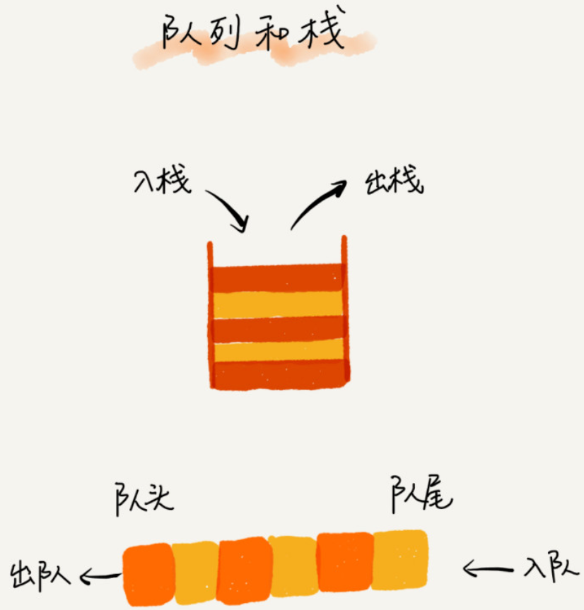
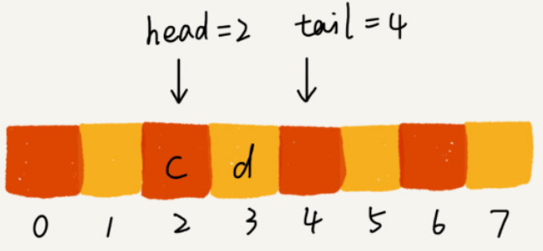
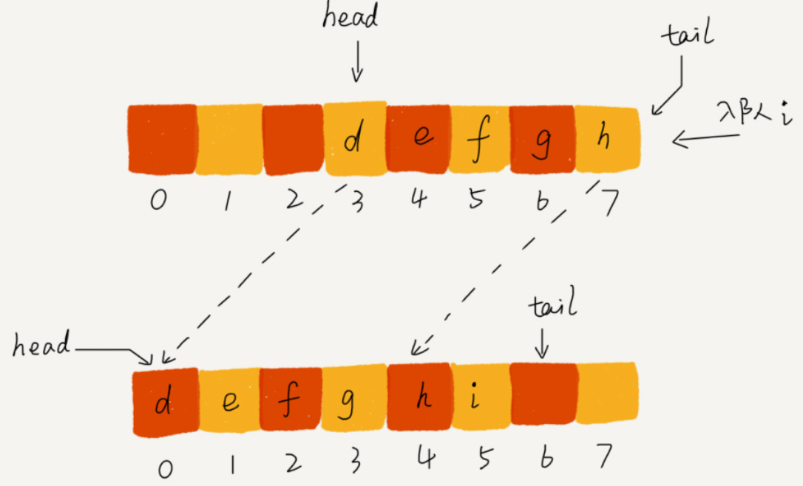
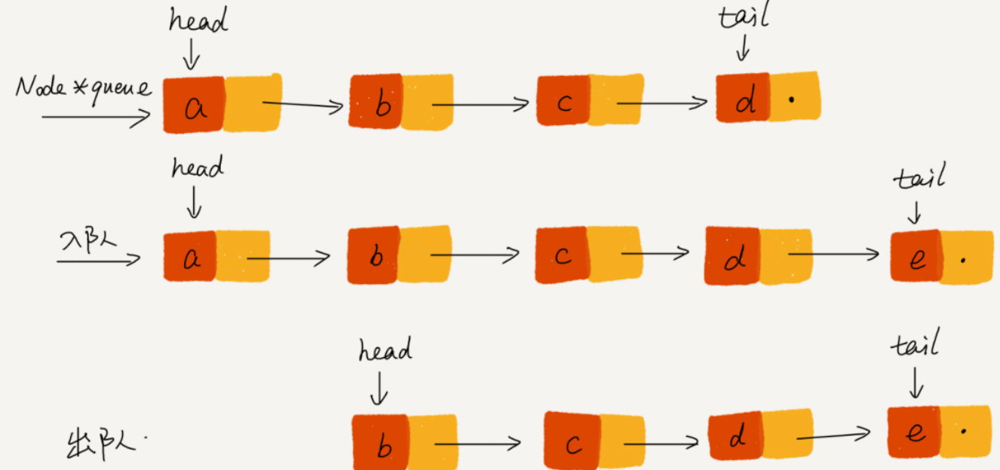
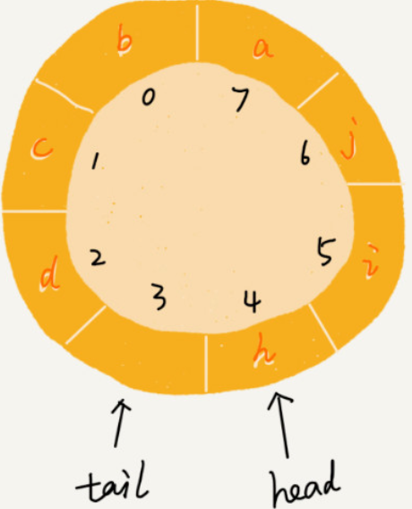
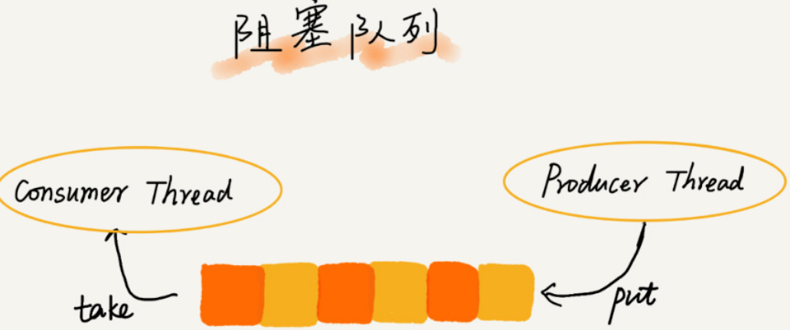
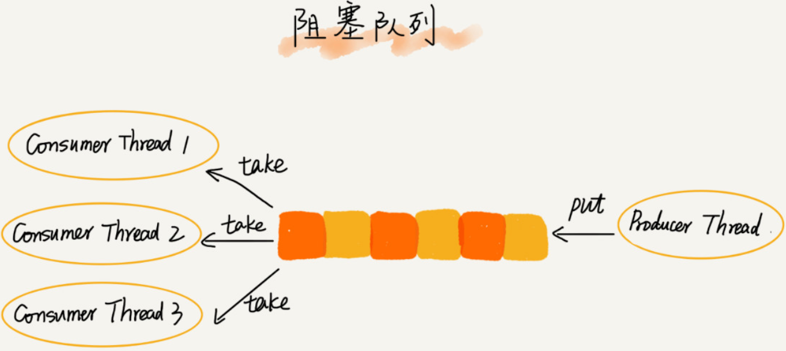

## 队列

### 概述

先进者先出，即是典型的队列。队列跟栈非常相似，支持的操作也有限，最基本的操作也是：**入队 enqueue()** 插入一个数据到队列尾部；**出队 dequeue() **，从队列头部取一个元素。队列和栈一样，是一种操作受限的线性表数据结构。对于大部分资源有限的场景，当没有空闲资源时，基本上都可以通过 "队列" 这种数据结构来实现请求排队

*队列和栈*

队列作为一种非常基础的数据结构，队列的应用也非常广泛，特别是一些具有额外特性的队列，如循环队列、阻塞队列、并发队列。它们在很多偏底层系统、框架、中间件开发中，起着关键作用。如高性能队列 `Disruptor` 、`Linux` 环形缓存，都用到了循环并发队列；`Java concurrent` 并发包利用 `ArrayBlockingQueue` 来实现公平锁

### 顺序队列和链式队列

#### 顺序队列

队列和栈一样，也是一种抽象的数据结构。它具有先进先出的特性，支持在队列尾部插入元素，在队列头部删除元素。跟栈一样，队列可以用数组来实现，也可以用链表来实现。用数组实现的队列即**顺序队列**，用链表实现的队列即**链式队列**。与栈相比，只需要一个**栈顶指针**就可以了。但是队列需要两个指针：一个是 `head` 指针，指向队列头部；一个是 `tail` 指针，指向队列尾部

*入队出队操作*

随着不停的入队出队操作，`head` 和 `tail` 都会持续往后移动。当 `tail` 移动道最右边，即使数组中还有空虚空间，也无法往队列中添加数据了（因为数组的删除操作会导致数组中的数据不连续）此时需进行数据搬移！但是，每次进行出队操作都相当于删除数组下标为 0 的数据，要搬移整个队列中的数据，这样出队操作的时间复杂度就会从原来的 `O(1)` 变为 `O(n)`

实际上，在出队时可以不用搬移数据，如果没有空闲空间了，只需要在入队时，再集中触发一次数据的搬移操作。当队列的 `tail` 指针移动道数组的最右边后，如果有新的数据入队，可以将 `head` 到 `tail` 之间的数据，整体搬移到数组中 0 到 `tail-head` 的位置

*队列数据入队数据搬移*

在这种实现思路中，出队操作的时间复杂度仍然是 `O(1)`，入队操作的时间复杂度在需要移动数据时候是 `O(n)`，均摊后也是 `O(1)`

#### 链式队列

基于链表的实现，同样需要两个指针：`head` 指针和 `tail` 指针。它们分别指向链表的第一个节点和最后一个节点。入队时，`tail->next = new_node ，tail = tail->next`；出队时，`head = head->next`。

*链式队列操作*

### 循环队列

使用数组实现队列时，当 `tail = n` 时，会有数据搬移操作，这样入队操作性能就会受到影响。循环队列，首尾相连，组成了一个环。但是循环队列的代码实现难度很大。最关键的是，**确定好队空和队满的判定条件**，针对循环队列，队列为空的判断条件仍然是 `head == tail`，但队列满的判断条件较复杂

*循环队列队满*

当循环队列队满时，`(tail + 1) % n = head`，队满时 `tail` 指向的位置实际上没有存储数据的。所以循环队列会浪费一个数组的存储空间

### 阻塞队列

阻塞队列即在队列基础上增加了阻塞操作。简单来说，就是在队列为空的时候，从队头取数据会被阻塞。因为此时还没有数据可取，直到队列中有了数据才能返回；如果队列已经满了，那么插入数据的操作就会被阻塞，直到队列中有空闲位置后再插入数据，然后再返回

阻塞队列即是典型的 "生产者-消费者模型"，基于阻塞队列实现的 "生产者 - 消费者模型"，可以有效的协调生产和消费的速度。当 "生产者" 生产数据的速度过快，"消费者" 来不及消费时，存储数据的队列很快就会满了。这时候生产者就阻塞等待，直到"消费者"消费了数据，"生产者"才会被唤醒。基于阻塞队列，可以通过协调 "生产者" 和 "消费者" 的个数，来提高数据的处理效率

*多消费者阻塞队列*

### 并发队列

在多线程环境下，会有多个线程同时操作队列，这个时候就会存在线程安全问题。线程安全的队列即**并发队列**。最简单直接的实现方式是直接在 `enqueue()`，`dequeue()` 方法上加锁，但是锁粒度大并发度会比较低，同一时刻仅允许一个存或取操作。实际上，基于数组的循环队列，利用 CAS 原子操作，可以实现非常高效的并发队列。这也是循环队列比链式队列应用更加广泛的原因

