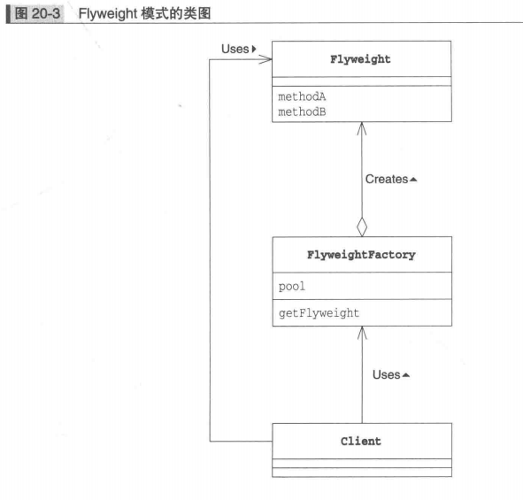
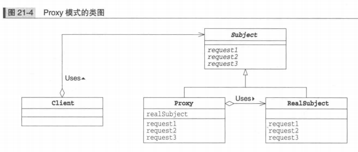

Flyweight 享元模式（共享对象，避免浪费）

**通过尽量共享实例避免 new 出实例**

### Flyweight 模式的登场角色

* `Flyweight` 实例会被共享的类
* `FlyweightFactory` 角色是生成 `Flyweigth` 角色的工厂。在工厂中生成的 `Flyweigth` 角色可以实现共享实例
* `Client` 请求者角色使用 `FlyweightFactory` 角色来生成 `Flyweigth` 角色

### Flyweigth 模式类图

### Proxy 模式（只在必要时生成实例）

### Proxy 模式中的登场角色

* `Subject` 角色定义了使 `Proxy` 角色和 `RealSubject` 角色之间具有一致性的接口。由于存在 `Subject`

  角色，所以 `Clietn` 角色不必在意它所使用的究竟是 `Proxy` 角色还是 `RealSubject` 角色

* `Proxy` 代理人角色。`Proxy` 角色会尽量处理来自 `Client` 角色的请求。只有当自己不能处理时。它才会将工作交给 `RealSubject` 角色。`Proxy` 角色只有在必要是才会生成 `RealSubject` 角色。`Proxy` 角色实现了在 `Subject` 角色中定义的接口。

* `RealSubject` 实际的主体会在代理人 `Proxy` 角色无法胜任工作时出场。它与 `Proxy` 角色一样，也实现了在 `Subject` 角色中定义的接口

* `Client` 请求者使用 `Proxy` 角色。

### Proxy 模式的类图

