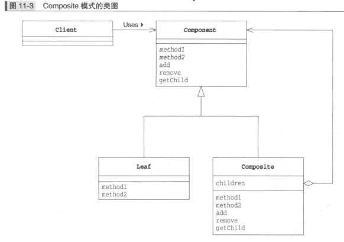
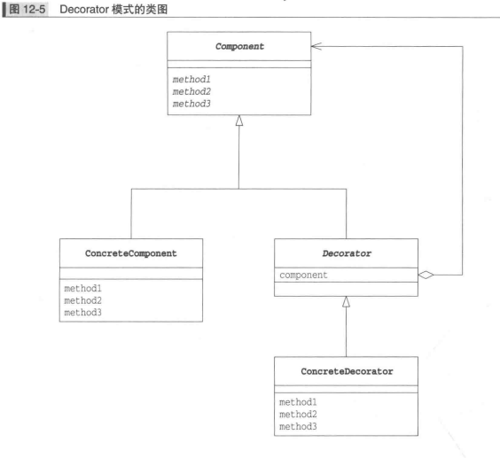

# 一致性

## Composite 组合模式(容器与内容的一致性)

__能够使容器与内容具有一致性,创造出递归结构的模式就是 Composite 模式__

### Composite 模式中的登场角色

* Leaf 内容角色,在该角色中不能放入其他对象
* Composite 容器角色,可以在其中放入 Leaf 角色和 Composite 角色
* Component 使 Leaf 角色和 Composite 角色具有一致性的角色, Composite 角色是 Leaf 角色和 Composite 角色的父类
* Client 使用 Composite 模式的角色

### Composite 模式类图

### 备注

使用 Composite 模式可以使容器与内容具有一致性,单个和多个的一致性,将多个对象结合在一起,当中一个对象进行处理

## Decorator 装饰模式装饰边框与被装饰物的一致性

### Decorator 模式中的登场角色

* `Component` 被装饰对象角色,增加功能时的核心角色
* `ConcreteComponent` 实现了 `Component` 角色所定义的接口
* `Decirator` 装饰物,该角色具有与 `Component` 角色相同的接口.在它内部保存了被装饰对象 `Component` 角色.`Decorator` 角色知道自己要装饰的对象
* `ConcreteDecorator` 具体的装饰物,该角色是具体的 `Decorator` 角色

### Decorator 模式类图

### 优点
在 `Decorator` 模式中，装饰边框与被装饰物具有一致性。这样即使被装饰物被边框装饰起来，接口也不会被隐藏起来。在 `Decorator` 模式中，装饰边框与被装饰
物具有相同的接口。虽然接口是相同的，但是越装饰，功能则越多。（不修改被装饰的类即可以增加功能）`Decorator` 模式使用了委托。对‘装饰边框’ 提出的要求会被
转交给 ‘被装饰物’ 去处理。