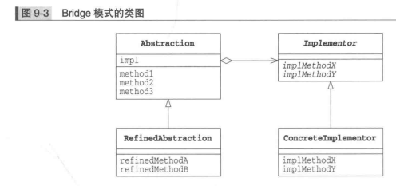
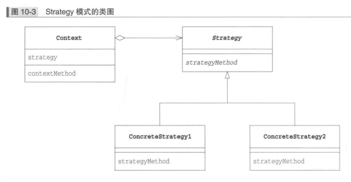

# 分开考虑

## Bridge 桥接器模式(将类的功能层次结构与实现层次结构分离)

### 类的层次结构的两个作用

* 希望增加新功能时(父类具有基本功能,在子类中增加新的功能),通常来说,类的层次机构关系不应该过深
* 希望增加新的实现时(父类声明抽象方法,而子类实现抽象方法)

### Bridge 模式中的登场角色

* `Abstraction` 抽象化,该角色位于 "类的功能层次结构" 的最上层,使用 `Implementor` 角色的方法定义了基本的功能.该角色保存了 `Implementor` 角色的实例
* `RefinedAbstraction` 改善后的抽象化,在 `Abstraction` 角色的基础上增加了新功能的角色
* `Implementor` 实现者,该角色位于 "类的实现层次结构" 的最上层,它定义了用于实现 `Abstraction` 角色的接口的方法
* `Concretelmplementor` 具体实现者,该角色负责实现在 `Implementor` 角色中定义的接口

### Bridge 模式的类图

### 备注

`Bridge` 模式的特征是将 "类的功能层次结构" 与 "类的实现层次结构" 分离开了,将类的这两个层次结构分离开有利于独立地对它们进行扩展.当想要增加功能时.只需要在 "类的功能层次结构" 一侧增加类即可,不必对 "类实现层次结构" 做任何修改,增加后的功能可以被 "所有的实现" 使用

继承是强关联,委托是弱关联.`Abstraction` 类中使用了委托, `Abstraction` 类的 `impl` 数据保存了实现的实例.这样类的任务就发生了转移,当其他类要求 `Abstraction` 类工作的时候,`Abstraction` 类并非自己工作,而是将工作交给了 `impl` 

## Strategy 策略模式(整体地替换算法)

__无论什么程序,其目的都是解决问题,使用 strategy 模式可以整体的替换算法的实现部分.能够整体地替换算法__

### Strategy 模式登场角色

* `Strategy` 策略角色负责决定实现策略所必需的接口
* `ConcreteStrategy` 具体的策略角色负责实现 `Strategy`  角色的接口,即负责实现具体的策略
* `Context` 上下文角色负责使用 `Strategy` 角色.`Context` 角色保存了 `ConcreteStrategy` 角色的实例,并使用 `ConcreteStrategy` 角色去实现需求

### Strategy 模式类图

### 备注

`Strategy` 模式将算法与其他部分分离开来,只是定义了与算法相关的接口,然后在程序中以委托的方式来使用算法.使用委托这种弱关系可以很方便的地整体替换算法.