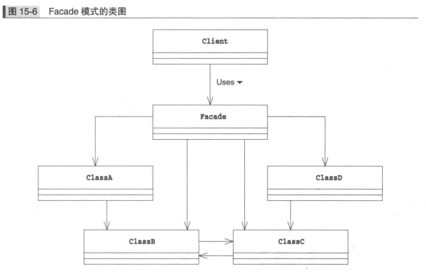
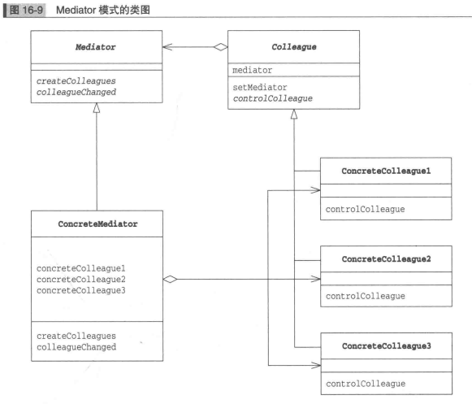

## Facade 模式

__`facade` 模式可以为互相关联在一起的类整理出高层接口。其中的 `Facade` 角色可以让系统对外只有一个简单的接口，而且，`Facade` 角色会考虑系统内各个类之间的责任关系和依赖关系，按照正确的顺序调用各个类__

### Facade 模式中的登场角色

* `Facade` 角色是代表构成系统的许多其他角色的简单窗口，`Facade` 角色向系统外部提供高层接口（API）。
* 构成系统的许多其他角色。这些角色各自完成自己的工作，他们并不知道 `facade` 角色。`facade` 角色调用其它角色进行工作，但是其他角色不会调用 `Facade` 角色。
* `Client` 请求者角色负责调用 `Facade` 角色

### Facade 模式类图

## Mediator 中介者模式

__调整多个对象之间的关系，不让各个对象之间互相通信，而是增加一个仲裁者角色，让他们各自与仲裁者通信__

### 中介者模式登场角色

* `Mediator` 中介者角色负责定义与 `Colleague` 角色进行通信和做出决定的接口
* `ConcreteMediator` 具体的中介者角色负责实现 `Mediator` 角色的接口，负责实际做出决定。
* `Colleague` 同事角色负责定义与 `Mediator` 角色进行通信的接口。
* `ConcreteColleague` 具体的同事角色负责实现 `Colleague` 角色的接口。

### Mediator 模式类图

