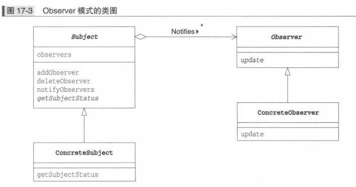

## Observer 观察者模式

### Observer 模式中的登场角色

* `Subject` 观察对象角色。`subject` 角色定义了注册观察者和删除观察者的方法，声明获取现在的状态的方法
* `ConcreteSubject` 具体的被观察对象角色，当自身状态发生变化后，它会通知所有已经注册的 `Observer` 角色
* `Observer` 观察者角色负责接收来自 `subject` 角色的状态变化的通知。声明了 `update` 方法
* `ConcreteObserver` 具体的观察者角色。当它的 `update` 方法被调用后，会去获取要观察对象的最新状态 

### Observer 模式的类图

### 备注

在 `Observer` 模式中，有带状态的 `ConcreteSubject` 角色和接收状态变化通知的 `ConcreteObserver` 角色。连接这两个角色的就是他们的接口 `Subject` 角色和 `Observer` 角色。

`Observer`  角色并非主动地去观察，而是被动地接受来自 `Subject` 角色的通知。也被称为 `Publish-Subscribe` 发布订阅模式

## Memento 备忘录模式保存对象状态

### Memento 模式中的登场角色

