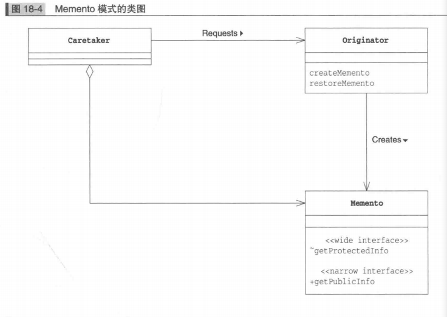
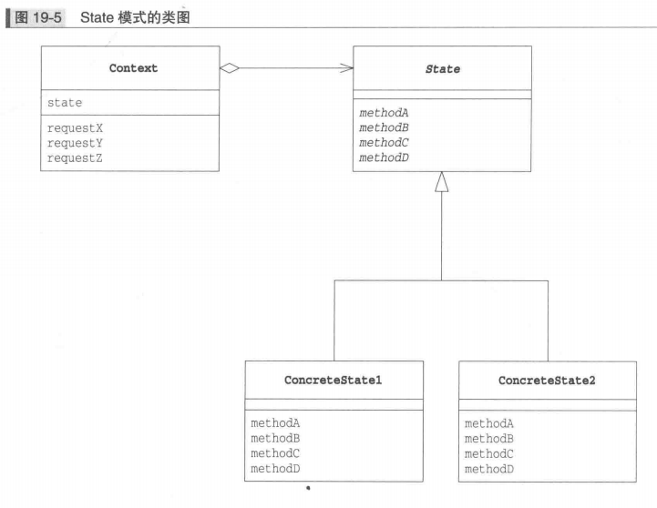

## Observer 观察者模式

### Observer 模式中的登场角色

* 观察对象角色 `Subject` ：定义了注册观察者和删除观察者的方法，声明获取现在的状态的方法
* 具体的被观察对象角色 `ConcreteSubject` ：当自身状态发生变化后，它会通知所有已经注册的 `Observer` 角色
* 观察者角色`Observer` ：负责接收来自 `subject` 角色的状态变化的通知。声明了 `update` 方法
* `ConcreteObserver` 具体的观察者角色。当它的 `update` 方法被调用后，会去获取要观察对象的最新状态 

### Observer 模式的类图

### 备注

在 `Observer` 模式中，有带状态的 `ConcreteSubject` 角色和接收状态变化通知的 `ConcreteObserver` 角色。连接这两个角色的就是他们的接口 `Subject` 角色和 `Observer` 角色。`Observer`  角色并非主动地去观察，而是被动地接受来自 `Subject` 角色的通知。也被称为 `Publish-Subscribe` 发布订阅模式

## Memento 备忘录模式保存对象状态

### Memento 模式中的登场角色

* 生产者角色 `Originator` ：会在保存自己的最新状态时生成 `Memento` 角色。当把以前保存的 `Memento` 角色传递给 `Originator` 角色时，它会将自己恢复至生成该 `Memento` 角色时的状态。

* 纪念品角色`Memento`： 会将 `Originator` 角色的内部信息整合在一起。在 `Memento` 角色中虽然保存了 `Originator` 角色的信息，但它不会向外部公开这些信息

  `Memento` 角色有以下两种接口

  1. `wide interface` -- 宽接口

     `Memento` 角色提供的 `宽接口` 是指所有用于获取恢复对象状态信息的方法的集合。由于宽接口会暴露所有 `Memento` 角色的内部信息，因此能够使用宽接口的只有 `Originator` 角色

  2. `narrowinterface` -- 窄接口

     `Memento` 角色为外部的 `Caretaker` 角色提供了窄接口。可以通过窄接口获取的 `Memento` 角色的内部信息非常有限，可以有效地防止信息泄露

* `Caretaker` 负责人角色：想要保存当前的 `Originator` 角色状态时，会通知 `Originator` 角色。`Originator` 角色在接收到通知后会生成 `Memento` 角色的实例并将其返回给 `Caretaker` 角色。由于以后可能会用 `Memento` 实例来将 `Originator` 恢复至原来的状态，因此 `Caretaker` 角色会一直保存 `Memento` 实例。不过 `Caretaker` 角色只能使用 `Memento` 角色两种接口的窄接口，它无法访问 `Memento` 角色内部地所有信息。它只是将 `Originator` 角色生成地 `Memento` 角色当作一个黑盒子保存起来。
* `Originator` 角色和 `Memento` 角色之间是强关联关系，但 `Caretaker` 角色和 `Memento` 角色之间是弱关联关系，`Memento` 角色对 `Caretaker` 角色隐藏了自身地内部信息

### Memento 模式地类图

## State 状态模式（用类表示状态）

* 用方法来判断状态
* 用类来表示状态

**依赖于状态的处理**

* 定义接口，声明抽象
* 定义多个类，实现具体方法

### State 模式中地登场角色

* 状态角色`state` ：表示状态，定义了根据不同状态进行不同处理的接口。该接口是那些处理内容依赖于状态的方法的集合
* 具体的状态角色`ConcreteState` ，它实现了 `State` 接口
* `Context` 状况，前后关系，上下文（角色）持有表示当前状态的 `ConcreteState` 角色。还定义了供外部调用者使用 `State` 模式的接口

### State 模式类图

