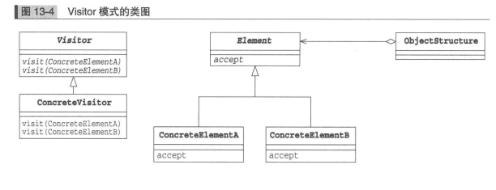
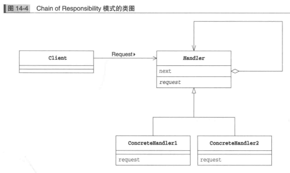

## Visitor 访问者模式（访问数据结构并处理数据）
__在 visitor 模式中，数据结构与处理被分离开来。访问者类来访问数据结构中的元素，并把对各元素的处理交给访问者类，
当需要增加新的处理时，只需要编写新的访问者，然后让数据结构可以接受访问者的访问__

### Visitor 模式中的登场角色

* `Visitor` 访问者角色负责对数据结构中每个具体的元素（`ConcreteElement` 角色） 声明一个用于访问的 `visit()` 方法。 `visit()`
是用于处理的方法，负责实现该方法的是 `ConcreteVisitor` 角色。
* `ConcreteVisitor` 具体的访问者角色负责实现 `visitor` 角色所定义的接口。它要实现所有的 `visit` 方法，即实现如何处理每个 `ConcreteElement`
角色。
* `Element` 元素角色表示 `visitor` 角色的访问对象，它声明了接受访问者的 `accept()` 方法。`accept()` 方法接收到的参数是 `Visitor`
角色。
* `ConcreteElement` 具体的元素角色负责实现 `Element` 角色所定义的接口。
* `ObjectStructure` 对象结构角色负责处理 `Element` 角色的集合。`ConcreteVisitor` 角色为每个 `Element` 角色都准备了处理方法。

### Visitor 模式的类图

### 备注
`Visitor` 模式的目的是将处理从数据结构中分离出来。数据结构很重要，它能将元素集合和关联在一起。但是，保存数据结构与以数据结构为基础进行处理
是两种不同的东西。

## Chain of Responsibility 责任链模式

### Chain of Responsibility 模式中的登场角色

* `Handler` 处理者角色定义了处理请求的接口。`Handler` 角色直到 “下一个处理者" 是谁，如果自己无法处理请求，它会将请求转给
下一个处理者，下一个处理者也是 `Handler` 角色。
* `ConcreteHandler` 角色是处理请求的具体角色。
* `Client` 请求者角色是向第一个 `ConcreteHandler` 角色发送请求的角色。

### Chain of Responsibility 模式类图

### 责任链模式优点
* 弱化了发出请求的人（`Client`角色）和处理请求的人（`ConcreteHandler`角色）之间的关系。`Client` 角色向第一个 `ConcreteHandler`
角色发出请求，然后请求会在责任链中传播，直到某个 `ConcreteHandler` 处理该请求,如果不使用该模式，就必须有某个伟大的角色知道“谁
该处理该请求”，这有点类似中央集权制。而让“发出请求的人”知道“谁应该处理该请求”并不明智，因为如果发出请求的人不得不直到处理请求的人
各自的责任分担情况，就会降低其作为可复用的组件的独立性。
* 可以动态地改变职责链。
* 可以让具体角色专注与具体工作
* 推卸请求会导致处理延迟，如果请求和处理者之间的关系是确定的，而且需要非常快的处理速度，不适用责任链模式更好

