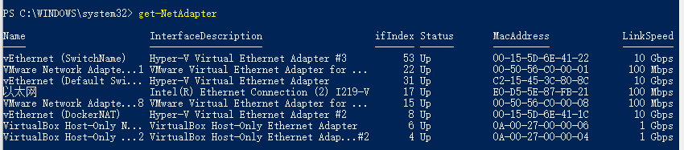

## 设置 NAT 网络

### NAT 概述

NAT 使用主计算机的 IP 地址和端口通过内部 Hyper-V  虚拟开关向虚拟机授予对网络资源的访问权限。

网络地址转换（NAT）是一种网络模式，旨在通过将一个外部 IP 地址和端口映射到更大的内部 IP 地址集来转换 IP 地址。基本上，NAT 使用流量表将流量从一个外部（主机）IP 地址和端口号路由到与网络上的终结点（虚拟机、计算机和容器等）关联的正确内部 IP 地址，此外，NAT 允许多个虚拟机托管需要相同（内部）通信端口的应用程序，方法是将它们映射到唯一的外部端口

### 创建 NAT 虚拟网络

* 以管理员身份打开 `PowerShell` 控制台

* 创建内部交换机

  ```powershell
  New-VMSwitch -SwitchName "SwitchName" -SwitchType Internal
  ```

* 查找刚创建的虚拟交换机的接口索引

  使用 `Get-NetAdapter` 命令查找接口索引

  

  内部交换机的名称类似于 `vEthernet (SwitchName)`，接口描述将为 `Hyper-V Virtual Ethernet Adapeter`

* 使用 `Net-NetIPAddress` 配置 NAT 网关

  ```powershell
  Net-NetIPAddress -IPAddress <NAT Gateway IP> -PrefixLength <NAT Subnet Prefix Length> -InterfaceIndex <ifIndex>
  ```

  若要配置网关，需要一些网络信息

  `IPAddress` -NAT 网关 IP 指定要用作 NAT 网关 IP 的 IPv4 或 IPv6 地址。常规形式将为 `a.b.c.1`（172.16.0.1）。最后一个位置不一定必须是 1，但通常是（基于前缀长度）。通用网关 IP 为 `192.168.0.1`

  `PrefixLength` - NAT 子网前缀长度定义的 NAT 本地自我大小（子网掩码）。子网前缀为 0 到 32 之间的整数值，0 将映射到整个 Internet，32 将只允许映射一个 IP。常用值是 24 到 12，具体取决于需要附加到 NAT 的 IP 数，常用 `PrefixLength` 为 24 这是子网掩码 `255.255.255.0`

  `InterfaceIndex` -- `ifIndex` 是上一步创建的交换机接口索引

   常规命令

  ```powershell
  New-NetIPAddress -IPAddress 192.168.0.1 -PrefixLength 24 -InterfaceIndex 24
  ```

* 使用 `New-NetNat` 配置 NAT 网络

  ```powershell
  New-NetNat -Name <NATOutsideName> -InternalIPinterfaceAddressPrefix <NAT subnet prefix>
  ```

  配置网关，需要提供的网络和 NAT 网关信息

  `Name` - `NATOutsideName` 描述 NAT 网络的名称。将使用此参数删除 NAT 网络

  `InternalIPInterfaceAddressPrefix` - NAT 子网前缀同时描述上述 `NAT` 网关 IP 前缀和上述 NAT 子网前缀长度

  常规形式将为 `a.b.c.0/NAT` 子网前缀长度，如 ` 192.168.0.0/24`

  常规命令

  ```powershell
  New-NetNat -Name MyNATnetwork -InternalIPInterfaceAddressPrefix 192.168.0.0/24
  ```

  

### 连接虚拟机

