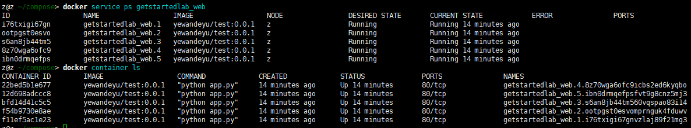

## 服务docker-compose的使用

### 关于服务

在分布式应用程序中，应用程序的不同部分称为“服务”。服务实际上只是“生产中的容器”。服务只运行一个映像，但它编码了映像运行的方式-它应该使用哪个端口，应该运行多个容器副本，以便服务具有所需的容量。扩展服务会更改运行该软件的容器实例的数量，从而为流程中的服务分配更多的计算资源。使用 `Docker` 平台定义，运行和扩展服务非常容易-只需编写一个 `docker-compose.yml` 文件即可

### `docker-compose.yml` 档案

一个 `docker-compose.yml` 文件是一个 YAML 文件，它定义了 `docker` 容器在生产中的表现

*docker-compose.yml*

```yaml
version: "3"
services:
  web:
    # replace username/repo:tag with your name and image details
    image: username/repo:tag
    deploy:
      replicas: 5
      resources:
        limits:
          cpus: "0.1"
          memory: 50M
      restart_policy:
        condition: on-failure
    ports:
      - "4000:80"
    networks:
      - webnet
networks:
  webnet: 
```

该 `docker-compose.yml` 文件告诉 `docker` 执行以下操作：

* 拉取 `username/repo:tag` 图像
* 将该映像的 5 个实例作为一个被调用的服务运行 `web`，限制每个实例使用，最多只占单个 `CPU` 核心时间的 10%，以及 50MB RAM
* 如果一个失败，立即重启容器
* 将主机上的端口 4000 映射到 `web` 端口 80
* 提升 `web` 容器通过负载均衡的网络共享端口 80 `webnet`。（在内部，容器本身 `web` 在短暂的端口发布到 80 端口）
* `webnet` 使用默认设置（负载平衡的覆盖网络）定义网络

### 运行新的负载均衡应用

* 首先运行命令

  ```shekk
  docker swarm init
  ```

  如果不先运行以上命令，则会报错 "this node is not a swarm manager"

* 首先为应用程序命名，在这里，它被设置为 `getstartedlab`

  ```shell
  docker stack deploy -c docker-compose.yml getstartedlab
  ```

  我们在一台机器上，单个服务栈运行了 5 个容器实例。查看服务

  ```shell
  docker service ls
  # 使用栈名称查看
  docker stack services getstartedlab
  ```

  在服务中运行单个容器成为任务。任务被赋予以数字递增的唯一 ID，最多为 `docker-compose.yml` 中的 `replicas` 中定义的数量。列出服务任务

  ```shell
  docker service ps getstartedlab_web
  ```

  列出所有容器

  ```shell
  docker container ls
  ```

  

### 扩展应用程序

可以通过更改 `docker-compose.yml` 的 `replicas` 的值，保存更改并重新运行 `docker stack deploy` 命令来扩展应用程序：

```shell
docker stack deploy -c docker-compose.yml getstartedlab
```

`docker` 执行原地更新，无需先停止服务或容器

### 停止应用程序和群

* 关闭应用程序 `docker stack rm`

  ```shell
  docker stack rm getstartedlab
  ```

* 关闭群

  ```shell
  docker swarm leave --force
  ```

### 常用命令

```shell
docker stack ls                                            # List stacks or apps
docker stack deploy -c <composefile> <appname>  # Run the specified Compose file
docker service ls                 # List running services associated with an app
docker service ps <service>                  # List tasks associated with an app
docker inspect <task or container>                   # Inspect task or container
docker container ls -q                                      # List container IDs
docker stack rm <appname>                             # Tear down an application
docker swarm leave --force      # Take down a single node swarm from the manager
```

