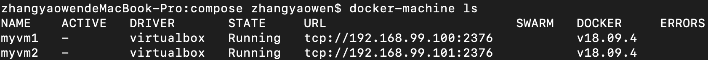
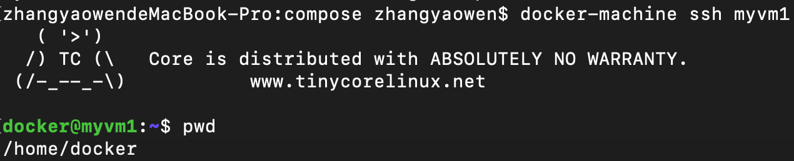
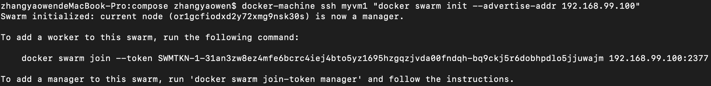
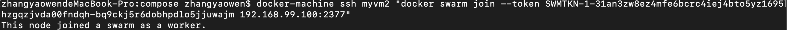
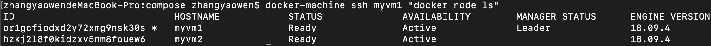

## Swarm 集群

### 概述

将应用程序部署到集群上，在多台计算机上运行它。多容器，多机应用程序通过连接多台机器到 `Dockerized` 簇成为群。集群是一组运行 `docker` 并加入集群的计算机。在此之后，继续运行 `docker` 命令，但现在它们由集群管理器在集群上执行。群中的机器可以是物理或虚拟及，加入群组后，它们称为节点

`Swarm` 管理器可以使用多种策略来运行容器。指定 `Compose` 文件中定义这些策略，集群管理器是集群中唯一可执行命令的机器，或者授权其他机器作为`worker` 加入集群。`worker` 只是在哪里提供能力，没有权限告诉任何其他机器它能做什么和不能做什么。

Docker 可以切换到 `swarm` 模式，启用集群模式使当前计算机成为集群管理器。此后，docker 就会运行在管理器 `swarm` 上执行的命令，而不仅仅是当前机器上

### 设置集群

集群由多个节点组成，可以是物理或虚拟机。运行 `docker swarm init` 以启用 `swarm` 模式并使当前计算机成为一个 `swarm` 管理器，然后在其他计算机上运行 `docker swarm join` ，以使它们作为 `worker` 加入 `swarm`

#### 创建集群

*  `docker-machine`  使用 `VirtualBox` (需要预先安装Virtualbox) 驱动程序创建 `vm`:

  ```shell
  # 创建两个名为 `myvm1`, `myvm2` 的虚拟机
  docker-machine create --driver virtualbox myvm1
  docker-machine create --driver virtualbox myvm2
  ```

* 列出虚拟机并获取其 IP 地址

  ```shell
  # 列出虚拟机
  docker-machine ls
  ```

  *列出vm*

  

* 登录虚拟机

  ```shell
  # 登录虚拟机
  docker-machine ssh <machine-name>
  ```

  *ssh登录vm*

  

  如果本机没有 `ssh` 二进制文件，可以使用 `go` 实现的 `ssh`

  ```shell
  # 使用原生 go 实现登录虚拟机
  docker-machine --native-ssh ssh <machine-name>
  ```

#### 初始化 SWARM 并添加节点

* 初始化集群

  第一台机器充当管理器，它执行管理命令并验证 `worker` 加入集群，第二台是 `worker`。向 `VM` 发送命令：`docker-machine ssh`。指示 `myvm1` 成为一个 `swarm` 管理器 	

  ```shell
  # 初始化集群设置 manager,第一个初始化集群的即为 manager
  docker-machine ssh myvm1 "docker swarm init --advertise-addr 192.168.99.100"
  ```

  *初始化集群并设置manager*

  

  `docker swarm init` 和 `doker swarm join` 使用端口 2377（集群管理端口），或者没有端口，使用默认值。`docker-machine ls` 返回的 2376 端口，是 `docker ` 守护进程端口。

  返回一个预先配置的 `docker swarm join` 命令，可以在要添加的任何节点上运行该命令，以加入集群

* worker 加入集群

  复制该命令，将其发送到 `myvm2`，以使 `vm2` 作为 worker 加入集群

  ```shell
  # worker 加入集群
  docker-machine ssh myvm2 "docker swarm join --token <token> <ip>:2377"
  ```

  *worker加入集群*

  

* 查看集群节点

  ```shell
  # 在 manager 上看出集群节点
  docker-machine ssh myvm1 "docker node ls"
  ```

  *查看集群节点*

  

* 离开集群

  ```shell
  # 离开集群
  docker swarm leave
  ```

  在 manager 节点加 `—force` 选项

