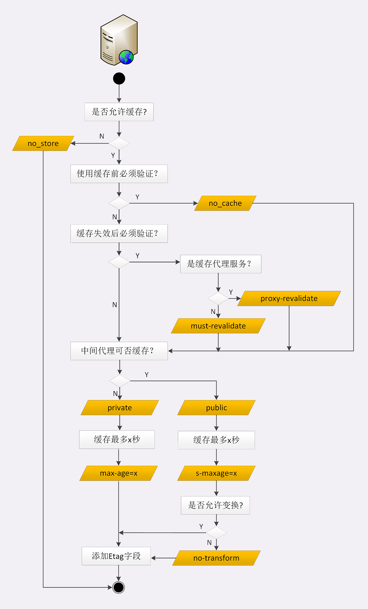

### HTTP 相关概念

#### 组成

##### 资源定位符

###### URI

URI Uniform Resource Identifier 统一资源标识符，使用它能够唯一地标记互联网上资源，URI 主要有三个基本的部分构成：

```
scheme :// user:passwd@ host:port path ?query #fragment
```

*URI组成部分*

|         组成         |                             用途                             |
| :------------------: | :----------------------------------------------------------: |
|    协议名 Scheme     | 即访问该资源应当使用的协议，如 http/https、ftp，file、rtsp、rtspu、news、telnet、data、mailto、view-source、ws/wss |
|  身份信息 (不推荐)   | 表示登录主机时的用户名和密码，现在不推荐使用这种形式了，它会将敏感信息以明文形式暴露出来 |
|   主机名 authority   | 即互联网上的标记，可以是域名或 IP 地址，表示资源所在的主机名，通常为 host:port |
|      路径 path       | 即资源在主机上的位置，使用 `/` 分割多级目录。URI 的 path 部分必须以 `/` 开始，即必须包含 `/` |
|    查询参数 query    | URL 查询参数 query，它在 path 之后，用一个 ? 开始，但不包含 ?，表示对资源附加的额外要求。查询参数是多个 key=value 的字符串，使用 & 连接 |
| 片段标识符 #fragment | 它是 URI 所定位的资源内部的一个『锚点』，浏览器可以在获取资源后直接跳转到它指示的位置。仅能由浏览器这样的客户端使用，服务器是看不到的，浏览器永远不会把带  #fragment 的 URI 发送给服务器，服务器也永远不会用这种方式处理资源的片段 |

URI 本质上是一个字符串，作用是唯一的标记资源的位置或者名字。它不仅能标记万维网的资源，也可以标记其他如邮件系统、本地文件系统等任意资源。

客户端和服务器看到的 URI 是不一样的，客户端看到的必须是完整的 URI，使用特定的协议去连接特定的主机，而服务器看到的只是报文请求行里被删除了协议名和主机名的 URI。

<u>在 nginx 中，它的 location、rewrite 等指令操作的 URI 指的是真正 URI 里的 path 和后续的部分</u>

###### URL

* URL Uniform Resource Locator 统一资源定位符，即网址，它是 URI 的一个子集

###### URN

统一资源名称。无论对象搬移到什么地方，URN 都能为对象提供一个稳定的名称。永久统一资源定位符（persistent uniform resource locators，PURL）是用 URL 来实现 URN 功能。基本思想是在搜索资源的过程中引入另一个中间层，通过一个中间资源定位符（resource locator）服务器对资源的实际 URL 进行登记和跟踪。客户端可以向定位符请求一个永久 URL，定位符可以以一个资源作为响应，将客户端重定向到资源当前实际的 URL 上去。

##### URI 转义

###### 百分比编码

拥有 8 位字符编码的编码机制，这些编码在 URL 的上下文中具有特定的含义。它有时被称为 URL 编码。包含一个百分号（%），后面跟着两个表示字符 ASCII 码的十六进制数。根据上下文，空白符 `' '` 将会转换为 `'+'` （必须在 HTTP 的POST 方法中使定义 `application/x-www-form-urlencoded ` 传输方式）， 或者将会转换为 `'%20'` 的 URL。

*保留及受限字符*

|       字符       |                          保留/受限                           | ASCII | HEX  |
| :--------------: | :----------------------------------------------------------: | :---: | :--: |
|        %         |                  保留作为编码字符的转义标志                  |  37   |  25  |
|        /         |                    保留作为路径分隔定界符                    |  47   |  2F  |
|        .         |                     保留在路径组件中使用                     |  46   |  2E  |
|        #         |                    保留作为分段定界符使用                    |  35   |  23  |
|        ？        |                  保留为查询字符串定界符使用                  |  63   |  3F  |
|        ；        |                    保留作为参数定界符使用                    |  59   |  3B  |
|        ：        |       保留为方案，用户/口令，主机/端口组件的定界符使用       |  58   |  3A  |
|        $         |                             保留                             |  36   |  24  |
|        ，        |                             保留                             |  39   |  27  |
|        +         |                             保留                             |  43   |  2B  |
|        @         |                        特殊上下文保留                        |  64   |  40  |
|        &         |                        特殊上下文保留                        |  38   |  26  |
|        =         |                        特殊上下文保留                        |  61   |  3D  |
|   `{}\|\^~[]`    |  由于各种传输 Agent 代理，如各种网关的不安全处理，使用受限   |       |      |
|      `<>"`       | 不安全，这些字符在 URL 范围之外通常是有意义的，如在文档中对 URL 自身进行定界，应对其进行编码 |       |      |
| `0x00-0x1F` Ox7F | 受限，这些十六进制范围内的字符都在 US-ASCII 字符集的不可打印区间内 |       |      |
|      >0x7F       | 受限，十六进制值在此范围内的字符都不在 US-ASCII 字符集的 7 比特范围内 |       |      |

#### 代理

##### 代理服务

###### 分类

代理（Proxy）是 HTTP 协议中请求方和应答方中间的一个环节，作为『中转站』，既可以转发客户端的请求，也可以转发服务器的应答。常见代理：

| 代理方式 |                        描述                        |
| :------: | :------------------------------------------------: |
| 匿名代理 |  完全隐匿了被代理的机器，外界看到的只是代理服务器  |
| 透明代理 | 传输过程是透明开发的，外界即知道代理，也知道客户端 |
| 正向代理 |       靠近客户端，代表客户端向服务器发送请求       |
| 反向代理 |       靠近服务器，代表服务器响应客户端的请求       |

###### 作用

由于代理在传输过程中插入了一个『中间层』，所以可以在这个环节做很多有意义的事情：负载均衡：把访问请求均匀分散到多台机器，实现访问集群化；内容缓存，暂存上下行的数据，减轻后端的压力；安全防护：隐匿 IP，使用 WAF 等工具抵御网络攻击，保护被代理的机器；数据处理：提供压缩，加密等额外的功能；健康检查：使用心跳等机制监控后端服务器，发现有故障就及时踢出集群，保证服务高可用；加密卸载：对外网使用 SSL/TLS 加密通信验证，而在内网不加密，消除加解密成本

###### 头字段

|     字段名      |                             描述                             |
| :-------------: | :----------------------------------------------------------: |
|       Via       | 是一个通用字段，请求头或响应头里都可以出现。每当报文经过一个代理节点，代理服务器就会把自身的信息追加到字段的末尾。如果通信链路中有很多中间代理，会在 Via 里形成一个链表 |
|      X-Via      |                          等同于 Via                          |
| X-Forwarded-For | 每经过一个代理节点就会在该字段里追加一个信息，追加的是请求方的 IP 地址 |
|    X-Real-IP    |            记录客户端 IP地址，没有中间的代理信息             |

###### 代理协议

通过 X-Forwarded-For 操作代理信息必须要解析 HTTP 报文头，且 HTTPS 下无法修改。代理协议作为事实标准简化协议

* v1

  明文，在 HTTP 报文前再增加一行 ASCII 码文本

  ```
  # PROXY 开头，然后是 TCP4 或 TCP6 表示客户端 IP 地址类型，后面是请求方地址，应答方地址，请求方端口，应答方端口，以缓冲换行 \r\n 结束
  PROXY TCP4 127.0.0.1 127.0.0.1 11123 80\r\n
  ```

* v2

  为二进制格式

代理协议并不支持 X-Forwarded-For 的链式地址格式，拿到客户端地址后再如何处理，需要代理服务器与后端协商

#### 报文

报文是在 HTTP 应用程序之间发送的数据块。使用流入（inbound）和流出（outbound）描述事物处理方向。报文流入源服务器，处理完成后，会流回用户 Agent 代理中。不管请求报文还是响应报文，所有报文都会向下流（downstream）流动。所有报文的发送者都在接收者的上游（upstream）。

HTTP 协议规定报文必须有 header ，可以没有 body，而且 header 之后必须要有一个『空行』，即 CRLF（由两个字符：回车符 ASCII 码 13，0x0D、换行符 ASCII 码 10，0x0A组成）作为行终止符结束

*   请求报文

    ```
    <method> <request-URL> <version> CRLF
    <field-name> : <field-value> CRLF
    more field
    <field-name> : <field-value> CRLF
    CRLF
    <entry>
    ```

*   响应报文

    ```
    <version> <status-code> <reason-phrase> CRLF
    <field-name> : <field-value> CRLF
    more field
    <field-name> : <field-value> CRLF
    CRLF
    <entry>
    ```

##### 起始行

对报文进行描述的 ASCII 文本，由三部分构成，通常使用空格来分隔，最后用 CRLF 换行表示结束

###### 请求行 request line

描述了**客户端想要如何操作服务端的资源**，

* 请求方法

  是一个动词，如 GET/POST，表示对资源的操作

* 请求目标

  通常是一个 URI，标记了请求方法要操作的资源

* 版本号

  `HTTP/<major>.<minor>` 表示报文使用的 HTTP 协议版本，主版本 major 和次版本 minor 都是整数。

###### 响应状态行 status line

即服务器响应的状态

* 版本号

  表示报文使用的 HTTP 协议版本

* 状态码

  数字，表示处理结果

* 原因短语

  数字状态码的补充，行终止列之前的所有文本。

##### 头部字段

key-value 形式 ASCII 文本属性，key 和 value 之间用 : 分隔，最后用 CRLF 换行表示字段结束。可添加使用自定义头字段，首部由一个空行 CRLF 结束，表示首部列表的结束和实体部分的开始

* 字段名不区分大小写，但首字母大写的可读性更好
* 字段名里不允许出现空格，可以使用连字符 -，但不能使用下划线 _
* 字段名后面必须紧接着 :，不能有空格，而 : 后字段值前可有有多个空格
* 字段的顺序没有意义，可以任意排列不影响语义
* 字段原则上不能重复，除非这个字段本身的语义允许，如 Set-Cookie

###### 字段划分

HTTP 协议规定了非常多的头部字段，实现各种功能：

| 字段类型 |                    描述                    |
| :------: | :----------------------------------------: |
| 通用字段 |         在请求头和响应头都可以出现         |
| 请求字段 |               仅出现在请求头               |
| 响应字段 |               仅出现在响应头               |
| 实体字段 | 实际属于通用字段，专门描述 body 的额外信息 |

###### 常用字段

|   类型   |       key        |                             含义                             | 必须出现 |
| :------: | :--------------: | :----------------------------------------------------------: | :------: |
| request  |      `Host`      | 告诉服务器这个请求应该由那个主机来处理，当一台计算机托管了多个虚拟主机的时候，服务器端就需要用 Host 字段来选择 |   true   |
| request  |   `User-Agent`   |                     描述 HTTP 请求客户端                     |          |
| general  |      `Date`      | 通常出现在响应头里，表示 HTTP 报文创建的时间，客户端可以使用这个时间再搭配其他字段决定缓存策略 |          |
| response |     `Server`     |             正在提供 Web 服务器的软件名和版本号              |          |
|  entity  | `Content-Length` | 表示报文 body 的长度，即请求头或请求行空行后面的数据长度，如果没有该字段，那么 body  就是不定长的，需要使用 chunked 方式分段传输 |          |

##### 实体

实际传输的数据，可能是文本，图片，视频等二进制数据

###### 数据压缩编码

HTTP 在传输时为了节约带宽，有时会压缩数据，使用 Encoding type 来指定编码格式

###### 实体内容协商

HTTP 协议定义了用于客户端和服务器进行内容协商的头字段（Accept 头告诉服务器希望接收什么数据，Content 头告诉客户端实际发送了什么数据）：

* Accept

  请求字段标记的是客户端可理解的 MIME type，可以用逗号分隔出多个类型，让服务器选择

* Accept-Encoding

  请求字段标记的是客户端支持的压缩格式，可以用逗号分隔，支持 gzip（采用 Lempel-Ziv coding LZ77 压缩算法，以及 32 位 CRC 校验的编码方式）、compress（采用 Lempel-Ziv-Welch LZW 压缩算法）、deflate（采用 zlib 结构和 deflate 压缩算法）、br（采用 Brotil 算法的编码方式）、identity（用于指代自身，除非特别说明，这个标记始终可以被接受）、*（匹配其他任意未在该请求头字段中列出的编码方式。假如该请求头字段不存在的话，这个值是默认值。它并不代表任意算法都支持，而仅仅表示算法之间无优先次序）、；q=(qvalues weighting 权重）

  ```
  Accept-Encoding: deflate, gzip;q=1.0, *;q=0.5
  ```

* Content-Type

  通用字段，在响应中，Content-Type 标头标识返回的实体类型（浏览器会在某些情况下进行 MIME查 找，并不一定遵循此标题的值; 为了防止这种行为，可以将标题 [`X-Content-Type-Options`](https://developer.mozilla.org/zh-CN/docs/Web/HTTP/Headers/X-Content-Type-Options) 设置为 **nosniff**。）在请求中 POST/PUT 客户端告诉服务器发送的数据类型

  ```
  Content-Type: text/html; charset=utf-8
  # media-type 资源或数据的 MIME type，charset 字符编码标准，boundary 对于多部分实体，boundary 是必须的，它用于封装消息的多个部分的边界
  Content-Type: multipart/form-data; boundary=something
  ```

* Content-Encoding

  当该首部出现时，表示消息主题进行了何种方式的内容编码转换。实际使用的压缩格式，对应 Accept-Encoding，值与 Accept-Encoding 对应

* Accept-Language

  语言类型，即自然语言，en-US 美式英语，zh-CN 简体中文

* Accept-Charset

  字符集，客户端能接受的字符集

在 HTTP 协议里用 Accept，Accept-Encoding，Accept-Language 等请求头字段进行内容协商，还可以用 q 参数表示权重来设定优先级，q 即 quality factor，权重的最大值是 1，最小值是 0.01 ，默认值是 1，如果值是 0 就表示拒绝。在数据类型或语言代码后面加分号，后接 q=value

```
Accept: text/html,application/xml;q=0.9,*/*;q=0.8
```

内容协商的过程是不透明的，每个 web 服务器使用的算法都不一样，但有时，服务器会在响应头里多加一个 **Vary** 字段，记录服务器在内容协商时参考的请求头字段，Vary

```
# 服务器依据 Accept-Encoding,User-Agent,Accept 三个头字段决定了发回的响应报文
Vary: Accept-Encoding,User-Agent,Accept
```

#### 文件传输

##### 数据压缩

传输数据时开启压缩，但 gzip 等压缩算法通常只对文本有较好的压缩率，而图片、音视频等多媒体数据本身已经是高度压缩，再用 gzip 处理也不会变小（甚至还有可能会增大一点）

在 Nginx 里会使用 gzip on 指令，启用压缩

##### 分块传输

###### 分块头

HTTP 协议就是 chunked 分块传输编码，在响应报文里用头字段 **Transfer-Encoding: chunked** 来表示，即报文里的 body 部分不是一次性发过来的，而是分成了许多的块（chunk）逐个发送。

分块传输也可以用于『流式数据』，这种情况下 body 数据的长度是未知的，无法在头字段 **Content-Length **里给出具体长度。

Transfer-Encoding: chunked 和 Contenting-Length 字段是**互斥**的，即响应报文里这两个字段不能同时出现，一个响应报文的传输要么是长度已知的，要么是长度未知（chunked）。

分块传输采用了明文的方式，类似响应头

###### 分块头结构

* 每个分块包含两部分，分块长度和分块数据
* 长度头是以 CRLF（回车换行，\r\n）结尾的一行明文，用 16 进制数字表示长度
* 数据块紧跟在长度头之后，最后也用 CRLF 结尾，但数据不包括 CRLF
* 最后用一个长度为 0 的块表示结束，即 0\r\n\r\n

*分块传输数据结构*


##### 头字段

###### Transfer-Encoding

指定了实体的编码方式。`Transfer-Encoding` 是一个[逐跳传输消息首部](https://developer.mozilla.org/en-US/docs/Web/HTTP/Headers#hbh)，即仅应用于两个节点之间的消息传递，而不是所请求的资源本身。一个多节点连接中的每一段都可以应用不同的`Transfer-Encoding` 值。如果想要将压缩后的数据应用于整个连接，那么使用端到端传输消息首部 [`Content-Encoding`](https://developer.mozilla.org/zh-CN/docs/Web/HTTP/Headers/Content-Encoding)

```
Transfer-Encoding: chunked
Transfer-Encoding: compress
Transfer-Encoding: deflate
Transfer-Encoding: gzip
Transfer-Encoding: identity
// Several values can be listed, separated by a comma
Transfer-Encoding: gzip, chunked
```

chunk 数据以一系列分块的形式进行发送。 [`Content-Length`](https://developer.mozilla.org/zh-CN/docs/Web/HTTP/Headers/Content-Length) 首部在这种情况下不被发送。在每一个分块的开头需要添加当前分块的长度，以十六进制的形式表示，后面紧跟着 '`\r\n`' ，之后是分块本身，后面也是'`\r\n`' 。终止块是一个常规的分块，不同之处在于其长度为0。终止块后面是一个挂载（trailer），由一系列（或者为空）的实体消息首部构成

#### 请求

##### 请求方法

目前 HTTP/1.1 支持的方法，单词都必须是大写的形式

| 方法名  |                             作用                             | 请求 body | 成功响应 body | 安全 | 幂等 | 可缓存 | 可在HTML froms 中使用 |
| :-----: | :----------------------------------------------------------: | :-------: | :-----------: | ---- | ---- | ------ | --------------------- |
| CONNECT | 开启客户端与所请求资源之间的双向沟通的通道，可以用来创建隧道（tunnel），是应用范围为点到点的方法 |    否     |      是       | 否   | 否   | 否     | 否                    |
| DELETE  |                         删除指定资源                         |  可以有   |    可以有     | 否   | 是   | 否     | 否                    |
|   GET   |         请求指定的资源，使用 GET 请求只用于获取数据          |    否     |      是       | 是   | 是   | 是     | 是                    |
|  HEAD   |      请求资源头部信息，返回头部与 GET 请求返回头部一致       |    否     |      否       | 是   | 是   | 是     | 否                    |
| OPTIONS |                 获取目的资源所支持的通信选项                 |    否     |      否       | 是   | 是   | 否     | 否                    |
|  PATCH  |                    用于对资源进行部分修改                    |    是     |      否       | 否   | 否   | 否     | 否                    |
|  POST   |      发送数据给服务器，请求主体类型由 Content-Type 指定      |    是     |      是       | 否   | 否   | 是     | 是                    |
|   PUT   |              使用请求中的负载创建或替换目标资源              |    是     |      否       | 否   | 是   | 否     | 否                    |
|  TRACE  |            实现沿通向目标资源的路径的消息环回测试            |    否     |      否       | 否   | 是   | 否     | 否                    |

###### 安全方法

HTTP 定义一组被称为安全方法的方法。在 HTTP 协议里，安全是指请求方法不会破坏服务器上的资源，即不会对服务器上的资源造成实质的修改。即只有 HEAD、GET、OPTIONS 是安全的。

###### 幂等

多次执行相同的操作，结果也是相同的，即多次『幂』后结果『相等』

HTTP 方法幂等：，指的是同样的请求被执行一次与连续执行多次的效果是一样的，服务器的状态也是一样的。即幂等方法不应该具有副作用（统计用途除外）。在正确实现的条件下，GET，HEAD，PUT 和 DELETE 等方法都是**幂等**的，而 POST 方法不是。所有的安全方法也都是幂等的

幂等性只与后端服务器的实际状态有关，而每一次请求接收到的状态码不一定相同，服务器不一定会确保请求方法的幂等性，有些应用可能会错误地打破幂等性约束

##### 范围请求

HTTP 协议范围请求允许服务器只发送 HTTP 消息的一部分到客户端。范围请求常用在传送大的媒体文件，或文件下载的断点续传

###### Accept-Ranges

响应头标识自身支持范围，字段值用于定义范围请求的单位

```
# 为 none 或不发送 Accept-Range 字段表示不支持范围请求，bytes 范围请求的单位是 bytes
Accept-Ranges: bytes
```

###### Range

请求头 Range 是 HTTP 范围请求的专用字段，服务器允许忽略 Range 头，从而返回整个文件，状态码用 200。

格式是 bytes=x-y，其中 x 和 y 是以字节为单位的数据范围，x 和 y 表示的是『偏移量』，范围必须从 0 计数，如前 10 个字节表示 0-9，第二个 10 字节表示 10-19。Range 的格式也很灵活，起点 x 和终点 y 可以省略，能够很方便地表示正数或倒数的范围，假设文件是 100 个字节，那么：

* 0- 表示从文档起点到文档终点，相当于 0-99，即整个文件
* 10- 表示从第 10 个字节开始到文档末尾，相当于 10-99
* -1 是文档的最后一个字节，相当于 99-99
* -10 是从文档末尾倒数 10 个字节，相当于 90-99

服务器收到 Range 字段后，需要做四件事

* 它必须检查范围是否合法，比如文件只有 100 个字节，但请求 200 ～ 300，这就是范围越界。服务器就会返回状态码 **416**，即『范围请求有误，无法处理，请再检查一下』
* 如果范围正确，服务器就可以根据 Range 头计算偏移量，读取文件的片段，返回状态码 **206 Partial Content**
* 服务器要添加一个响应头字段 Content-Range，告诉片段实际偏移量和资源的总大小，格式是 **bytes x-y/length**，与 Range 头区别在于没有 =，范围后多了总长度。

```
Range: <unit>=<range-start>-
Range: <unit>=<range-start>-<range-end>
Range: <unit>=<range-start>-<range-end>, <range-start>-<range-end>
Range: <unit>=<range-start>-<range-end>, <range-start>-<range-end>, <range-start>-<range-end>
Range: bytes=200-1000, 2000-6576, 19000- 
```

常用视频进度条拖拽，多段下载、断点续传也是基于它实现的，要点是：

* 发送 HEAD，看服务器是否支持范围请求，同时获取文件的大小
* 开启多个线程，每个线程用 Range 字段划分出各自负责下载的片段，发送请求
* 即使意外中断，只要根据上次的下载记录，用 Range 请求剩下的一部分即可

###### Content-Range

显示的是一个数据片段在整个文件中的位置

```
# unit 数据间采用的单位，通常是 byte
# range-start 给定单位下，区间的起始值
# range-end 给定单位下，区间的结束值
# size 整个文件的大小，如果大小未知
Content-Range: <unit> <range-start>-<range-end>/<size>
Content-Range: <unit> <range-start>-<range-end>/*
Content-Range: <unit> */<size>
Content-Range: bytes 200-1000/67589 
```

###### 多段数据

范围请求一次只获取一个片段，它还支持在 Range 头里使用多个 x-y，一次性获取多个片段数据。

这种情况需要使用一种特殊的 MIME 类型 **multipart/byteranges**，表示报文的 body 是由多段字节列组成的，并且还要用一个参数 **boundary=xxx** 给出段之间的分隔标记。多段数据的格式与分块传输类似，但需要用分隔标记 boundary 来区分不同的片段

*多段数据格式*


每一个分段必须以**- - boundary** 开始（前面加两个 -），之后要用 **Content-Type** 和 **Content-Range** 标记这段数据的类型和所在范围，然后就像普通的响应头一样以回车换行结束，再加上分段数据，最后用一个 **-- boundary --** (前后各有两个 -)，表示所有的分段结束

##### 状态码

###### 1xx

属于提示信息，是协议处理的中间状态

| 状态码 |      原因短语       |                             描述                             |
| :----: | :-----------------: | :----------------------------------------------------------: |
|  100   |      Continue       | 表示目前为止一切正常, 客户端应该继续请求, 如果已完成请求则忽略，为了让服务器检查请求的首部, 客户端必须在发送请求实体前, 在初始化请求中发送 `Expect: 100-continue` 首部并接收 `100 Continue` 响应状态码 |
|  101   | Switching Protocols | （协议切换）状态码表示服务器应客户端升级协议的请求（[`Upgrade`](https://developer.mozilla.org/zh-CN/docs/Web/HTTP/Headers/Upgrade)请求头）正在进行协议切换 |

###### 2xx

| 状态码 |           原因短语            |                             描述                             |
| :----: | :---------------------------: | :----------------------------------------------------------: |
|  200   |              OK               |    成功，如果非 HEAD 请求，通常在响应头后都会有 body 数据    |
|  201   |            Created            | 成功，请求已被处理，创建了新资源，新资源在应答返回之前已经被创建。同时新增的资源会在应答消息体中返回，其地址或者是原始请求的路径，或者是 [`Location`](https://developer.mozilla.org/zh-CN/docs/Web/HTTP/Headers/Location) 首部的值（常规使用场景是作为 [`POST`](https://developer.mozilla.org/zh-CN/docs/Web/HTTP/Methods/POST) 请求的返回值。） |
|  202   |           Accepted            | 服务器端已经收到请求消息，但尚未进行处理。对于请求的处理无保证，即稍后无法通过 HTTP 协议给客户端发送一个异步请求来告知其请求的处理结果。该状态码被设计用来将请求交由另外一个进程或者服务器来进行处理，或者是对请求进行批处理的情形 |
|  203   | Non-Authoritative Information | 请求成功被响应，但是获得的负载与源头服务器的状态码为 [`200`](https://developer.mozilla.org/zh-CN/docs/Web/HTTP/Status/200) (`OK`)的响应相比，经过了拥有转换功能的 [proxy](https://developer.mozilla.org/en-US/docs/Glossary/Proxy_server) （代理服务器）的修改。 |
|  204   |          No Content           |           与 200 基本相同，响应头后没有 body 数据            |
|  205   |         Reset Content         | 用来通知客户端重置文档视图，比如清空表单内容、重置 canvas 状态或者刷新用户界面 |
|  206   |        Partial Content        | 成功，且主体包含所请求的数据区间，该数据区间是在请求的 Range 首部指定的，如果只包含一个数据区间，那么整个响应的 Content-Type 首部的值为所请求的文件的类型，同时包含 Content-Range 首部。如果包含多个数据区间，那么整个响应的 Content-Type 首部的值为 `multipart/byteranges` ，其中一个片段对应一个数据区间，并提供  Content-Range 和 Content-Type 描述信息是 HTTP 分块下载或断点续传的基础，在客户端发送『范围请求』，要求获取资源的部分数据时出现，是服务器成功处理请求，但 body 数据不是资源的全部，是其中的一部分。206 通常还会伴随头字段 Content-Range，表示响应报文里 body 数据的具体范围，供客户端确认，Content-Range: bytes 0-99/2000 ，意思是此次获取的是总计 2000 个字节的前 100 个字节 |

###### 3xx

表示客户端请求的资源发生了变动，客户端必须用新的 URI 重新发送请求获取资源，即重定向

| 状态码 |      原因短语      |                             描述                             |
| :----: | :----------------: | :----------------------------------------------------------: |
|  300   |  Multiple Choices  | 一个用来表示重定向的响应状态码，表示该请求拥有多种可能的响应。用户代理或者用户自身应该从中选择一个。由于没有如何进行选择的标准方法，这个状态码极少使用。 |
|  301   | Moved Permanently  | 永久重定向，说明请求的资源已经被移动到了由 [`Location`](https://developer.mozilla.org/zh-CN/docs/Web/HTTP/Headers/Location) 头部指定的url上，是固定的不会再改变。搜索引擎会根据该响应修正，尽管标准要求浏览器在收到该响应并进行重定向时不应该修改 http method和 body，但是有一些浏览器可能会有问题。最好是在应对[`GET`](https://developer.mozilla.org/zh-CN/docs/Web/HTTP/Methods/GET) 或 [`HEAD`](https://developer.mozilla.org/zh-CN/docs/Web/HTTP/Methods/HEAD) 方法时使用 301，其他情况使用[`308`](https://developer.mozilla.org/zh-CN/docs/Web/HTTP/Status/308) 来替代 301 |
|  302   |       Found        | 曾经描述短语是 Moved Temporarily，即临时重定向，资源存在，但暂时需要用另一个 URI 来访问，仅在响应 [`GET`](https://developer.mozilla.org/zh-CN/docs/Web/HTTP/Methods/GET) 或 [`HEAD`](https://developer.mozilla.org/zh-CN/docs/Web/HTTP/Methods/HEAD) 方法时采用 302 状态码，而在其他时候使用 [`307`](https://developer.mozilla.org/zh-CN/docs/Web/HTTP/Status/307) Temporary Redirect 来替代，因为在这些场景下方法变换是明确禁止的。 |
|  303   |     See Other      | 通常作为 [`PUT`](https://developer.mozilla.org/zh-CN/docs/Web/HTTP/Methods/PUT) 或 [`POST`](https://developer.mozilla.org/zh-CN/docs/Web/HTTP/Methods/POST) 操作的返回结果，表示重定向链接指向的不是新上传的资源，而是另外一个页面，比如消息确认页面或上传进度页面。告知客户端应用另一个 URL 来获取资源，新 URL 位于响应 Location 头，主要目的是允许 POST 请求的响应将客户端定向到某个资源上去 |
|  304   |    Not Modified    | 用于 If-Modified-Since 等条件请求，表示资源未修改，用于缓存控制，不具有通常的跳转含义，但可以理解成『重定向到已缓存的文件』，即缓存重定向 |
|  305   |     Use Proxy      |   必须通过一个代理来访问资源；代理位置由 Location 头给出。   |
|  307   | Temporary Redirect | 临时重定向，请求的资源暂时地被移动到了响应的 [`Location`](https://developer.mozilla.org/zh-CN/docs/Web/HTTP/Headers/Location) 首部所指向的 URL 上，在使用 [`PUT`](https://developer.mozilla.org/zh-CN/docs/Web/HTTP/Methods/PUT) 方法进行文件上传操作时，如果需要返回一条确认信息（如"你已经成功上传了 XYZ"），而不是返回上传的资源本身，就可以使用这个状态码。状态码 `307` 与  302 唯一区别在于，当发送重定向请求的时候，`307` 状态码确保请求方法和消息主体不会发生变化。如果使用 `302` 响应状态码，一些旧客户端会错误地将请求方法转换为 [`GET`](https://developer.mozilla.org/zh-CN/docs/Web/HTTP/Methods/GET)：也就是说，在 Web 中，如果使用了 `GET` 以外的请求方法，且返回了 `302` 状态码，则重定向后的请求方法是不可预测的；但如果使用 `307` 状态码，之后的请求方法就是可预测的。对于 `GET` 请求来说，两种情况没有区别 |
|  308   | Permanent Redirect | **308 Permanent Redirect**（永久重定向）请求的资源已经被永久的移动到了由 [`Location`](https://developer.mozilla.org/zh-CN/docs/Web/HTTP/Headers/Location) 首部指定的 URL 上。浏览器会进行重定向，在重定向过程中，请求方法和消息主体不会发生改变。返回 [`301`](https://developer.mozilla.org/zh-CN/docs/Web/HTTP/Status/301) 状态码时，请求方法有时候会被客户端错误地修改为 [`GET`](https://developer.mozilla.org/zh-CN/docs/Web/HTTP/Headers/GET) 方法 |

###### 4xx

表示客户端发送的请求报文有误，服务器无法处理

| 状态码 |            原因短语             |                             描述                             |
| :----: | :-----------------------------: | :----------------------------------------------------------: |
|  400   |           Bad Request           |                         请求报文错误                         |
|  401   |          Unauthorized           | 客户端错误，由于缺乏目标资源要求的身份验证凭证，发送的请求未得到满足。这个状态码会与  [`WWW-Authenticate`](https://developer.mozilla.org/zh-CN/docs/Web/HTTP/Headers/WWW-Authenticate) 首部一起发送，其中包含有如何进行验证的信息。 |
|  403   |            Forbidden            | 客户端错误，指的是服务器端有能力处理该请求，但是拒绝授权访问。 |
|  404   |            Not Found            | 客户端错误，服务器端无法找到请求的资源。返回该响应的链接通常称为坏链（broken link）或死链（dead link），它们会导向链接出错处理([link rot](https://en.wikipedia.org/wiki/Link_rot))页面。 |
|  405   |       Method Not Allowed        |             服务器禁止了使用当前 HTTP 方法的请求             |
|  406   |         Not Acceptable          | 服务器端无法提供与 [`Accept-Charset`](https://developer.mozilla.org/zh-CN/docs/Web/HTTP/Headers/Accept-Charset) 以及 [`Accept-Language`](https://developer.mozilla.org/zh-CN/docs/Web/HTTP/Headers/Accept-Language) 消息头指定的值相匹配的响应，服务器返回该状态码，消息体中应该包含所能提供的资源表现形式的列表，允许用户手动进行选择 |
|  407   |  Proxy Authentication Required  | 客户端错误，由于缺乏位于浏览器与可访问所请求资源的服务器之间的代理服务器要求的身份验证凭证，发送的请求尚未得到满足。该状态码会与 [`Proxy-Authenticate`](https://developer.mozilla.org/zh-CN/docs/Web/HTTP/Headers/Proxy-Authenticate) 首部一起发送，其中包含有如何进行验证的信息 |
|  408   |         Request Timeout         | 请求超时，服务器想要将没有在使用的连接关闭。一些服务器会在空闲连接上发送此信息，**即便是在客户端没有发送任何请求的情况下**服务器应该在此类响应中将 [`Connection`](https://developer.mozilla.org/zh-CN/docs/Web/HTTP/Headers/Connection) 首部的值设置为 "close"，因为 `408` 意味着服务器已经决定将连接关闭，而不是继续等待 |
|  409   |            Conflict             | 请求与服务器端目标资源的当前状态相冲突，多个请求发生了冲突，多线程并发时的竞争状态。冲突最有可能发生在对 [`PUT`](https://developer.mozilla.org/zh-CN/docs/Web/HTTP/Methods/PUT) 请求的响应中。例如，当上传文件的版本比服务器上已存在的要旧，从而导致版本冲突的时候，那么就有可能收到状态码为 409 的响应 |
|  410   |              Gone               | 请求内容在服务器上不存在了，同时是永久性的丢失。如果不清楚是否为永久或临时的丢失，应该使用 404，410 响应默认会被缓存 |
|  411   |         Length Required         | 表示由于缺少确定的[`Content-Length`](https://developer.mozilla.org/zh-CN/docs/Web/HTTP/Headers/Content-Length) 首部字段，服务器拒绝客户端的请求。 |
|  412   |       Precondition Failed       | （先决条件失败）表示客户端错误，意味着对于目标资源的访问请求被拒绝。通常发生于采用除 [`GET`](https://developer.mozilla.org/zh-CN/docs/Web/HTTP/Methods/GET) 和 [`HEAD`](https://developer.mozilla.org/zh-CN/docs/Web/HTTP/Methods/HEAD) 之外的方法进行条件请求时，由首部字段 [`If-Unmodified-Since`](https://developer.mozilla.org/zh-CN/docs/Web/HTTP/Headers/If-Unmodified-Since) 或 [`If-None-Match`](https://developer.mozilla.org/zh-CN/docs/Web/HTTP/Headers/If-None-Match) 规定的先决条件不成立的情况下。这时候，请求的操作通常是上传或修改文件无法执行，从而返回该错误状态码 |
|  413   |        Payload Too Large        | 请求主体的大小超过了服务器愿意或有能力处理的限度，服务器可能会（may）关闭连接以防止客户端继续发送该请求，如果“超出限度”是暂时性的，服务器应该返回 [`Retry-After`](https://developer.mozilla.org/zh-CN/docs/Web/HTTP/Headers/Retry-After) 首部字段，说明这是暂时性的，以及客户端可以在什么时间（after what time）后重试 |
|  414   |          URI Too Long           |          客户端所请求的 URI 超过了服务器允许的范围           |
|  415   |     Unsupported Media Type      | HTTP协议的错误状态代码，表示服务器由于不支持其有效载荷的格式，从而拒绝接受客户端的请求，格式问题的出现有可能源于客户端在 [`Content-Type`](https://developer.mozilla.org/zh-CN/docs/Web/HTTP/Headers/Content-Type) 或 [`Content-Encoding`](https://developer.mozilla.org/zh-CN/docs/Web/HTTP/Headers/Content-Encoding) 首部中指定的格式，也可能源于直接对负载数据进行检测的结果 |
|  416   |      Range Not Satisfiable      | 服务器无法处理所请求的数据区间。最常见的情况是所请求的数据区间不在文件范围之内，也就是说，[`Range`](https://developer.mozilla.org/zh-CN/docs/Web/HTTP/Headers/Range) 首部的值，虽然从语法上来说是没问题的，但是从语义上来说却没有意义。`416` 响应报文包含一个 [`Content-Range`](https://developer.mozilla.org/zh-CN/docs/Web/HTTP/Headers/Content-Range) 首部，提示无法满足的数据区间（用星号 * 表示），后面紧跟着一个“/”，再后面是当前资源的长度。例如：Content-Range: */12777，遇到这一错误状态码时，浏览器一般有两种策略：要么终止操作（例如，一项中断的下载操作被认为是不可恢复的），要么再次请求整个文件 |
|  417   |       Expectation Failed        | 意味着服务器无法满足 [`Expect`](https://developer.mozilla.org/zh-CN/docs/Web/HTTP/Headers/Expect) 请求消息头中的期望条件 |
|  418   |          I'm a teapot           |                         愚人节的玩笑                         |
|  422   |      Unprocessable Entity       | 服务器理解请求实体的内容类型，并且请求实体的语法是正确的，但是服务器无法处理所包含的指令，客户端不应在不修改的情况下重复发送此请求。 |
|  425   |            Too Early            | 服务器不愿意冒风险来处理该请求，原因是处理该请求可能会被“重放”，从而造成潜在的[重放攻击](https://zh.wikipedia.org/zh-cn/重放攻击)。 |
|  426   |        Upgrade Required         | 表示服务器拒绝处理客户端使用当前协议发送的请求，但是可以接受其使用升级后的协议发送的请求，服务器会在响应中使用 [`Upgrade`](https://developer.mozilla.org/zh-CN/docs/Web/HTTP/Headers/Upgrade) 首部来指定要求的协议。 |
|  428   |      Precondition Required      | 服务器端要求发送[条件](https://developer.mozilla.org/en-US/docs/Web/HTTP/Conditional_requests)请求。 |
|  429   |        Too Many Requests        | 一定的时间内用户发送了太多的请求，即超出了“频次限制”，在响应中，可以提供一个  [`Retry-After`](https://developer.mozilla.org/zh-CN/docs/Web/HTTP/Headers/Retry-After) 首部来提示用户需要等待多长时间之后再发送新的请求 |
|  431   | Request Header Fields Too Large | 请求中的首部字段的值过大，服务器拒绝接受客户端的请求。客户端可以在缩减首部字段的体积后再次发送请求，可以用于首部总体体积过大的情况，也可以用于单个首部体积过大的情况 |
|  451   |  Unavailable For Legal Reasons  | （因法律原因不可用）是一种HTTP协议的错误状态代码，表示服务器由于法律原因，无法提供客户端请求的资源，例如可能会导致法律诉讼的页面 |

###### 5xx

表示客户端请求报文正确，但服务器在处理时内部发生了错误，无法响应应有的响应数据，是服务器端的错误码

| 状态码 |            原因短语             |                             描述                             |
| :----: | :-----------------------------: | :----------------------------------------------------------: |
|  500   |      Internal Server Error      | 服务器端错误的响应状态码，意味着所请求的服务器遇到意外的情况并阻止其执行请求。 |
|  501   |         Not Implemented         |                   客户端请求的功能还不支持                   |
|  502   |           Bad Gateway           | 服务器作为网关或代理时返回的错误码，表示服务器自身工作正常，访问后端服务器时发生了错误，但具体的错误原因不知 |
|  503   |       Service Unavailable       | 服务器忙，暂时无法响应服务，503 是一个临时状态，一般 503 响应报文里会有一个 Retry-After 字段，指示客户端可以在多久以后再次发送请求 |
|  504   |         Gateway Timeout         |  扮演网关或者代理的服务器无法在规定的时间内获得想要的响应。  |
|  505   |   HTTP Version Not Supported    |           表示服务器不支持请求所使用的 HTTP 版本。           |
|  506   |     Variant Also Negotiates     | 可以在TCN（透明内容协商，见RF2295）上下文给出。TCN 协议允许客户端取回给定资源的最佳变量/变元，这里服务器支持多个变量/变元。 |
|  507   |      Insufficient Storage       | 服务器不能存储相关内容即一个方法可能没有被执行，因为服务器不能存储其表达形式，这里的表达形式指：方法所附带的数据，而且其请求必需已经发送成功 |
|  508   |          Loop Detected          | 服务器中断一个操作，因为它在处理具有“Depth: infinity”的请求时遇到了一个无限循环。508码表示整个操作失败 |
|  510   |          Not Extended           | 在 HTTP 扩展框架协议中 ，客户端可以发送一个包含扩展声明的请求，该声明描述了要使用的扩展。如果服务器接收到这样的请求，但是请求不支持任何所描述的扩展，那么服务器将使用 510 状态码进行响应 |
|  511   | Network Authentication Required | 客户端需要通过验证才能使用该网络。该状态码不是由源头服务器生成的，而是由控制网络访问的拦截代理服务器生成的 |

#### HTTP 连接

##### 短连接

HTTP 协议最初（0.9/1.0）是个非常简单的协议，通信过程采用了简单的『请求-应答』方式。底层数据传输基于 TCP/IP，每次发送请求前需要先与服务器建立连接，收到响应报文后会立即关闭连接。因为客户端与服务器的整个连接过程很短暂，不会与服务器保持长时间的连接状态，所以就被称为**短连接**（short-lived connections）。早期的 HTTP 协议也被称为是**无连接**的协议

短连接的缺点很严重，因为在 TCP 协议里，建立连接和关闭连接都是非常昂贵的操作。TCP 建立连接要**三次握手**，发送 3 个数据包，需要 1 个 RTT；关闭连接时**四次挥手**，4 个数据包需要 2 个 RTT。而 HTTP 的一次简单『请求 - 响应』通常只需要 4 个包，如果不算服务器内部的处理时间，最多是 2 个 RTT。

##### 长连接

针对短连接暴露出的缺点，HTTP 协议就提出了**长连接**的通信方式，即**持久连接**（persistent connections）、**连接保活**（keep alive）、**连接复用**（connection reuse）。

##### 连接相关的头字段

由于长连接对性能的改善效果非常显著，所以在 HTTP/1.1 中的连接都会默认启用长连接。不需要用什么特殊的头字段指定，只要向服务器发送了第一次请求，后续的请求都会重复利用第一次打开的 TCP 连接，也就是长连接，在这个连接上收发数据。也可以在请求头里明确地要求使用长连接机制，使用的字段是 **Connection**，值为：**keep-alive**

因为 TCP 连接的长时间不关闭，服务器必须在内存里保存它的状态，这就占用了服务器的资源。如果有大量的空闲长连接只连接不发送数据，就会很快耗尽服务器的资源，导致服务器无法为真正有需要的用户提供服务。所以长连接也需要在恰当的时候关闭，不能永远保持与服务器的连接，这在客户端或服务器都可以做到：

* 在客户端，可以在请求头里加上**Connection: close** 字段，即这次通信后关闭连接。

* 服务器通常不会主动关闭连接，但可以使用一些策略控制，如使用 nginx 服务器

  1.使用 **keepalive_timeout** 指令，设置长连接的超时时间，如果在一段时间内连接上没有任何数据收发就主动断开连接，避免空闲连接占用系统资源

  2.使用 **keepalive_requests** 指令，设置长连接上可发送的最大请求次数。当 nginx 在这个连接上处理了 1000 个请求后，也会主动断开连接

客户端和服务器可以附加通用头字段 **Keep-Alive: timeout=value**，限定长连接的超时时间。该字段的约束力并不强，通信双方可能并不会遵守，一般不使用

在长连接中的一个重要问题是如何正确地区分多个报文的开始和结束，最好总使用 Content-Length 头明确响应实体的长度，正确标记报文结束。如果是流式传输，body 长度不能立即确定，必须用分块传输编码

###### DDos 攻击

利用 HTTP 的长连接特性对服务器发起大量请求，导致服务器最终耗尽资源『拒绝服务』

#### 重定向

重定向是服务器发起的跳转，要求客户端该用新的 URI 重新发送请求，通常会自动进行，重定向分为永久、临时、特殊重定向有 HTTP、HTML、JS 三种重定向的优先级为：http->html->js，

循环跳转如果重定向出现 A=>B=>C=>A 的无限循环，HTTP 协议规定，浏览器必须具有检测『循环跳转』的能力，在发现这种情况时应答停止发送请求并给出错误提示

##### 重定向方式

###### HTTP

服务器响应重定向状态码及 `Location` 头字段，HTTP 协议的重定向响应的状态码为 3xx。浏览器在接收到重定向响应时，会采用该响应提供的新的 URL，并立即进行加载，重定向状态码 301/302 时，重定向的方法可能变为 GET 方法，对于需要使用原来请求方法，请求体时需要使用 308/307。

###### HTML 重定向

HTTP 协议重定向机制应该优先采用，对于无法控制服务器响应的情况，可以在 head 中添加 meta 元素实现

```html
<head> 
    <!-- content 数字为跳转等待时间 -->
    <meta http-equiv="Refresh" content="0; URL=http://example.com/" />
</head>
```

该方法仅适用于 HTML 页面（或类似页面），然而不能应用于图片或其他类型的内容，该机制会使浏览器的回退按钮失效；可以返回含有含有这个头部的页面，但是又会立即跳转

###### JavaScript 重定向

```js
window.location = "http://example.com/";
```

设置 window.location 的属性值，然后加载新页面，不适用所有类型的资源

##### 头字段

###### Location

响应头，页面重定向的地址。一般在响应码为3xx的响应中才会有意义。

除了重定向响应之外， 状态码为 [`201`](https://developer.mozilla.org/zh-CN/docs/Web/HTTP/Headers/201) (Created) 的消息也会带有Location首部。它指向的是新创建的资源的地址

Content-Location 指向的是经过内容协商后的资源的直接地址，不需要进一步的内容协商。Location 对应的是响应，而 Content-Location 对应的是要返回的实体

```
# 相对地址或绝对地址
Location: <url>
Location: /index.html
```

###### Referer

请求头包含了当前请求页面的来源页面的地址，即表示当前页面是通过此来源页面里的链接进入的。服务端一般使用 Referer 请求头识别访问来源

在以下情况，Referer 头不会被发送：

*   来源页面采用的协议为 file 或 data
*   当前请求采用的是非安全协议 http，而来源页面采用的是安全协议 HTTPS

```
# url 当前页面被链接而至的前一页面的绝对路径或者相对路径。不包含 URL fragments (例如 "#section") 和 userinfo 
Referer: <url>
```

##### 应用场景

###### 不安全请求的临时响应

不安全请求会修改服务器端的状态，应该避免用户无意的重复操作，此时可以返回 303 响应，其中含有合适的响应信息。如果刷新按钮被点击的话，只会导致该页面被刷新，而不会重复提交不安全的请求

###### 对于耗时请求的临时响应

一些请求的处理会需要比较长的时间，比如有时候 [`DELETE`](https://developer.mozilla.org/zh-CN/docs/Web/HTTP/Headers/DELETE) 请求会被安排为稍后处理。在这种情况下，会返回一个 [`303`](https://developer.mozilla.org/zh-CN/docs/Web/HTTP/Status/303) (See Other)  重定向响应，该响应链接到一个页面，表示请求的操作已经被列入计划，并且最终会通知用户操作的进展情况，或者允许用户将其取消。

##### 服务器配置

###### apache

mod_alias 模块提供了 Redirect 和 Redirect_Match 两种指令来设置 302 响应

```conf
<VirtualHost *:443>
	ServerName example.com
	Redirect / https://www.example.com
</VirtualHost>
```

位于 `images/` 文件夹下的所有文档都会被重定向至新的域名

```
<VirtualHost *:80>
	RedirectMatch ^/images/(.*)$ http://images.example.com/$1
</VirtualHost>
```

永久重定向使用额外的参数（使用 HTTP 状态码或者 permanent 关键字）来进行设置：

```
Redirect permanent / https://www.example.com
# …acts the same as: 
Redirect 301 / https://www.example.com
```

###### nginx

```nginx
server {
	listen 80;
	server_name example.com;
	return 301 $scheme://www.example.com$request_uri;
}
```

可以使用 rewrite 指令来针对一个文件目录或者一部分页面应用重定向设置：

```nginx
rewrite ^/images/(.*)$ http://images.example.com/$1 redirect;
rewrite ^/images/(.*)$ http://images.example.com/$1 permanent;
```

#### 缓存控制

常见的 HTTP 缓存只能存储 GET 响应，私有缓存只能用于单独用户，共享缓存能被多个用户使用，一般作为缓存代理

##### HTTP 缓存代理

###### HTTP 缓存代理服务器

HTTP 的服务器缓存功能主要由代理服务器来实现，而源服务器系统内部各种缓存（Memecache，redis）与 HTTP 没有关系。

没有缓存时，代理服务器每次都是直接转发客户端和服务器的报文，中间不会存储任何数据，只有简单的中转功能。加入缓存后，代理服务器收到源服务器发来的响应数据后需要：

1. 将报文转发给客户端
2. 把报文存入自己的 Cache 里，下一次再有相同的请求，代理服务器就直接发送 304 或者缓存数据

在 HTTP 缓存体系中，缓存代理既是客户端，也是服务端，可以用客户端的缓存控制策略也可用服务器的缓存控制策略。

###### HTTP 缓存代理控制

缓存代理是数据中转站，使用 Cache-Control 属性约束

* X-Cache、X-Hit、X-Accel

    代理在响应报文中增加以上 Cache-Control 属性表示是否命中和命中率

* Very

    同一个请求，经过内容协商后可能会有不同的字符集、编码、浏览器等版本，缓存代理必须要存储这些不同的版本。当再接收到相同的请求时，代理就读取缓存里的 Vary，对比请求头的 Vary 的相应的值，如果和上一个请求完全匹配，即版本一致，可以返回缓存的数据

* Purge

    缓存清理，比较常用的做法是使用自定义请求方法 PURGE，发给代理服务器，要求删除 URI 对应的缓存数据

###### 源服务器缓存控制

Vary HTTP 响应头决定了对于后续的请求头，如何判断是请求一个新的资源还是使用缓存的文件。当缓存服务器收到一个请求，只有当前的请求和原始（缓存）的请求头跟缓存响应头里的 Vary 都匹配，才能使用缓存的响应

*服务器完整缓存控制策略*



###### 客户端的缓存控制

客户端在 HTTP 缓存体系里要面对的是代理和源服务器，必须区别对待

*客户端完整缓存策略*


##### 头字段

###### Cache-Control

HTTP/1.1 定义该头来区分缓存机制的支持情况，服务器与客户端通过它配置缓存策略，多个指令（不区分大小写）以逗号分隔。服务器客户端都可以使用 **Cache-Control**，来进行缓存控制，互相协商缓存的使用策略。除了使用 Cache-Control，服务器可以用 Expires 字段来标记资源的有效期（优先级较低）<strong>源服务器设置完 Cache-Control 后必须要为报文加上 Last-modified 或 ETag 字段</strong>

*缓存请求指令*

|           指令            |  头类型   |                             描述                             |      用途       |
| :-----------------------: | :-------: | :----------------------------------------------------------: | :-------------: |
|          public           |   响应    |                     响应可被任何对象缓存                     |    可缓存性     |
|          private          |   响应    | 表明响应只能被私有缓存（缓存只能在客户端保存，是用户私有的，不能放在代理上与别人分享） |    可缓存性     |
|         no-cache          | 请求/响应 | 可以缓存，但在使用之前必须去服务器验证是否过期，是否有最新的版本 |    内容协商     |
|         no-store          | 请求/响应 |                          不允许缓存                          |    可缓存性     |
|          max-age          | 请求/响应 | 设置缓存生成时间，相对响应报文创建时间（即 Date 字段 + max-age 值确定缓存过期时间） | 时间（seconds） |
|         s-maxage          |   响应    | 设置缓存代理生存时间，覆盖 max-age 或 Expires 头，仅用于共享缓存，私有缓存会忽略 | 时间（seconds） |
|         max-stale         |   请求    | 表明客户端愿意接收一个已经过期的资源，可以设置一个可选的秒数，表示响应不能超过该给定时间（如果代理上的缓存过期了也可以接受，但不能过期太多，即使用 max-age + max-stale 计算缓存有效时间） | 时间（seconds） |
|         min-fresh         |   请求    | 表示客户端希望获取一个能在指定的秒数内保持其最新状态的响应（缓存必须有效，而且必须在 x 秒后依然有效，即缓存存在时间 + min-fresh 必须小于 max-age） | 时间（seconds） |
| stale-if-revalidate(扩展) |   请求    | 表示客户端愿意接受陈旧响应，同时在后台异步检查新的响应，秒值表示愿意接受陈旧响应的时间长度 | 时间（seconds） |
|   stale-if-error(扩展)    |   请求    | 表示如果新的检查失败，则客户愿意接受陈旧的响应，秒值表示客户在初始到期后愿意接受陈旧响应的时间 | 时间（seconds） |
|      must-revalidate      |   响应    | 一旦资源过期，在成功向原始服务器验证之前，缓存不能用该资源响应后续请求 |    缓存验证     |
|     proxy-revalidate      |   响应    | 与 must-revalidate 作用相同，仅适用于共享缓存，私有缓存忽略（要求代理的缓存过期后必须验证，客户端不必回源，只验证到代理这个环节） |    缓存验证     |
|      immutable(扩展)      |   响应    | 表示响应正文不会随时间而改变。资源（如果未过期）在服务器上不发生改变，因此客户端不应发送重新验证请求头（如 If-None-Match 或 If-Modified-Since) 来检查更新，即使用户显式刷新页面 |    缓存验证     |
|       no-transform        |   响应    | 不得对资源进行转换或转变。`Content-Encoding`、`Content-Range`、`Content-Type`等 HTTP 头不能由代理修改。例如，非透明代理或者如[Google's Light Mode](https://support.google.com/webmasters/answer/6211428?hl=en)可能对图像格式进行转换，以便节省缓存空间或者减少缓慢链路上的流量。`no-transform` 指令不允许这样做。 |    缓存修改     |
|      only-if-cached       |   请求    | 表明客户端只接受已缓存的响应，并且不要向原始服务器检查是否有更新的拷贝（如果代理上没有缓存或缓存过期，会响应 504） |    缓存条件     |

```
# 缓存在客户端，生成时间为 5s
Cache-Control: private,max-age=5
# 缓存在代理服务器生存时间为 10s，在客户端生存 5s，过期后直接请求缓存服务器
Cache-Control: public,max-age=5,s-maxage=10
# 代理和客户端都缓存 5s，过期后 缓存去服务器请求并且不允许改变数据
Cache-Control: public, max-age=5,proxy-revalidate,no-transform
```

###### Pragma 

Pragma 是 HTTP/1.0 标准中定义的一个 header 属性，请求中包含 Pragme 的效果和在 `Cache-Control:no-cache` 相同，但 HTTP 响应头没有明确定义这个属性

```
# 与 Cache-Control: no-cache 效果一致。强制要求缓存服务器在返回缓存的版本之前将请求提交到源头服务器进行验证。
Pragma: no-cache
```

###### Expires

响应头包含日期/时间，在此时刻后，响应过期。无效的日期：0；代表过去的日期，即该资源已经过期 

```
Expires: <http-date>
Expires: Wed, 21 Oct 2015 07:28:00 GMT
```

###### ETags

HTTP 响应头是资源的特定版本的标识符。这可以让缓存更高效，并节省带宽，因为如果内容没有改变，Web服务器不需要发送完整的响应。而如果内容发生了变化，使用 ETag 有助于防止资源的同时更新相互覆盖（“空中碰撞”）。

如果给定 URL 中的资源更改，则一定要生成新的 Etag 值。 因此 Etags 类似于指纹，也可能被某些服务器用于跟踪。 比较 Etags 能快速确定此资源是否变化，但也可能被跟踪服务器永久存留

```
# 'W/'(大小写敏感) 表示使用弱验证器。弱验证器很容易生成，但不利于比较，强验证器是比较的理想选择，但很难有效地生成。相同资源的两个弱 Etag 值可能语义等同，但不是每个字节都相同
# "<etag_value>"
实体标签唯一地表示所请求的资源。 它们是位于双引号之间的 ASCII 字符串（如“675af34563dc-tr34”）。 没有明确指定生成 ETag 值的方法。通常，使用内容的散列，最后修改时间戳的哈希值，或简单地使用版本号。例如，MDN 使用 wiki 内容的十六进制数字的哈希值。
ETag: W/"<etag_value>"
ETag: "<etag_value>"
ETag: "33a64df551425fcc55e4d42a148795d9f25f89d4"
ETag: W/"0815"
```

###### Last-Modified

响应头，服务器资源做出修改时间，常被用作一个验证器来判断接收到的或者存储的资源是否彼此一致。精确度比 ETag 低，If-Modified-Since 或 If-Unmodified-Since 请求头会使用这个字段

```
Last-Modified: <day-name>, <day> <month> <year> <hour>:<minute>:<second> GMT
Last-Modified: Wed, 21 Oct 2015 07:28:00 GMT
```

###### Age

响应头包含对象在缓存代理中存储的时长，以秒为单位。

Age 的值通常接近于 0，表示此对象刚从原始服务器获取不久；其他的值表示代理服务器当前的系统时间与此应答中的通用头 Date 的值之差

```
# 表示对象在缓存代理服务器中存贮的时长，以秒为单位
Age: <delta-seconds>
```

#### 条件请求

##### 条件请求流程

###### 用途

条件请求指的是请求的执行结果会因特定首部的值不同而不同。这些首部规定了请求的前置条件，请求结果则视条件匹配与否而有所不同

请求引发的不同反应取决于请求所使用的方法，以及组成前置条件的首部集合

*   对于安全（[safe](https://developer.mozilla.org/en-US/docs/Glossary/safe)）方法来说，例如 [`GET`](https://developer.mozilla.org/zh-CN/docs/Web/HTTP/Methods/GET)，通常用来获取文件，条件请求可以被用来限定仅在满足条件的情况下返回文件。这样可以节省带宽。
*   对于非安全（[unsafe](https://developer.mozilla.org/en-US/docs/Glossary/safe)）方法来说，例如 [`PUT`](https://developer.mozilla.org/zh-CN/docs/Web/HTTP/Methods/PUT) 方法，通常用来上传文件，条件请求可以被用来限定仅在满足文件的初始版本与服务器上的版本相同的条件下才会将其上传

###### 验证器

所有条件请求首部都是试图去检测服务器上存储的资源是否与某一特定版本相匹配。为了达到这个目的，条件请求需要指明资源的版本。请求中会传递一个描述资源版本的值，这些值即验证器

*   文件的最后修改时间，即 last-modified 时间
*   实体标签，etag

验证类型根据上下文环境的不同，有两种不同的等值检查类型：

*   强验证类型应用需要逐个字节验证，如断点续传
*   弱验证类型应用只需要确认资源内容相同即可，即有细微差别也可以接受

验证类型与验证器的类型是相互独立的。 [`Last-Modified`](https://developer.mozilla.org/zh-CN/docs/Web/HTTP/Headers/Last-Modified) 和 [`ETag`](https://developer.mozilla.org/zh-CN/docs/Web/HTTP/Headers/ETag) 首部均可应用于两种验证类型，尽管在服务器端实现的复杂程度可能会有所不同。HTTP 协议默认使用强验证类型，可以指定何时使用弱验证类型

##### 条件首部

HTTP 协议定义了一系列 **If** 开头的 **条件请求** 字段，专门用来检查验证资源是否过期，把两个请求才能完成的工作合并在一个请求里，而且验证责任也交给服务器。条件请求一共有 5 个头字段

###### If-Match

请求头，在请求方法为 GET 和 HEAD 的情况下，服务器仅在请求的资源满足此首部列出的 ETag 值时才返回资源。而对于 PUT 或其他非安全方法，只有在满足条件的情况下才可以将资源上传

```
# etag_value 实体标签，* 可以指代任意资源
If-Match: <etag_value>
If-Match: <etag_value>, <etag_value>, …
```

常见的应用场景：

*   对于 GET 和 HEAD 方法，搭配 Range 首部使用，用来保证新请求的范围与之前请求的范围是对同一份资源的请求。如果 ETag 无法匹配，那么需要返回 416 响应
*   对于 PUT 用来避免更新丢失问题，它可以用来检测用户想要上传的不会覆盖获取原始之后做出的更新。如果请求的条件不满足，需要返回 412 响应

###### If-None-Match

对于 GET 和 HEAD 请求方法来说，当且仅当服务器上没有任何资源的 ETag 属性值与这个首部中列出的相匹配的时候，服务器端会才返回所请求的资源，响应码为 200。当验证失败时，服务端必须返回响应码 304（服务器端在生成状态码为 304 的响应的时候，必须同时生成以下会存在于对应的 200 响应中的首部：Cache-Control、Content-Location、Date、ETag、Expires 和 Vary ）

```
If-None-Match: <etag_value>
If-None-Match: <etag_value>, <etag_value>, …
If-None-Match: *
```

对于其他方法来说，当且仅当最终确认没有已存在的资源的 ETag 属性值与这个首部中所列出的相匹配的时候，才会对请求进行相应的处理。

常见应用场景：

*   采用 GET 或 HEAD 方法更新特定 ETag 属性值的缓存
*   PUT 时，将 If-None-Match 值设置为 *，用来生成事先并不知道是否存在的文件，可以确保先前并没有进行过类型的上传操作，防止更新丢失

###### If-Modified-Since

条件请求头，服务器只在所请求的资源在给定的日期时间之后对内容进行过修改的情况下才会将资源返回，响应 200，如果请求的资源从那时起未经修改，那么返回一个不带消息主体的 304 响应。而在 Last-Modified 首部中会带有上次修改时间。只能用在 GET 或 HEAD 请求中。当于 If-None-Match 一同出现时，会被忽略，除非服务器不支持 If-None-Match

```
# day-name "Mon", "Tue", "Wed", "Thu", "Fri", "Sat" 或 "Sun" 之一 （区分大小写）
# day 两位数组表示天数 04 or 23
# month"Jan", "Feb", "Mar", "Apr", "May", "Jun", "Jul", "Aug", "Sep", "Oct", "Nov", "Dec" 之一（区分大小写）
# year 4 未数字表示的年份 1990 or 2010
# hour 两位数表示的小时数，04， 23
# minute 两位数字表示的分钟数，04 or 59
# second 两位数字表示的描述，05 or 59
# GMT 国际标准时间，HTTP 中的时间均使用国际标准时间表示，从不使用当地时间
If-Modified-Since: <day-name>, <day> <month> <year> <hour>:<minute>:<second> GMT
If-Modified-Since: Wed, 21 Oct 2015 07:28:00 GMT 
```

###### If-Unmodified-Since

条件请求头，只有当资源在指定的时间之后没有进行修改的情况下，服务器才返回请求的资源，或是接受 POST 或其他 non-safe 方法的请求。如果所请求的资源在指定的时间之后发生了修改，那么会返回 412

应用场景：

*   POST 搭配使用，可以用来优化并发控制，如果某些 wiki 应用在原始副本获取之后，服务器上所存储的文档已经被修改，那么对其作出的编辑会被拒绝提交
*   与含有 If-Range 消息头的范围请求搭配使用，确保新的请求片段来自于未经修改的文档

```
If-Unmodified-Since: <day-name>, <day> <month> <year> <hour>:<minute>:<second> GMT
If-Unmodified-Since: Wed, 21 Oct 2015 07:28:00 GMT 
```

###### If-Range

条件请求头，当字段值中的条件得到满足时，Range 头才会起作用，同时服务器响应 206，以及 Range 头字段请求的相应部分；如果字段值中的条件没有得到满足，服务器会返回 200，并返回完整资源

字段值既可以用 Last-Modified 时间值用作验证，也可以用 ETag 标记作为验证，但不能两者同时使用，通常用于断点续传的下载过程中，用来自从上次中断后，确保下载的资源没有发生改变。

```
If-Range: <day-name>, <day> <month> <year> <hour>:<minute>:<second> GMT
If-Range: <etag>
If-Range: Wed, 21 Oct 2015 07:28:00 GMT 
```

