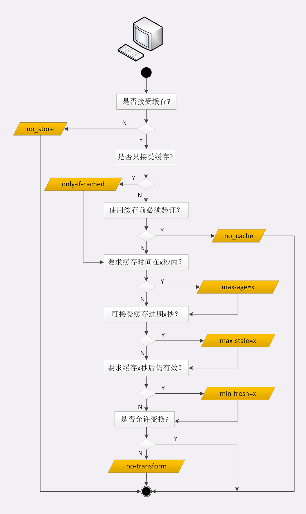

### HTTP 相关概念

#### 协议相关

HTTP 是一个用于传输超媒体文档的应用层协议。它是为 web 浏览器和 web 服务器之间的通信设计的。HTTP 是无状态协议，该协议基于 TCP/IP 层，但可以在任何可靠的传输层上使用

##### HTTP 组件

###### 客户端 user-agent

user-agent 是任何能够为用户发起行为的工具。

###### 服务端

通信的另一端

###### 代理 Proxies

在浏览器和服务器之间，有许多计算机和其他设备转发了HTTP消息。由于Web栈层次结构的原因，它们大多都出现在传输层、网络层和物理层上，对于HTTP应用层而言就是透明的，虽然它们可能会对应用层性能有重要影响。还有一部分是表现在应用层上的，被称为**代理（Proxies）**。代理（Proxies）既可以表现得透明，又可以不透明（“改变请求”会通过它们）。代理主要有如下几种作用：

-   缓存（可以是公开的也可以是私有的，像浏览器的缓存）
-   过滤（像反病毒扫描，家长控制...）
-   负载均衡（让多个服务器服务不同的请求）
-   认证（对不同资源进行权限管理）
-   日志记录（允许存储历史信息）

##### HTTP 相关

###### HTTP 和连接

一个连接是由传输层来控制的，不属于 HTTP 范围，HTTP并不需要底层的传输层协议是面向连接的，只需要它是可靠的，或不丢失消息的（至少返回错误）。

在客户端与服务端能够交互之前，必须在这两者间建立一个 TCP 链接：

*   HTTP/1.0 默认为每一对 HTTP 请求/响应都打开一个单独的 TCP 连接。
*   HTTP/1.1 引入了流水线（被证明难以实现）和持久连接的概念；底层的 TCP 连接可以通过 `Connection` 头部来被部分控制
*   HTTP/2 通过在一个连接复用消息的方式让这个连接始终保持为暖连接

###### HTTP 控制

HTTP 能进行以下特性的控制：

*   缓存，服务端和客户端都可以控制缓存

*   开发同源限制

    为了防止网络窥听和其它隐私泄漏，浏览器强制对Web网站做了分割限制。只有来自于**相同来源**的网页才能够获取网站的全部信息。这样的限制有时反而成了负担，HTTP可以通过修改头部来开放这样的限制，因此Web文档可以是由不同域下的信息拼接成的，某些情况下，这样做还有安全因素考虑

*   认证

    一些页面能够被保护起来，仅让特定的用户进行访问，基本的认证功能可以直接通过 HTTP 提供，使用 `Authenticate` 相似的头，或用 HTTP Cookies 来设置指定的会话

*   代理和隧道

    通常情况下，服务器和/或客户端是处于内网的，对外网隐藏真实 IP 地址。因此 HTTP 请求就要通过代理越过这个网络屏障。但并非所有的代理都是 HTTP 代理。例如，SOCKS协议的代理就运作在更底层，一些像 FTP 这样的协议也能够被它们处理

*   会话

##### data 协议

即前缀为 `data:` 协议的 URL，其允许内容创建者向文档中嵌入小文件

###### 语法

```
data:[<mediatype>][;base64],<data>
```

Data URLs 由四个部分组成：前缀（`data:`）、指示数据类型的 MIME 类型、如果非文本则为可选的 base64 标记、数据本身

*   mediatype

    为 MIME 类型的字符串，如果省略，则默认值为 `text/plain;charset=US-ASCII`

*   数据

    如果数据是文本类型，可以直接将文本嵌入（根据文档类型，使用合适的实体字符或转义字符），如果是二进制数据，可以将数据进行 base64 编码后再进行嵌入

    ```
    # 简单的 text/plain 类型数据
    data:,Hello%2C%20World!
    # base64 编码的 text/plain 类型数据
    data:text/plain;base64,SGVsbG8sIFdvcmxkIQ%3D%3D
    # html 文档源码
    data:text/html,%3Ch1%3EHello%2C%20World!%3C%2Fh1%3E
    # 带 js 的 html 文档
    data:text/html,<script>alert('hi');</script>
    ```

#### 组成部分

##### 资源定位符

###### URI

URI Uniform Resource Identifier 统一资源标识符，使用它能够唯一地标记互联网上资源，URI 主要有三个基本的部分构成：


*URI组成部分*

|         组成         |                             用途                             |
| :------------------: | :----------------------------------------------------------: |
|    协议名 Scheme     | 即访问该资源应当使用的协议，如 http/https、ftp，file、tel、data、mailto、view-source、ws/wss |
|  身份信息 (不推荐)   | 表示登录主机时的用户名和密码，但现在不推荐使用这种形式了，它会将敏感信息以明文形式暴露出来 |
|   主机名 authority   | 即互联网上的标记，可以是域名或 IP 地址，表示资源所在的主机名，通常为 host:port |
|      路径 path       | 即资源在主机上的位置，使用 `/` 分割多级目录。URI 的 path 部分必须以 `/` 开始，即必须包含 `/` |
|    查询参数 query    | URL 查询参数 query，它在 path 之后，用一个 ? 开始，但不包含 ?，表示对资源附加的额外要求。查询参数是多个 key=value 的字符串，使用 & 连接 |
| 片段标识符 #fragment | 它是 URI 所定位的资源内部的一个『锚点』，浏览器可以在获取资源后直接跳转到它指示的位置。仅能由浏览器这样的客户端使用，服务器是看不到的，浏览器永远不会把带  #fragment 的 URI 发送给服务器，服务器也永远不会用这种方式处理资源的片段 |

URI 本质上是一个字符串，这个字符串的作用是唯一的标记资源的位置或者名字。它不仅能标记万维网的资源，也可以标记其他的，如邮件系统、本地文件系统等任意资源。

客户端和服务器看到的 URI 是不一样的，客户端看到的必须是完整的 URI，使用特定的协议去连接特定的主机，而服务器看到的只是报文请求行里被删除了协议名和主机名的 URI。

<u>在 nginx 中，它的 location、rewrite 等指令操作的 URI 指的是真正 URI 里的 path 和后续的部分</u>

###### URL

* URL Uniform Resource Locator 统一资源定位符，即网址，它是 URI 的一个子集

###### URN

统一资源名称，包括名字，但不包括访问方式

##### URI 转义

###### 百分比编码

是一种拥有 8 位字符编码的编码机制，这些编码在 URL 的上下文中具有特定的含义。它有时被称为 URL 编码。包含一个百分号（%），后面跟着两个表示字符 ASCII 码的十六进制数。

根据上下文, 空白符 `' '` 将会转换为 `'+'` （必须在HTTP的POST方法中使定义 `application/x-www-form-urlencoded ` 传输方式）， 或者将会转换为 `'%20'` 的 URL。

*保留及受限字符*

|    字符    |                          保留/受限                           | ASCII | HEX  |
| :--------: | :----------------------------------------------------------: | :---: | :--: |
|     %      |                  保留作为编码字符的转义标志                  |  37   |  25  |
|     /      |                    保留作为路径分隔定界符                    |  47   |  2F  |
|     .      |                     保留在路径组件中使用                     |  46   |  2E  |
|     #      |                    保留作为分段定界符使用                    |  35   |  23  |
|     ？     |                  保留为查询字符串定界符使用                  |  63   |  3F  |
|     ；     |                    保留作为参数定界符使用                    |  59   |  3B  |
|     ：     |       保留为方案，用户/口令，主机/端口组件的定界符使用       |  58   |  3A  |
|     $      |                             保留                             |  36   |  24  |
|     ，     |                             保留                             |  39   |  27  |
|     +      |                             保留                             |  43   |  2B  |
|     @      |                        特殊上下文保留                        |  64   |  40  |
|     &      |                        特殊上下文保留                        |  38   |  26  |
|     =      |                        特殊上下文保留                        |  61   |  3D  |
| {}\|\^~[]` |  由于各种传输 Agent 代理，如各种网关的不安全处理，使用受限   |       |      |
|    <>"     | 不安全，这些字符在 URL 范围之外通常是有意义的，比如在文档中对 URL 自身进行定界，所以应该对其进行编码 |       |      |
| 0x00-0x1F  | 受限，这些十六进制范围内的字符都在 US-ASCII 字符集的不可打印区间内 |       |      |
|   >0x7F    | 受限，十六进制值在此范围内的字符都不在 US-ASCII 字符集的 7 比特范围内 |       |      |

#### 代理

##### 代理服务

###### 分类

代理（Proxy）是 HTTP 协议中请求方和应答方中间的一个环节，作为『中转站』，既可以转发客户端的请求，也可以转发服务器的应答。常见代理：

* 匿名代理

  完全『隐匿』了被代理的机器，外界看到的只是代理服务器

* 透明代理

  传输过程是『透明开发』的，外界既知道代理，也知道客户端

* 正向代理

  靠近客户端，代表客户端向服务器发送请求

* 反向代理

  靠近服务器端，代表服务器响应客户端的请求

###### 作用

由于代理在传输过程中插入了一个『中间层』，所以可以在这个环节做很多有意义的事情：

* 负载均衡

  把访问请求均匀分散到多台机器，实现访问集群化

* 内容缓存

  暂存上下行的数据，减轻后端的压力

* 安全防护

  隐匿 IP，使用 WAF 等工具抵御网络攻击，保护被代理的机器

* 数据处理

  提供压缩，加密等额外的功能
  
* 健康检查

  使用心跳等机制监控后端服务器，发现有故障就及时踢出集群，保证服务高可用

* 加密卸载

  对外网使用 SSL/TLS 加密通信验证，而在内网不加密，消除加解密成本

###### 头字段

|     字段名      |                             描述                             |
| :-------------: | :----------------------------------------------------------: |
|       Via       | 是一个通用字段，请求头或响应头里都可以出现。每当报文经过一个代理节点，代理服务器就会把自身的信息追加到字段的末尾。如果通信链路中有很多中间代理，会在 Via 里形成一个链表 |
|      X-Via      |                          等同于 Via                          |
| X-Forwarded-For | 每经过一个代理节点就会在该字段里追加一个信息，追加的是请求方的 IP 地址 |
|    X-Real-IP    |            记录客户端 IP地址，没有中间的代理信息             |

###### 代理协议

通过 X-Forwarded-For 操作代理信息必须要解析 HTTP 报文头，且 HTTPS 下无法修改。代理协议作为事实标准简化协议

* v1

  明文，在 HTTP 报文前再增加一行 ASCII 码文本

  ```
  # PROXY 开头，然后是 TCP4 或 TCP6 表示客户端 IP 地址类型，后面是请求方地址，应答方地址，请求方端口，应答方端口，以缓冲换行 \r\n 结束
  PROXY TCP4 127.0.0.1 127.0.0.1 11123 80\r\n
  ```

* v2

  为二进制格式

代理协议并不支持 X-Forwarded-For 的链式地址格式，拿到客户端地址后再如何处理，需要代理服务器与后端协商

#### 域名

域名是一个有层次的结构，是一串用 . 分隔的多个单词，最右边的被称为『顶级域名』，然后是『二级域名』，层级关系向左依次降低。最左边的是主机名，通常用来表明主机的用途，如 www 表示提供万维网服务，mail 表示提供邮件服务。在 Apache、Nginx 这样的 Web 服务器里，域名可以用来标识虚拟主机，决定由那个虚拟主机来对外提供服务。

##### 域名解析

DNS 核心系统是一个三层的树状、分布式服务，基本对应域名的结构：

* 根域名服务器 Root DNS Server

  管理顶级域名服务器，返回 com 、net、cn 等顶级域名服务器的 IP 地址

* 顶级域名服务器 Top-level DNS Server

  管理各自域名下的权威域名服务器，如 com 顶级域名服务器可以返回 apple.com 域名服务器的 IP 地址

* 权威域名服务器 Authoritative DNS Server

  管理自己域名下主机的 IP 地址，如 apple.com 权威域名服务器可以返回 www.apple.com 的 IP 地址

<u>nginx 中的 resolver 指令，就是用来配置 DNS 服务器的，如果没有它，那么 nginx 就无法查询域名对应的 IP，也就无法反向代理到外部的网站</u>

```nginx
# 指定 Google 的 DNS，缓存 30s
resolver 8.8.8.8 valid = 30s
```

#### 报文

HTTP 协议的请求报文和响应报文的结构基本相同，由三大部分组成

* 起始行（start line）

  描述请求或响应的基本信息

* 头部字段集合（header）

  使用 key-value 形式更详细地说明报文

* 消息正文（entity）

  实际传输的数据，可能是文本，图片，视频等二进制数据

HTTP 协议规定报文必须有 header ，但可以没有 body，而且 header 之后必须要有一个『空行』，即 CRLF，十六进制 0D0A

##### 起始行

###### 请求行 request line

描述了**客户端想要如何操作服务端的资源**，请求行由三部分构成：

* 请求方法

  是一个动词，如 GET/POST，表示对资源的操作

* 请求目标

  通常是一个 URI，标记了请求方法要操作的资源

* 版本号

  表示报文使用的 HTTP 协议版本

这三部分通常使用空格来分隔，最后用 CRLF 换行表示结束

###### 响应状态行 status line

即服务器响应的状态

* 版本号

  表示报文使用的 HTTP 协议版本

* 状态码

  数字，表示处理结果

* 原因

  数字状态码的补充

请求头和响应头的结构基本一样，唯一的区别是起始行。头部字段是 key-value 的形式，key 和 value 之间用 : 分隔，最后用 CRLF 换行表示字段结束。HTTP 头部字段非常灵活，可以任意添加自定义头，使用头字段

* 字段名不区分大小写，但首字母大写的可读性更好
* 字段名里不允许出现空格，可以使用连字符 -，但不能使用下划线 _
* 字段名后面必须紧接着 :，不能有空格，而 : 后字段值前可有有多个空格
* 字段的属性没有意义，可以任意排列不影响语义
* 字段原则上不能重复，除非这个字段本身的语义允许，如 Set-Cookie

##### HTTP 头部字段

###### 字段划分

HTTP 协议规定了非常多的头部字段，实现各种功能：

* 通用字段

  在请求头和响应头里都可以出现

* 请求字段

  仅能出现在请求头里，进一步说明请求信息或者额外的附加条件

* 响应字段

  仅能出现在响应头里，补充说明响应报文的信息

* 实体字段

  实际属于通用字段，但专门描述 body 的额外信息

###### 常用字段

|   类型   |      key       |                             含义                             | 必须出现 |
| :------: | :------------: | :----------------------------------------------------------: | :------: |
| request  |      Host      | 告诉服务器这个请求应该由那个主机来处理，当一台计算机托管了多个虚拟主机的时候，服务器端就需要用 Host 字段来选择 |   true   |
| request  |   User-Agent   |                     描述 HTTP 请求客户端                     |          |
| general  |      Date      | 通常出现在响应头里，表示 HTTP 报文创建的时间，客户端可以使用这个时间再搭配其他字段决定缓存策略 |          |
| response |     Server     |             正在提供 Web 服务器的软件名和版本号              |          |
|  entity  | Content-Length | 表示报文 body 的长度，即请求头或请求行空行后面的数据长度，如果没有该字段，那么 body  就是不定长的，需要使用 chunked 方式分段传输 |          |

##### MIMIE

###### 数据类型

在 TCP/IP 协议栈里，传输数据基本上都是 header + body 的格式。但 TCP、UDP 是传输层协议，不会关心 body 数据是什么，只要把数据发送到对方就算完成任务。而 HTTP 是应有层协议，数据到达之后还需要告诉上层应用这是什么数据才行，即数据类型

Multipurpose Internet Mail Extensions 是一个很大的标准规范，但 HTTP 只取了其中的一部分，用来标记 body 的数据类型，即 MIME type，MIME 把数据分成了八大类，每个大类下再细分多个子类，形式是 type/subtype 的字符串。HTTP 里经常遇到的类别

*MIMIE 分类*

|    类型     |              描述              |                             示例                             |
| :---------: | :----------------------------: | :----------------------------------------------------------: |
|    text     | 文件是普通文本，理论上人类可读 |       text/plain, text/html, text/css, text/javascript       |
|    image    |      某种图像，不包括视频      |              image/gif、image/png、image/x-icon              |
|    audio    |          某种音频文件          |   audio/midi、audio/mpeg、audio/webm、audio/ogg、audio/wav   |
|    video    |          某种视频文件          |                    video/webm、video/ogg                     |
| application |         某种二进制数据         | application/octet-stream、application/pkcs12、application/pdf |

对于text文件类型若没有特定的subtype，就使用 `text/plain`。类似的，二进制文件没有特定或已知的 subtype，即使用 `application/octet-stream`（不透明的二进制数据）

###### MIME 嗅探

在缺失 MIME 类型或客户端认为文件设置了错误的 MIME 类型时，浏览器可能会通过查看资源来进行 MIME 嗅探。每一个浏览器在不同的情况下会执行不同的操作。因为这个操作会有一些安全问题，有的 MIME 类型表示可执行内容而有些是不可执行内容。浏览器可以通过请求头 `Content-Type` 来设置 `X-Content-Type-Options`以阻止 MIME 嗅探。

`X-Content-Type-Options` HTTP 消息头相当于一个提示标志，被服务器用来提示客户端一定要遵循在 `Content-Type` 首部中对 MIME 类型的设定，而不能对其进行修改。这就禁用了客户端的 MIME 类型嗅探行为

```
# 请求类型是"style" 但是 MIME 类型不是 "text/css",请求类型是"script" 但是 MIME 类型不是  JavaScript MIME 类型时，请求将被阻止
X-Content-Type-Options: nosniff
```

###### mulitpart/form-data

multipart 标识细分领域的文件类型的种类，对应不同的 MIME 类型。

可用于 HTML 表单从浏览器发送信息给服务器。作为多部分文档格式，它由边界线（`--`）划分出不同的部分组成。每一部分有自己的实体，以及自己的 HTTP 请求头。Content-Disposition 和 Content-Type 用于文件上传领域，最常用的 Content-Length 因为边界线作为分隔符而被忽略

###### Content-Disposition 

响应头指示回复的内容该以何种形式展示，是以**内联**的形式（即网页或者页面的一部分），还是以**附件**的形式下载并保存到本地。

消息头最初是在MIME标准中定义的，HTTP表单及[`POST`](https://developer.mozilla.org/zh-CN/docs/Web/HTTP/Methods/POST) 请求只用到了其所有参数的一个子集。只有`form-data`以及可选的`name`和`filename`三个参数可以应用在HTTP场景中

在 multipart/form-data 类型的应答消息体中， **`Content-Disposition`** 消息头可以被用在 multipart 消息体的子部分中，用来给出其对应字段的相关信息。各个子部分由在[`Content-Type`](https://developer.mozilla.org/zh-CN/docs/Web/HTTP/Headers/Content-Type) 中定义的**分隔符**分隔。用在消息体自身则无实际意义

*   作为消息主体中的消息头

    在 HTTP 场景中，第一个参数是 inline（默认），标识回复中的消息体会以页面的一部分或整个页面的形式展示。attachment（意味着消息体应该被下载到本地；大多数浏览器会呈现一个保存为的对话框，将 filename 的值预填为下载后的文件名）

    ```
    Content-Disposition: inline
    Content-Disposition: attachment
    Content-Disposition: attachment; filename="filename.jpg"
    ```

*   作为 multipart body 中的消息头

    在 HTTP 场景中，第一个参数总是固定不变的 form-data；附加的参数不区分大小写，并且拥有参数值，参数名与参数值用 `=` 连接，参数值用双引号括起来，参数之间用分号`;`分割

    ```
    Content-Disposition: form-data
    Content-Disposition: form-data; name="fieldName"
    Content-Disposition: form-data; name="fieldName"; filename="filename.jpg"
    ```

    name 是表单字段名，每个字段名会对应一个子部分。在同一个字段名对应多个文件的情况下，则多个子部分共用同一个字段名，如果 name 参数值为 `_charset_`，意味着这个子部分表示的不是一个 HTML 字段，而是在未明确指定字符集信息的情况下各部分使用的默认字符集

    filename 是要传送的文件的初始名称字符串，该参数总是可选的，而且不能盲目使用：路径信息必须舍去。当 `filename` 和 `filename*` 同时出现的时候，优先采用 `filename*`，假如二者都支持

    *form-data 请求*

    ```
    POST /test.html HTTP/1.1
    Host: example.org
    Content-Type: multipart/form-data;boundary="boundary"
    
    --boundary
    Content-Disposition: form-data; name="field1"
    
    value1
    --boundary
    Content-Disposition: form-data; name="field2"; filename="example.txt"
    ```

###### multipart/byteranges

用于把部分的响应报文发送回浏览器。当发送状态码 206 Partial Content 时，这个 MIME 类型用于指出这个文件由若干部分组成。每个都有其请求范围，每个不同的部分都有 Content-Type 头说明文件类型和 Content-Range 说明其范围

###### application/x-www-form-urlencoded

数据被编码成以 `&` 分割的键值对，同时以 `=` 分隔键和值，非字母或数字的字符会被百分比编码，该类型不支持二进制数据

##### 实体

###### 数据压缩编码

HTTP 在传输时为了节约带宽，有时会压缩数据，使用 Encoding type 来指定编码格式

###### 实体内容协商

HTTP 协议定义了用于客户端和服务器进行内容协商的头字段（Accept 头告诉服务器希望接收什么数据，Content 头告诉客户端实际发送了什么数据）：

* Accept

  请求字段标记的是客户端可理解的 MIME type，可以用逗号分隔出多个类型，让服务器选择

* Accept-Encoding

  请求字段标记的是客户端支持的压缩格式，可以用逗号分隔，支持 gzip（采用 Lempel-Ziv coding LZ77 压缩算法，以及 32 位 CRC 校验的编码方式）、compress（采用 Lempel-Ziv-Welch LZW 压缩算法）、deflate（采用 zlib 结构和 deflate 压缩算法）、br（采用 Brotil 算法的编码方式）、identity（用于指代自身，除非特别说明，这个标记始终可以被接受）、*（匹配其他任意未在该请求头字段中列出的编码方式。假如该请求头字段不存在的话，这个值是默认值。它并不代表任意算法都支持，而仅仅表示算法之间无优先次序）、;q=(qvalues weighting 权重）

  ```
  Accept-Encoding: deflate, gzip;q=1.0, *;q=0.5
  ```

* Content-Type

  通用字段，在响应中，Content-Type 标头标识返回的实体类型（浏览器会在某些情况下进行MIME查找，并不一定遵循此标题的值; 为了防止这种行为，可以将标题 [`X-Content-Type-Options`](https://developer.mozilla.org/zh-CN/docs/Web/HTTP/Headers/X-Content-Type-Options) 设置为 **nosniff**。）在请求中 POST/PUT 客户端告诉服务器发送的数据类型

  ```
  Content-Type: text/html; charset=utf-8
  # media-type 资源或数据的 MIME type，charset 字符编码标准，boundary 对于多部分实体，boundary 是必须的，它用于封装消息的多个部分的边界
  Content-Type: multipart/form-data; boundary=something
  ```

* Content-Encoding

  当该首部出现时，表示消息主题进行了何种方式的内容编码转换。实际使用的压缩格式，对应 Accept-Encoding，值与 Accept-Encoding 对应

* Accept-Language

  语言类型，即自然语言，en-US 美式英语，zh-CN 简体中文

* Accept-Charset

  字符集，客户端能接受的字符集

在 HTTP 协议里用 Accept，Accept-Encoding，Accept-Language 等请求头字段进行内容协商，还可以用 q 参数表示权重来设定优先级，q 即 quality factor，权重的最大值是 1，最小值是 0.01 ，默认值是 1，如果值是 0 就表示拒绝。在数据类型或语言代码后面加分号，后接 q=value

```
Accept: text/html,application/xml;q=0.9,*/*;q=0.8
```

内容协商的过程是不透明的，每个 web 服务器使用的算法都不一样，但有时，服务器会在响应头里多加一个 **Vary** 字段，记录服务器在内容协商时参考的请求头字段，Vary

```
# 服务器依据 Accept-Encoding,User-Agent,Accept 三个头字段决定了发回的响应报文
Vary: Accept-Encoding,User-Agent,Accept
```

#### 文件传输

##### 数据压缩

传输数据时开启压缩，但 gzip 等压缩算法通常只对文本有较好的压缩率，而图片、音视频等多媒体数据本身已经是高度压缩，再用 gzip 处理也不会变小（甚至还有可能会增大一点）

在 Nginx 里会使用 gzip on 指令，启用压缩

##### 分块传输

###### 分块头

HTTP 协议就是 chunked 分块传输编码，在响应报文里用头字段 **Transfer-Encoding: chunked** 来表示，即报文里的 body 部分不是一次性发过来的，而是分成了许多的块（chunk）逐个发送。

分块传输也可以用于『流式数据』，这种情况下 body 数据的长度是未知的，无法在头字段 **Content-Length **里给出具体长度。

Transfer-Encoding: chunked 和 Contenting-Length 字段是**互斥**的，即响应报文里这两个字段不能同时出现，一个响应报文的传输要么是长度已知的，要么是长度未知（chunked）。

分块传输采用了明文的方式，类似响应头

###### 分块头结构

* 每个分块包含两部分，分块长度和分块数据
* 长度头是以 CRLF（回车换行，\r\n）结尾的一行明文，用 16 进制数字表示长度
* 数据块紧跟在长度头之后，最后也用 CRLF 结尾，但数据不包括 CRLF
* 最后用一个长度为 0 的块表示结束，即 0\r\n\r\n

*分块传输数据结构*


#### 请求

##### 请求方法

目前 HTTP/1.1 支持的方法，单词都必须是大写的形式

| 方法名  |                             作用                             | 请求 body | 成功响应 body | 安全 | 幂等 | 可缓存 | 可在HTML froms 中使用 |
| :-----: | :----------------------------------------------------------: | :-------: | :-----------: | ---- | ---- | ------ | --------------------- |
| CONNECT | 开启客户端与所请求资源之间的双向沟通的通道，可以用来创建隧道（tunnel），是应用范围为点到点的方法 |    否     |      是       | 否   | 否   | 否     | 否                    |
| DELETE  |                         删除指定资源                         |  可以有   |    可以有     | 否   | 是   | 否     | 否                    |
|   GET   |         请求指定的资源，使用 GET 请求只用于获取数据          |    否     |      是       | 是   | 是   | 是     | 是                    |
|  HEAD   |      请求资源头部信息，返回头部与 GET 请求返回头部一致       |    否     |      否       | 是   | 是   | 是     | 否                    |
| OPTIONS |                 获取目的资源所支持的通信选项                 |    否     |      否       | 是   | 是   | 否     | 否                    |
|  PATCH  |                    用于对资源进行部分修改                    |    是     |      否       | 否   | 否   | 否     | 否                    |
|  POST   |      发送数据给服务器，请求主体类型由 Content-Type 指定      |    是     |      是       | 否   | 否   | 是     | 是                    |
|   PUT   |              使用请求中的负载创建或替换目标资源              |    是     |      否       | 否   | 是   | 否     | 否                    |
|  TRACE  |            实现沿通向目标资源的路径的消息环回测试            |    否     |      否       | 否   | 是   | 否     | 否                    |

##### 安全和幂等

在 HTTP 协议里，安全是指请求方法不会破坏服务器上的资源，即不会对服务器上的资源造成实质的修改。即只有 HEAD 和 GET 是安全的。

**幂等**：多次执行相同的操作，结果也是相同的，即多次『幂』后结果『相等』

##### 范围请求

###### HTTP 范围请求

range requests，允许客户端在请求头里使用专用字段来表示只获取文件的一部分。

范围请求不是 Web 服务器必备的技能，可以实现也可以不实现，服务器必须在响应头里使用字段

* Accept-Ranges: bytes 明确告诉客户端，支持范围请求
* Accept-Range: none 或不发送 Accept-Range 字段来表示不支持范围请求

请求头 Range 是 HTTP 范围请求的专用字段，格式是 bytes=x-y，其中 x 和 y 是以字节为单位的数据范围，x 和 y 表示的是『偏移量』，范围必须从 0 计数，如前 10 个字节表示 0-9，第二个 10 字节表示 10-19。Range 的格式也很灵活，起点 x 和终点 y 可以省略，能够很方便地表示正数或倒数的范围，假设文件是 100 个字节，那么：

* 0- 表示从文档起点到文档终点，相当于 0-99，即整个文件
* 10- 表示从第 10 个字节开始到文档末尾，相当于 10-99
* -1 是文档的最后一个字节，相当于 99-99
* -10 是从文档末尾倒数 10 个字节，相当于 90-99

服务器收到 Range 字段后，需要做四件事

* 它必须检查范围是否合法，比如文件只有 100 个字节，但请求 200 ～ 300，这就是范围越界。服务器就会返回状态码 **416**，即『范围请求有误，无法处理，请再检查一下』
* 如果范围正确，服务器就可以根据 Range 头计算偏移量，读取文件的片段，返回状态码 **206 Partial Content**
* 服务器要添加一个响应头字段 Content-Range，告诉片段实际偏移量和资源的总大小，格式是 **bytes x-y/length**，与 Range 头区别在于没有 =，范围后多了总长度。

常用视频进度条拖拽，多段下载、断点续传也是基于它实现的，要点是：

* 发送 HEAD，看服务器是否支持范围请求，同时获取文件的大小
* 开启多个线程，每个线程用 Range 字段划分出各自负责下载的片段，发送请求
* 即使意外中断，只要根据上次的下载记录，用 Range 请求剩下的一部分即可

###### 多段数据

范围请求一次只获取一个片段，它还支持在 Range 头里使用多个 x-y，一次性获取多个片段数据。

这种情况需要使用一种特殊的 MIME 类型 **multipart/byteranges**，表示报文的 body 是由多段字节列组成的，并且还要用一个参数 **boundary=xxx** 给出段之间的分隔标记。多段数据的格式与分块传输类似，但需要用分隔标记 boundary 来区分不同的片段

*多段数据格式*


每一个分段必须以**- - boundary** 开始（前面加两个 -），之后要用 **Content-Type** 和 **Content-Range** 标记这段数据的类型和所在范围，然后就像普通的响应头一样以回车换行结束，再加上分段数据，最后用一个 **-- boundary --** (前后各有两个 -)，表示所有的分段结束

##### 状态码

###### 1xx

属于提升信息，是协议处理的中间状态

* 101 Switching Protocols 是客户端使用 Upgrade 头字段，要求在 HTTP 协议的基础上改成其他的协议继续通信，如 WebSocket。而服务器也同意变更协议，就会发送状态码 101，但这之后的数据传输就不会再使用 HTTP 了

###### 2xx

|       状态码        |                             描述                             |
| :-----------------: | :----------------------------------------------------------: |
|       200 OK        |    成功，如果非 HEAD 请求，通常在响应头后都会有 body 数据    |
|   204 No Content    |          与 200 基本相同，但响应头后没有 body 数据           |
| 206 Partial Content | 是 HTTP 分块下载或断点续传的基础，在客户端发送『范围请求』，要求获取资源的部分数据时出现，与 200 一样，是服务器成功处理了请求，但 body 里的数据不是资源的全部，而是其中的一部分。206 通常还会伴随头字段 Content-Range，表示响应报文里 body 数据的具体范围，供客户端确认，Content-Range: bytes 0-99/2000 ，意思是此次获取的是总计 2000 个字节的前 100 个字节 |

###### 3xx

表示客户端请求的资源发生了变动，客户端必须用新的 URI 重新发送请求获取资源，即重定向

|        状态码         |                             描述                             |
| :-------------------: | :----------------------------------------------------------: |
| 301 Moved Permanently | 永久重定向，即此次请求的资源已经不存在了，需要该用新的 URI 再次访问。 |
|       302 Found       | 曾经的描述短语是 Moved Temporarily，即临时重定向，资源存在，但暂时需要用另一个 URI 来访问 |
|   304 Not Modified    | 用于 If-Modified-Since 等条件请求，表示资源未修改，用于缓存控制，不具有通常的跳转含义，但可以理解成『重定向到已缓存的文件』，即缓存重定向 |

###### 4xx

表示客户端发送的请求报文有误，服务器无法处理

|               状态码                |                        描述                        |
| :---------------------------------: | :------------------------------------------------: |
|           400 Bad Request           |                    请求报文错误                    |
|            403 Forbidden            |                 服务器禁止访问资源                 |
|            404 Not Found            |                     资源未找到                     |
|       405 Method Not Allowed        |             不允许使用某些方法操作资源             |
|         406 Not Acceptable          |            资源无法满足客户端请求的条件            |
|         408 Request Timeout         |          请求超时，服务器等待了过长的时间          |
|            409 Conflict             |     多个请求发生了冲突，多线程并发时的竞争状态     |
|    413 Request Entity Too Large     |               请求报文里的 body 太大               |
|      414 Request-URI Too Long       |                请求行里的 URI 太大                 |
|        429 Too Many Requests        | 客户端发送了太多的请求，通常是由于服务器的限连策略 |
| 431 Request Header Fields Too Large |              请求头某个字段或总体太大              |

###### 5xx

表示客户端请求报文正确，但服务器在处理时内部发生了错误，无法响应应有的响应数据，是服务器端的错误码

|          状态码           |                             描述                             |
| :-----------------------: | :----------------------------------------------------------: |
| 500 Internal Server Error |                          通用错误码                          |
|    501 Not Implemented    |                   客户端请求的功能还不支持                   |
|      502 Bad Gateway      | 服务器作为网关或代理时返回的错误码，表示服务器自身工作正常，访问后端服务器时发生了错误，但具体的错误原因不知 |
|  503 Service Unavailable  | 服务器忙，暂时无法响应服务，503 是一个临时状态，很可能几秒钟后服务器就正常，一般 503 响应报文里通常会有一个 Retry-After 字段，指示客户端可以在多久以后再次发送请求 |

#### HTTP 连接

##### 短连接

HTTP 协议最初（0.9/1.0）是个非常简单的协议，通信过程采用了简单的『请求-应答』方式。底层数据传输基于 TCP/IP，每次发送请求前需要先与服务器建立连接，收到响应报文后会立即关闭连接。因为客户端与服务器的整个连接过程很短暂，不会与服务器保持长时间的连接状态，所以就被称为**短连接**（short-lived connections）。早期的 HTTP 协议也被称为是**无连接**的协议

短连接的缺点很严重，因为在 TCP 协议里，建立连接和关闭连接都是非常昂贵的操作。TCP 建立连接要**三次握手**，发送 3 个数据包，需要 1 个 RTT；关闭连接时**四次挥手**，4 个数据包需要 2 个 RTT。而 HTTP 的一次简单『请求 - 响应』通常只需要 4 个包，如果不算服务器内部的处理时间，最多是 2 个 RTT。

##### 长连接

针对短连接暴露出的缺点，HTTP 协议就提出了**长连接**的通信方式，即**持久连接**（persistent connections）、**连接保活**（keep alive）、**连接复用**（connection reuse）。

##### 连接相关的头字段

由于长连接对性能的改善效果非常显著，所以在 HTTP/1.1 中的连接都会默认启用长连接。不需要用什么特殊的头字段指定，只要向服务器发送了第一次请求，后续的请求都会重复利用第一次打开的 TCP 连接，也就是长连接，在这个连接上收发数据。也可以在请求头里明确地要求使用长连接机制，使用的字段是 **Connection**，值为：**keep-alive**

因为 TCP 连接的长时间不关闭，服务器必须在内存里保存它的状态，这就占用了服务器的资源。如果有大量的空闲长连接只连接不发送数据，就会很快耗尽服务器的资源，导致服务器无法为真正有需要的用户提供服务。所以长连接也需要在恰当的时候关闭，不能永远保持与服务器的连接，这在客户端或服务器都可以做到：

* 在客户端，可以在请求头里加上**Connection: close** 字段，即这次通信后关闭连接。

* 服务器通常不会主动关闭连接，但可以使用一些策略控制，如使用 nginx 服务器

  1.使用 **keepalive_timeout** 指令，设置长连接的超时时间，如果在一段时间内连接上没有任何数据收发就主动断开连接，避免空闲连接占用系统资源

  2.使用**keepalive_requests** 指令，设置长连接上可发送的最大请求次数。当 nginx 在这个连接上处理了 1000 个请求后，也会主动断开连接

客户端和服务器都可以在报文里附加通用头字段**Keep-Alive: timeout=value**，限定长连接的超时时间。但这个字段的约束力并不强，通信双方可能并不会遵守，一般不使用

在长连接中的一个重要问题是如何正确地区分多个报文的开始和结束，最好总使用 Content-Length 头明确响应实体的长度，正确标记报文结束。如果是流式传输，body 长度不能立即确定，必须用分块传输编码

###### DDos 攻击

利用 HTTP 的长连接特性对服务器发起大量请求，导致服务器最终耗尽资源『拒绝服务』

#### 重定向

重定向是服务器发起的跳转，要求客户端该用新的 URI 重新发送请求，通常会自动进行，用户是无感知的。**Location** 字段属于响应字段，必须出现在响应报文里。但只有配合 301/302 状态码才有意义，它**标记了服务器要求重定向的 URI**。浏览器收到 301/302 报文，会检查响应头里有没有 Location。如果有，就从字段里提取出 URI，发出新的请求。在 Location 里 URI 既可以使用绝对 URI，也可以使用相对 URI。与跳转有关的还有一个 Referer 和 Referrer-Policy 字段表示浏览器跳转的来源，即引用地址，可用于统计分析和防盗链。

##### 重定向的相关问题

* 性能损耗

  重定向的机制决定了一个跳转会有两次请求-应答，比正常的访问多了一次

* 循环跳转

  如果重定向的策略设置欠考虑，可能出现 A=>B=>C=>A 的无限循环，HTTP 协议规定，浏览器必须具有检测『循环跳转』的能力，在发现这种情况时应答停止发送请求并给出错误提示

#### 缓存控制

常见的 HTTP 缓存只能存储 GET 响应，私有缓存只能用于单独用户，浏览器缓存拥有用户通过 HTTP 获取的所有文档，共享缓存能被多个用户使用，一般作为缓存代理

##### HTTP 缓存代理

###### HTTP 缓存代理服务器

HTTP 的服务器缓存功能主要由代理服务器来实现，而源服务器系统内部各种缓存（Memecache，redis）与 HTTP 没有关系。

没有缓存时，代理服务器每次都是直接转发客户端和服务器的报文，中间不会存储任何数据，只有简单的中转功能。加入缓存后，代理服务器收到源服务器发来的响应数据后需要：

1. 将报文转发给客户端
2. 把报文存入自己的 Cache 里，下一次再有相同的请求，代理服务器就直接发送 304 或者缓存数据

在 HTTP 缓存体系中，缓存代理即是客户端，也是服务端，可以用客户端的缓存控制策略也可用服务器的缓存控制策略。

###### HTTP 缓存代理控制

缓存代理是数据中转站，使用 Cache-Control 属性约束

* X-Cache、X-Hit、X-Accel

    代理在响应报文中增加以上 Cache-Control 属性表示是否命中和命中率

* Very

    同一个请求，经过内容协商后可能会有不同的字符集、编码、浏览器等版本，缓存代理必须要存储这些不同的版本。当再接收到相同的请求时，代理就读取缓存里的 Vary，对比请求头李的 Vary 的相应的值，如果和上一个请求完全匹配，即版本一致，可以返回缓存的数据

* Purge

    缓存清理，比较常用的做法是使用自定义请求方法 PURGE，发给代理服务器，要求删除 URI 对应的缓存数据

###### 源服务器缓存控制

*服务器完整缓存控制策略*


###### 客户端的缓存控制

客户端在 HTTP 缓存体系里要面对的是代理和源服务器，必须区别对待

*客户端完整缓存策略*



##### 头字段

###### Cache-Control

HTTP/1.1 定义该头来区分缓存机制的支持情况，服务器与客户端通过它配置缓存策略，多个指令（不区分大小写）以逗号分隔。

服务器客户端都可以使用 **Cache-Control**，来进行缓存控制，互相协商缓存的使用策略。除了使用 Cache-Control，服务器可以用 Expires 字段来标记资源的有效期，但优先级低于 Cache-Control

源服务器设置完 Cache-Control 后必须要为报文加上 Last-modified 或 ETag 字段

*缓存请求指令*

|           指令            | 请求/响应 |                             描述                             |      用途       |
| :-----------------------: | :-------: | :----------------------------------------------------------: | :-------------: |
|          public           |   响应    |                     响应可被任何对象缓存                     |    可缓存性     |
|          private          |   响应    | 表明响应只能被私有缓存（缓存只能在客户端保存，是用户私有的，不能放在代理上与别人分享） |    可缓存性     |
|         no-cache          | 请求/响应 | 可以缓存，但在使用之前必须去服务器验证是否过期，是否有最新的版本 |    内容协商     |
|         no-store          | 请求/响应 |                          不允许缓存                          |    可缓存性     |
|          max-age          | 请求/响应 | 设置缓存生成时间，相对响应报文创建时间（即 Date 字段 + max-age 值确定缓存过期时间） | 时间（seconds） |
|         s-maxage          |   响应    |  覆盖 max-age 或 Expires 头，仅用于共享缓存，私有缓存会忽略  | 时间（seconds） |
|         max-stale         |   请求    | 表明客户端愿意接收一个已经过期的资源，可以设置一个可选的秒数，表示响应不能超过该给定时间（如果代理上的缓存过期了也可以接受，但不能过期太多，即使用 max-age + max-stale 计算缓存有效时间） | 时间（seconds） |
|         min-fresh         |   请求    | 表示客户端希望获取一个能在指定的秒数内保持其最新状态的响应（缓存必须有效，而且必须在 x 秒后依然有效，即缓存存在时间 + min-fresh 必须小于 max-age） | 时间（seconds） |
| stale-if-revalidate(扩展) |   请求    | 表示客户端愿意接受陈旧响应，同时在后台异步检查新的响应，秒值表示愿意接受陈旧响应的时间长度 | 时间（seconds） |
|   stale-if-error(扩展)    |   请求    | 表示如果新的检查失败，则客户愿意接受陈旧的响应，秒值表示客户在初始到期后愿意接受陈旧响应的时间 | 时间（seconds） |
|      must-revalidate      |   响应    | 一旦资源过期，在成功向原始服务器验证之前，缓存不能用该资源响应后续请求 |    缓存验证     |
|     proxy-revalidate      |   响应    | 与 must-revalidate 作用相同，仅使用共享缓存，私有缓存忽略（要求代理的缓存过期后必须验证，客户端不必回源，只验证到代理这个环节） |    缓存验证     |
|      immutable(扩展)      |   响应    | 表示响应正文不会随时间而改变。资源（如果未过期）在服务器上不发生改变，因此客户端不应发送重新验证请求头（如 If-None-Match 或 If-Modified-Since) 来检查更新，即使用户显式刷新页面 |    缓存验证     |
|       no-transform        |   响应    | 不得对资源进行转换或转变。`Content-Encoding`、`Content-Range`、`Content-Type`等HTTP头不能由代理修改。例如，非透明代理或者如[Google's Light Mode](https://support.google.com/webmasters/answer/6211428?hl=en)可能对图像格式进行转换，以便节省缓存空间或者减少缓慢链路上的流量。`no-transform`指令不允许这样做。 |    缓存修改     |
|      only-if-cached       |   请求    | 表明客户端只接受已缓存的响应，并且不要向原始服务器检查是否有更新的拷贝（如果代理上没有缓存或缓存过期，会响应 504） |    缓存条件     |

```
# 缓存在客户端，生成时间为 5s
Cache-Control: private,max-age=5
# 缓存在代理服务器生存时间为 10s，在客户端生存 5s，过期后直接请求缓存服务器
Cache-Control: public,max-age=5,s-maxage=10
# 代理和客户端都缓存 5s，过期后 缓存去服务器请求并且不允许改变数据
Cache-Control: public, max-age=5,proxy-revalidate,no-transform
```

###### Pragma 

Pragma 是 HTTP/1.0 标准中定义的一个 header 属性，请求中包含 Pragme 的效果和在 `Cache-Control:no-cache` 相同，但 HTTP 响应头没有明确定义这个属性

```
# 与 Cache-Control: no-cache 效果一致。强制要求缓存服务器在返回缓存的版本之前将请求提交到源头服务器进行验证。
Pragma: no-cache
```

###### Expires

响应头包含日期/时间，在此时刻后，响应过期。无效的日期，0，代表过去的日期，即该资源已经过期 

```
Expires: <http-date>
Expires: Wed, 21 Oct 2015 07:28:00 GMT
```

###### ETags

HTTP 响应头是资源的特定版本的标识符。这可以让缓存更高效，并节省带宽，因为如果内容没有改变，Web服务器不需要发送完整的响应。而如果内容发生了变化，使用 ETag 有助于防止资源的同时更新相互覆盖（“空中碰撞”）。

如果给定 URL 中的资源更改，则一定要生成新的 Etag 值。 因此 Etags 类似于指纹，也可能被某些服务器用于跟踪。 比较 Etags 能快速确定此资源是否变化，但也可能被跟踪服务器永久存留

```
# 'W/'(大小写敏感) 表示使用弱验证器。弱验证器很容易生成，但不利于比较，强验证器是比较的理想选择，但很难有效地生成。相同资源的两个弱 Etag 值可能语义等同，但不是每个字节都相同
# "<etag_value>"
实体标签唯一地表示所请求的资源。 它们是位于双引号之间的 ASCII 字符串（如“675af34563dc-tr34”）。 没有明确指定生成 ETag 值的方法。通常，使用内容的散列，最后修改时间戳的哈希值，或简单地使用版本号。例如，MDN 使用 wiki 内容的十六进制数字的哈希值。
ETag: W/"<etag_value>"
ETag: "<etag_value>"
ETag: "33a64df551425fcc55e4d42a148795d9f25f89d4"
ETag: W/"0815"
```

#### 条件请求

浏览器用 Cache-Control 做缓存控制只能是刷新数据，不能很好地利用缓存数据，又因为缓存会失效，使用前还必须要去服务器验证是否是最新版。

浏览器可以用两个连续的请求组成『验证动作』，先是一个 HEAD，获取资源的修改时间等元信息，然后与缓存数据比较，如果没有改动就使用缓存，节省网络流量，否则就再发一个 GET 请求，获取最新的版本，为了规避两个请求网络成本。

HTTP 协议定义了一系列 **If** 开头的 **条件请求** 字段，专门用来检查验证资源是否过期，把两个请求才能完成的工作合并在一个请求里，而且验证责任也交给服务器。条件请求一共有 5 个头字段

* If-Modified-Since:<date>

  需要第一次的响应报文预先提供 Last-modified，后第二次请求带上缓存里的原值，验证资源是否是最新的。如果资源没有变化，服务器就响应 304 Not Modifed，表示缓存依然有效，浏览器可以更新一下有效期，然后使用缓存。**Last-modified 即资源最后修改时间**。

  如果自指定日期后，文档没有被修改过，条件位真，通常 GET 就会成功执行携带新首部的新文档会被返回给缓存，新首部除了其他信息之外，还包含一个新的过期日期

* If-None-Match:<tags>

  需要第一次的响应报文预先提供 **Etag** 字段，第二次再请求时带上该值，服务器验证该值与当前实体 Etag 是否相同。**ETag 是 Entity Tag 实体标签，资源唯一标识**。强 ETag 要求资源在字节级别必须完全相符，弱 ETag 在值前有个 W/ 标记，只要求资源在语义上没有变化，但内部可能会有部分发生了改变。
  
* If-Unmodified-Since

  在进行部分文件的传输时，获取文件的其余部分之前要确保文件未发生变化

* If-Range

  支持对不完整文件的缓存

* If-Match

  用于与 Web 服务器打交道时的并发控制

