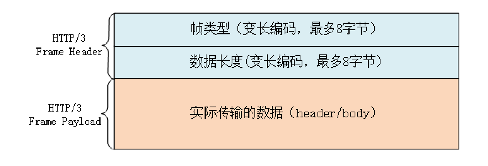

### HTTP 延申


##### HTTPS

###### 通信安全

通信安全必须具备以下四个特性：

* 机密性（Secrecy/Confidentiality）

  对数据的保密，只能由可信的人访问，对其他人是不可见的秘密，即除了通信方外其他人不可见

* 完整性（Integrity）

  数据在传输过程中没有被篡改

* 身份认证（Authentication）

  确认对方的真实身份，保证消息只能发送给可信方

* 不可否认（Non-repudiation/Undeniable)

  不能否认已经发生过的行为

###### 规范

HTTPS 协议规定了协议名为 https，默认端口号 443，请求-应答、报文结构、请求方法、URI、头字段、连接管理等都完全沿用 HTTP。HTTPS 将 HTTP 下层的传输协议由 TCP/IP 换成了 SSL/TLS，由 HTTP over TCP/IP 变成了 HTTP over SSL/TLS，让 HTTP 运行在安全的 SSL/TLS 协议上，收发报文不再使用 Socket API ，而是调用专门的安全接口 SSL/TLS，SSL/TLS 可以承载很多应用协议：HTTPS、FTPS、LDAPS

###### 层次结构

SSL 即安全套阶层（Secure Socket Layer)，在 OSI 模型中处于第 5 层（会话层），由 v2 和 v3 两个版本，SSL 发展到 v3 时被互联网工程组 IETF 在 1999 年标准化为 TLS（Transport Layer Security），版本号从 1.0 算，TLS 1.0 即 SSLv3.1。TSL 发展出三个版本，2006 1.1，2008 1.2，2018 1.3。目前应用广泛的是 TLS 1.2，之前的 1.0，1.1 各大浏览器将在 2020 年左右停止支持。

浏览器和服务器在使用 TLS 建立连接时需要选择一组恰当的加密算法来实现安全通信，这些算法组合为加密套件（cipher suite），客户端和服务器支持非常多的密码套件，基本形式为『密钥交换算法 + 签名算法 + 对称加密算法 + 摘要算法』，TLS 会在 Openssl 密码套件前添加 TLS 前缀，TLS_ECDHE_RSA_WITH_AES_256_GCM_SHA384，并用 WITH 分开握手和通信算法：`ECDHE-RSA-AES256-GCM-SHA384` 即：握手时使用 ECDHE 算法进行密钥交换、用 RSA 签名和身份认证、握手后的通信使用 AES 对称算法，密钥长度 256 位，分组模式 GCM、摘要算法 SHA384 用于消息认证和产生随机数（AES 保证机密，SHA384 保证完整，RSA 保证身份认证和不可否认）TLS1.2 要求必须实现 `TLS_RSA_WITH_AES_128_CBC_SHA`，TLS 1.3 要求必须实现 `TLS_AES_128_GCM_SHA256`，并且因为前向安全的原因废除了 DH 和 RSA 密钥交换算法

###### TLS 协议的组成

TLS 包含几个子协议，比较常用的有记录协议、警报协议、握手协议、变更密码规范协议、扩展协议

* 记录协议（Record Protocol）

  规定了 TLS 收发数据的基本单位：记录（record）。类似 TCP 里的 segment，所有的其他子协议都需要通过记录协议发出。但多个记录数据可以在一个 TCP 包里一次性发出，也不需要像 TCP 那样返回 ACK

* 警告协议（Alert Protocol）

  向对方发出警报信息，类似 HTTP 协议里的状态码。收到警报后，另一方可以选择继续，也可以终止连接

* 握手协议（Handshake Protocol）

  浏览器和服务器在握手过程中协商 TLS 版本号、随机数、密码套件等信息，然后交换证书和密钥参数，最终双方协商得到会话密钥，用于后续的混合加密

* 变更密码规范协议（Change Cipher Spec Protocol）

    就是一个通知，告诉对方，后续的数据都将使用加密保护，在它之前数据都是明文的

###### TLS 建立连接

*TLS握手过程*


每个框都是一个记录，多个记录组合成一个 TCP 包发送，最多经过两次消息往返（4 个消息），就可以完成握手。

单向认证（服务器认证流程）

1. 建立 TCP 连接

2. 浏览器发送 Client Hello 消息：客户端版本号、支持的密码套件、随机数（用于后续生成会话密钥）

3. 服务器回复 Server Hello 消息：随机数、选择的密码套件、版本号、证书、密钥交换算法、ServerHelloDone

   第一次消息交换完毕（两个 TCP 包），客户端和服务器通过明文共享了：Client Random、Server Random、Server Params

4. 客户端根据密码套件要求，生成一个公钥，用 Client Key Exchange 消息发送给服务器。Change Cipher Spec，再发一个 Finished 消息，把之前所有发送的数据做个摘要，再加密一下，让服务器验证

5. 服务器发送 Change Cipher Spec 和 Finished 消息，双方验证加密解密 OK，握手结束

对于客户端也需要认证的场景，会在 ServerHelloDone 之后，Client Key Exchange 之前，客户端发送 Client Certificate 消息

###### 对称加密

加密和解密使用同一个密钥，密钥约定度量单位是 bit，密钥长度 128，即 16 字节的二进制串。TLS 里有很多对称加密算法：RC4、DES、3DES、AES、ChaCha20，目前 RC4、DES、3DES 都被证明不安全，常用：（AES：性能好硬件会做特殊优化；ChaCha20：纯软件运行性能超过 AES）

*   密钥长度

    AES：密钥长度可以是 128、192、256 位，ChaCha20：密钥固定 256 位

*   分组模式

    用固定长度的密钥加密任意长度的明文。最早有 ECB、CBC、CFB、OFB 等几种，但陆续被发现有安全漏洞，最新的分组模式为 AEAD（Authenticated Encryption with Associated Data），在加密的同时增加了认证功能，常用是 GCM、CCM、Poly1305。AES128-GCM 即使用密钥长度为 128 的 AES 算法，分组模式是 GCM。严格区分对称加密算法可以分为块加密算法（block cipher）和流加密算法（stream cipher），DES，AES 属于块加密，而 RC4、ChaCha20 属于流加密

###### 非对称加密

使用两个密钥：公钥加密后只能使用私钥解密；私钥加密后只能用公钥解密

TLS 中支持：

* RSA

  基于整数分解，使用两个超大素数的乘积作为生成密钥的材料

* ECC

  Elliptic Curve Cryptography 基于椭圆曲线离散对数，使用特定的曲线方程和基点生成公钥和私钥，子算法 ECDHE 用于密钥交换，ECDSA 用于数字签名。比较常用的两个曲线：P-256（secp256r1，在 OpenSSL 为 prime256v1）和 x25519，P-256 是 NIST（美国国家标准技术研究所）和 NSA（美国国家安全局）推荐使用的曲线，而 x25519 被认为是最安全，最快速的曲线

  ECC 在安全强度和性能上都有明显的优势。160 位的 ECC 相当于 1024 位的 RSA，而 224 位的 ECC 则相当于 2048 位的 RSA

###### 摘要算法

实现完整性的手段主要是摘要算法（Digest Algorithm），即散列函数、哈希函数（Hash Function）。摘要算法对输入具有单向性和雪崩效应，输入的微小不同会导致输出的剧烈变化，TLS 用来生成伪随机数（PRF，psudo random function）TLS 推荐使用 SHA-2（SHA-224、SHA-256、SHA-384、SHA-512、SHA-512/224、SHA-512/256）生成对应位长度的消息摘要。完整性的必须建立在机密性上，在混合加密系统里会用会话密钥加密消息和摘要

###### 数字签名

使用私钥加密原文的消息摘要，公钥解密消息摘要并计算原文摘要比对

###### 数字证书和 CA

解决公钥信任问题。知名的 CA（DigiCert、VeriSign、Entrust、Let’s Encrypt）等，它们签发的证书分 DV、OV、EV 三种，区别在于可信程度。DV 是最低的，只是域名级别的可信，背后是谁不知道。EV 是最高的，经过了法律和审计的严格核查，可以证明网站拥有者的身份（在浏览器地址栏会显示出公司的名字，例如 Apple、GitHub 的网站

小一点的 CA 可以让大 CA 签名认证，但链条的最后，也就是 Root CA，就只能自己证明自己了，这个就叫『自签名证书』（Self-Signed Certificate）或者『根证书』（Root Certificate）

操作系统和浏览器都内置了各大 CA 的根证书，上网的时候只要服务器发过来它的证书，就可以验证证书里的签名，顺着证书链（Certificate Chain）一层层地验证，直到找到根证书，就能够确定证书是可信的，从而里面的公钥也是可信的。证书格式遵循 X509 v3 标准，有两种编码方式，二进制 DER，ASCII 码 PEM。

###### 申请证书

* 申请证书时应当同时申请 RSA 和 ECDSA 两种证书，在 nginx 里配置成双证书验证，这样服务器可以自动选择快速的椭圆曲线证书，同时也兼容只支持 RSA 的客户端

* 如果申请 RSA 证书，密钥至少要 2048 位，摘要算法应选择 SHA-2

###### nginx 配置 HTTPS

配置 web 服务器，在 443 端口开启 HTTPS 服务

```nginx
server {
    listen 443 ssl;
    ssl_certificate rsa.crt; # rsa2048 cert
    ssl_ceritificate_key rsa.key; # rsa2048 private key
    ssl_ceritificate  ecc.crt; # ecdsa cert
    ssl_ceritificate _key  ecc.key; # ecdsa private key
    # 强制只支持 TLS1.2 以上的协议，打开 Session Ticket 会话复用
    ssl_protocols TLSv1.2 TLSv1.3;
    ssl_session_timeout 5m;
    ssl_session_tickets on;
    ssl_session_ticket_key ticket.key;
    # 密码套件配置
    ssl_prefer_server_ciphers   on;
    # 配置密码套件，优先使用放前面
    ssl_ciphers ECDHE-ECDSA-AES256-GCM-SHA384:ECDHE-RSA-AES256-GCM-SHA384:ECDHE-RSA-AES128-GCM-SHA256:ECDHE-RSA-CHACHA20-POLY1305:ECDHE+AES128:!MD5:!SHA1;
    # 配置椭圆曲线
    ssl_ecdh_curve X25519:P-256
    # 添加 HSTS 头
    add_header Strict-Transport-Security max-age=15768000; #182.5days
}
```

##### HTTP 2.0

HTTP/2 把 HTTP 分解成语义和语法，语义层不做改动，与 HTTP/1 完全一致（请求方法、URI、状态码等），基于 HTTP 的上层应用也不需要做任何修改，可以无缝转换到 HTTP/2

###### 连接前言

TLS 握手成功后，客户端必须发送一个连接前言，用来确认建立 HTTP/2 连接。连接前言是标准的 HTTP/1 请求报文，使用纯文本的 ASCII 码格式，请求方法是特别注册的关键字 PRI，全文只有 24 个字节

```
PRI * HTTP/2.0\r\n\r\nSM\r\n\r\n
```

###### 头部压缩

HTTP/2 并没有使用传统的压缩算法，而是开发了专门的 HPACK 算法，在客户端和服务器两端建立字典，用索引号表示重复的字符串，还釆用哈夫曼编码来压缩整数和字符串，可以达到 50%~90% 的高压缩率。

HTTP/2 废除了原有的起始行概念，把起始行里面的请求方法、URI、状态码等统一转换成了头字段的形式（伪头字段 pseudo-header fields）。废除了起始行里的版本号和错误原因短语。伪头部字段会在名字前加分号（:authority 域名、:method 请求方法、:status 状态码）所有的头字段必须全部小写

###### 二进制报文

报文采用二进制格式。它把 TCP 协议的部分特性挪到了应用层，把原来的 Header+Body 的消息分散为数个小片的二进制帧（Frame），用 HEADERS 帧存放头数据、DATA 帧存放实体数据。

*HTTP2帧格式.png*


1. 三个字节的帧长度（单位为字节），但不包括头的 9 个字节，默认上限是 2^14，最大 2^24，即 HTTP2 帧通常不超过 16k，最大 16M

2. 一个字节的帧类型

   *HTTP/2 共定义了 10 种帧类型*

   |      值       |             描述             |
   | :-----------: | :--------------------------: |
   |    HEADERS    |      仅包含 HTTP 头信息      |
   |     DATA      |   包含消息得所有或部分负载   |
   |   PRIORITY    |     指定分配给流的优先级     |
   |  RST_STREAM   |       错误通知、终止流       |
   |   SETTINGS    |         指定连接配置         |
   | PUSH_PROMISE  | 通知将资源推送到客户端的意图 |
   |     PING      |      检测信号和往返时间      |
   |    GOAWAY     |    为当前连接生成流的停止    |
   | WINDOW_UPDATE |      用于管理流的流控制      |
   | CONTINUATION  |     延续某个标头碎片序列     |

3. 一个字节帧标志，可以保存 8 个标志位，携带简单的控制消息，指定帧的状态信息，仅以下帧支持设置标志：

   * DATA 帧

     可以定义两个布尔标志：END_STREAM（表示单方向数据流结束）PADDED（存在填充数据）

   * HEADERS 帧

     支持 END_STREAM，PADDED，并添加两个额外的标志：END_HEADERS（头帧结束）PRIORITY（设置流优先级）

   * PUSH_PROMISE

     支持 END_HEADERS、PADDED 标志

4. 四字节的流标识符，即帧所属的流，接收方使用它来从乱序的帧里识别出具有相同流 ID 的帧序列，按顺序组装实现虚拟的流。

   最高位保留不用，只有 31 位可以使用

###### Stream

消息的“碎片”到达目的地后应该怎么组装：

HTTP/2 为此定义了一个“流”（Stream）的概念，它是二进制帧的双向传输序列，同一个消息往返的帧会分配一个唯一的流 ID。HTTP/2 流支持：

1. 并发，一个 HTTP/2 流支持多个流传输数据，并且可以设定优先级
2. 客户端服务端都可以创建流，客户端发起的 ID 是奇数，服务端发起的 ID 是偶数，流 IO 不能重用，顺序递增
3. 将请求-应答模式抽象为流，一个流里面客户端和服务器都可以发送或接收数据帧，流之间彼此独立，流内部的帧有严格顺序
4. 0 号流不能关闭，不能发送数据帧，只能发送控制帧

###### 安全性

支持明文和密文，密文版本必须是 TLS 1.2  以上，还要支持前向安全和 SNI

#### HTTP 3

##### HTTP 2 缺点

###### 传输层队头阻塞

HTTP 2 解决了应用层队头堵塞，但由于下层传输协议使用 TCP，无法解决 TCP 的队头阻塞

TCP 的丢包重传机制要求丢失的包必须要等待重新传输确认，其他的 TCP 段即使已经收到了，也只能放在内核缓存区等待。

##### 新特性

###### QUIC 协议

基于 UDP，因为 UDP 是无序的，包之间没有依赖关系，不存在阻塞。

QUIC 也基于 UDP 实现了可靠传输，保证数据一定能够抵达目的地。它还引入了类似 HTTP/2 的“流”和“多路复用”，单个“流”是有序的，可能会因为丢包而阻塞，但其他流不会受到影响。

QUIC 全面采用加密通信，应用 TLS 1.3 ，但 QUIC 并不是建立在 TLS 之上，而是内部包含了 TLS。它使用自己的帧接管了 TLS 里的记录，握手消息、警报消息都不使用 TLS 记录，直接封装成 QUIC 的帧发送，省掉了一次开销。

QUIC 基本数据传输单位是包（packet）和帧（frame），一个包由多个帧组成，包面向连接，帧面向流。QUIC 使用不透明的连接ID来标记通信两个端点，客户端和服务器可以自行选择一组 ID 来标记自己，这样解除了 TCP 里四元绑定。支持连接迁移

*QUIC包结构*


*QUIC帧结构*


*HTTP 3 帧结构*



HTTP/3 里的帧仍然分成数据帧和控制帧两类，HEADERS 帧和 DATA 帧传输数据，但其他一些帧因为在下层的 QUIC 里有了替代，所以在 HTTP/3 里就都消失了，比如 RST_STREAM、WINDOW_UPDATE、PING 等。

头部压缩算法在 HTTP/3 里升级成了 QPACK，使用方式上也做了改变。虽然也分成静态表和动态表，但在流上发送 HEADERS 帧时不能更新字段，只能引用，索引表的更新需要在专门的单向流上发送指令来管理，解决了 HPACK 的队头阻塞问题

###### HTTP 3 服务发现

HTTP/3 没有指定默认的端口号，也就是说不一定非要在 UDP 的 80 或者 443 上提供 HTTP/3 服务。

浏览器需要先用 HTTP/2 协议连接服务器，然后服务器可以在启动 HTTP/2 连接后发送一个 Alt-Svc 帧，包含一个 h3=host:port 的字符串，告诉浏览器在另一个端点上提供等价的 HTTP/3 服务

浏览器收到 Alt-Svc 帧，会使用 QUIC 异步连接指定的端口，如果连接成功，就会断开 HTTP/2 连接，改用新的 HTTP/3 收发数据

