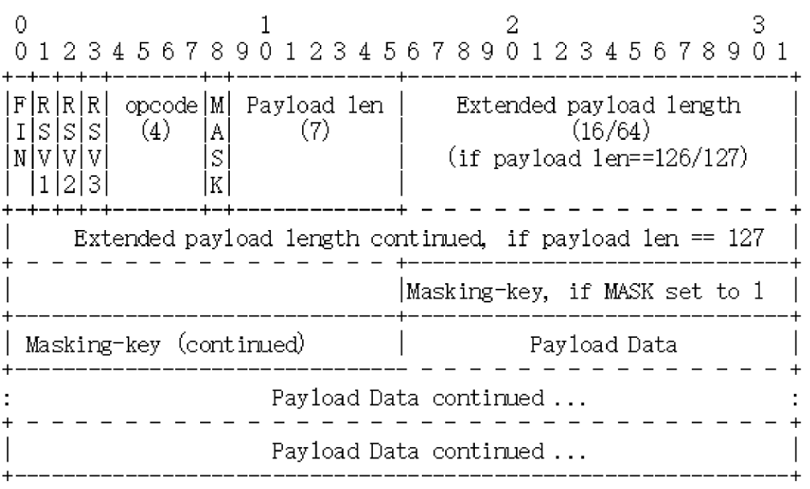

### WebSocket

#### 特点

* WebSocket 是一个真正的“全双工”的通信协议，与 TCP 一样，客户端和服务器都可以随时向对方发送数据，
* 采用二进制帧结构，算法，语义与 HTTP 完全不兼容
* 服务器发现方面，WebSocket 采用了 URI 格式：`ws` 和 `wss`，对应端口 80 和 443

#### 帧格式

*WebSocket帧结构定义*



*长度不固定，最少2个字节，最多14字节*

* 开头两个字节是必须的

  第一个字节的第一位 `FIN` 是消息结束的标志位，相当于 HTTP/2 里的 `END_STREAM`，表示数据发送完毕。一个消息可以拆成多个帧，接收方看到 `FIN` 后，就可以把前面的帧拼起来，组成完整的消息

* FIN 后三位是保留位，目前没有任何意义，必须是 0

* 第一个字节的后 4 位是 `Opcode`，操作码，即帧类型，1 即纯文本，2 是二进制数据，8 关闭连接，9 和 10 分别是连接保活的 PING 和 PONG

* 第二个字节后 7 位是 `Payload len`，即帧内容长度，它是一种变长编码，最少 7 位，最多 7 + 64 位，即额外增加 8 字节，一个 WebSocket 帧最大是 2^64

* Masking-key，掩码密钥，由标志位 `MASK` 决定的，如果掩码就是 4 个字节的随机数，否则就不存在

#### WebSocket 的握手

和 TCP、TLS 一样，WebSocket 也要有一个握手过程，然后才能正式收发数据。WebSocket 的握手是一个标准的 HTTP GET 请求，但要带上两个协议升级的专用头字段：

* `Connection: Upgrade`，表示要求协议升级
* `Upgrade: websocket`，表示要升级成 WebSocket 协议

为了防止普通的 HTTP 消息被意外识别成 WebSocket，握手消息还增加了两个额外的认证用头字段

* `Sec-WebSocket-key`：一个 Base64 编码的 16 字节随机数，作为简单的认证密钥
* `Sec-WebSocket-Version`：协议的版本号，当前必须 13

*websocket握手*


服务器收到 HTTP 请求报文，看到上面几个字段，就知道这是 WebSocket 的升级请求，于是就不走普通的 HTTP 处理流程，而是构造一个特殊的 `101 Switching Protocols` 响应报文，通知客户端。

WebSocket 的握手响应报文也有特殊格式，要用字段 `Sec-WebSocket-Accept` 验证客户端请求报文，同样也是为了防止误连接。流程是将请求头里的 `Sec-WebSocket-Key` 的值，加上一个专用 UUID  `258EAFA5-E914-47DA-95CA-C5AB0DC85B11`，再计算 SHA-1 摘要

```java
encode_base64(
  sha1( 
    Sec-WebSocket-Key + '258EAFA5-E914-47DA-95CA-C5AB0DC85B11' ))
```

客户端收到响应报文，就可以用同样的算法，比较值是否相等，如果相等，说明返回的报文确实是刚才握手时连接的服务器，认证成功，握手完成，后续传输数据即为 WebSocket 格式二进制帧