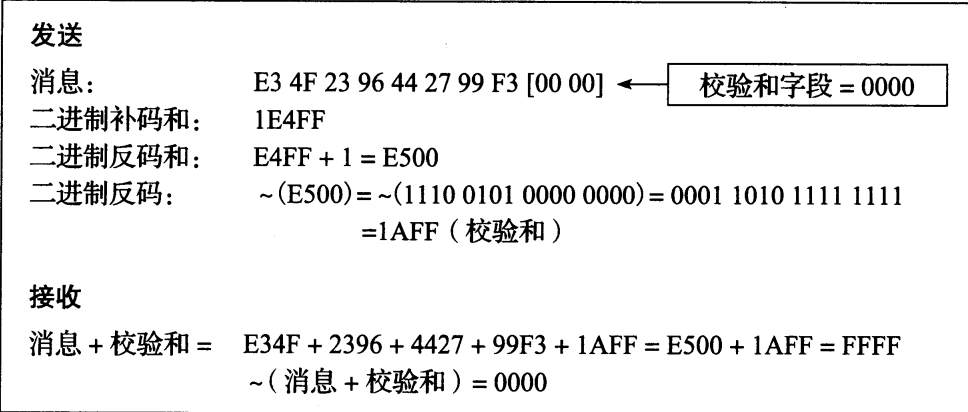
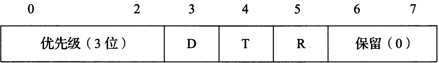
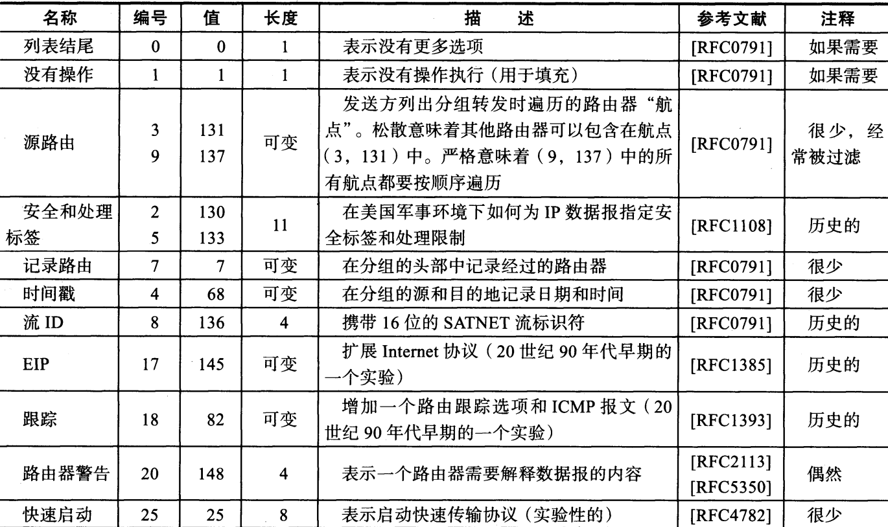
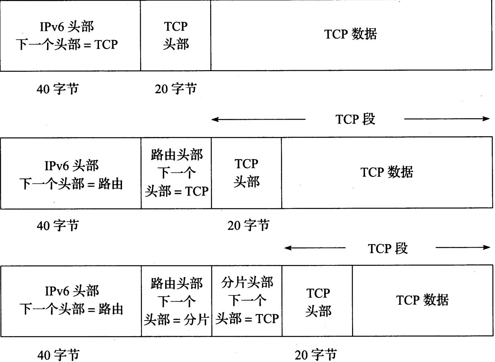
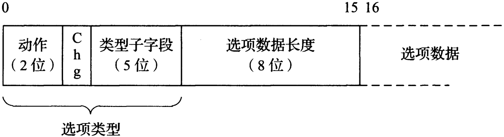
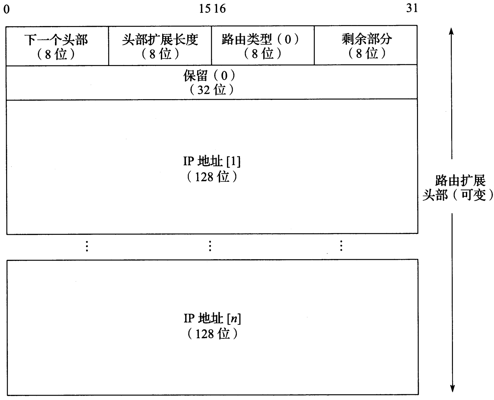
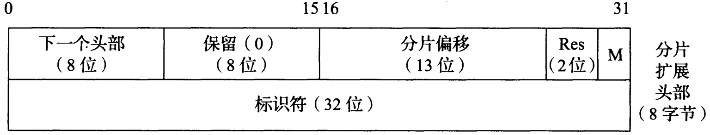

### 概述

IP 是 TCP/IP 协议族中的核心协议，所有 TCP、UDP、ICMP、IGMP 数据都通过 IP 数据报传输。IP 提供了一种尽力而为（不保证 IP 数据报能成功到达目的地，虽然 IP 不是简单丢弃所有不必要流量，但它也不对自己尝试交付的数据报提供保证，当某些错误发生时，IP 提供一个简单的错误处理方法：丢弃一些数据，通常是最后到达的数据报），无连接的数据报交付服务，任何可靠性必须由上层提供。IPv4 和 IPv6 都使用这种尽力而为的基本交付模式。

**无连接**即 IP 不维护网络单元（即路由器）中数据报相关的任何链接状态信息，每个数据报独立于其他数据报来处理。这意味着 IP 数据报可不安顺序交付。如果一个源主机向同一目的地发送两个连续的数据报，每个数据报可以独立路由，通过不同路径，并且 B 可能在 A 之前到达。IP 数据报也可能发生其他问题：它们可能在传输过程中被复制，可能改变内容从而导致错误。此外，IP 之上的一些协议（通常是 TCP）需要处理这些潜在问题，以便为应用提供无差错的交付

*IPv4数据报*

*IPv4数据报，头部大小可变，4位的 IHL字段被限制为15个32位字（60字节）。一个典型的IPv4头部包含20字节（没有选项）。第二个 32 位字的大部分用于 IPv4 分片功能，头部校验和只用于确保头部字段被正确发送到目的地，但不保护数据*

*IPv6数据报*

*IPv6头部大小固定（40字节），下一个头部字段用于说明IPv6头部之后其他扩展头部的存在和类型，它们形成了一条包括特殊扩展和处理指令的头部链，应用数据跟在这条头部链之后，通常紧跟着一个传输层头部*

### IPv4和IPv6头部

正常的 IPv4 头部大小为 20 字节，除非存在选项，IPv6 头部长度是 40 字节，但没有任何选项。它可以有扩展头部，可提供类似的功能。一个 32 位值的 4 字节按以下顺序传输：首先是 0 ～ 7 位，然后是 8 ～ 15 位，接着是 16 ～ 23 位，最后是 24 ～ 31 位。即**高位优先**字节顺序。它是 TCP/IP 头部中所有二进制整数在网络中传输时所需的字节顺序。它被称为**网络字节序**。计算机 CPU 使用其他格式二进制整数，大多数 PC 使用低位优先字节序，在传输时必须将头部值转换为网络字节序，并在接受时再转换回来

#### IP 头部字段

* 版本

  是第一个字段，只有 4 位，包含 IP 数据报的版本号：IPv4 为 4，IPv6 为 6。IPv4 与 IPv6 头部除版本字段位置相同外再无其他是一样的。因此，这两个协议不能直接互操作，主机或路由器必须分别处理 IPv4 或 IPv6（或两者，称为双栈）

* 头部长度（IHL）

  字段保存了 IPv4 头部中 32 位字的数量，包括任何选项。由于它是一个 4 位的字段，所以 IPv4 头部被限制为最多 15 个 32 位字，即 60 字节。这种限制使一些选项（如记录路由选项）当前几乎无法使用。这个字段的正常值（当没有选项时）是 5。IPv6 中不存在这个字段，其头部长度固定为 40 字节

* 服务类型（ToS）字段

  IPv6 指定了一个等效的**通信类型**字段。由于它们从来没被广泛使用，因此最终这个 8 位长的字段被分为两个部分，并由一组 RFC 和其他 RFC 重新定义。目前，前 6 位为**区分服务字段（DS字段）**，后 2 位是**显式拥塞通知（ECN）**字段或指示位。现在这些 RFC 适用于 IPv4 和 IPv6。这些字段被用于数据报转发时的特殊处理

* 总长度

  是 IPv4 数据报的总长度（以字节为单位）。通过这个字段和 IHL 字段，可以知道数据报的数据部分从哪里开始，以及它的长度。由于它是一个 16 位的字段，所以 IPv4 数据报的最大长度（包括头部）为 65535 字节。由于一些携带 IPv4 数据报的低层协议不能（精确）表达自己封装的数据报大小，所以需要在头部中给出总长度字段。

  尽管可发送一个 65535 字节的 IP 数据报，但大多数链路层（如以太网）不能携带这么大的数据，除非将它拆分成更小的片。另外主机不需要接收大于 576 字节的 IPv4 数据报（在 IPv6 中，主机需要能处理所连接链路 MTU 大小的数据报，而最小链路 MTU 为 1280 字节）。很多使用 UDP 协议传输数据的应用程序，限制为使用 512 字节大小的数据，以避免 576 字节的 IPv4 限制。TCP 根据额外信息选择自己的数据报大小

  当一个 IPv4 数据报为分为多个更小的分片时，每个分片自身仍是一个独立的 IP 数据报，总长度字段反映具体的分片长度。IPv6 头部不支持分片，其长度可由**负载长度**字段获得。这个字段提供 IPv6 数据报长度，不包括头部长度，但扩展头部包括在**负载长度**中。对于 IPv4，这个 16 位的字段限制其最大值为 65535。对于 IPv6，**负载**长度被限制为 64 KB，而不是整个数据报。IPv6 还支持一个**超长数据报**选项，它在理论上提供了可能性，即单个分组的有效载荷可达到 4 GB。

* 标识

  标识由 IPv4 主机发送的数据报，为了避免将一个数据报分片和其他数据报分片混淆，发送主机通常在每次（从它的一个IP地址）发送数据报时都将一个内部计数器加 + 1，并将该技术器值复制到 IPv4 标识字段。这个字段对实现分片很重要。在 IPv6 中，这个字段显示在分片扩展头部中。

* 生存期 TTL

  用于设置一个数据报可经过的路由器数量的上限。发送方将它初始化为某个值（RFC1122）建议为 64，但 128 或 255 也很多。每台路由器在转发数据报时将该值减 1。当这个字段值达到 0 时，该数据报被丢弃。并使用一个 ICMP 消息通知发送方。这可防止由于出现不希望的路由环路而导致数据报在网络中永远循环。在 IPv6 中已根据实际用途被重新命名为跳数限制

* 协议

  包含一个数字，表示数据报有效载荷部分的数据类型。最常用的值为 17（UDP）和 6（TCP）。这提供了多路分解的功能，以便 IP 协议可用于携带多种协议类型的有效载荷。虽然该字段最初仅用于指定数据报封装的传输层协议，但它现在用于识别其中封装的协议是否为一种传输层协议。其他封装也是可能的（如 IPv4-in-IPv4 值为 4）。数字分配页面给出了可能的协议字段值的正式列表。IPv6 头部中的下一个头部字段给出了 IPv4 中的协议字段，它用于指出 IPv6 头部之后的头部类型。这个字段可能包含由 IPv4 协议字段定义的任何值，或 IPv6 扩展头部的相关值

* 头部校验和

  仅计算 IPv4 头部。IP 协议不检查 IPv4 数据报有效载荷的正确性。为了确保 IP 数据报的有效载荷部分已正确传输，其他协议必须通过自己的数据完整性检验机制来检测重要数据。封装在 IP 中的几乎所有协议（ICMP、IGMP、UDP、TCP）在自己头部中都有一个涵盖其头部和数据的校验和，也涵盖它们认为重要的 IP 头部的某些部分。IPv6 头部没有任何校验和字段。

  当一个 IPv4 数据报经过一台路由器时，TTL 字段减少 1 带来的结果是其头部的校验和必须改变。

#### Internet 校验和

Internet 校验和是一个 16 位的数字和，它能以相当高的概率确定接收的消息或其中的部分内容是否与发送的相匹配。Internet 校验和与循环冗余校验（CRC）不同，后者提供了更强的保护功能。为了给输出的数据报计算 IPv4 头部校验和，首先将数据报的校验和字段值设置为 0.然后，对头部（整个头部被认为是一个16位字的序列）计算16位二进制反码和。这个 16 位二进制反码和被存储在校验和字段。二进制反码加法可通过“循环进位（end-rund-carry）加法“实现：当使用传统（二进制补码）加法产生一个进位时，这个进位以二进制值 1 加在高位。

*计算校验和*

*Internet校验和是一个被校验数据（如果被计算的字节数为奇数，用 0 填充）的 16 位反码和的反码。如果被计算数据包括一个校验和字段，该字段在进行校验和运算之前被设置为0，然后将计算出的校验和填充到该字段。为了检查一个包含校验和字段（头部，有效载荷等）的数据输入是否有效，需要对整个数据块（包括校验和字段）同样计算校验和。由于校验和字段本质上是其余数据校验和的反码，对正确接收的数据计算校验和应产生一个值0*

当一个IPv4数据报被接受时，对整个头部计算出一个校验和，包括校验和字段自身的值。假设没有错误，计算出的考验和值为 0（值 FFFF 的反码）。对于任何不正常的分组或头部，分组中的校验和字段值不为 FFFF。如果是这样，这个和（在发送方的最后一次反码运算之前）将为 0。通过反码加法得到的和不能永远为 0，除非所有字节都是 0，这是任何合法 IPv4 头部中都不可能出现。当发现一个头部出错（计算的校验和不为 0）时，IPv4 实现将丢弃接收到的数据报。但是，不会生成差错信息。更高层以某种方式检测丢失的数据报，并在必要时重新传输。

#### DS字段和 ECN（ToS字节或IPv6流量类别）

IP 头部的 DS 是区分服务字段，**区分服务**（DiffServ）是一个框架和一组标准，用于支持 Internet 上不同类型的服务（即不只是尽力而为服务）。IP 数据报以某种方式（通过预定义模式设置某些位）被标记，使它们的转发不同于其他数据报。这样做可能导致网络中排队延时的增加和减少，以及出现其他特殊效果。DS 字段中的数字称为**区分服务代码点（DSCP）**，代码点即预定义的具有特定含义的位。在通常情况下，如果数据报拥有一个分配的 DSCP，它在通过网络基础设施交付过程中会保持不变。但是，某些策略可能导致一个数据报中的 DSCP 在交付过程中改变

当通过一台具有内部排队流量的路由器时，头部中的 2 位 ECN 位用于为数据报标记**拥塞标识符**。一台持续拥塞的具有 ECN 感知能力的路由器在转发分组时会设置这两位。这种功能的设计思路是，当一个被标记的分组被目的节点接受时，有些协议（如TCP）会发现分组被标记并将这种情况通知发送方，发送方随后会降低发送速度，这样可在路由器因过载而被迫丢弃流量之前缓解拥塞。这种机制是避免或处理网络拥塞的方法之一。DS 字段和 ECN 字段并不密切相关，但它们被用作代替一切 **IPv4 服务类型和 IPv6 流量类别**字段，

尽管原来的 ToS 和流量类别字段没有得到广泛支持，但 DS 字段结构仍然提供兼容。

*服务类型ToS字段和流量类别字段结构*

*优先级子字段用于表示哪些分组具有更高优先级（较大的值意味着更高的优先级，范围 000 常规 - 111 网络控制）D、T、R分别表示延时、吞吐量、可靠性，如果这些字段为 1，分别对应于低延时、高吞吐量、高可靠性*

6 位 DS 字段用于保存 DSCP，提供对 64 个代码点的支持，特定 DSCP 值可通知路由器对接收的数据报进行转发或特殊处理。不同类型的转发处理表示为**每跳行为（PHB）**，因此 DSCP 值可有效通知路由器那种 PHB 被应用于数据报。DSCP 的默认值通常为 0，对应于常规的尽力而为的 Internet 流量。

**加速转发（EF）**提供了非拥塞的网络服务，EF 流量应享受较低的延时、抖动、丢包率。EF 流量要求路由器的输出速率至少比输入速率达。在一台路由器的队列中，EF 流量仅排在其他 EF 流量之后

#### IP 选项

IP 支持一些可供数据报选择的选项。由于 IPv4 头部大小的限制以及相关的安全问题，在 IPv6 中，大部分选项已被删除或改变，不再是 IPv6 基本头部的一部分，而被放在 IPv6 头部之后的一个或多个扩展头部中。IP 路由器接收到一个包含选项的数据报，通常需要对该数据报进行特殊处理。在某些情况下，尽管 IPv6 路由器可以处理扩展头部，但很多头部被设计为仅由终端主机处理。在有些路由器中，带选项或扩展的数据报不会像普通数据报那样被快速转发。

选项的方位总是以 32 位为界。如果有必要，数值 0 作为填充字节被添加。这确保 IPv4 头部始终是 32 为的倍数（IHL 字段的要求）。如果选项存在，它在 IPv4 分组中紧跟在基本 IPv4 头部之后。选项由一个 8 位的类型字段标识。这个字段被细分为 3 个子字段：复制（1 位）、类别（2 位）和编号（5 位）。选项 0 和 1 的长度是 1 字节，多数的其他选项的长度可变。可变选项包括 1 字节的类别标识符、1 字节的长度以及选项自身

*IP头部选项*

### IPv6 扩展头部

在 IPv6 中，那些由 IPv4 选项提供的特殊功能，通过在 IPv6 头部之后增加扩展头部实现。IPv4 路由和时间戳功能都采用这种方式，其他功能（如分片和超大分组）很少在 IPv6 中使用（但仍需要），因此没有为它们在 IPv6 头部分配相应的位，基于这种设计，IPv6 头部固定位 40 字节，扩展头部仅在需要时添加。在选择 IPv6 头部为固定大小时，要求扩展头部仅由终端主机（仅有一个例外）处理，IPv6 设计者简化了高性能路由器的设计和实现，这是因为 IPv6 路由器处理分组所需的命令比 IPv4 简单。实际上，分组处理性能受很多因素影响，包括协议复杂性、路由器硬件和软件功能，以及流量负载。

扩展头部和更高层协议头部与 IPv6 头部链接起来构成级联的头部。每个头部中的下一个头部字段表示紧跟着的头部类型，可能是一个 IPv6 扩展头部或其他类型。

*IPv6头部链接起来构成级联头部*

*IPv6头部使用下一个头部字段形成一个链，链中的头部可以是 IPv6 扩展头部或传输层头部，IPv6 头部出现在数据报的开头，并且长度始终为 40 字节*

*IPv6下一个头部字段值可能表示扩展头部或其他协议头部*

|        头部类型        | 顺序 |  值  |
| :--------------------: | :--: | :--: |
|        IPv6头部        |  1   |  41  |
|   逐跳选项（HOPOPT）   |  2   |  0   |
|       目的地选项       | 3，8 |  60  |
|          路由          |  4   |  43  |
|          分片          |  5   |  44  |
|  封装安全载荷（ESP）   |  7   |  50  |
|       认证（AH）       |  6   |  51  |
|     移动（MIPv6）      |  9   | 135  |
| （无--没有下一个头部） | 最后 |  59  |
|         ICMPv6         | 最后 |  58  |
|          UDP           | 最后 |  17  |
|          TCP           | 最后 |  6   |
|      各种高层协议      | 最后 | ---  |

  IPv6 扩展头部机制将一些功能（路由和分片）与选项加以区分。除了“逐跳选项”的位置之外（它是强制性的），扩展头部的顺序是建议性的，因此一个 IPv6 实现必须按接收的顺序处理扩展头部。只有“目的地选项”头部可以使用两次，第一次是指出包含在 IPv6 头部中的目的 IPv6 地址，第二次（位置 8）是关于数据报的最终目的地。在某些情况下（如使用路由头部），当数据报被转发到最终目的地时，IPv6 头部中的目的 IP 地址字段将会改变

#### IPv6 选项

相对于 IPv4，IPv6 提供了一种更灵活和可扩展的方式，将扩展和选项相结合。由于 IPv4 头部空间限制，那些来自 IPv4 的选项已停止使用，而 IPv6 可变长度的扩展头部或编码在特殊扩展头部中的选项可适应当前更大的 Internet。如果选项存在，可放入**逐跳选项**（与一个数据报传输路径上的每个路由器相关）或目的地选项（仅与接收方相关）逐跳选项是唯一由分组经过的每个路由器处理的选项，逐跳选项和目的地选项的编码格式一样。逐跳选项和目的地选项头部的出现可以超过一次。这些选项均被编码为**类型 - 长度 - 值**集合

*选项结构*

*逐跳选项和目的地选项编码为 TLV 集合，第一字节给出了选项类型，包括一些子字段，在选项没被识别时指示一个IPv6节点如何动作，以及在数据报转发时选项数据是否改变。选项数据长度字段给出了选项数据的字节长度*

TLV 结构，它的长度为 2 字节，后面是可变长度的数据字节。第一字节表示选项类型，其中包括 3 个子字段。当 5 位的类型子字段无法由选项识别时，第一个子字段给出了一个 IPv6 节点尝试执行的动作：

一个 IPv6 的 TLV 选项类型的 2 个高序位，表示如果这个没有被识别，一个 IPv6 节点是转发还是丢弃该数据报，以及是否向发送方返回一个消息，提示这个数据报的处理结果：00 跳过选项，继续处理，01 丢弃这个数据报（沉默），10 丢弃这个数据报，并向源地址发送一个 ICMPv6 参数问题消息，11 与 10 相同，但仅在分组的目的地不是组播时，发送这个 ICMPv6 消息。

如果一个发往组播目的地的数据报中包括一个未知选项，那么大量节点将生成返回源节点的流量。这可通过将动作子字段设置为 11 来避免。动作子字段的灵活性在开发新的选项时是有用的。一个新的选项可携带在一个数据报中，并被那些无法理解它的路由器所忽略，这样有助于促进新选项的增量部署。当选项数据可能在数据报转发过程中改变时，改变位字段设置为 1。以下选项已被 IPv6 定义：

IPv6 选项携带在逐跳（H）选项或目的地（D）选项扩展头部中。选项类型字段包含来自“类型”列以及动作和改变子字段中的二进制值。“长度”列包含来自一些选项数据长度字节中的值。填充 1 是唯一没有该字节的选项

|    选项名    | 头部 | 动作 | 改变 | 类型 | 长度 |
| :----------: | :--: | :--: | :--: | :--: | :--: |
|    填充 1    |  HD  |  00  |  0   |  0   | N/A  |
|    填充 N    |  HD  |  00  |  0   |  1   | 可变 |
| 超大有效载荷 |  H   |  11  |  0   | 194  |  4   |
| 隧道封装限制 |  D   |  00  |  0   |  4   |  4   |
|  路由器警告  |  H   |  00  |  0   |  5   |  4   |
|   快速启动   |  H   |  00  |  1   |  6   |  8   |
|   CALIPSO    |  H   |  00  |  0   |  7   |  8+  |
|   家乡地址   |  D   |  11  |  0   | 201  |  16  |

* 填充 1 和填充 N

  由于 IPv6 选项需要与 8 字节的偏移量对齐，因此较小的选项用 0 填充到长度为 8 字节。这里有两个填充选项，分别为填充 1 和填充 N。填充 1 选项（类型 0）是唯一缺少长度字段和值字段的选项。它仅有 1 字节长，取值为 0。填充 N 选项（类型 1）向头部的选项区域填充 2 字节或更多字节，使用上表格式。对于 n 个填充字节，选项数据长度字段包括的值为（n - 2）

* IPv6 超大有效载荷

  在某些 TCP/IP 网络中，由于正常的 64KB 的 IP 数据报大小限制，在传输大量数据时会导致不必要的开销，IPv6 超大有效载荷选项指定了一种有效载荷大于 65535 字节的 IPv6 数据报，即超大报文。这个选项无法由 MTU 小于 64KB 的链路连接的节点来实现。超大有效载荷选项提供了一个 32 位的字段，用于携带有效载荷在 65535 ～ 4294967295 字节之间的数据报。当一个用于传输的超大报文形成时，其正常负载长度字段被设置为 0。TCP 协议使用负载长度字段，计算 Internet 校验和算法得到的校验和。当使用超大有效载荷选项时，TCP 必须使用来自选项的长度值，而不是基本头部中的长度字段。

* 隧道封装限制

  隧道是将一个协议封装在另一个协议中。隧道可用于形成虚拟的覆盖网络，在覆盖网络中，一个网络可作为另一个 IP 的链路层使用，隧道可以嵌套，一条隧道中的数据报本身也可采用递归方式封装在另一条隧道中。在发送一个是 IP 数据报时，发送者通常无法控制最终用于封装的隧道层次。发送者可使用这个选项设置一个限制。一台路由器打算将一个 IPv6 数据报封装在一条隧道中，它首先检查隧道封装限制选项是否存在并置位。如果这个限制选项的值为 0，该数据报被丢弃，并将一个 `ICMPv6` 参数问题消息发送到数据报源端（即之前的隧道入口点）。如果这个限制选项的值不为 0，该数据报可进行隧道封装，但新形成（封装）的 IPv6 数据报必须包括一个隧道封装限制选项，其值比封装之前的数据报中封装限制选项值减 1。实际上，封装限制行动类似于 IPv4 的 TTL 和 IPv6 的跳数限制，只不过采用隧道封装层次代替转发跳步

* 路由器警告

  路由器警告选项指出数据报包含需要路由器处理的信息。它与 IPv4 的路由器警告选项的目的相同。

* 快速启动

  快速启动（QS）选项和定义 TCP/IP 实验性“快速启动”程序配合使用。它适用于 IPv4 和 IPv6，但目前建议仅用于专用网络，而不是全球性的 Internet。选项包括发送者需要的比特/秒为单位的传输速率的编码值、QS TTL 值和一些额外信息。如果沿途的路由器认为可以接受所需的速率，在这种情况下它们将递减 QS TTL，并在转发数据报时保存所需的速率不变。如果路由器不同意（即其支持的速率较低），它将该速率减少到一个可接受的速率。如果路由器不能识别 QS 选项，它将不递减 QS TTL。接收方将向发送方提供反馈，包括接收到的数据报的 IPv4 TTL 或 IPv6 跳数限制字段和自己的 QS TTL 之间的差异，以及获得的速率可能被沿途的路由器所调整。这个信息被发送方用于确定发送速率（否则可能超出 TCP 使用的速率）。对 TTL 值进行比较的目的是沿途每台路由器参与 QS 谈判。如果发现任何路由器递减 IPv4 TTL（或 IPv6 跳数限制）字段，但没有修改 QS TTL 值，则说明它没有启用 QS

* CALIPSO

  这个选项用于在某些专用网络中支持通用体系结构标签 IPv6 安全选项（CALIPSO）。它提供了一种为数据报做标记的方法，包括一个安全级别标识符和一些额外的信息。它用于多级网络环境，其中所有数据的安全级别必须以某种形式的标签注明

* 家乡地址

  当使用 IPv6 移动选项时，这个选项保存发送数据报的 IPv6 节点的”家乡“地址。移动 IP 规定了 IP 节点的一系列处理过程，这些节点可能改变自己的网络接入点，同时不会断开自己的高层网络连接。这里存在一个节点的”家乡“的概念，它来自其典型位置的地址前缀。当远离家乡漫游时，通常为该节点分配一个不同的 IP 地址。该选项允许这个节点提供自己正常的家乡地址，以及它在漫游时的新地址（通常是临时分配）。当其他 IPv6 节点需要与移动节点通信时，它可以使用该节点的家乡地址。如果家乡地址选项存在，包含它的目的地选项头部必须出现在路由头部之后，并且在分片、认证和 ESP 头部之前（如果这些头部也存在）

#### 路由头部

IPv6 路由头部为发送方提供了一种 IPv6 数据报控制机制，以控制（至少部分控制）数据报通过网络的路径。路由扩展头部有两个不同版本，分别为类型 0（RH0）和类型 2（RH2）。RH0 出于安全考虑已被否决，RH2 倍定义为与移动 IP 共同使用。

*IPv6路由头部扩展RH0头部*

​	*涵盖了IPv4的宽松和严格的源路由和记录路由选项。它在数据报转发时由发送方构造，其中包括转发路径上的IPv6节点地址。每个地址可指定为一个宽松或严格的地址。一个严格的地址必须经过一个IPv6跳步到达，而一个宽松的地址可能经过一个或多个其他跳步到达。在IPv6基本头部中，目的IP地址字段修改为包含数据报转发的下一个转发地址*

对于RH0，IPv6**路由类型**标识符为0；对于RH2标识符为2。**剩余部分**字段指出还有多个段路由需要处理，即中间节点数。它是一个 32 位的从**保留**字段开始的地址块，由发送方设置为 0，并由接收方忽略。在数据报转发时，这些地址并非可访问的组播 IPv6 地址。

IPv6 路由头部在转发过程中不会处理，直至目的IP地址字段中包含的地址所在的节点。这时，**剩余部分**字段用于确定来自地址向量的下一跳地址，并将该地址与 IPv6 头部中的目的 IP 地址字段交换（在经过路由头部指定的每个跳步时，IPv6 头部中的目的地址将会更新）。因此，在这个数据报转发过程中，剩余部分字段将会变得越来越小（每到达一个指定的中间节点减 1），头部中的地址列表反映转发数据报的节点地址。

出于安全方面的担心，RH0 已被废弃，它可用于增加 DoS 攻击效果，它允许在路由头部的多个位置指定相同地址。这可能导致流量在一条特定路径上两台或多台主机或路由器之间重复转发。大量的流量负载可能在网络中沿着特定路径创建，与相同路径上的其他流量竞争带宽而造成干扰。IPv6 唯一支持的路由头部时 RH2。RH2 与 RH0 基本相同，区别在于它只容纳一个地址，并且在路由类型字段中使用的值不同

#### 分片头部

分片头部用于 IPv6 源节点向目的地发送一个大于路径 MTU 的数据报。在 IPv4 中，如果数据报大小超过下一跳 MTU，任何主机或路由器可将该数据报分片，IPv4 头部中第二个 32 位字段表示分片信息。在 IPv6 中，仅数据报的发送者可以执行分片操作，在这种情况下需要添加一个分片头部。分片头部包括的信息与 IPv4 头部中的相同，只不过标识字符字段是 32 位（IPv4 为 16 位）。

*IPv6分片头部*

*IPv6分片头部包含一个32位的标识符字段，M 位字段表明该分片是否为原始数据报的最后一个分片。分片偏移字段给出了有效载荷在原始数据报中以 8 字节为单位的偏移量（与 IPv4 一致）*

保留字段和 2 位的 Res 字段都为 0，并且都会被接收方所忽略。分片偏移字段表明数据以 8 字节为单位的偏移量放置在分片头部之后。如果 M 位字段设置为 1，表示在数据报中包含更多分片，为 0 则该分片为最后一个分片。

在分片过程中，输入的数据报称为原始数据报，由两部分组成：“不可分片部分” 和 “可分片部分”。不可分片部分包括 IPv6 头部和任何在到达目的地之前需由中间节点处理的扩展头部（即路由头部之前的所有头部，如果有逐跳选项扩展头部，则是该头部之前的所有头部）；可分片部分包括数据报的其余部分（即目的选项头部、上层头部和有效载荷数据）。当原始数据报被分片后，将会产生多个分片，其中每个分片都包含一个原始数据报中不可分片部分的副本，但是需要修改每个 IPv6 头部的负载长度字段，以反映它所描述的分片的大小。在不可分片部分之后，每个新的分片都包含一个分片头部，其中包含一个分片相应的分片偏移字段，以及一个原始分组的标识符字段的副本。最后一个分片的 M 位字段置为 0。