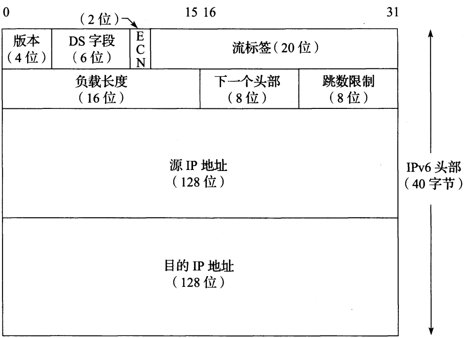

## Internet 协议

### 概述

IP 是 TCP/IP 协议族中的核心协议，所有 TCP、UDP、ICMP、IGMP 数据都通过 IP 数据报传输。IP 提供了一种尽力而为（不保证 IP 数据报能成功到达目的地，虽然 IP 不是简单丢弃所有不必要流量，但它也不对自己尝试交付的数据报提供保证，当某些错误发生时，IP 提供一个简单的错误处理方法：丢弃一些数据，通常是最后到达的数据报），无连接的数据报交付服务，任何可靠性必须由上层提供。IPv4 和 IPv6 都使用这种尽力而为的基本交付模式。

**无连接**即 IP 不维护网络单元（即路由器）中数据报相关的任何链接状态信息，每个数据报独立于其他数据报来处理。这意味着 IP 数据报可不安顺序交付。如果一个源主机向同一目的地发送两个连续的数据报，每个数据报可以独立路由，通过不同路径，并且 B 可能在 A 之前到达。IP 数据报也可能发生其他问题：它们可能在传输过程中被复制，可能改变内容从而导致错误。此外，IP 之上的一些协议（通常是 TCP）需要处理这些潜在问题，以便为应用提供无差错的交付

*IPv4数据报*

*IPv4数据报，头部大小可变，4位的 IHL字段被限制为15个32位字（60字节）。一个典型的IPv4头部包含20字节（没有选项）。第二个 32 位字的大部分用于 IPv4 分片功能，头部校验和只用于确保头部字段被正确发送到目的地，但不保护数据*

*IPv6数据报*

*IPv6头部大小固定（40字节），下一个头部字段用于说明IPv6头部之后其他扩展头部的存在和类型，它们形成了一条包括特殊扩展和处理指令的头部链，应用数据跟在这条头部链之后，通常紧跟着一个传输层头部*

### IPv4和IPv6头部

正常的 IPv4 头部大小为 20 字节，除非存在选项，IPv6 头部长度是 40 字节，但没有任何选项。它可以有扩展头部，可提供类似的功能。一个 32 位值的 4 字节按以下顺序传输：首先是 0 ～ 7 位，然后是 8 ～ 15 位，接着是 16 ～ 23 位，最后是 24 ～ 31 位。即**高位优先**字节顺序。它是 TCP/IP 头部中所有二进制整数在网络中传输时所需的字节顺序。它被称为**网络字节序**。计算机 CPU 使用其他格式二进制整数，大多数 PC 使用低位优先字节序，在传输时必须将头部值转换为网络字节序，并在接受时再转换回来

#### IP 头部字段

* 版本

  是第一个字段，只有 4 位，包含 IP 数据报的版本号：IPv4 为 4，IPv6 为 6。IPv4 与 IPv6 头部除版本字段位置相同外再无其他是一样的。因此，这两个协议不能直接互操作，主机或路由器必须分别处理 IPv4 或 IPv6（或两者，称为双栈）

* 头部长度（IHL）

  字段保存了 IPv4 头部中 32 位字的数量，包括任何选项。由于它是一个 4 位的字段，所以 IPv4 头部被限制为最多 15 个 32 位字，即 60 字节。这种限制使一些选项（如记录路由选项）当前几乎无法使用。这个字段的正常值（当没有选项时）是 5。IPv6 中不存在这个字段，其头部长度固定为 40 字节

* 服务类型（ToS）字段

  IPv6 指定了一个等效的**通信类型**字段。由于它们从来没被广泛使用，因此最终这个 8 位长的字段被分为两个部分，并由一组 RFC 和其他 RFC 重新定义。目前，前 6 位为**区分服务字段（DS字段）**，后 2 位是**显式拥塞通知（ECN）**字段或指示位。现在这些 RFC 适用于 IPv4 和 IPv6。这些字段被用于数据报转发时的特殊处理

* 总长度

  是 IPv4 数据报的总长度（以字节为单位）。通过这个字段和 IHL 字段，可以知道数据报的数据部分从哪里开始，以及它的长度。由于它是一个 16 位的字段，所以 IPv4 数据报的最大长度（包括头部）为 65535 字节。由于一些携带 IPv4 数据报的低层协议不能（精确）表达自己封装的数据报大小，所以需要在头部中给出总长度字段。

  尽管可发送一个 65535 字节的 IP 数据报，但大多数链路层（如以太网）不能携带这么大的数据，除非将它拆分成更小的片。另外主机不需要接收大于 576 字节的 IPv4 数据报（在 IPv6 中，主机需要能处理所连接链路 MTU 大小的数据报，而最小链路 MTU 为 1280 字节）。很多使用 UDP 协议传输数据的应用程序，限制为使用 512 字节大小的数据，以避免 576 字节的 IPv4 限制。TCP 根据额外信息选择自己的数据报大小

  当一个 IPv4 数据报为分为多个更小的分片时，每个分片自身仍是一个独立的 IP 数据报，总长度字段反映具体的分片长度。IPv6 头部不支持分片，其长度可由**负载长度**字段获得。这个字段提供 IPv6 数据报长度，不包括头部长度，但扩展头部包括在**负载长度**中。对于 IPv4，这个 16 位的字段限制其最大值为 65535。对于 IPv6，**负载**长度被限制为 64 KB，而不是整个数据报。IPv6 还支持一个**超长数据报**选项，它在理论上提供了可能性，即单个分组的有效载荷可达到 4 GB。

* 标识

  标识由 IPv4 主机发送的数据报，为了避免将一个数据报分片和其他数据报分片混淆，发送主机通常在每次（从它的一个IP地址）发送数据报时都将一个内部计数器加 + 1，并将该技术器值复制到 IPv4 标识字段。这个字段对实现分片很重要。在 IPv6 中，这个字段显示在分片扩展头部中。

* 生存期 TTL

  用于设置一个数据报可经过的路由器数量的上限。发送方将它初始化为某个值（RFC1122）建议为 64，但 128 或 255 也很多。每台路由器在转发数据报时将该值减 1。当这个字段值达到 0 时，该数据报被丢弃。并使用一个 ICMP 消息通知发送方。这可防止由于出现不希望的路由环路而导致数据报在网络中永远循环。在 IPv6 中已根据实际用途被重新命名为跳数限制

* 协议

  包含一个数字，表示数据报有效载荷部分的数据类型。最常用的值为 17（UDP）和 6（TCP）。这提供了多路分解的功能，以便 IP 协议可用于携带多种协议类型的有效载荷。虽然该字段最初仅用于指定数据报封装的传输层协议，但它现在用于识别其中封装的协议是否为一种传输层协议。其他封装也是可能的（如 IPv4-in-IPv4 值为 4）。数字分配页面给出了可能的协议字段值的正式列表。IPv6 头部中的下一个头部字段给出了 IPv4 中的协议字段，它用于指出 IPv6 头部之后的头部类型。这个字段可能包含由 IPv4 协议字段定义的任何值，或 IPv6 扩展头部的相关值

* 头部校验和

  仅计算 IPv4 头部。IP 协议不检查 IPv4 数据报有效载荷的正确性。为了确保 IP 数据报的有效载荷部分已正确传输，其他协议必须通过自己的数据完整性检验机制来检测重要数据。封装在 IP 中的几乎所有协议（ICMP、IGMP、UDP、TCP）在自己头部中都有一个涵盖其头部和数据的校验和，也涵盖它们认为重要的 IP 头部的某些部分。IPv6 头部没有任何校验和字段。

  当一个 IPv4 数据报经过一台路由器时，TTL 字段减少 1 带来的结果是其头部的校验和必须改变。

#### Internet 校验和

