## Internet 地址结构

### 概述

连接到 `Internet` 的每个设备至少有一个 IP 地址。基于 `TCP/IP` 协议的专用网络中使用的设备也需要 IP 地址。在任何情况下，IP 路由器实现的转发程序使用 IP 地址来识别流量去向。IP 地址也表示 流量的来源

### 表示 IP 地址

#### IPv4 地址

这些地址通常采用点分四组或点分十进制表示法，每个数字是一个非负整数，范围为 `0~255`，代表整个 IP 地址的四分之一。点分四组表示法是编写完整的 IPv4 地址（32 位非负整数）的简单方式，它使用便捷的十进制数

#### IPv6 地址

在 IPv6 中，地址的长度是 128 位，是 IPv4 地址长度的 4 倍。IPv6 地址的传统表示法是采用称为块或字段的四个十六进制数，这些块由冒号分隔。一些已取得共识的 IPv6 地址简化表示法已被标准化（RFC4291）：

* 一个块中前导的零不必书写
* 全零的块可以省略
* 在 IPv6 格式中嵌入 IPv4 地址可使用混合符号形式，紧接着 IPv4 部分的地址块的值为 `ffff`，地址的其余北方使用点分四组格式。如 `IPv6` 地址 `::ffff:10.0.0.1` 表示 IPv4 地址 `10.0.0.1`。它被称为 IPv4 映射的 IPv6 地址
* IPv6 地址的低 32 位通常采用点分四组表示法。因此，IPv6 地址 `::0102:f001` 相当于地址 `::1.2.240.1`。它被称为 IPv4 兼容的 IPv6 地址。IPv4 兼容地址与 IPv4 映射地址不同；它们只是能用类似 IPv4 地址的方式书写或由软件处理方面给人以兼容的感觉。这种地址最初用于 IPv4 和 IPv6 之间的过渡计划，但现在不再需要
* 在某些情况下（如表示一个包含地址的 URL 时），IPv6 地址中的冒号分隔符可能与其他分隔符混淆，在这种情况下，用括号字符 `[]` 包围 IPv6 地址。如 `http://[2001:0db8:85a3:1319:8a2e:0370:7344]:443/`

`[RFC4291]` 提供的灵活性造成了不必要的混淆，因为能用多种方式表示相同的 IPv6 地址。`[RFC5952]` 制定了一些规则，以缩小选择范围，同时与 `[RFC4291]` 保持兼容：

* 前导的零必须压缩（如：，`2001:0db8::0022` 变成 `2001:db8::22`）
* `::` 只能用于影响最大的地方（压缩最多的零），但并不只是针对 16 位的块。如果多个块中包含等长度的零，顺序靠前的块将被替换为 `::`
* `a~f` 的十六进制数用小写表示

### 基本的 IP 地址结构

IPv4 地址空间中有 `4294967296` 个可能的地址，而 IPv6 的地址个数为 `2-128` 个地址。由于拥有大量地址，可以方便地将地址空间划分成块，IP 地址可根据类型和大小分组。大多数 IPv4 地址块最终被细分为一个地址，用于识别连接 `Interenet` 或某些专用的内联网的计算机网络接口。这些地址称为**单播地址**，其他类型的地址包括广播、组播和任播地址，它们可能涉及多个接口，还有一些特殊用途的地址。

#### 分类寻址

当最初定义 `Internet` 地址结构时，每个单播 IP 地址都有一个网络部分，用于识别接口使用的 IP 地址在那个网络中可被发现；以及一个主机地址，用于识别由网络部分给出的网络中的特定主机。因此，地址中的一些连续位称为**网络号**，其余位称为**主机号**。当时，大多数主机只有一个网络接口，因为术语接口地址和主机地址有时交替使用

现实中的不同网络可能有不同数量的主机，每台主机都需要一个唯一的 IP 地址。一种划分方法是基于当前或预计的主机数量，将不同大小的 IP 地址空间分配给不同的站点。地址空间的划分涉及五大类。每类都基于网络中可容纳的主机数量，确定在一个 32 位的 IPv4 地址中分配给网络号和主机号的位数

*五类地址*

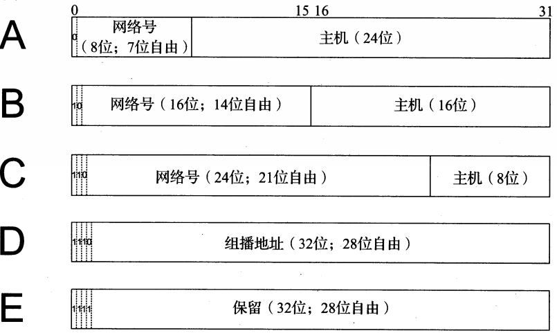

​                                                                                                                                                                                                                                                                                                                                                  IPv4 地址空间最初分为五大类。A、B、C 类用于为  `Internet` (单播地址）中的接口分配地址，以及其他一些特殊情况下使用。类由地址中的头几位来定义：0 为 A 类，10 为 B 类，110 为 C 类，D 类地址供组播使用，E 类地址保留

*分类地址空间划分*

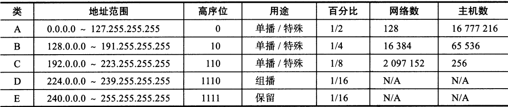

这些数字是不准确的，有几个地址通常不作为单播地址使用。特别是，地址块中的第一个和最后一个地址通常不使用。

#### 子网寻址

Internet 发展初期首先遇到一个困难，那就是很难为接入 `Internet` 的新网段分配一个新的网络号。80 年代后，随着局域网（LAN）的发展和增加，这个问题变得更棘手。为了解决这个问题，人们想到一个方式，在一个站点接入 Internet 后为其分配一个网络号，然后由站点管理员进一步划分本地的子网数。在不改变 Internet 核心路由基础设施的情况下解决这个问题。

实现这个想法需要改变一个 IP 地址的网络部分和主机部分的限制，但这样做只是针对一个站点自身而言；Internet 其余部分将只能“看到"传统的 A 类、B 类、C 类部分。支持此功能的方法称为**子网寻址**。通过子网寻址，一个站点被分配一个 A，B，C 类的网路号，保留一些剩余主机号进一步用于站点内分配。该站点可能将基础地址中的主机部分进一步划分为一个子网号和一个主机号。从本质上来说，子网寻址为 IP 地址结构增加了一个额外部分，但它没有为地址增加长度。因此，一个站点管理员能在子网数和每个子网中预期的主机数之间折中，同时不需要与其他站点协调

子网寻址提供额外灵活性的代价是增加成本。由于当前的子网字段和主机字段的定义是由站点指定的（不是由网络号分类决定），一个站点中所有路由器和主机需要一种新的方式，以确定地址中的子网部分和其他的主机部分。在出现子网之前，这个信息可直接从一个网络号中获得，只需知道是 A 类、B 类 或 C 类地址（由地址的前几位表示）

*B类地址划分子网*

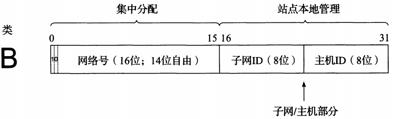

一个B类地址被划分子网，它使用 8 位作为子网 ID，提供 256 个子网和每个子网中 254 台主机（当前每个子网的第一个和最后一个地址无效，即从整个分配范围中除去第一个和最后一个地址），这种划分可由网络管理员改变。该站点将每个地址的前 16 位固定为某些特定号码，这是由于这些位已被分配给核心机构。后 16 为（仅用于在无子网的 B 类网络中创建主机号）限制可以由站点的网络管理员按需分配。只有划分子网的网络中的主机和路由器知道子网结构。在需要进行子网寻址之前，Internet 其他部分仍将它作为站点相关的地址来看待。

*子网掩码工作*

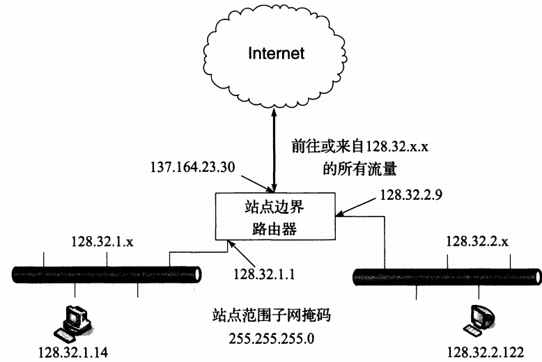

某个站点被分配一个典型的 B 类网路号 128.32。网络管理员决定用于站点范围内的子网掩码为 `255.255.255.0`，提供 256 个子网，每个子网可容纳 256 - 2 = 254 台主机。同一子网中每台主机的 IPv4 地址拥有相同子网号。左侧的局域网段中主机的 IPv4 地址开始于 128.32.1，右侧的所有主机开始于 `128.32.2`

在上图中，显示了一个虚拟的站点，使用一个边界路由器（即 `Internet` 的一个连接点）连接 `Internet` 和两个内部局域网。x 的值可以是 `[0, 255]`，范围内的任意值。每个以太网是一个 IPv4 子网，整体分配为 B 类地址的网路号 `128.32`。Internet 中其他站点要访问这个站点，目的地址以 `128.32` 开始的所有流量直接由 Internet 路由系统交给边界路由器（特别是其接口的 IPv4 地址 137.164.23.30）。在这点上，边界路由器必须区分 `128.32` 网络中的不同子网。特别是，它必须能区分和分离目的地址为 `128.32.1.x` 和目的地址为 `128.32.2.x` 的流量。这些地址分别表示子网号 1 和 2，它们都采用 `128.32` 的 B 类网路号。为了做到这点，路由器必须知道在地址中如何找到子网 ID。这可通过一个配置参数实现。

#### 子网掩码

子网掩码是由**一台主机或路由器使用的分配位，以确定如何从一台主机对应 IP 地址中获得网络和子网信息**。IP 子网掩码与对应的 IP 地址长度相同（IPv4 为 32 位，IPv6 为 128 位）它们通常在一台主机或路由器中以 IP 地址相同的方式配置，既可以是静态的（通常是路由器），也可以使用动态配置（动态主机配置协议（DHCP））。对于 IPv4 ，子网掩码以 IPv4 地址相同的方式（点分十进制）编写。当前子网掩码由一些 1 后跟一些 0 构成。这样安排，就可以用容易记的格式表示掩码，只需给出一些连续位的 1 （左起）的掩码。这种格式是当前最常见的格式，有时也被称为**前缀长度**

*各种格式的 IPv4 子网掩码的例子*

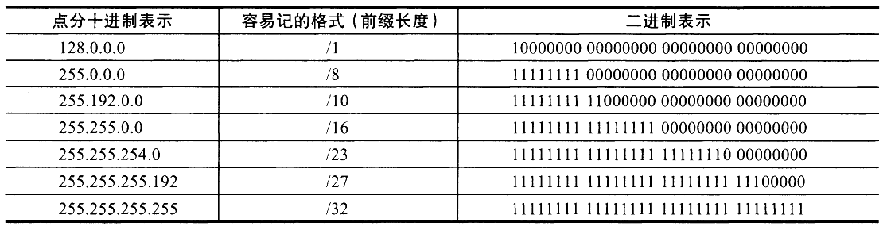

*各种格式的 IPv4 子网掩码的例子*

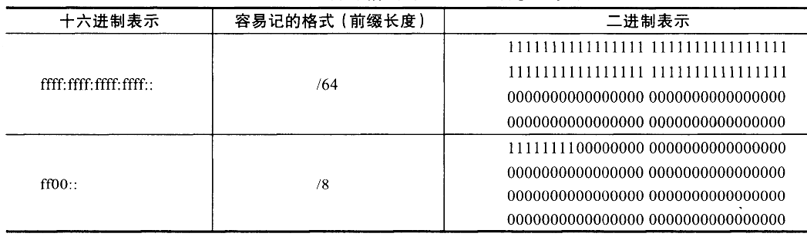

**子网掩码由路由器和主机使用，以确定一个 IP 地址的网络/子网部分的结束和主机部分的开始。子网掩码中的一位设为 1 表示一个 IP 地址的对应位与一个地址的网络/子网部分对应位相结合，并将结果作为转发数据报的基础。相反，子网掩码中的一位设为 0，表示一个 IP 地址的对应位作为主机 ID 的一部分。**

*子网掩码为255.255.255.0 时处理IPv4 地址 128.32.1.14*

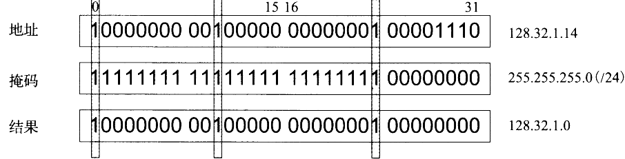

IP 地址中的每位与子网掩码中的对应位进行与运算。**Internet 路由系统其余部分不需要子网掩码的知识，因为站点之外的路由器做出路由决策只基于地址的网路号部分，并不需要网络/子网或主机部分。因此子网掩码纯粹时站点内部的局部问题**

#### 可变长度子网掩码

在同一站点的不同部分，可将不同长度的子网掩码应用于相同的网路号。虽然这样增加了地址配置管理的复杂性，但也提高了子网结构的灵活性，由于不同子网可容纳不同数量的主机。目前，大多数主机、路由器和路由协议支持可变长度子网掩码（VLSM）。

*可变长度子网掩码*

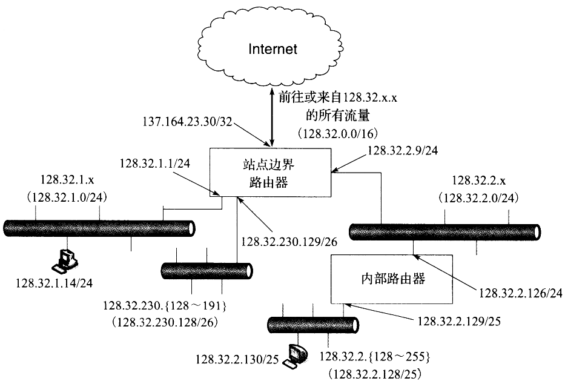

三个不同的子网掩码被用于站点中的子网 `128.32.0.0/16，/24，25，26`。每个子网可提供不同数量的主机。主机数受 IP 地址中没有被网络/子网号使用的剩余位限制。对于 IPv4 和 /24 前缀，允许有 32 - 24 = 8 （256 台主机）；对于 `/25` 有 （128 台），`/26` 有 （64 台）。主机和路由器的每个接口都需要用 IP 地址和子网掩码来描述，但掩码决定了网络拓扑的不同。基于路由器中运行的动态路由协议（如：OSPF，IS-IS，RIPv2），流量能正确地在同一站点中的主机之间流动，以及通过 `Internet` 前往或来自外部站点

有一个常见情况，即一个子网中只包含两台主机。当路由器之间被一条点到点链路连接，则每个端点都需要分配一个 IP 地址，常见做法是 IPv4 使用 `/31` 为前缀，目前也有建议 IPv6 使用 `/127` 为前缀

#### 广播地址

**在每个 IPv4 子网中，一个特殊地址被保留作为子网广播地址。子网广播地址通过将 IPv4 地址的网络/子网部分设置为适当值，以及主机部分的所有位设置为 1 而形成**。子网广播地址的构建方式为：对子网掩码取反，并于子网中任意主机地址（或等值的网络/子网前缀）进行按位或运算。

*IPv4 地址 128.32.1.14 和子网掩码 255.255.255.0 获取广播地址*

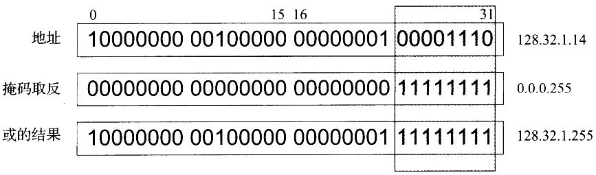

  子网广播地址由子网掩码首先取反，然后与 IPv4 地址进行或运算构建而成。在这种情况下，一个 `/24` 的子网掩码，剩余的 `32 - 24 = 8` 位设置为 1，得到一个十进制值 255 和子网广播地址 `128.32.1.255`

使用这种地址作为目的地的数据报，也被称为定向广播。理论上，这种广播可作为一个单独的数据报通过 `Internet` 路由直至到达目标子网，再作为一组广播数据报发送给子网中所有主机。即可以形成一个目的 IPv4 地址为 `128.32.255.255` 的数据报，并且通过连接网络将它发送到 Internet，这是，该数据报将发送给目标站点中的所有主机（定向广播，从安全的角度来看，它们至今在 `Internet` 中仍被禁用。路由器现在默认禁止转发定向广播，甚至完全省略支持能力）

除了子网广播地址，特殊用途地址 `255.255.255.255` 被保留为本地网络广播（也称为有限广播）它根本不会被路由器转发。虽然路由器可能不转发广播，但子网广播和连接在同一网络中的计算机的本地网络广播将工作，除非被终端主机明确禁用。这种广播不需要路由器；如果有的话，链路层的广播机制用于支持它们。广播地址通常与某些协议一起使用（如 UDP/IP，ICMP），因为这些协议不涉及 `TCP/IP` 那样的双方会话。IPv6 没有任何广播地址；广播地址可用于 IPv4 中，而 IPv6 仅使用组播地址

#### IPv6 地址和接口标识符

除了比 IPv4 地址长 4 被这个因素，IPv6 地址还有一些额外的特点。IPv6 地址使用特殊前缀表示一个地址范围。一个 IPv6 地址范围是指它可用的网络规模。有关范围的重要例子包括节点本地（只用于同一计算机中同行），链路本地（只用于同一网络链路或 IPv6 前缀中的节点）或全球性（Internet范围）。在 IPv6 中，大部分节点通常在同一网络接口上使用多个地址。虽然 IPv4 也支持这样做，但是并不常见。一个 IPv6 节点中需要一组地址，包括组播地址

链路本地 IPv6 地址（和一些全球性 IPv6 地址）使用接口标识符（IID）作为一个单播 IPv6 地址的分配基础。除了地址是以二进制值 000 开始外，IID 在所有情况下都作为一个 IPv6 地址的低序位，这样它们必须在同一网络中有唯一前缀。IID 长度通常是 64 位，并直接由一个网络接口相关的链路层 MAC 地址形成，该地址使用修改的 EUI-64 格式或者由其他进程随机提供的值形成，以提供可防范地址跟踪的某种程度的隐私保护

在 IEEE 标准中，EUI 表示扩展唯一标识符。EUI-64 标识符开始于一个 24 位的组织唯一标识符，接着是一个由组织分配的 40 位扩展标识符，它由前面 24 位识别。OUI 由 IEEE 注册权威结构来维护和分配。EUI 可能是统一管理，本地管理的。在 `Internet` 环境下，这种地址通常是统一管理的。多年以来，很多 IEEE 标准兼容的网络接口（如以太网）在使用短格式的地址（48位的 EUI）。EUI-48 和 EUI-64 格式之间的显著区别是它们的长度

*EUI-48 和 EUI-64 格式*

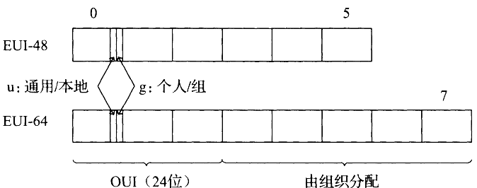

OUI 的长度是 24 位，并占据 EUI-48 和 EUI-64 地址的前三字节。这些地址的第一个字节的低两位分别是 u 位和 g 位。当 u 位被设置时，表示该地址是本地管理。当 g 位被设置时，表示该地址时一组或组播类型的地址。

一个 EUI-64 地址可以由 EUI-48 地址形成，将 EUI-48 地址的 24 位 OUI 值复制到 EUI-64 地址，并将 EUI-64 地址的第 4 和第 5 个字节的 16 位替换为 `1111111111111110` (十六进制 FFFE)，然后复制由组织分配的剩余位。

### 聚合

通过取消分类结构的 IP 地址，能分配各种尺寸的 IP 地址块。但是，这样并没有帮助较少路由表条目数。一条路由表条码告诉一个路由器向哪里发送流量。从本质上来说，路由器检查每个到达的数据报中的目的 IP 地址，找到一条匹配的路由表条目，并从该条目中提取数据报的“下一跳”。

在 Internet 环境中，可采用分层路由思想以一种特定方式减少 Internet 路由条目数。这通过一个称为路由聚合的过程来实现。通过将相邻的多个 IP 前缀合并成一个短前缀（称为一个聚合或汇聚），可以覆盖更多地址空间。

*IP聚合过程*

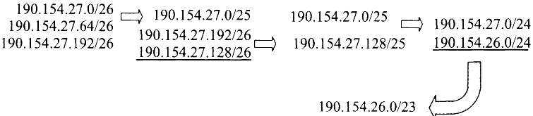

*箭头表示将两个地址前缀聚合为一个，带下划线的前缀时每一步的结果。第一步 `190.154.27.0/26` 和 `!90.154.27.64` 可以聚合，这是由于它们数值相邻，但是 `190.154.27.192/26`不能聚合。通过与 `190.154.27.128/26` 相加，它们可经过两步聚合形成 `190.154.27.0/24`。最后，通过与相邻的 `190.154.26.0/24` 相加，生成聚合结果 `190.154.26.0/23`*

### 特殊用途地址

IPv4 和 IPv6 地址空间中都包括几个地址范围，它们被用于特殊用途（因此不能用于单播地址分配）

##### IPv4 特殊用途地址

* `0.0.0.0/8` 本地网络中的主机。仅作为源 IP 地址使用
* `10.0.0.0/8` 专用网络（内联网）的地址。这种地址不会出现在公共 Internet 中
* `127.0.0.0/8` `Internet` 主机回送地址（同一计算机）通常只用 `127.0.0.1`
* `169.254.0.0/16` 链路本地地址，只用于一条链路，通常自动分配
* `172.16.0.0/12` 专用网络（内联网）的地址，这种地址不会出现在公共 `Internet` 中
* `192.0.0.0/24` IETF 协议分配（IANA保留）
* `192.0.2.0/24` 批准用于文档中的 TEST-net-1 地址。这种地址不会出现在公共 Internet 中
* `192.88.99.0/24` 用于 6to4 中断（任播地址）
* `192.168.0.0/16` 专用网络（内联网）的地址。这种地址不会出现在公共 `Internet` 中
* `192.18.0.0/15` 用于基准和性能测试
* `198.51.100.0/24` TEST-net-2 地址。被批准用于文档中
* `203.0.113.0/24` TEST-net-3 地址。被批准用于文档中
* `224.0.0.0/4` IPv4 组播地址（即以前的 D 类），仅作为目的 IP 地址使用
* `240.0.0.0/4` 保留空间（以前的 D 类），除了 `255.255.255.255`
* `255.255.255.255/32` 本地网络（受限的）广播地址

##### IPv6 特殊用途地址

* `::/0` 默认路由条目，不用于寻址
* `::/128` 未指定地址，可作为源 IP 地址使用
* `::1/128` IPv6 主机回送地址，不用于发送出本地主机的数据报中
* `::ffff:0:0/96` IPv4 映射地址。这种地址不会出现在分组头部，只用于内部主机
* `::{ipv4-address}/96` IPv4 兼容地址。已过时，未使用
* `2001::/32` `Teredo` 地址
* `2001:10::/28` ORCHI（覆盖可路由加密散列标识符）。这种地址不会出现在公共 Internet 中
* `2001:db8::/32` 用于文档和实例的地址范围。这种地址不会出现在公共 `Internet` 中
* `2002::/16` `6to4` 隧道中继的 `6to4` 地址
* `3ffe::/16` 用于 `6bone` 实验，已过时，未使用
* `5f00::/16` 用于 `6bone` 实验。已过时，未使用
* `fc00::/7` 唯一的本地单播地址，不用于全球性的 `Internet`
* `fe80::/10` 链路本地单播地址
* `ff00::/8` IPv6 组播地址，仅作为目的 IP 地址使用

对于 IPv4 和 IPv6，没有指定作为特殊，组播或保留地址的地址范围可供单播使用。一些单播地址空间（IPv4 的前缀 `10/8`，`172.16/12`，`192.168/16`，以及 IPv6 的前缀 `fc00::/7`）被保留用于构建专用网络。来自这些范围的地址可用于一个站点或组织内部的主机和路由器之间的通信，但不能跨域全球性的 `Internet`，因此，这些地址有时也被称为**不可路由**的地址。即，它们不能在公共 `Internet` 中路由。专用，不可路由的地址空间管理完全由本地决定。IPv4 专用地址在家庭网络，中等规模和大型企业内部网络中很常见。它们经常与网络地址转换（NAT）结合使用，在 IP 数据报进入 `Internet` 时修改其中的 IP 地址。

