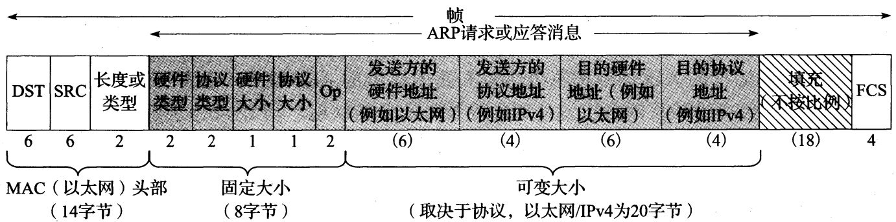

### 概述

由硬件交换的帧需要使用正确的硬件地址定位到正确的接口；否则，无法传输数据。但是，一个传统 IPv4 网络需要使用自己的地址：32 位的 IPv4 地址。如果一台主机要将一个帧发送到另一台主机，仅知道这台主机的 IP 地址是不够的，还需要知道主机在网络中的有效硬件地址。操作系统软件（即以太网驱动程序）必须知道目的主机的硬件地址，以便直接向它发送数据。对于 TCP/IP 网络，地址解析协议（ARP）提供了一种在 IPv4 地址和各种网络技术使用的硬件地址之间的映射。ARP 仅用于 IPv4，IPv6 使用邻居发现协议，它被合并入 ICMPv6

网络层地址和链路层地址是由不同部门分配的。对于网络硬件，主地址是由设备制造商定义的，并存储在设备的永久性内存中，所以它不会改变。因此，工作在特定硬件技术上的任意协议族，必须利用特定类型的地址。这允许不同协议族中的网络层同时运行。另一方面，网络接口的 IP 地址是由用户或网络管理员分配的，并且可以按需选择。为便携设备分配的 IP 地址可能改变。

地址解析是发现两个地址之间的映射关系的过程。对于使用 IPv4 的 TCP/IP 协议族，这是由运行的 ARP 来实现的。ARP 是一个通用的协议，被设计为支持多种地址之间的映射。实际上，ARP 几乎总是用于 32 位 IPv4 地址和以太网 48 位 MAC 地址之间的映射。ARP 提供从网络层地址到相关硬件地址的动态映射。

#### 直接交付和 ARP

直接交付发生在一个 IP 数据报被发送到一个 IP 地址，而该地址与发送方具有相同 IP 前缀的情况下。在 IP 数据报转发的常见方式。IPv4 直接交付基本操作：

* 应用程序是一个 Web 浏览器，调用一个特殊函数来解析 URL，看它是否包含主机名。
* 应用要求 TCP 协议建立一条道 IP 地址的连接
* 通过向 IP 地址发送一个 IPv4 数据报，TCP 尝试向远程主机发送一个连接请求
* 假设 IP 地址与发送主机网络前缀相同，数据报可被直接发送到这个地址而不经过任何路由器
* 假设以太网兼容地址被用于 IPv4 子网，发送主机必须将 32 位的 IPv4 目的地址转换为 48 位的以太网地址。需要从逻辑 Internet 地址向对应物理硬件地址进行转换。这是 ARP 功能，ARP 工作在正常模式下，仅适用于广播网络，链路层能将一个消息交付到它连接到所有网络设备。这是 ARP 运行的一个重要要求。在非广播网络（非广播多路访问 NBMA）中，可能需要更复杂的映射协议
* 在一个共享的链路层网段上，ARP 向所有主机发送一个称为 ARP 请求的以太网帧，即链路层广播。
* 通过 ARP，同一广播域中的所有系统可接收 ARP 请求。这包括可能根本不运行 IPv4 或 IPv6 协议的系统，但不包括位于不同 VLAN 中的系统，即使支持它们。如果某个系统使用请求中指出的 IPv4 地址，它仅需要响应一个 ARP 应答。这个应答包含 IPv4 地址（与请求相匹配）和对应的 MAC 地址。这个应答通常不是广播，而是仅直接发送给请求的发送方。同时，接收 ARP 请求的主机学习 IPv4 到 MAC 地址的映射，并记录在内存中供以后使用
* ARP 应答被原始请求的发送方接收，现在可发送引起这次 ARP 请求/应答交换过程的数据报
* 发送方可将数据报封装在以太网帧中直接发送到目的主机，并使用由 ARP 交换学到的以太网地址作为目的地址。由于这个以太网地址仅指向正确的目的地址，所以其他主机或路由器不会接收到这个数据报。因此，当仅使用直接交付时，并不需要经过路由器

ARP 用于运行 IPv4 的多接入链路层网络，每个主机额都有自己首选的硬件地址。点到点链路不使用 ARP。当这些链路被建立后，在链路两端通知正在使用的地址。由于不涉及硬件地址，因此不需要地址解析或 ARP

#### ARP 缓存

ARP 高效运行的关键是维护每个主机和路由器上的 ARP 缓存。该缓存使用地址解析协议为每个接口维护从网络层地址到硬件地址的最新缓存。当 IPv4 地址映射到硬件地址时，它对应于高速缓存中的一个条目，其正常到期时间是条目创建开始后的 20 分钟。

#### ARP 缓存超时

超时通常与 ARP 缓存中每个条目相关，arp 命令允许管理员设置缓存条目永远不超时。在大多数实现中，完整条目的超时为 20 分钟，而不完整条目的超时为 3 分钟。这些实现通常在每次使用一个条目后为它重新启动 20 分钟的超时。

**软状态**是指在超时到达前没有更新而被丢弃的信息。如果网络条件发送改变，软状态有助于启动自动重新配置，因此很多 Internet 协议使用软状态。软状态的成本是协议必须刷新状态以避免过期。在一些协议设计中，经常包括“软状态刷新”，以保持软状态的活跃

### ARP 帧格式

* 前 14 字节构成标准的以太网头部，假设没有 802.1p/q 或其他标记，其余部分由 ARP 协议来定义。ARP 帧的前 8 个字节是通用的。ARP 帧的以太网头部中，前两个字段包含目的和源以太网地址。对于 ARP 请求，目的以太网地址 `ff:ff:ff:ff:ff:ff`（全部为1）是广播地址，在同一广播域中的所有以太网接口可接收这些帧。在以太网帧中，对于 ARP（请求或应答），2 字节的长度或类型字段必须为 `0x0806`
* 长度/类型 字段之后的前 4 个字段指定了最后 4 个字段的类型和大小。这些值由 IANA 来指定。术语硬件和协议用于描述 ARP 分组中的字段。**硬件类型**字段指出了硬件地址类型。对于以太网，该值为 1。**协议类型**字段指出了映射的协议地址类型。对于 IPv4 地址，该值为 `0x0800`。当以太网帧包含 IPv4 数据报时，这可能与以太网帧的类型字段值一致。**硬件大小**和**协议大小**分别指出硬件地址和协议地址的字节数。对于以太网中使用 IPv4 地址的 ARP 请求或应答，它们的值分别为 6 和 4。**Op**字段指出该操作是 ARP 请求（值为 1），ARP 应答（值为 2），RARP 请求（值为3），RARP 应答（值为4）。由于 ARP 请求和 ARP 应答的长度/类型字段相同，这个字段是必须的
* 以太网帧会有一些重复信息，以太网头部和 ARP 消息都包含发送方硬件地址。对于一个 ARP 请求，除了目的硬件地址（设为 0）之外，其他字段都需要填充。当一个系统接收到一个 ARP 请求，它填充自己的硬件地址，将两个发送方地址和两个接收方地址互换，将 Op 字段设置为 2，然后发送生成的应答

### 代理 ARP

代理 ARP 使一个系统（通常是一台专门配置的路由器）可回答不同主机的 ARP 请求。它使 ARP 请求的发送者认为做出响应的系统就是目的主机，但实际上目的主机可能在其他地方（或不存在）。ARP 代理并不常见，通常应尽量避免使用它。

代理 ARP 也被称为混杂 ARP 或 ARP 黑客。两个物理网络相互隐蔽自己。在这种情况下，两个物理网络课使用相同的 IP 前缀，只要将中间的路由器配置为一个代理 ARP，在一个网络中由代理响应对其他网络主机的 ARP 请求。这种技术可用于向一组主机隐藏另一组主机。Linux 支持一种**自动代理 ARP 功能**。它可通过在文件 `/proc/sys/net/ipv4/conf/*/proxy_arp` 中写入字符 1，或使用 sysctl 命令来启用。它支持使用代理 ARP 功能，而不必为被代理的每个可能的 IPv4 地址手工输入 ARP 条目。这样做允许自动代理一个地址范围，而不是单个地址

### 与 ARP 相关的攻击

使用代理 ARP 功能假扮主机，对 ARP 请求作出应答。如果受害主机不存在，这很直观，而且可能很难发现。如果受害主机不存在，这很直观，而且可能难以发现。如果该主机仍在运行，这被认为更困难，因为每个 ARP 请求可能有多个应答，这样比较容易发现。一种更巧妙的攻击可被 ARP 触发，它涉及一台主机被连接到多个网络，并且一个接口的 ARP 条目被其他 ARP 表遗漏的情况，这是由 ARP 软件的一个错误造成的。利用这种漏洞可将流量引导到错误的网段上。Linux 提供了一个直接影响该行为的方式，可通过修改文件 `/proc/sys/net/ipv4/conf/*/arp_filter` 实现。如果将数值 1 写入这个文件，当输入的 ARP 请求到达一个接口时，就进行一次 IP 转发检查。这时需要查找请求者的 IP 地址，以确定那个接口将用于发送返回的 IP 数据报。如果到达的 ARP 请求与返回发送方的 IP 数据报使用不同的接口，这个 ARP 应答被抑制（触发它的 ARP 请求被丢弃）

更具破坏性的 ARP 攻击涉及静态条目处理。当查找对应一个特定 IP 地址的以太网地址时，静态条目可用于避免 ARP 请求/应答。这种条目已被用于尝试增强安全性。它的思路是在 ARP 缓存中对重要主机使用静态条目，以快速检测任何针对该 IP 地址的主机欺骗。大多数 ARP 实现通常用 ARP 应答提供的条目代替静态缓存条目。这样的后果是，接收到 ARP 应答（即使它没发送 ARP 请求）的主机被欺骗，并使用攻击者提供的条目代替自己的静态条目