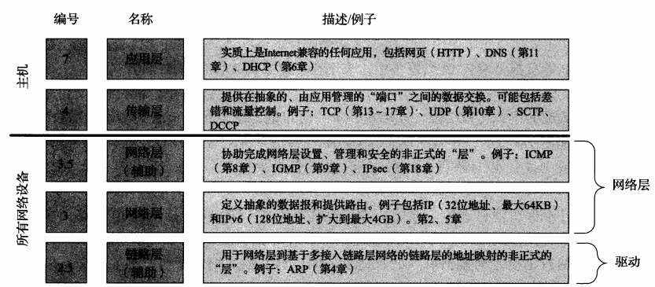
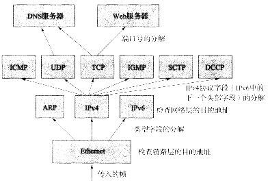
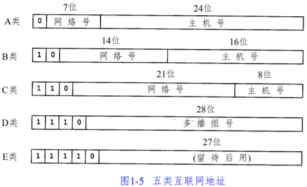
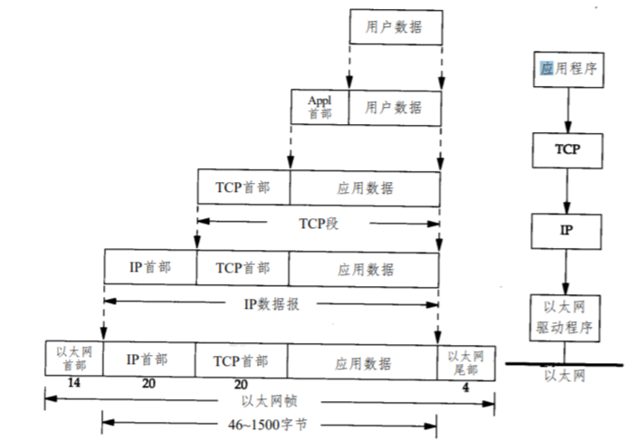

## 网络概述

### 分层

网络协议通常分不同的层次进行开发，每一层分别负责不同的通信功能。一个协议族，如 `TCP/IP` 是一组不同层次上的多个协议的组合。当前网络模型是常见的 `TCP/IP` 4层协议：

* 链路层

  数据链路层或网络接口层，通常包括操作系统中的设备驱动程序和计算机中对应的网络接口卡。它们一起处理与电缆（或其他任何传输媒介）的物理接口细节

* 网络层

  即处理分组在网络中的数据，如分组的选路。在 `TCP/IP` 协议族中，网络层协议包括 `IP` 协议（网际协议），`ICMP` 协议（Internet 互联网控制报文协议），以及 `IGMP` 协议（Internet 组管理协议）

* 传输层

  传输层主要为两台主机上的应用程序提供端到端的通信。在 `TCP/IP` 协议族中，有两个互不相同的传输协议：

  **`TCP` 传输控制协议**：`TCP` 为两台主机提供高可靠性的数据通信。它所做的工作包括把应用程序交给它的数据分成合适的小块交给下面的网络层，确认接收到的分组，设置发生最后确认分组的超时时钟等，由于传输层提供了高可靠性的端到端的通信，因此应用层可以忽略这些细节

  **`UDP` 用户数据报协议**：为应用层提供一种非常简单的服务，它只是把数据包的分组从一台主机发送到另一台主机，但并不保证该数据报能到达另一端。任何必需的可靠性必须由应用层来提供

* 应用层

  应用层负责处理特定的应用程序细节，几乎各种不同的 `TCP/IP` 实现都会提供这些通用的应用程序： `Telnet` 远程登录，`FTP` 文件传输协议，`SMTP` 简单邮件传送协议，`SNMP` 简单网络管理协议

### `TCP/IP` 协议族结构和协议

`TCP` 和 `UDP`  是两种最为著名的运输层协议，二者都使用 `IP` 作为网络层协议，虽然 `TCP` 使用不可靠的 `IP` 服务，但它却提供一种可靠的运输层服务。`UDP` 为应用程序发送和接收数据报。一个数据报是指从发送方传输到接收方的一个信息单元。`UDP` 是不可靠的，它不能保证数据报能安全无误地到达最终目的。

`IP` 是网络层上的主要协议，同时被 `TCP` 和 `UDP`  使用。`TCP` 和 `UDP` 的每组数据都通过端系统和每个中间路由器中的 `IP` 层在互联网中进行传输。`ICMP` 是 `IP` 协议的附属协议。`IP` 层用它来与其他主机或路由器交换错误报文和其他重要信息。`IGMP` 是 Internet 组管理协议。它用来把一个 `UDP` 数据报多播到多个主机。`ARP` 地址解析协议和 `RARP` 逆地址解析协议是某些网络接口（如以太网和令牌环网）使用的特殊协议，用来转换 `IP`层和网络接口层使用的地址。

#### ARPANET 参考模型

`ARPANET` 参考模型的分层，它最终被 `TCP/IP` 协议族采纳。结构比 `OSI` 模型更简单，但在实现中包括了一些特性协议，并且不适合常规层次的简化

*ARPANET网络模型分层*



* 最底下的层次是 2.5 层

  这是一个非正式的层。有几个协议工作在这层，`ARP`，它是 `IPV4` 的专用协议，只用于多接入链路层协议，完成 `IP` 层使用的地址和链路层使用的地址间的转换。`IPV6` 的地址映射功能为 `ICMPv6` 的一部分。

* 编号为 3 层为 `IP`层

  它是 `TCP/IP` 中最重要的网络层协议，`IP` 发生给链路层协议的 `PDU` 为 `IP` 数据报，它的大小是 `64 kb`，`IPV6` 将它扩大为 `4GB`。大的分组放入链路层 `PDU` （帧）时需要进行缩小处理，这个过程称为分片，它通常由 `IP` 主机和某些路由器在必要时执行。在分片过程中，大数据报的一部分被放入多个称为分片的小数据报中，并在到达目的地后组合（重组）

  由于每个 `IP` 分组都是一个数据报，所以都包含发送方和接收方的第三层地址，这些地址即为`IP` 地址(32 位的 `IPv4` 地址或 128 位的 `IPv6` 地址)。每个数据报的目的地址用于决定将该数据报发送到哪里，而做出此决定和发送数据报到下一跳的过程称为转发。路由器和主机都能进行转发，但是更多的是由路由器实现转发。3 种类型的 `IP` 地址，地址类型决定如何进行转发：单播（目的地是一台主机），广播（目的地是一个指定网络中的所有主机）和组播（目的地是属于一个组播组中的一组主机）。

* Internet 控制消息协议（`ICMP`）是 `IP` 的一个辅助协议，标记为 3.5 层

  `IP` 层使用它与其他主机或路由器的 `IP` 层之间交换差错消息和其他重要消息，`ICMP` 有两个版本：`IPv4` 使用 `ICMPv4`，`IPv6` 使用 `ICMPv6`。`ICMPv6` 是相当复杂的，包括地址自动配置和邻居发现等功能，它们在 `IPv4` 网络中有其他协议（如 `ARP`）处理虽然 `ICMP` 主要由 `IP` 使用，但它也能被其他应用使用。事实上，`ping` 和 `traceroute` 都使用 `ICMP`。`ICMP` 消息被封装在 `IP` 数据报中，采用与传输层 `PDU` 相同的封装方式。

  Internet 组管理协议（`IGMP`）是 `IPv4` 的另一个辅助协议。它采用组播寻址和交付来管理作为组播组成员的主机（一组接收方接收一个特定目的地址的组播流量）

* 在第 4 层传输层中

  传输控制协议（`TCP`）会处理数据包丢失。重复和重新排序等从 `IP` 层不处理的问题。采用面向连接的方式，并且不保留消息边界。`TCP` 在两台主机之间提供可靠的数据流传输，`TCP` 涉及很多工作，如将来自应用的数据分解成在网络层中传输的适当尺寸的块，确认接收到的分组和设置超时，以便对方能够确认自己发送的分组。由于传输层提供这种可靠的数据流，所以应用层可以忽略这些细节。`TCP` 发送到 `IP` 的 `PDU` 称为 `TCP` 段。

  用户数据报协议（`UDP`）仅提供比 `IP` 协议稍多的功能。`UDP` 允许应用发送数据报并保留消息边界，但不强制实现速率控制或差错控制。`UDP` 为应用层提供一种更简单的服务，它允许将数据报从一台主机发送到另一台主机，但不保证数据报能到达另一端。任何可靠性都需要由应用层提供。事实上，`UDP` 所做的是提供一套端口号，用于复用、分解数据和校验数据的完整性。`UDP` 发送到 `IP` 的 `PDU` 为 `UDP` 段　

  数据报拥塞控制协议（`DCCP`），它在 RFC 4340 中定义，它提供了一种介于 `TCP` 和 `UDP`之间的的服务类型：面向连接、不可靠的数据报交换，但具有拥塞控制功能（拥塞控制包括发送方控制发送速率的多种技术，以避免流量堵塞整个网站）

  流控制协议（`SCTP`），在 RFC 4960 中定义，是用于某些特定系统的传输协议。`SCTP` 提供类似于 `TCP` 的可靠交付，但不要求严格保持数据的顺序。它还允许多个数据流逻辑上在同一连接上传输，并提供了一个消息抽象，这是它于 `TCP` 的主要区别。`SCTP` 用于在 `IP` 网络上携带信令消息，类似于某些电话网络中的用途。

* 应用层

  传输层之上，应用层负责处理特定应用的细节。几乎每个应用的实现都是基于 `TCP/IP` 的。应用层与应用的细节有关，但与网络中的数据传输无关。较低的三层则相反：它们对具体应用一无所知，但需要处理所有的通信细节

#### `TCP/IP` 中的复用、分解和封装



`TCP/IP` 协议栈将地址信息和协议分解标识符相结合，以决定一个数据报是否被正确接收，以及那个实体将会处理该数据报。有几层还会检测数值（校验和），以保证内容在传输中没有损坏

以以太网帧作为传入帧，以太网帧包含一个 48 位的目的地址（链路层或介质访问控制（MAC）地址）和一个 16 位的以太网类型字段。`0x0800` 表示这个帧包含 `IPv4` 数据报。`0x0806` 和 `0x86DD` 分别表示 `ARP` 和 `IPv6`，假设目的地址与接收方的一个地址匹配，这个帧将被接收并校验差错，以太网类型字段用于选择处理它的网络层协议。

如果接收到的帧包含一个 `IP` 数据报，以太网头部和尾部信息将被清除 ，并将剩余字节（包含帧的有效载荷）交给 `IP` 来处理。`IP` 检测一系列的字段，包括数据报中的目的 `IP` 地址。如果目的地址与自己的一个 `IP` 地址匹配，并且数据报头部（`IP` 不检测有效载荷）没有错误，则检测 8 位的 `IPv4` 协议字段（`IPv6` 中为下一个头部字段），以决定接下来调用那个协议来处理，常见的值包括：1（`ICMP`），2（`IGMP`），4（`IPv4`），6（`TCP`），17（`UDP`）。数值 4 （和 41 表示 `IPv6`）的含义表示一个 `IP` 数据报可能出现在另一个 `IP` 数据报的有效载荷中。它违反了分层和封装的原有概念，但是是作为隧道技术的基础。如果网络层（`IPv4` 或 `IPv6`）认为传入的数据报有效，并且已确定正确的传输层协议，则将数据报（必要时由分片重组而成）交给传输层处理。在传输层，大部分协议（包括 `TCP`，`UDP`）通过端口号将复用分解到适当的应用。

#### 端口号

端口号是 16 位的非负整数（0 ~ 65535）。这些数字是抽象的，在物理上没有指向任何东西。每个 `IP` 地址有 65535 个可用的端口号，每个传输协议可使用这些端口号，它们被用于确定正确的接收数据的具体服务

标准的端口号由 `Internet` 号码分配机构（`IANA`）分配。这组数字被划分为特定范围，包括知名端口号（１～1023），注册端口号（1024~40151）和动态/私有端口号（49151~65535）。在传统上，服务器需要绑定到一个端口，它需要管理员访问的特殊权限

`TCP` 和 `UDP` 采用 16 bit 的端口号来识别应用程序。这些端口号的选择是：服务器一般都是通过知名端口号来识别的。任何 `TCP/IP` 实现所提供的服务都用知名的 1- 1023 之间的端口号。这些知名端口号由 Internet 号分配机构来管理。客户端通常对它所使用的端口号并不关心，只需保证该端口号在本机上是唯一的就可以。客户端口号又称作临时端口号（它通常只是在用户运行该客户程序时才存在，而服务器则只要主机运行，其服务就运行）

大多数 Unix 系统的文件 `/etc/services` 都包含了熟知的端口号。使用如下语句查寻

```shell
grep domain /etc/services
```

Unix 系统有保留端口号的概念，只有具有超级用户特权的进程才允许给它自己分配一个保留端口号（这些端口位于 1~1023 之间，一些应用程序将它作为客户与服务器之间身份认证的一部分）

### 互联网的地址

互联网上的每个接口必须有一个唯一的 Internet 地址即使 `IP` 地址。`IP` 地址长 32 bit。Internet 地址并不采用平面形式的地址空间，`IP` 地址具有一定的结构，五类不同的互联网地址格式如下：

*五类 `IP` 地址*



这些 32 位的地址通常写成四个十进制的数，其中每个整数对应一个字节。这种表示法为“点分十进制表示法”。区分各类地址的最简单的方法是看它的第一个十进制整数，各类 `IP` 地址的范围：

* A  0.0.0.0 到 127.255.255.255；

* B 128.0.0.0 到 191.255.255.255；

* C 192.0.0.0 到 223.255.255.255；

* D 224.0.0.0 到 239.255.255.255；

* E 240.0.0.0 到 247.255.255.255

### 域名系统

域名系统（`DNS`）是一个分布的数据库，由它来提供 `IP` 地址和主机名之间的映射信息。

### 封装

当应用程序用 `TCP` 传送数据时，数据被送入协议栈中，然后逐个通过每一层直到被当作一串比特流送入网络。其中每一层对收到的数据都要增加一些首部信息（有时还要增加尾部信息）。`TCP` 传给 `IP` 的数据单元称作 `TCP` 报文段（`TCP segment`）。`IP` 传给网络接口层的数据单元称作 `IP` 数据报（`IP datagram`）即分组，分组既可以是一个 `IP` 数据报，也可以是 `IP` 数据报的一个片 （`fragment`）通过以太网传输的比特流成为帧（Frame）。以太网数据帧的物理特性是其长度必须在 46-1500 字节之间（`ip address` 命令的 `mtu` 后的数字）。

*数据进入协议栈时的封装过程*



`UDP` 数据与 `TCP` 数据基本一致。唯一不同的是 `UDP` 传给 `IP` 的信息单元称作 `UDP` 数据报（`UDP datagram`），而且 `UDP` 的首部长为 8 字节。由于 `TCP`、`UDP`、`ICMP`、`IGMP` 都要向 `IP` 传送数据，因此 `IP` 会在生成的 `IP` 首部中存入一个长度为 8 bit 的数值，称为协议域。1 为 `ICMP` 协议，2 为 `IGMP` 协议，6 为 `TCP` 协议，17 为 `UDP` 协议。类似的，传输层协议在生成报文首部时要存入一个应用程序的标识符。`TCP` 和 `UDP` 都用一个 16 bit 的端口号来表示不同的应用程序。`TCP` 和 `UDP` 把源端口号和目的端口号分别存入报文首部中。网络接口分别要发送和接收 `IP`、`ARP`、`RARP` 数据，因此会在以太网的帧首部中加入 16 bit 的帧类型域。

### 设计应用

#### 客户-服务器模型

大部分网络应用程序在编写时都假设一端是客户，另一端是服务器，其目的是为了让服务器为客户提供一些特定的服务，可以将这种服务分为两种类型：重复型或并发型。

* 重复型服务器通过以下步骤进行交互：

  L1 等待一个客户请求的到来。

  L2 处理客户请求。

  L3 发送响应给发送请求的客户。

  L4 返回 L1 步。

  重复型服务器主要的问题是：在 L2 状态，在这个时候，它不能为其他客户提供服务。

* 并发服务器采用以下步骤：

  C1 等待一个客户请求的到来。

  C2 启动一个新的服务器来处理这个客户的请求（这期间可能生成一个新的进程、任务或线程，并依赖底层操作系统的支持，并处理客户请求并返回，处理结束后，终止这个新服务器）。

  C3 返回 C1。

  并发服务器的优点在于它是利用生成其他服务的方法来处理客户请求。即，每个客户都有它自己对应的服务器。如果操作系统允许多任务，那么就可以同时为多个客户服务。一般来说，`TCP` 服务器是并发的，而 `UDP` 服务器是重复的，但也存在一些例外

#### 对等服务

有些应用以更分布式的形式设计，其中没有专门的服务器。相反，每个应用即是客户机，又是服务器，有时同时是两者，并能转发请求。如（`Skype`，`BT`）采用这种形式。这种应用称为对等或 `P2P` 应用。并发的`P2P` 应用接收到传入的请求，确定它是否能响应这个请求，如果不能，将这个请求转发给其他对等方。因此一组 `P2P` 应用共同形成一个应用网络，也称为覆盖网络。

`P2P` 网络的一个主要问题是发现服务。即一个对等方如何在一个网络中发现提供它所需的数据或服务器的其他对等方？以及可能进行交互的那些对等方的位置？这通常由一个引导程序来处理，以便每个客户机在最初配置中使用它所需的对等方的地址和端口号。一旦连接成功，新的参与者向其他活跃的对等方发出请求，并根据协议获得对等方提供的服务或文件。

### 应用编程接口

使用 `TCP/IP` 协议的应用程序通常采用两种应用编程接口（`API：socket`）和 `TLI`（运输层接口：Transport Layer Interface）

