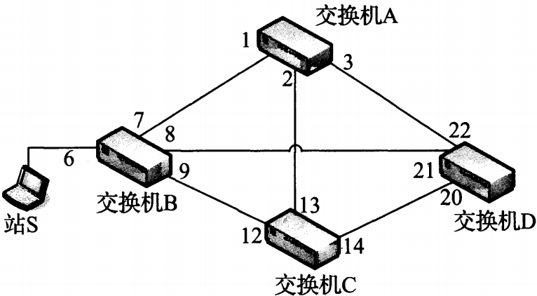

## 链路层

### 概述

TCP/IP 支持多种不同的链路层，它依赖于使用的网络硬件类型：有线局域网（以太网）、无线网络（WI-FI）、基于蜂窝技术的无线数据服务（LTE）。

大多数链路层技术都有一个相关的协议，描述由网络硬件传输的相应 PDU（帧）格式。以区分更高层的 PDU 格　式。帧格式通常支持可变的帧长度，范围从几字节到几千字节。这个范围的上限为**最大传输单元（MTU）**。有些网络技术（调制解调器和串行线路）不强制规定最大的帧，因此它们可以由用户来配置

### 以太网和 IEEE 802 局域网/城域网标准

#### 以太网帧格式

所有的以太网（802.3）帧都基于一个共同的格式。在原有规范的基础上，帧格式已被改进以支持额外功能。以太网帧开始是一个**前导**字段，接收器电路用它确定一个帧的到达时间，并确定编码位之间的时间量。由于以太网是一个异步的局域网（即每个以太网接口卡中不保持精确的时钟同步），从一个接口到另一个接口的编码位之间的间隔可能不同。前导是一个公认的模式（典型值是 `0xAA`)，在发现**帧起始分隔符**（SFD）时，接收器使用它“恢复时钟”。SFD 的固定值 `0xAB`

*以太网帧*


*以太网帧格式包含一个源地址和目的地址、一个重载的长度/类型字段、一个数据字段和一个帧校验序列（CRC32）。基本帧格式提供了一个标签，其中包含一个 VLAN ID 和优先级信息（802.1p/q)，以及一个最近出现的可扩展标签。前导和 SFD 被用于接收器同步。当以太网以半双工模式运行在 100Mb/s 或以上速率时，其他位可能被作为载体扩展添加到短帧中，以确保冲突检测电路的正常运行*

* 基本的帧格式包括 48 位（6字节）的**目的地址**（DST）和**源地址**（SRC）字段。这些地址有时也采用其他名称，如：MAC地址，链路层地址，802地址，硬件地址，物理地址。以太网帧的目的地址也允许寻址到多个站点（广播或组播）广播功能用于 ARP 协议，组播功能用于 ICMPv6 协议，以实现网络层地址和链路层地址之间的转换

* 源地址后是**类型**字段，或**长度**字段。在多数情况下，它用于确定头部后面的数据类型。TCP/IP 网络使用的常见值包括 IPv4（0x0800），IPv6（0x86DD），ARP（0x0806)。0x8100 表示一个 Q 标签帧（可携带一个“虚拟局域网”或 802.1q 标准的 VLAN ID）。一个以太网帧的基本大小是 1518 字节，但是最近的标准将该值扩大到 2000 字节。

* 当前的 802.3-2008 标准采用修改后的 802.3 帧格式，提供最大为 482 字节的“标签”，它携带在每个以太网帧中。这些较大的帧被称为信封帧，长度最大的可能达到 2000 字节。包含 802.1p/q 标签的帧称为 Q 标签帧，即信封帧。但是，并非所有信封帧必然是 Q 标签帧

* **有效载荷**：这里放高层 PDU （IP 数据报）的地址。传统上，以太网的有效载荷一直是 1500 字节，它代表以太网的 **MTU**。目前，大多数系统以太网使用 1500 字节的 MTU，虽然在必要时它可设置为一个较小的值。有效载荷有时被填充数个 0，以确保帧在总体长度符合最小长度要求
* 有效载荷后是**循环冗余校验（CRC）**字段位于尾部，4 字节， 32 位。

#### 帧大小

以太网帧有最小和最大尺寸。最小的帧是 64 字节，要求数据区（有效载荷）长度（无标签）最小为 48 字节。当有效载荷较小时，填充字节（值为 0）被添加到有效载荷尾部，以确保达到最小长度

传统以太网的最大帧长度是 1518 字节（包括 4 字节 CRC 和 14 字节头部）。选择这个值是一个折中：如果一个帧中包括一个错误（接收到不正确的 CRC 校验），只需重发 1.5KB 以修复该问题。MTU 大小限制为 1500 字节。为了发送一个更大的消息，则需要多个帧（如，对于 TCP/IP 网络常用的较大尺寸 64 KB，需要至少 44 个帧）

由多个以太网帧构成一个更大的上层 PDU 的后果是，每个帧都贡献了一个固定开销（14 字节的头部和 4字节的 CRC）。为了允许以太网硬件接收电路正确恢复来自网络的数据，并为其他站提供将自己的流量与已有流量分开的机会，以太网帧在网络中不能无缝地压缩在一起。**在帧开始处定义了 7 字节前导和 1 字节 SFD 之外，还指定了 12 字节的包间距（IPG）时间**，因此，每帧的效率最多为 1500/（12 + 8 + 14 + 1500 + 4) = 0.975293，一种提高效率的方式是：**在以太网中传输大量数据时，尽量使帧尺寸更大一些，这可采用以太网巨型帧来实现**，它是一种非标准的以太网扩展（主要在 1000MB/s 以太网交换机中使用），通常允许帧尺寸高达 9000 字节。有效环境使用的帧超过 9000 字节为超级巨型帧。这些较大的帧通常无法与较小的 1518 字节的帧互操作。

#### 802.1p/q 虚拟局域网和 QoS 标签

为了解决大型多用途交换网络运行中的问题,，IEEE采用一种称为**虚拟局域网(VLAN)的功能**扩展802 LAN标准，它被定义在802.1q [802.1Q-2005]标准中。兼容的以太网交换机将主机之间的流量分隔为常见的 `VLAN` 。正是由于这种分隔，连在同一交换机但在不同VLAN中的两台主机，它们之间的流量需要一台路由器来传递。已研发出交换机/路由器组合设备来满足这种需求。路由器性能最终得到改进以匹配VLAN交换性能。因此，VLAN的吸引力已有所减弱，现代高性能路由器逐渐取代它们。尽管如此，它们仍在使用，在某些环境中仍受欢迎，因此有必要了解它们。

工作站到 VLAN 的映射有几种方法。通过端口分配 VLAN 是一种简单而常见的方法，交换机端口所连接的站被分配在一个特定 VLAN 中，这样连接的任意站就都成为 VLAN 中的成员。其他选择包括基于 MAC 地址的 VLAN，以太网交换机使用表将一个站的 MAC 地址映射到一个 VLAN。

当不同的 VLAN 中的站连接在同一交换机时，交换机确保流量不在两个 VLAN 之间泄漏，无论这些站使用哪种类型的以太网接口。当多个 VLAN 跨越多个交换机（中继）时，在以太网帧发送到另一台交换机之前，需要使用 VLAN 来标记该帧的归属。使用一个 VLAN 标签（或头部）的标记，其中包含 12 位 VLAN 表示符号（提供 4096 个 VLAN，但保留 VLAN 0 和 VLAN 4095）。它还包含支持 QoS 的 3 位优先级（定义在 802.1p/q 标准中）。

802.1p规定了在帧中表示QoS标识符的机制。802.1p 头部包括一个 3 位**优先级**字段，它用于表明一个 QoS 级别。这个标准是802.1q VLAN 标准的扩展。这两个标准可以一起工作，并在同一头部中共享某些位。它用3个有效位定义了 8 个服务级别。 0 级为最低优先级，用于传统的尽力而为的流量。7 级为最高优先级，可用于关键路由或网管功能。这个标准规定了优先级如何被编码在分组中，但没指定如何控制哪些分组采用哪个级别，以及实现优先级服务的底层机制，这些可由具体的实现者来定义。因此，一个优先级流量相对于另一个的处理方式时由实现或供应商定义的。如果 802.1p/q 头部中的 VLAN ID 字段被设置为 0，802.1 p 可以独立于 VLAN 使用

控制 802.1p/q 信息的 Linux 命令是 `vconfig`。它可用来添加和删除虚拟接口，即与物理接口相关联的 `VLAN ID`它也可用来设置 802.1p 优先级，更改虚拟接口确定方式，改变由特定 `VLAN ID` 标记的分组之间的映射。以及协议在操作系统中处理时如何划分优先级

```shell
# 为 为 eth1 添加 vlan id 为 2
vconfig add eth1 2
# 显示配置
ifconfig eth1.2
# 删除
vconfig rem eth1.2
```

#### 802.1AX（802.3ad）链路聚合

有些系统配备多个网络接口，具有**绑定**或**链路聚合**能力。通过链路聚合，两个或更多接口被视为一个，通过冗余或将数据分割（分拆）到多个接口，提高性能并获得更好的可靠性。802.1AX 定义了最常用的链路聚合方法，以及可管理这些链路的**链路聚合控制协议LACP**。LACP 使用一种特定格式的 IEEE 802 帧（LACPDU）

以太网交换机支持的链路聚合时一个替代方案，它比支持更高速网络接口的性价比高。如果多个端口聚合能提供足够的带宽，则可能并不需要高速接口。链路聚合不仅可被网络交换机支持，而且可在一台主机上跨越多个网络接口卡。在通常情况下，聚合的端口必须是同一类型，并工作在同一模式（半双工或全双工）下

```shell
# 跨越不同类型设备的链路聚合
modprobe bonding # 加载绑定驱动，是一个支持链路聚合的特殊设备驱动程序
# 使用 IPv4 地址来创建 bond0 接口
ifconfig bond0 10.0.0.111 netmask 255.255.255.128
ifenslave bond eth0 wlan0 # ifenslave 命令执行后，绑定设备 bond0 的flags用 MASTER 标志来标记，eth0 和 wlan0 用 slave 来标志
```

LACP 协议旨在通过避免手工配置，以简化链路聚合的建立工作。在 LACP "主角"（客户端）和 "参与者" （服务器）启用后，它们通常每秒都会发送 LACPDU。LACP 自动确定哪些成员链路可被聚合成一个**链路聚合组 LAG**，并将它们聚合起来。这个过程的实现需要通过链路发送一系列信息（MAC 地址、端口优先级、端口号和密钥）。一个接收站可比较来自其他端口的值，如果匹配就执行聚合。LACP 协议 [802.1AX-2008]

### 全双工自动协商802.1X流量控制

当以太网最初被开发出来时，它仅工作在半双工模式，并使用一条共享的电缆。即：同一时间内只能在一个方向发送数据，因此在任何时间点只有一个站可以发送一个帧。随着交换式以太网的发展，网络不再是单一的共享线路，而代之以很多链路的组合。因此，多个站之间可以同时进行数据交换。以太网被修改为全双工操作，这样可以有效禁用冲突检测电路。这样可以增加以太网的物理长度，因为半双工操作和冲突检测的相关时间约束被取消

在 Linux 中，`ethtool` 程序可用于查询是否支持全双工，以及是否正在执行全双工操作，还可显示和设置以太网接口的很多属性。

```shell
# 显示网卡的设置
ethtool <ethname>
```

*网卡属性*


* `Speed` 为速率：`Speed: 100Mb/s`
* `Supported auto-negotiation: Yes` 为是否支持**自动协商**：（这是 802.3u的机制），使接口能交换信息（如速度）和功能（半双工或全双工运行）。自动协商信息在物理层通过信号交换，它可在不发生或接收数据时发送。
* `Port` 为物理端口类型
* `PHYAD` 为物理端口地址
* `Transceiver` 物理层电路在 NIC 内部还是外部

#### 双工不匹配

自动协商有一些互操作性问题，特别是一台计算机及其相关的交换机端口使用不同的双工配置时，或者当自动协商只在链路的一端被禁用时。在这些情况下，可能会发生**双工不匹配**。当这种情况下发生时，连接不会完全失败，但可能带来显著的性能下降。当网络中出现中等程度的双向流量繁忙时（大数据传输期间），一个半双工接口会将输入的流量检测为冲突，从而触发以太网 MAC 的 CSMA/CD 的指数退避功能。同时，导致这个冲突的数据被丢弃，这可能需要更高层协议（TCP）重传。因此，性能下降可能只在半双工接口发生数据，同时又有大量流量需要接收时才是明显的，站处于轻负载时通常不会发生这种情况。

#### 局域网唤醒省电和魔术分组

**Windows 唤醒功能和 Linux 唤醒功能**选项用于使网络接口或主机脱离低功耗（睡眠）状态，这是基于某类分组的传输来实现的。这种分组用来触发可配置的功率状态改变。在 Linux 中，用于唤醒的值可以是零，或者是多个用于低功耗状态唤醒的位，它们可以被几种帧触发：任何物理层（PHY）活动（p）、发往站的单播帧（u）、组播帧（m）、广播帧（b）、ARP 帧（a）、魔术分组帧（g），包括密码的魔术分组帧。这些都可用 `ethtool` 的选项来设置

```shell
# 当接收到任何 u，m，g，b 类型的帧时，将 eth0 设备配置为发送一个唤醒信号
ethtool -s eth0 wol umgb
```

魔术分组包含一个字节值 `0xFF` 的特定重复模式。在通常情况下，这种帧采用 UDP 分组形式封装在以太网广播帧中发送。有几个工具可以生成

```shell
# 构造一个魔术分组
wol 00:08:74:93:c8:3c
```

#### 链路层流量控制

以全双工模式运行扩展的以太网和跨越不同速率的网段时，可能需要由交换机将帧缓存一段时间。如：当多个站发送到同一目的地（输出端口争用），这种情况可能发生。如果一个站聚合的流量速率超过该站的链路速率，那么帧就开始存储在中间交换机中。如果这种情况持续一段时间，这些帧可能被丢弃。一种方法是在发送方采取流量控制。一些以太网交换机通过在交换机和网卡之间发送特殊信号帧来实现流量控制。流量控制信号被发送到发送方，通知它必须放慢传输速率，但规范将这些细节留给具体实现来完成。以太网使用 **PAUSE 消息**（PAUSE 帧）来实现流量控制。

PAUSE 消息包含在 MAC 帧中，通过将**以太网长度/类型字段值设为 0x8808，以及使用 MAC 控制操作码 0x0001 来标识**，如果一个站接收到这种帧，表示建议它减缓发送速率。PAUSE 帧总是被发送到 MAC 地址 `01:80:C2:00:00:01`，并且只能在全双工链路上使用。包含一个保持关闭（hold-off）时间值（指定量为 512 比特的时间），表明发送方在继续发送之前需要暂停多长时间

MAC 控制帧和常规封装的帧类似，但紧跟在长度/类型字段后的是一个 2 字节的操作码。PAUSE 帧实际上是唯一一种使用 MAC 控制帧的帧类型。包括一个 2 字节的保持关闭时间。整个 MAC 控制层（基本只是 802.3x 流量控制）的实现是可选的。

以太网层次的流量控制可能有重大负面影响，因此通常不使用它。当多个站通过一台过载的交换机发送时，该交换机通常向所有主机发送 PAUSE 帧。交换机的内存使用可能对发送主机不均衡，因此有些主机可能被惩罚（流量控制），即使它们本身并没有占有太多流量

### 网桥和交换机

IEEE 802.1d 标准规定了网桥的操作，交换机本质上是高性能的网桥。网桥或交换机用于连接多个物理的链路层网络或成组的站。最基本的设置涉及连接两个交换机来形成一个扩展的局域网


*一个包括两台交换机的扩展以太网。每个交换机端口有一个编号，每个站（包括每个交换机）有自己的 MAC 地址*

上图交换机 A 和 B 互连形成一个扩展的局域网。在上图中，客户端系统都连接到 A，服务器都连接到 B。每个网络单元（包括每个交换机）有自己的 MAC 地址。每个网桥经过一段时间对域外 MAC 地址的"学习"后，最终每个交换机会知道每个站可由那个端口到达。每个交换机基于每个端口（也可能是每个 VLAN）的列表被存储在一张表（过滤数据库）中。

当第一次打开一个网桥（交换机）时，它的数据库是空的，因此它不知道除自己之外的任何站的位置。当它每次接收到一个目的地不是自己的帧时，它为除该帧到达的端口外的所有端口做一个备份，并向所有端口发送这个帧的备份。如果交换机（网桥）未学习到站的位置，每个帧将会被交付到每个网段

目前多数系统支持网络接口之间的网桥功能，即具有多个接口的计算机可用作网桥。

```shell
# 创建一个网桥设备 br0
brctl addbr br0;
# 为网桥增加接口 eth0 和 eth1
brctl addif br0 eth0
brctl addif br0 eth1
# 启动接口
ifconfig eth0 up
ifconfig eth1 up
ifconfig br0 up
# 删除接口
brctl delif eth0
# 网桥信息
brctl show
# 过滤数据库
brctl showmacs br0
```

由于站可能出现移动、网卡更换、MAC 地址改变或其他情况，所以就算网桥曾发现一个 MAC 地址可通过某个端口访问，这个信息也不能假设永远正确。为了解决这个问题，在每次学习一个地址后，网桥启动一个计时器（默认为 5 分钟）。在 Linux 中，每个学习条目使用一个与网桥相关的固定时间。如果在指定的有效期内，没有再次看到该条目中的地址，则将这个条目删除。当一个条目因有效期满而被删除时，后续的帧将被发送到接收端口之外的所有端口（洪泛），并更新过滤数据库中的这个条目

#### 生成树协议 STP

网桥可能单独或与其他网桥共同运行。当两个以上的网桥使用（或交换机端口交叉连接）时，由于存在级联的可能性，因此可能形成很多组的循环帧。

*扩展以太网洪范帧*



*一个扩展的以太网包括 4 台交换机和多条冗余链路。如果在这个网络中采用简单的洪范转发帧，由于多余的倍增流量（广播风暴），将会导致一场大的灾难*

假定上图中的多个交换机刚被打开，并且它们的过滤数据库为空。当站 S 发送一个帧时，交换机 B 在端口 7，8，9 复制该帧。这时，最初的帧已被"放大"三倍。这些帧被交换机 A、D、C 接收。交换机 A 在端口 2 和 3 生成该帧的副本。交换机 D 和 C 分别在端口 20、22 和 13、14 生成更多副本。当这些副本在交换机 A、C、D 之间双向传输，这时放大倍数已增大为 6。当这些帧到达时，转发数据库开始出现震荡，这是由于网桥反复尝试查找通过哪些端口可到达站 S。有一种协议可避免这种情况，这种协议称为**生成树协议 STP**，在当前的标准中，**传统的 STP 被快速生成树协议代替**。STP 通过在每个网桥禁用某些端口来工作，这样可避免拓扑环路（即两个网桥之间不允许出现重复路径）但如果拓扑结构未分区，则仍可到达所有站。

*STP协议下交换机*


*通过 STP，链路 B-A、A-C、C-D 在生成树中是活跃的。端口 6，7，1，2，13，14，20 处于转发状态；所有其他端口被阻塞即不转发。这样可以防止帧循环，避免广播风暴。如果配置发生变化或某台交换机故障，则将阻塞端口改变为转发状态，并由网桥计算一个新生成树*

用于转发数据库时，STP 必须处理以下情况：网桥启用或关闭、接口卡更换或 MAC 地址改变。显然这种变化可能影响生成树运行，因此 STP 必须适应这些变化。这种适应通过交换一种称为**网桥协议数据单元（BPDU）的帧**来实现。这些帧用来形成和维护生成树。这棵树生长自一个网桥该网桥由其他网桥选举为"根网桥"。一个网络可能存在多个生成树。如何确定那棵生成树最适于转发帧，这基于每条链路和根网桥位置的相关成本。这个成本是一个与链路速度成反比的整数（建议）STP 计算根网桥的成本最小的路径。如果必须遍历多条链路，相关成本是这些链路之和

#### 端口状态和角色

网桥端口可能有 5 个状态：阻塞、侦听、学习、转发、禁用

*RSTP相关的端口状态*


*在正常的 STP 操作中，端口在 4 个主要状态之间转换。在阻塞状态下，帧不被转发，但一次拓扑变化或超时可能导致向侦听状态转换。转发状态是活跃的交换机端口承载数据流量的正常状态。实线表示端口的正常转换，虚线表示由管理配置引起的改变*

在初始化后，一个端口进入阻塞状态。在这种状态下，它不进行地址学习、数据转发或 BPDU 发送，但它会监控接收的 BPDU，并在它需要被包含在将到达的根网桥的路径中的情况下，使端口转换到侦听状态。在侦听状态下，该端口允许发送和接收 BPDU，但不进行地址学习或数据转发。经过一个典型 15 秒的转发延迟，端口进入学习状态。这时，它被允许执行数据转发之外的所有操作。在进入转发状态并开始转发数据之前，需要等待另一个转发延迟。

相对于端口状态机，每个端口都扮演一定的角色。由于 RSTP 的出现。端口可能扮演**根端口、指定端口、备用端口、备份端口等角色**：**根端口**是生成树中位于指向根的线段终点的那些端口。**指定端口**是处于转发状态，并与根相连段中路径成本最小的端口。**备用端口**是与根相连线段中成本更高的端口。它们不处于转发状态。**备份端口**是指连接到同一线段中作为**同一网桥指定端口使用的端口**备份端口可轻易接管一个失效的指定端口，而不影响生成树拓扑的其余部分，但是它不能在全部网桥失效的情况下提供一条到根的备用路径

#### BPDU 结构

*BPDU 网桥协议数据单元帧*


*BPDU 被放置在 802 帧的有效载荷区，并在网桥之间交换以建立生成树。重要的字段包括源、根节点、到根的成本和拓扑变化提示。在 802.1w 和 [802.1D-2004] 中（包括快速 STP 或 RSTP），附加字段显示端口状态*

以上格式适用于最初的 STP，以及新的 RSTP。BPDU 总被发送到组地址 `01:80:C2:00:00:00`，并且不会通过一个未修改的网桥转发。BPDU 帧结构：

* DST、SRC、L/T 字段是携带 BPDU 的传统以太网（802.3）帧头部的一部分。
* 3 字节的 LLC/SNAP 头部由 802.1 定义，并针对 BPDU 被设置为常数 `0x424203`。并非所有 BPDU 都是用 LLC/SNAP 封装，但这是一个常见的选项。
* **协议（Prot）**字段给出协议 ID 号，它被设置为 0。
* **版本（Vers）**字段被设置为 0 或 2，取决于使用 STP 还是 RSTP。
* **类型（Type）**字段的分配与版本类似。
* **标志（Flags）**字段包含拓扑变化（TC）和拓扑变化确认（TCA）位，它们由最初的 802.1d 标准定义：附加位被定义为**建议（P）**、**端口角色**（00 未知，01 为备用，10 为根，11 为指定），**学习（L）**，**转发（F）**，**协议（A）**。这些都作为 RSTP 内容。
* **根 ID 字段**给出发送方使用的根网桥标识符，即从网桥 ID 字段中获得的 MAC 地址。这些 ID 字段都用一种特殊方式编码，包括 MAC 地址之前的一个 2 字节的优先级字段。优先级的值可通过管理软件来设置，以强制要求生成树采用某个特定网桥作为根。
* **根路径成本**是在根 ID 字段中指定的计算出的到达某个网桥的成本。
* **PID 字段**是端口标识符和由发送帧给出的端口号，它被附加在一个可配置的 1 字节的优先级字段（默认为 0x80）之后。
* **消息有效期（MsgA）字段**指出消息有效期。
* **最大有效期（MaxA）字段**指出超时默认 20 秒的最大期限。
* **欢迎时间（Hello Time）字段**指出配置帧的传输周期。
* **转发延迟字段**指出学习和侦听状态的时间。所有的有效期和时间字段可在 1/256 秒内获得

消息有效期字段不像其他的时间字段那样是固定值。当根网桥发送一个 BPDU 时，它将该字段设置为 0。网桥转发接收到的不是根端口的帧，并将消息有效期字段加 1。即改字段是一个跳步计数器，用于记录 BPDU 经过的网桥数量。当一个 BPDU 被一个端口接收时，其包含的信息在内存和 STP 算法参与者中被保存至超时（超时发生在 MaxA-MsgA 时刻）。如果超过这个时间，根端口没有接收到另一个 BPDU，根网桥被宣布"死亡"，并重新开始根网桥选举过程

STP 的第一个工作时选举根网桥：根网桥是在网路（或 VLAN）中标识符最小（优先级与MAC 地址相结合）的网桥。**当一个网桥初始化时，它假设自己是根网桥，并用自己的网桥 ID 作为根 ID 字段的值发送配置 BPDU 消息，如果它检测到一个 ID 更小的网桥，则停止发送自己的帧，并基于接收到的 ID 更小的帧构造下一步发送的 BPDU。发出根 ID 更小的 BPDU 的端口被标记为根端口（即端口在到根网桥的路径上）剩余端口被设置为阻塞或转发状态**

STP 的另一个重要工作是处理拓扑变化：在 STP 中，**当一个端口进入阻塞或转发状态时，意味着拓扑变化。当网桥检测到一个连接变化（如：链路故障）它向根端口之外的端口发送拓扑变化通知 （TCN）BPDU，通知自己在树中的父网桥，直到根为止。树中通向根的下一个网桥向发送通知的网桥确认 TCN BPDU，并将它们转发到根。当接收到拓扑变化通知时，根网桥在后续的周期性配置消息中设置 TC 位。这种消息被网络中的每个网桥所转发，并被处于阻塞或转发状态的端口接收。设置这个位允许网桥减少转发延时计时器的有效期，将有效期以秒代替推荐的 5 分钟。这样，数据库中已有的错误条目可被快速清除和重新学习，同时允许访问那些被误删除的条目**

#### 快速生成树协议 RSTP （802.1w）

传统 STP 在拓扑变化之后，只能通过一定时间内未接收到 BPDU 来检测。如果这个超时很大，收敛时间（沿着生成树重新建立数据流的时间）可能比预期大。IEEE 802.1w 标准改进了传统 STP，它定义采用新名称的**快速生成树协议**（Rapid Spanning Tree Protocol，RSTP）。在 RSTP 中，对 STP 的主要改进是监视每个端口的状态，并在故障时立即发送一个拓扑变化通知。另外，RSTP 使用 BPDU 的标志字段中的全部 6 位来支持网桥之间的协议，以避免由计时器来启动协议操作。它将正常的 STP 端口状态由 5 个减少到 3 个（丢弃、学习、转发）RSTP 的丢弃状态代替了传统 STP 的禁止、阻塞和侦听状态。RSTP 创建了一个称为备用端口的新角色，作用是在根端口停止运行时立即代替它。由于 RSTP 只使用一种类型的 BPDU，因此没有专门的拓扑变化 BPDU。RSTP 的 BPDU 使用版本和类型号 2 而不是 0。在 RSTP 中，检测到一次拓扑变化的交换机会发送一个表示拓扑变化的 BPDU，任何接收到它的交换机立即清除自己的过滤数据库。这可显著改变影响协议的收敛时间。这时，无须等待拓扑变化传递到根网桥再经过转发延迟后返回，而是立即清除相关条目。大多数情况下，收敛时间可从几十秒减少到几分之一秒。

RSTP 使边缘端口（只连接到端站的端口）和正常的生成树端口之间，以及点到点链路和共享链路之间都有区别。边缘端口和点到点链路上的端口通常不会形成循环，因此允许它们跳过侦听和学习状态，直接进入转发状态。如果假设一个边缘端口可能被入侵，例如两个端口交叉连接，它们可携带任何形式的 BPDU 简单的端站通常不处理 BPDU，这时它们将被重新分类为生成树端口。点到点链路可根据接口操作模式来识别。如果这个接口运行在全双工模式下，则这条链路是点到点链路

在普通的 STP 中，BPDU 通常由一个通知网桥或根网桥来转发。在 RSTP 中，BPDU 为了"保持活跃"而由所有网桥来定期发送，以便确定相连的邻居是否正常运行。大多数高层路由协议也会这样做。在 RSTP 中，拓扑变化没有像普通 STP 那样包括边缘端口连接或断开。当检测到一次拓扑变化时，通知网桥发送 TC 位被设置的 BPDU，不仅到根网桥而且到所有网桥。这样做允许将拓扑变化通知整个网络，并且比传统 STP 更快速。当一个网桥接收到这些消息时，它会更新除边缘端口之外的所有相关条目。

RSTP 已被扩展到 VLAN 中，它采用一种称为多生成树协议（MSTP）的协议。这个协议保留了 RSTP（和 STP）报文格式，因此它有可能做到向后兼容，也支持形成多个生成树（每个VLAN一个生成树）

#### 多注册协议 MRP

**多注册协议**Multiple Registration Protocol，MRP 提供了在桥接局域网环境中的站之间注册属性的通用方法。MVRP 用于注册 VLAN MMRP 用于注册组 MAC 地址。MRP 代替了早期的 GARP 框架；MVRP 和 MMRP 分别代替了旧的 GVRP 和 GMRP 协议。这些协议最初由 802.1q 定义

在使用 MVRP 时，当一个站被配置为一个 VLAN 成员时，该信息被传输到它所连接的交换机，并由该交换机将站加入 VLAN 通知其他交换机。这允许交换机根据站的 VLAN ID 添加自己的过滤表，也允许 VLAN 拓扑变化不必通过 STP 而重新计算现有生成树。避免重新计算 STP 是从 GVRP 向 MVRP 迁移的原因之一

MMRP 是一个站注册其感兴趣的组 MAC 地址（组播地址）的方法。这个信息可能被用于交换机建立端口，组播流量必须通过该端口来交付。如果没有这样的功能，交换机将不得不广播所有的组播流量，这样可能导致不必要的开销，MMRP 是一个第 2 层协议，它与第 3 层协议 IGMP 和 MLD 相似，并在很多交换机中支持 "IGMP/MLD探听" 能力

### 无线局域网 Wi-Fi

#### 无线服务

*无线扩展服务集*


*接入点可采用一种分布式服务（一个无线或有线的主干）来连接，以形成一个扩展的无线局域网（称为一个ESS）站（包括 AP 和移动设备）之间的通信构成一个基本服务集。在通常情况下，每个 ESS 有一个指定的 ESSID，它的功能是作为一个网络的名称*

上图网络包括多个站（STA）。在通常情况下，站和接入点（AP）组成一个操作子集。一个 AP 和相关的站被称为一个基本服务集（BSS）。AP 之间通常使用一种有线的分布式服务（DS）连接，形成一个扩展服务集。这种方式通常被称为基础设施模式。802.11 标准也提供了一种 Ad hoc（自组织）模式。在这种配置中没有 AP 或 DS，而是直接采用站到站（对等）通信。加入一个 Ad hoc 网络的 STA 形成一个独立基本服务集（IBSS）。由 BSS 或 IBSS 的集合形成的无线局域网称为服务集，它由一个服务集标识符（SSID）来标识。扩展服务集标识符（ESSID）是由 SSID 命名的一个 BSS 集合，实际上是一个最长 32 个字符的局域网名称。在 WLAN 第一次建立时，该名称通常分配给 AP

#### 802.11 帧

802.11 网络有一个常见的总体框架，但包括多种类型的帧格式。每种类型的帧不一定包含所有字段

*常见帧格式和最大尺寸数据帧*


*MPDU 格式类似于以太网，但取决于接入点之间使用的 DS 类型：帧是发送到 DS 还是来自它，以及帧是否被聚合。Qos 控制字段用于特殊功能，HT 控制字段用于控制 802.11n 的"高吞吐量"功能*

* **前导码**：802.11 帧包括一个用于同步的前导码，它取决于正在使用的 802.11 协议类型。
* **物理层会聚程序：** PLCP 头部以独立于物理层的方式提供特定的物理层信息。帧的 PLCP 部分的传输速率通常比其余部分低。这样做的目的：提供正确交付的概率（较低速度通常具有更好的容错性能），提供对传统设备的兼容性和防止慢速操作的干扰。
* MAC PDU（MPDU）：与以太网相似，但有一些额外的字段。MPDU 以**帧控制字**开始，其中包括 2 位的类型字段，用于识别该帧的类型（管理帧、控制帧、数据帧）。每种类型有不同的子类型。剩余字段由帧的类型来决定

##### 管理帧

管理帧用于创建、维持、终止站和接入点之间的连接。它们也被用于确定是否采用加密，传输网络名称（SSID或ESSID），支持那种传输速率，以及采用的时间数据库等。当一个 Wi-Fi 接口"扫描"临近的接入点时，这些帧被用于提供必要的信息。**扫描**是一个站发现可用的网络及相关配置信息的过程。这涉及每个可用频率和流量的侦听过程，以确定可用的接入点。一个站可以主动探测网了，在扫描时传输一个特殊的管理帧（"探测请求"）。这些探测请求有一定的限制，以保证 802.11 流量不在非 802.11 频率上传输。

*无线接口 wlan0 手工启动扫描结果*


*AP的mac地址为00:02:6F:20:B5:84的AP在基础设施中作为AP，它在信道 4 (2.427GHz) 上广播 ESSID "Grizzly-5354-Aries-802.11b/g"。信号质量和强度决定扫描的站从 AP 接收信号的好坏，但相应值的含义可能因设备生产商的而不同。WPA 加密被用于这种链路，传输速率从 1mb/s~54mb/s不等。tsf（时间、同步、功能）的值表示 AP 的时间概念，被用于需要同步的各种功能*

当一个 AP 广播它的 SSID 时，任何站可尝试与 AP 建立连接。当一个连接建立时，大多数 Wi-Fi 网络会提供必要的配置信息，以便为站提供 Internet 接入。