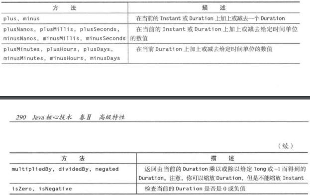
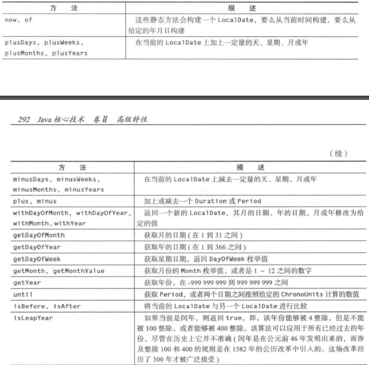
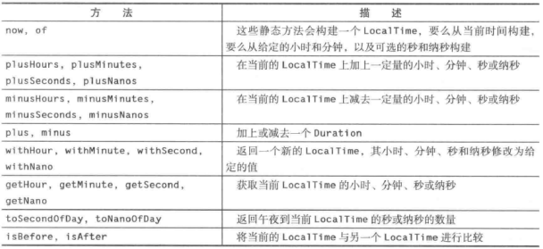

## Java 8 的日期和时间 API

### 时间线

Java 的 Date 和 Time API 规范要求 Java 使用的时间尺度为：

* 每天 86400 秒
* 每天正午与官方时间精确匹配
* 在其他时间点上，以精确定义的方式与官方时间接近匹配

在 Java 中，`Instant` 表示时间线上的某个点。被称为“新纪元”的时间线原点被设置为UNIX初始时间。从该原点开始，时间按照每天 86400 秒向前或向回度量，精确到纳秒。`Instant` 的值向回可追朔 10 亿年（`Instant.MIN`）。最大值 `Instant.MAX` 是公元 `1000000000` 年的 12 月 31 日

静态方法调用 `Instant.now()` 会给出当前的时刻。可以按照常用的方式，用 `equals` 和 `compareTo` 方法来比较两个 `Instant` 对象，因此可以将 `Instant` 对象用作时间戳

为了得到两个时刻之间的时间差，可以使用静态方法 `Duration.between` 

```java
// 获取算法的运算时间
Instant start = Instant.now();
runAlgorithm();
Instant end = Instant.now();
Duration timeElapsed = Duration.between(start, end);
long millis = timeElapsed.toMillis();		
```

`Duration` 是两个时刻之间的时间量。可以通过调用 `toNanos` 、`toMillis`、`getSeconds`、`toMinutes`、`toHours` 和 `toDays` 来获得 `Duration` 按照传统单位度量的时间长度

`Duration` 对象的内部存储所需的空间超过了一个 `long` 的值，因此秒数存储在一个 `long` 中，而纳秒数存储在一个额外的 `int ` 中。如果想要让计算精确到纳秒级，那么实际上需要整个 `Duration` 的存储内容。如果不需要这么高的精度，可以用 long 的值来执行计算，然后调用 `toNanos`

​			*用于时间的Instant和Duration的算术运算*



`Instant` 和 `Duration` 类都是不可修改的类，所以 `multipliedBy` 和 `minus` 这样的方法都会返回一个新的实例

### 本地时间

在 Java API 中有两种人类时间，本地日期/时间和时区时间。本地日期/时间包含日期和当天的时间，但是与时区信息没有任何关联。1903 年 6 月 14 日就是一个本地日期的实例。因为这个日期既没有当天的时间，也没有时区信息，因此它并不对应精确的时刻。1969 年 7 月 16 日 09：32：00 EDT 是一个时区日期/时间，表示的是时间线上的一个精确的时刻

`LocalDate` 是带有年、月、日的日期。为了构建 `LocalDate` 对象，可以使用 `now` 或 `of` 静态方法：

```java
LocalDate today = LocalDate.now();
LocalDate alonzosBirthday = LocalDate.of(1903, 6, 14);
alonzosBirthday = LocalDate.of(1903, Month.JUNE, 14);
```

​		*LocalDate的方法*

​		

### 日期调整器

对于日程安排应用来说，经常需要计算诸如"每个月的第一个星期二"这样的日期。`TemporalAdjusters` 类提供了大量用于常见调整的静态方法。可以将调整方法的结果传给 `with` 方法

```java
// 获取某个月的第一个星期二
LocalDate firstTuesday = LocalDate.of(year, month, 1).with(TemporaAdjusters.nextOrSame(DayOfWeek.TUESDAY));
```

`with` 方法返回一个新的 `LocalDate` 对象，而不会修改原来的对象

​	*TemporalAdjusters类中的日期调整器*

​	

还可以通过实现 `TemporalAdjuster` 接口来创建自己的调整器。

```java
// 计算下一个工作日的调整器
TemporalAdjuster NEXT_WORKDAY = w -> {
    LocalDate result = (LocalDate) w;
    do {
        result = result.plusDays(1);
    }
    while (result.getDayOfWeek().getValue() >= 6);
    return result;
}
LocalDate backToWork = today.with(NEXT_WORKDAY);
```

`lambda` 表达式的参数类型为 `Temporal` ，它必须被强制转型为 `LocalDate`。可以用 `ofDateAdjuster` 方法来避免这种强制转型，该方法期望得到的参数是类型为 `UnaryOperator<LocalDate>` 的 `lambda` 表达式

```java
TemporalAdjuster Next_WORKDAY = TemporalAdjusters.ofDateAdjuster(w -> {
    LocalDate result = w;
    do {
        result = result.plusDays(1);
    }
    while (result.getDayOfWeek().getValue() >= 6);
    return result;
})
```

### 本地时间

`LocalTime` 表示当日时刻，如：15：30：30。可以用  `now` 或 `of` 方法创建其实例

`LocalTime rightNow = LocalTIme.now()`

`LocalTime bedtime = LocalTime.of(22, 30);`

​		*LocalTime的方法*

​		

