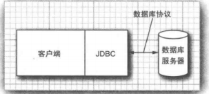

## java 中输出与正则相关

### 输入与输出流

可以从其中读入一个字节序列的对象称为输入流，而可以向其中写入一个字节序列的对象称为输出流。这些字节序列的来源地和目的地可以是文件、网络连接、内存块。抽象类 `InputStream` 和 `OutputStream` 是输入输出的基类

因为面向字节的流不便于处理以 `Unicode` 形式存储信息（Unicode 中每个字符都使用了多个字节来表示），所以从抽象类 `Reader` 和 `Writer` 中继承出来了一个专门用于处理 `Unicode` 字符的单独的类层次结构。这些类拥有的读入和写出操作都是基于两字节的 `Char` 值（即，`Unicode` 码元），而不是基于 `byte` 值的

#### 读写字节

`InputStream` 类的抽象方法

```java
// 读入一个字节，并返回读入的字节，或者在遇到输入源结尾时返回 -1
abstract int read();
```

在设计具体的输入流时，必须覆盖这个方法以提供适用的功能。`InputStream` 类还有若干非抽象的方法，它们可以读入一个字节数组，或者跳过大量的字节。这些方法都要调用抽象的 `read` 方法，因此各个子类都只需覆盖这一个方法

`OutputStream` 类定义了下面的抽象方法

```java
// 向某个输出位置写一个字节
abstract void write(int b);
```

`read` 和 `write` 方法在执行时都将阻塞，直至字节确实被读入或写出。这就意味着如果不能被立即访问，那么当前的线程将被阻塞。这使得在这两个方法等待指定的流变为可用的这段时间里，其他的线程就有机会去执行有用的工作

`available` 方法可以检查当前可读入的字节数量

```java
// 该代码片段不会被阻塞
int bytesAvailable = in.available();
if (bytesAvailable > 0) {
    byte[] data = new byte[bytesAvailable];
    in.read(data);
}
```

完成输入、输出流的读写时，应该通过调用 `close` 方法来关闭它，这个调用会释放掉占用的操作系统资源。关闭一个输出流的同事还会冲刷用于该输出流的缓冲区；所有被临时置于缓冲区中，以便用更大的包的形式传递的字节在关闭输出流时都将被送出。特别是，如果不关闭文件，那么写出字节的最后一个包可能将永远也得不到传递。可以使用 `flush` 方法来手动冲刷这些输出

#### java 中流家族

*java输入输出流家族*


对 `Unicode` 文本，可以使用抽象类 `Reader` 和 `Writer` 的子类


还有 4 个附加的接口：`Closeable`、`Flushable`、`Readable`、`Appendable` 前两个接口非常简单，分别拥有下面的方法

```java
void close() throws IOException
void flush()
```

`InputStream` 、`OutputStream` 、`Reader` 、`Writer` 都实现了 `Closeable` 接口。`java.io.Closeable` 接口扩展了 `java.lang.AutoCloseable` 接口。对任何 `Closeable` 进行操作时，都可以使用 `try-with-resource` 语句。`Closeable` 接口的 `close` 方法只抛出 `IOException`，而 `AutoCloseable.close` 方法可以抛出任何异常



而 `OutputStream` 和 `Writer` 还实现了 `Flushable` 接口。

`Readable` 接口只有一个方法

```java
int read(CharBuffer cb)
```

`CharBuffer` 类拥有按顺序和随机地进行读写访问的方法，它表示一个内存中的缓冲区或一个内存映像的文件

`Appendable` 接口有两个用于添加单个字符和字符序列的方法

```java
Appendable append(char c)
Appendable append(CharSequence s)
```

只有 `Writer` 实现了 `Appendable` 接口

#### 组合输入、输出流过滤器

`FileInputStream` 和 `FileOutputStream` 可以提供附着在一个磁盘文件上的输入流和输出流，需要向构造器提供文件名或文件的完整路径名。所有在 `java.io` 中的类都将相对路径名解释为以用户工作目录开始，可以通过调用 `System.getProperty("user.dir")` 来获得这个信息。这些类只支持在字节级别上的读写。即只能读入字节和字节数组

### 文本输入与输出

在保存数据时，可以选择二进制格式或文本格式。在存储文本字符串时，需要考虑字符编码方式。在 Java 内部使用的 `UTF-16` 编码方式。

`OutputStreamWriter` 类将使用选定的字符编码方式，把 `Unicode` 码元的输出流转换为字节流。而 `InputStreamReader` 类将包含字节（用某种字符编码方式表示的字符）的输入流转换为可以产生 `Unicode` 码元的读入器。应该总是在 `InputStreamReader` 的构造器中选择一种具体的编码方式

对于文本输出，可以使用 `PrintWriter` 。这个类拥有以文本格式打印字符串和数字的方法

```java
PrintWriter out = new PrintWriter("employee.txt", "UTF-8");
// 等同于以下代码
PrintWriter out = new PrintWriter(new FileOutputStream("employee.txt"), "UTF-8");
```

如果写出器设置为自动冲刷模式，只要 `println` 被调用，缓冲区中的所有字符都会被发送到它们的目的地（打印写出器总是带缓冲区的）。默认情况下，自动冲刷机制是禁用的。可以通过使用 `PrintWriter(Writer out, Boolean autoFlush)` 来启用或禁用自动冲刷机制。`print` 方法不抛出异常，可以调用 `checkError` 方法来查看输出流是否出现了某些错误

#### 读入文本输入

最简单的处理任意文本的方式就是使用 `Scanner` 类。可以从任何输入流中构建 `Scanner` 对象

```java
// 将短小的文本文件像下面这样读入到一个字符串中
String content = new String(Files.readAllBytes(path), charset);
// 将这个文件一行行的读入
List<String> lines = Files.readAllLines(path, charset);
// 如果文件太大，可以将行惰性处理为一个 Stream<String> 对象
try (Stream<String> lines = Files.lines(path, charset))
{
    
}
```

`BufferedReader` 类有一个 `lines` 方法，可以产生一个 `Stream<String>` 对象，`BufferedReader` 没有用于任何读入数字的方法

#### 字符编码方式

输入和输出流都是用于字节序列的。Java 针对字符使用的是 `Unicode` 标准。每个字符或“编码点”都具有一个 21 位的整数。有多种不同的字符编码方式，即将这些 21 位数字包装成字节的方法有多种，最常见的是 `UTF-8`。它将每个 `Unicode` 编码点编码为 1 到 4 个字节的序列。好处是传统的包含了英语中用到的所有字符的 ASCII 字符集中的每个字符都只会占用一个字节。Java 中使用的是 `UTF-16` ，它会将每个 `Unicode` 编码点编码为 1 个或 2 个 16 位值。有两种形式的 `UTF-16` 高位优先和低位优先。为了表示使用的是哪一种格式，文件可以以"字节顺序标记"开头，这个标记为 16 位数值 `0xFEFF`。读入器可以使用这个值来确定字节顺序。然后丢其它

#### 读写二进制数据

`DataOutput` 接口定义了用于二进制写数组，字符，BOOLEAN 值和字符串的方法。

#### 随机访问文件

`RandomAccessFile` 类可以在文件中的任何位置查找或写入数据。磁盘文件都是随机访问的，但是与网络套接字通信的输入、输出流却不是。打开一个随机访问文件，只用于读入或者同时用于读写，可以通过字符串 `r` 用于读入访问或 `rw` 用于读入、写出访问，作为构造器的第二个参数来指定这个选项

```java
RandomAccessFile in = new RandomAccessFile("employee.dat", "r");
RandomAccessFile inOut = new RandomAccessFile("employee.dat", "rw");
```

将已有文件作为 `RandomAccessFile` 打开时，这个文件并不会被删除

随机访问文件有一个表示下一个将被读入或写出的字节所处位置的文件指针，`seek` 方法可以用来将这个文件指针设置到文件中的任意字节位置，`seek` 的参数是一个 `long` 类型的整数，它的值位于 0 到文件按照字节来度量的长度之间。`getFilePointer` 方法返回文件指针的当前位置

`RandomeAccessFile` 类同时实现了 `DataInput` 和 `DataOutput` 接口。

#### ZIP 文档

ZIP 文档通常以压缩格式存储了一个或多个文件，每个 ZIP 文档都有一个头，包含诸如每个文件名字和所使用的压缩方法等信息。Java 中，可以使用 `ZipInputStream` 来读入 ZIP 文档。`getNextEntry` 方法可以返回一个描述这些项的 `ZipEntry` 类型的对象。向 `ZipInputStream` 的 `getInputStream` 方法传递该项可以获取用于读取该项的输入流。然后调用 `closeEntry` 来读入下一项。

要写出到 ZIP 文件，可以使用 `ZipOutputStream` ，而对于希望放入到 ZIP 文件中的每一项，都应该创建一个 `ZipEntry` 对象，并将文件名传递给 `ZipEntry` 的构造器，它将设置其他诸如文件日期和解压缩方法等参数。使用 `ZipOutputStream` 的 `putNextEntry` 方法来开始写出新文件，并将文件数据发送到 ZIP 输出流中。当完成时，需要调用 `closeEntry`

### 对象输入输出流与序列化

#### 保存和加载序列化对象

为了保存对象数据，首先需要打开一个 `ObjectOutputStream` 对象

```java
// 对象写入
ObjectOutputStream out = new ObjectOutputStream(new FileOutputStream("employee.dat"));
Manager boss = new Manager("Carl Cracker", 80000, 1987, 12, 15);
// 对象读入,以这些对象被写出时的顺序获得它们
ObjectInputStream in = new ObjectInputStream(new FileInputStream("employee.dat"));
Manager e1 = in.readObject();
```

对希望在对象输出流中存储或从对象输入流中恢复的所有类都应进行一下修改，这些类必须实现 `Serializable` 接口。`Serializable` 接口没有任何方法

只有在写出对象时才能用 `writeObject/readObject` 方法，对于基本类型值，需要使用诸如 `writeInt/readInt` 或 `writeDouble/readDouble` 这样的方法（对象流泪都实现了 `DataInput/DataOutput` 接口）

在底层是 `ObjectOutputStream` 在浏览对象的所有域，并存储它们的内容。当写出一个 Employee 对象时，其名字、日期和薪水域都会被写出到输出流中。但是，当一个对象被多个对象共享，作为它们各自状态的一部分时，当对象被重新加载时，它可能占据的是与原来完全不同的内存地址

每个对象都是用一个序列号保存的，这就是这种机制，其算法是

* 对遇到的每一个对象引用都关联一个序列号
* 对于每个对象，当第一次遇到时，保存其对象数据到输出流中
* 如果某个对象之前已经被保存过，那么只写出“与之前保存过的序列号为 x 的对象相同”

读回对象时，整个过程是反过来的

* 对于对象输入流中的对象，在第一次遇到其序列号时，构建它，并使用流中数据来初始化它，然后记录这个顺序号和新对象之间的关联
* 当遇到“与之前保存过的序列号为 x 的对象相同” 标记时，获取这个顺序号相关联的对象引用

序列化将对象保存到磁盘文件中，并按照它们被存储的样子获取它们。序列化的另一种非常重要的应用是通过网络将对象集合传送到另一台计算机上。

对象序列化是以特殊的文件格式存储对象数据的。每个文件都是以 `AC ED` 这两个字节的魔幻数字开始的。后面紧跟着对象序列化格式的版本号，目前是 `00 05`

#### 修改默认的序列化机制

某些数据域是不可以序列化的（只对本地方法有意义的存储文件句柄或窗口句柄的整数值，这种信息在稍后重新加载对象或将其传送到其他机器上时都是没有用处的）Java 拥有一种很简单的机制来防止这种域被序列化，将它们标记成是 `transient` 的。如果这些域属于不可序列化的类，也需要将它们标记成 `transient` 的。瞬时的域在对象被序列化时总是被跳过的。

序列化机制为单个类提供了一种方式，去向默认的读写行为添加验证或任何其他想要的行为。可序列化的类可以定义具有下列签名的方法

```java
private void readObject(ObjectInputStream in) throws IOException, ClassNotFoundException;
private void writeObject(ObjectOutputStream out) throws IOException;
```

定义该方法后，数据域就再也不会被自动序列化，取而代之的是调用这些方法。`readObject` 和 `writeObject` 方法只需要保存和加载它们的数据域，而不需要关心超类数据和任何其他类的信息。

除了让序列化机制来保存和恢复对象数据，类还可以定义它自己的机制。为了做到这一点，这个类必须实现 `Exterbakuzable` 接口，需要定义两个方法

```java
public void readExternal(ObjectInputStream in) throws IOException, ClassNotFoundException;
public void writeExtenal(ObjectOutputStream out) throws IOException
```

这些方法对包括超类数据在内的整个对象的存储和恢复负全责。在写出对象时，序列化机制在输出流中仅仅只是记录该对象所属的类。在读入可外部化的类时，对象输入流将用无参构造器创建一个对象，然后调用 `readExternal` 方法。

`readObject` 和 `writeObject` 方法是私有的，并且只能被序列化机制调用。`readExternal`  和 `writeExternale` 方法是公共的，`readExternal` 还潜在地允许修改现有对象的状态

#### 为克隆使用序列化

序列化机制提供了一种克隆对象的简便途径，只要对应的类是可序列化的即可。直接将对象序列化到输出流中，然后将其读回。这样产生的新对象是对现有对象的一个深拷贝。在此过程中，不必将对象写出到文件中，可以用 `ByteArrayOutputStream` 将数据保存到字节数据中

### 操作文件

#### Path

`Path` 表示的是一个目录名序列，其后还可以跟着一个文件名。路径中的第一个部件可以是跟部件（`/` 或 `C:\`），或允许访问的根部件取决于文件系统。以根部件开始的路径是绝对路径；否则，就是相对路径。

静态的 `Paths.get` 方法接受一个或多个字符串，并将它们用默认文件系统的路径分隔符连接起立，然后解析连接起来的结果，如果其表示的不是给定文件系统中的合法路径，那么就抛出 `InvalidPathException` 异常。这个连接起来的结果就是一个 `Path` 对象。`get` 方法可以获取包含多个部件构成的单个字符串。

路径不必对应着某个实际存在的文件，仅仅只是一个抽象的名字序列，当要创建文件时，首先要创建一个路径，然后才调用方法去创建对应的文件

组合或解析路径调用 `p.resolve(q)` 将按照下列规则返回一个路径

* 如果 q 是绝对路径，则结果就是 q
* 否则，根据文件系统的规则，将 P 后面跟着 q 作为结果

`resolve` 可以接收路径和字符串。`resolveSibling`  通过解析指定路径的父路径产生其兄弟路径。`resolve` 的对立面是 `relativize` ，调用 `p.relativize(r)` 将产生路径 q，而对 q 进行解析的结果是 `r`

`normalize` 方法将移除所有冗余的 `.` 和 `..` 部件（或者文件系统认为冗余的所有部件）

`toAbsolutePath` 方法将产生给定路径的绝对路径，该绝对路径从根部件开始

`Path` 类有许多有用的方法用来将路径断开。`getParent()`，`getFileName()`，`getRoot()`

与遗留系统的 `API` 交互，使用的是 `File` 类而不是 `Path` 接口。`Path` 接口有一个 `toFile` 方法，而 `File` 类有一个 `toPath` 方法

#### 读写文件

`Files` 类可以使得普通文件操作变得快捷。

```java
// 读取文件的所有内容
byte[] bytes = Files.readAllBytes(path);
// 将文件当作字符串读入
String content = new String(bytes, charset);
// 将文件当作序列读入
List<String> lines = Files.readAllLines(Path, charset);
// 写出一个字符串到文件中
Files.write(path, content.getBytes(charset));
// 向指定文件追加内容
Files.write(path, content.getBytes(charset), StandardOpenOption.APPEND);
// 将一个行的集合写出到文件中
File.write(path, lines);
```

#### 创建文件和目录

```java
// 创建新目录，路径中除最后一个部件外，其他部分都必须是已存在的
Files.createDirectory(path);
// 创建路径中的中间目录
Files.createDirectories(path);
// 创建一个空文件, 如果文件已经存在，那么这个调用就会抛出异常。检查文件是否存在和创建文件是原子性的，如果文件不存在，该文件就会被创建，并且其他程序在此过程中是无法执行文件创建操作的
Files.createFile(path);
// 创建临时文件或临时目录：dir 是 path 对象，prefix 和 suffix 是可以为 null 的字符串
Path newPath = Files.createTempFile(dir, prefix, suffix);
Path newPaht = Files.createTempFile(prefix, suffix);
Path newPath1 = Files.createTempFileDirectory(dir, prefix);
Path newPath2 = Files.createTempDirectory(prefix);
```

#### 复制移动删除文件

```java
// 将文件从一个位置复制到另一个位置
Files.copy(FromPath, toPath);
// 移动文件（复制并删除原文件）,如果目录路径已经存在，复制或移动将失败。
Files.move(fromPath, toPath);
// 移动并覆盖，复制所有的文件属性
Files.copy(fromPath, toPath, StandardCopyOption.REPLACE_EXISTING, StandardCopyOption.COPY_ATTRIBUTES)
// 原子性移动
Files.move(fromPath, toPath, StandardCopyOption.ATOMIC_MOVE)
// 输入流复制到 Path 中
Files.copy(inputStream, toPath);
// 将 Path 复制到输出流中
Files.copy(fromPath, outputStream);
// 删除文件
Files.delete(path);
// 删除可能为空文件
boolean deleted = Files.deleteIfExists(path);
```

用于文件操作的标准选项

`StandardOption`；与 `newBufferedWriter`，`newInputStream`，`newOutputStream`，`write` 一起使用

* `READ`			用于读取而打开
* `WRITE`	                用于写入而打开
* `APPEND`                  如果用于写入而打开，那么在文件末尾追加
* `TRUNCATE_EXISTING`                          如果用于写入而打开，那么移除已有内容
* `CREATE_NEW`                                         创建新文件并且在文件已存在的情况下会创建失败
* `CREATE`                                                 自动在文件不存在的情况下创建文件
* `DELETE_ON_CLOSE`                              当文件被关闭时，尽可能地删除文件
* `SPARSE`                                                 给文件系统一个提示，表示该文件是稀疏的
* `DSYN|SYN`                                             要求对文件数据|数据和元数据的每次更新都必须同步地写入到存储设备中

`StandardCopyOption`；与 `copy`，`move` 一起使用

* `ATOMIC_MOVE`                                              原子性地移动文件

* `COPY_ATTRIBUTES`				       复制文件的属性
* `REPLACE_EXISTING`                                    如果目标已存在，则替换它

`LinkOption` 与上面所有方法以及 `exists`，`isDirectroy`，`isRegularFile` 等一起使用

* `NOFOLLOW_LINKS`                                               不要跟踪符号链接

`FileVisitOption`; 与 `find`，`walk`，`walkFileTree` 一起使用

* `FOLLOW_LINKS`                                               跟踪符号链接

#### 获取文件信息

下面的静态方法都将返回一个 `boolean` 值，表示检查路径的某个属性的结果

* `exists`
* `isHidden`
* `isReadable`, `isWritable`, `isExecutable`
* `isRegularFile`，`isDirectory`，`isSymbolicLink`

* `size` 方法返回文件的字节数 

```java
long fileSize = Files.size(path);
```

* `getOwner()` 方法将文件的拥有者作为 `java.nio.file.attrubute.UserPrincipal` 的一个实例返回

  所有的文件系统都会报告一个基本属性集，它们被封装在 `BasicFileAttrubutes` 接口中，这些属性与上述信息有部分重叠。基本文件属性包括：

  创建文件，最后一次访问以及最后一次修改文件的时间，这些时间都表示成 `java.nio.file.attribute.FileTime`

  文件是常规文件，目录还是符号链接，或者都不是

  文件尺寸

  文件主键，这是某种类的对象，具体所属类与文件系统相关，有可能是文件唯一标识符，也可能不是

  要获取这些属性，可以调用

  ```java
  BasicFileAttributes attributes = Files.readAttributes(path, BasicFileAttributes.class)
  ```

  如果文件系统兼容 `POSIX`，可以获取一个 `PosixFileAttributes`

  ```java
  PosixFileAttributes attributes = Files.readAttributes(path, PosixFileAttributes.class)
  ```

#### 访问目录中的项

静态的 `Files.list` 方法会返回一个可以读取目录中各个项的 `Stream<Path>` 对象。目录是被惰性读取的，这样处理具有大量项的目录可以变得更高效。`list` 方法不会进入子目录。为了处理目录中的所有子目录，需要使用 `File.walk` 方法

可以通过调用 `File.walk(pathToRoot, depth)` 来限制想要访问的树的深度。两种 `walk` 方法都具有 `FileVisitOption...` 的可变长参数，但是只能提供一种选项 `FOLLOW_LINKS` 

如果要过滤 `walk` 返回的路径，并且过滤标准涉及与目录存储相关的文件属性，应该使用 `find` 方法来替代 `walk` 方法。

#### 使用目录流

`Files.walk` 方法会产生一个可以遍历目录中所有子孙的 `Stream<Path>` 对象。有时，需要对遍历过程进行更加细粒度的控制。在这种情况下，应该使用 `File.newFirectoryStream` 对象，它会产生一个 `DirectoryStream` 它是专门用于目录遍历的接口。

```java
try (DirectoryStream<Path> entries = Files.newDirectoryStream(dir))
{
    for (Path entry: entries) {
        
    }
}
```

可以使用 `glob` 模式来过滤文件

`try (DirectoryStream<Path> entries = Files.newDirectoryStream(dir, "*.java"))`


如果想要访问某个目录的所有子孙成员，可以转而调用 `walkFileTree` 方法，并向其传递一个 `FileVisitor` 类型的对象，这个对象会得到下列通知：

* 在遇到一个文件或目录时：

  ```java
  FileVisitResult visitFile(T path, BasicFileAttributes attrs)
  ```

* 在一个目录被处理前：

  ```java
  FileVisitResult preVisitDirectory(T dir, IOException ex)
  ```

* 在一个目录被处理后：

  ```java
  FileVisitResult postVisitDirectory(T dir, IOException ex)
  ```

* 在试图访问文件或目录时发生错误，例如没有权限打开目录：

  ```java
  FileVisitResult visitFileFailed(path, IOException)
  ```

对于上述每种情况，都可以指定是否希望执行下面的操作

* 继续访问下一个文件

  `FileVisitResult.CONTINUE`

* 继续访问，但是不再访问这个目录下的任何项

  `FileVisitResult.SKIP_SUBTREE`

* 继续访问，但是不再访问这个文件的兄弟文件

  `FileVisitResult.SKIP_SIBLINGS`

* 终止访问

  `FileVisitResult.TERMINATE`

当有任何方法抛出异常时，就会终止访问，而这个异常会从 `walkFileTree` 方法中抛出

#### ZIP 文件系统

`Paths` 类会在默认文件系统中查找路径，即在用户本地磁盘中的文件。

```java
// 建立一个文件系统，包含 ZIP 文档中的所有文件
FileSystem fs = FileSystems.newFileSystem(Paths.get(zipname), null)
// 根据文件名，从 ZIP 文档中复制出这个文件
Files.copy(fs.getPath(sourceName), targetPath);
```

#### 内存映射文件

`java.nio` 包使用内存映射变得十分简单，首先从文件中获得一个通道 `channel`，用于磁盘文件的一种抽象，使可以访问访问诸如内存映射，文件加锁机制以及文件间快速数据传递等操作系统特性

```java
FileChannel channel = FileChannel.open(path, options);
```

通过调用 `FileChannel` 类的 `map` 方法从这个通道中获得一个 `ByteBuffer`。

* `FileChannel.MapMode.READ_ONLY`: 产生的缓冲区是只读的，任何对该缓冲区写入的尝试都会导致 `ReadOnlyBufferException` 异常

* `FileChannel.MapMode.READWRITE`：所产生的缓冲区是可写的，任何修改都会在某个时刻写回到文件中。其他映射同一个文件的程序可能不能立即看到这些修改，多个程序同时进行文件映射的确切行为是依赖于操作系统的

* `FileChannel.MapMode.PRIVATE`：产生的缓冲区是可写的，但是任何修改对这个缓冲区来说都是私有的，不会传播到文件中

  一旦有了缓冲区，就可以使用 `ByteBuffer` 类和 `Buffer` 超类的方法读写数据。缓冲区支持顺序和随机数据访问，有一个可以通过 `get` 和 `put` 操作来移动的位置。