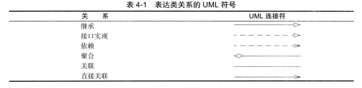

## 对象和类相关

### 对象的三个主要特性

* 对象的行为（behavior）：同一个类的所有对象实力，由于支持相同的行为而具有家族式的相似性。对象的行为是用可调用的方法定义的
* 对象的状态（state）：每个对象都保存着描述当前特征的信息。对象的状态可能会随着时间而发生改变，但这种改变不会是自发的。对象状态的改变必须通过调用方法实现（如果不经过方法调用就可以改变对象状态，则封装性遭到了破坏）
* 对象的标识（identity）：每个对象都有一个唯一的身份。

### 对象构造

#### 重载

如果多个方法有相同的名字、不同的参数，便产生了重载。编译器必须挑选出具体执行那个方法。它通过用各个方法给出的参数类型与特定方法调用所使用的值类型进行匹配来挑选出相应的方法。如果编译器找不到匹配的参数，就会参数编译时错误。

#### 构造方法

如果在编写一个类时没有编写构造器，那么系统就会提供一个无参数构造器。这个构造器将所有的实例域设置为默认值。如果类中提供了至少一个构造器，但是没有提供无参数的构造器，则在构造对象时如果没有提供参数就会被视为不合法。

- 构造方法必须具备和所在类相同的名字
- 构造方法没有返回值类型，连 void  也没有
- 构造方法可以重载，可以有多个同名的构造方法，但它们要签名不同，这样易用不同的初始数据值来构造对象
- 在构造方法中，使用 `this` 调用其他构造器，应在任何其他可执行语句之前出现

#### 初始化块

在一个类的声明中，可以包含多个代码块。只要构造类的对象，这些块就会被执行。首先运行初始化块，然后才运行构造器的主体部分。如果对类的静态域进行初始化的代码比较复杂，那么可以使用静态的初始化块，在类第一次加载的时候，将会进行静态域的初始化。与实例域一样，除非将它们显式地设置成其他值，否则默认的初始值是 0、false、null。所有的静态初始化语句以及静态初始化块都将按照类定义的顺序执行

**调用构造器的具体处理步骤**

1）所有数据域被初始化为默认值（0，false 或 null）

2）按照在类声明中出现的次序，依次执行所有域初始化语句和初始化块

3）如果构造器第一行调用了第二个构造器，则执行第二个构造器主体

4）执行这个构造器的主体

#### 对象析构与 `finalize` 方法

Java 不支持析构器。可以为任何一个类添加 `finalize` 方法。`finalize` 方法将在垃圾回收器清除对象之前调用。在实际应用中，不要依赖于使用 `finalize` 方法回收任何短缺的资源，因为很难知道这个方法什么时候才能够调用。`System.runFinalizersOnExit(true)` 的方法能够确保 `finalizer` 方法在 `java` 关闭前被调用。不过这个方法并不安全，替代的方法是使用方法 `Runtime.addShutdownHook` 添加关闭钩（shutdown hook）。

### 类之间的关系

* 依赖（uses-a）：如果一个类的方法操纵另一个类的对象，即一个类依赖于另一个类，应该尽可能将相互依赖的类减少降低类之间的耦合
* 聚合（has-a）：一个对象的属性包含另一些对象
* 继承（is-a）：一个类扩展了另一个类的功能

#### 通过引用变量访问对象

* 对象是通过对象引用变量来访问的，该变量包含对对象的引用，从本质上来说，一个类是一个程序员定义的类型。类是一种引用类型**对象引用变量中只包含了对该对象的引用，严格来说，对象引用变量和对象是不同的，但是大多数情况下，这种差异是可以忽略的**
* 数组被看作是对象，数组是用 `new` 操作符创建的，一个数组变量实际上是一个包含数组引用的变量
* 给方法传递一个对象，是将对象的引用传递给方法

#### 对象操作符号 `.`

* `objectRefVar.dataField`  引用对象的数据域 （实例变量，依赖于某个具体事例）
* `objectRefvar.method(arguments)` 调用对象的方法（实例方法，具体实例上调用它）

#### 引用数据域

如果一个引用类型的数据域没有引用任何对象，那么这个数据域既有一个特殊的 Java 值 `null` 

* 引用类型数据域的默认值是 `null`
* 数值类型域的默认值是 `0`
* Boolean 类型数据域默认值是 `false`
* char 类型的数据域的默认值是 `\u0000`

#### 基本类型变量和引用类型变量的区别

每个变量都代表一个存储值的内存位置。声明一个变量时，就是在告诉编译器这个变量可以存放什么类型的值。对基本类型变量来说。对应内存所存储的值是基本类型的值。对引用类型变量来说，对应内存所存储的值是一个引用，是对象的存储地址。将一个变量赋值给另一个变量时，另一个变量就被赋予同样的值。对基本对象就是将一个变量的实际值赋给另一个变量。对引用变量就是将一个变量的引用赋给另一个变量

* `Object` 类 `java.lang.Object`

  __Java 中的所有类都继承自 Object 类，如果定义一个类时，没有指定继承性，那么这个类的父类就被默认为是 Object__

  ```Java
  public Sting toString();	// 返回对象类名@内存地址的字符串
  public boolean equals(Object o);	// 测试两个对象是否相等，指向同一个对象
  ```

* `ArrayList`  类 `ArrayList` 对象可以用于存储一个对象列表，`ArrayList` 来存储不限定个数的对象，ArrayList 是一种泛型类，具有一个泛型类型 `E`，创建一个 `ArrayList` 时，可以指定一个具体的类型来替换 `E`

  ```java
  ArrayList<AConcreteType> list = new ArrayList<AConcreteType>()；
  ArrayList<java.util.Date> dates = new ArrayList<java.util.Date> ();
  ArrayList<AConcreteType> list = new ArrayList<>()；
  ```

  数组和 ArrayList 之间的异同

  |       操作        |             数组              |                  ArrayList                   |
  | :---------------: | :---------------------------: | :------------------------------------------: |
  | 创建数组/数组列表 | `String[] a = new String[10]` | `ArrayList list<String> = new ArrayList<>()` |
  |     引用元素      |          `a[index]`           |              `list.get(index)`               |
  |     更新元素      |     `a[index] = "value"`      |          `list.set(index, "value")`          |
  |     返回大小      |          `a.length`           |                `list.size()`                 |
  |    添加新元素     |                               |             `list.add("value")`              |
  |  插入一个新元素   |                               |          `list.add(index, "value")`          |
  |   删除一个元素    |                               |             `list.remove(index)`             |
  |   删除一个元素    |                               |            `list.remove(Object)`             |
  |   删除所有元素    |                               |                `list.clear()`                |

  从数组创建一个数组列表,数组静态方法 `asList` 返回一个列表，传递给 `ArrayList` 构造方法用于创建一个 `ArrayList`

  ```java
  String[] array = {"red", "green", "blue"};
  ArrayList<String> list = new ArrayList<>(Arrays.asList(array));	
  ```

  从数组列表创建一个数组,数组列表的 `toArray(array)` 将 list 的内复制到 array 中

  ```java
  String[] array1 = new String[list.size()];
  list.toArray(array1);
  ```

  如果数组列表的元素时可比较的，整数，浮点数，字符串，则可以使用 `java.util.Collections` 类中的静态的 `sort` 方法来对元素进行排序

  ```java
  Integer[] array = {3,5,95,4,15,34,3,6,5};
  ArrayList<Integer> list = new ArrayList<>(Arrays.asList(array));
  java.util.Collections.sort(list);
  ```

  `java.util.Collections` 类中的静态的 `max` 和 `min` 方法返回列表中的最大和最小元素, `shuffle` 来随机打乱列表的元素

#### 静态变量，常量和方法

* 静态变量被类中的所有对象所共享。静态方法不能访问类中的实例成员，静态变量，静态变量将变量值存储在一个公共的内存地址，因为它是公共的地址，__所以如果某一个对象修改了静态变量的值，那么同一个类的所有对象都会受到影响，java 支持静态方法和静态变量，无需创建类的实例就可以调用静态方法__
* 实例方法可以调用实例方法和静态方法，以及访问实例数据或者静态数据。静态方法可以调用静态方法以及访问静态数据域。然而，静态方法不能调用实例方法或者访问实例数据，因为静态方法不属于某个特定的对象。

#### 可见性修饰符

* 可见性修饰符可用用于确定一个类及它成员的可见性

* 可在类，方法和数据域前使用 `public` 修饰符，表示它们可以被任何其他的类访问。__表示它们可以被任何其他类访问，如果没有使用可见性修饰符，那么默认类，方法和数据域是可以被同一个包的任何一个类方法。这称为 包私有 （package-private）或 包内访问（package-access）__

* 包可用用来组织类，在使用是在程序文件开头声明 `package packageName` ,如果定义类中没有声明包，就表示它放在默认包中。

* `private` 修饰符限定方法和数据域只能在它自己的类中访问。

* `protected` 一个类中的受保护成员可用从子类中访问，父类中被保护的数据域或方法可以在它子类中访问

* 可见性递增 `私有 -> 默认 -> 被保护 -> 公共成员`

  | 类中成员修饰符 | 在同一类中可访问 | 在同一包中可访问 | 在子类内可访问 | 在不同包可访问 |
  | :------------: | :--------------: | :--------------: | :------------: | :------------: |
  |     public     |        是        |        是        |       是       |       是       |
  |   protected    |        是        |        是        |       是       |       否       |
  |    defaule     |        是        |        是        |       否       |       否       |
  |    private     |        是        |        否        |       否       |       否       |

* __如果一个变量或方法依赖于类的某个具体实例，那就应该将它定义为实例变量或实例方法。如果一个变量或方法不依赖于类的某个具体实例，就应该将它定义为静态变量或静态方法__

#### 常用 Java 修饰符

|    修饰符    |  类  | 构造方法 | 方法 | 数据 |  块  |                             解释                             |
| :----------: | :--: | :------: | :--: | :--: | :--: | :----------------------------------------------------------: |
|  （default)  | true |   true   | true | true | true |          类，构造方法，方法或数据域再所在的包中可见          |
|    public    | true |   true   | true | true |      |       类，构造方法，方法或数据域再任何包任何程序都可见       |
|   private    |      |   true   | true | true |      |           构造方法，方法或数据域只在所在的类中可见           |
|    static    |      |          | true | true | true |             定义类方法，类数据域或静态初始化模块             |
|    final     | true |          | true | true |      |        类不能扩展，方法不能在子类中修改，数据域是常量        |
|   abstract   | true |          | true |      |      |          抽象类必须被继承，抽象方法必须在子类中实现          |
|    native    |      |          | true |      |      |     用 native 修饰的方法表明它是用 Java以外的语言实现的      |
| synchronized |      |          | true |      | true |             同一时间只有一个线程可以执行这个方法             |
|   strictfp   | true |          | true |      |      | 使用精确浮点数计算模式，保证在所有的 Java 虚拟机中计算结果都相同 |
|  transient   |      |          |      | true |      |               标记实例数据域，使其不进行序列化               |

### 包

从编译器的角度来看，嵌套的包之间没有任何关系。`java.util` 包 与 `java.util.jar` 包毫无关系。每一个都拥有独立的类集合

一个类可以使用所属包中的所有类，以及其他包中的公有类。

导入包中类的关键字是 `import`，定义包的关键字是 `package`，如果没有在源文件中放置包，这个源文件的类就被放置在一个默认包中。

### 类路径

类存储在文件系统的子目录中，类的路径必须与包名匹配。

类文件可以存储在 JAR 文件中。在一个 JAR 文件中，可以包含多个压缩形式的类文件和子目录，这样既可以节省又可以改善性能。在程序中用到第三方的库文件时，通常会给出一个或多个需要包含的 JAR 文件。`JDK` 也提供了许多的 `JAR` 文件

为了使类能够被多个程序共享，需要做到下面几点：

1）把类放到一个目录中，如 `/home/user/classdir` 。这个目录是包树状结构的基目录。如果希望将 `com.horstmann.corejava.Employee` 类添加到其中，这个 `Employee.class` 类文件就必须位于子目录 `/home/user/classdir/com/horstmann/corejava` 中

2）将 JAR 文件放在一个目录中，如 `/home/user/archives`

3）设置类路径。类路径是所有博涵类文件的路径的集合


#### 数据域封装

将数据域设为私有保护数据，并且使类易于维护，为了避免对数据域的直接修改，应该使用 `private` 修饰符将数据域声明为私有。为了能修改私有数据域，可以提供一个修改器方法, 和访问器方法

* 访问器 `get()` 方法

  `public returnType getPropertyName()`

* 修改器 `set()` 方法

  `public void setPropertyName(dataType propertyValue)`

#### 对象数组

数组既可以存储基本类型值，也可以存储对象，对象的数组实际是引用变量的数组。调用 `curcleArray[1].getArea()` 实际上调用了两个层次的引用，`curcleArray` 引用了整个数组，`curcleArray[1]` 引用了一个 `circle` 对象，

**当使用 new 操作符创建对象数组后，这个数组中的每个元素都是默认值为 `null` 的引用变量**

#### 变量的作用域

__实例变量和静态变量的作用域是整个类，无论变量是在哪里声明__

* 一个类的实例变量和静态变量称为类变量或数据域，在方法内部定义的变量称为局部变量，类的变量和方法可以在类中以任意顺序出现
* 如果一个局部变量和一个类变量具有相同的名字，那么局部变量优先，而同名的类变量将被隐藏。

#### this 引用

__关键字 this 引用对象自身，它也可以在构造方法内部用于调用同一个类的其他构造方法，关键字 this 是指向调用对象本身的引用名。可用 this 关键字引用对象的实例成员__

* this 关键字可用用来引用类的隐藏数据域，在数据域的 set 方法中，经常将数据域名用作参数名。在这种情况下，这个数据域在 set 方法中被隐藏。为了给它设置新值，需要在方法中引用隐藏的数据域名。隐藏的静态变量可用简单的通过 `类名.静态变量` 方式访问。隐藏的实例变量就需要使用关键字 `this` 来引用
* 使用 this 可用调用同一个类的另一个构造方法

#### 类的关系

* **依赖：**`uses-a` 关系， 如果一个类的方法操纵另一个类的对象，则一个类依赖于另一个类（应该尽可能地将相互依赖地类减少至最少。如果类 A 不知道 B 的存在，它就不会关心 B 的任何改变，意味着 B 的改变不会导致 A 产生任何 bug）
* **聚合：** `has-a` ，一个类对象包含一些另一个类的对象，也称为关联是一种常见的二元关系，描述两个类之间的活动，关系中涉及的每个类可以有一个角色表示，描述在该关系中担当的角色，关联中涉及的每个类可以给定一个多重性，多重性可以是一个数字或一个区间，决定在关系中涉及类的多少个对象
* **继承：** `is-a`,用于表示特殊与一般关系的。

#### 类关系的 `UML` 符号



#### 将基本数据类型值作为对象处理

__基本数据类型值不是一个对象，但是可用使用 JAVA API 中的包装类来包装成一个对象，出于性能考虑，在 Java 中基本数据类型不作为对象使用。因为处理对象需要额外的系统开销，Java 提供了一个方便的方法，即将基本数据类型包装成对象。通过使用包装类，可以将基本数据类型值作为对象处理__

__根据上下文环境，基本数据类型值可以使用包装类自动转换成一个对象，反过来的自动转换也可以，将基本类型值转换为包装类的过程为装箱，将包装了转换为基本类型为开箱，Java 支持自动装开箱__

* 包装类没有无参构造方法，所有包装类都是不可变的，一旦创建该对象，它们内部值就不能再改变
* 每一个数值包装类都有常量 `MAX_VALUE` 和 `MIN_VALUE` 表示对象基本数据类型的最大值和最小值
* 每个数值包装类都包含方法 `doubleValue`, `floatValue`, `intValue` , `longValue` ,`shortValue`, 这些方法返回包装对象的 `double`, `float`, `int`, `long` , `short` 值。
* 数值包装类中包含 `compareTo` 方法用于比较两个数值，如果该数值大于，等于，小于另外一个数值时，分别返回 1，0，-1
* 数值包装类有一个有用的静态方法 `valueOf(String s)` 该方法创建一个新对象，并将它初始化为指定字符串表示的值
* 使用 `Integer` 类中的 `parseInt` 方法将一个数值字符串转换为一个 `int` 值，如果数值字符串参数不是一个合法的待转换的数值字符串，则会发生运行时错误,该方法为类的静态方法，直接调用即可

#### super 关键字

关键字 super 指这个 super 关键字所在类的父类，可用于调用父类中的普通方法和构造方法。

* 调用父类构造方法 `super()` 或 `super(parameters)`, `super` 必须出现在子类构造方法第一行，这是显示调用父类构造方法的唯一方法
* 构造方法链：构造方法可以调用重载的构造方法或父类的构造方法。如果它们都没有被显示地调用，编译器就会自动地将 `super()` 作为构造方法的第一条语句，在任何情况下，构造一个类的实例时，将会调用沿着继承链的所有父类的构造方法。当构造一个子类的对象时，子类构造方法会在完成自己的任务之前，首先调用它的父类的构造方法，如果父类继承自其他类，那么父类构造方法又会在完成自己的任务之前，调用它自身的父类的构造方法。这个过程持续到沿着这个继承体系结构的最后一个构造方法被调用为止。

* 调用父类方法：`super.方法名（参数）`

#### 方法重写

__要重写一个方法，需要在子类中使用和父类一样的签名以及一样的返回值类型来对该方法进行定义，在子类的方法前面放一个 `@Override` 来重写标注__

* 仅当实例方法是可访问时，它才能被覆盖。因为私有方法在它的类本身以外是不能访问的，所以它不能被覆盖。如果子类中定义的方法在父类中是私有的，那么这两个方法完全没有关系
* 静态方法也能被继承，但是静态方法不能被覆盖。如果父类中定义的静态方法在子类中被重新定义，那么在父类中定义的静态方法将被隐藏，可使用 `父类名.静态方法名` `SuperClass.staticMethod` 调用隐藏的静态方法
* 方法重写发生在通过继承而相关的不同类中；方法重载可以发生在同一类中，也可以发生在由于继承而相关的不同类中，方法重写具有同样的签名和返回值类型；方法重载具有同样的名字，但是不同的参数列表

#### 多态

__多态意味着父类的变量可以指向子类对象,每个子类实例都是其父类的实例，但反过来不成立，使用父类对象的地方都可以使用子类的对象__

#### 动态绑定

__方法可以在沿着继承链的多个类中实现，JVM 决定运行时候调用那个方法__

* 声明类型：一个变量必须被声明为某种类型，变量的这个类型称为它的声明类型，一个引用类型变量可以是 null 值或者是一个对声明类型实例的引用，实例可以使用声明类型或它的子类型的构造方法创建
* 实际类型：是被变量引用的对象的实际类，调用那个方法是由实际类型决定的。
* 如果对象 `o` 调用一个方法 `p`，那么 `JVM` 会依次在本类及继承链查找 `p` 方法的实现，一旦找到一个实现就停止查找，然后调用这个首先找到的实现

#### 对象转换和 instanceof 运算符

__对象转换：对象的引用可以类型转换为对另外一种对象的引用 `(class)o`__

* 总是可以将一个子类的实例转换为一个父类的变量（向上转换）因为子类的实例永远是它父类的实例。当把一个父类的实例转换为它的子类变量（向下转换）时，必须使用转换记号`(子类名)`  进行显示转换，向编译器告知具体实例类型
* 在尝试转换之前确保该对象是目标类型的实例。使用运算符 `instanceof` 来实现
* 基本类型值转换返回一个新值，而转换一个对象引用不会创建一个新的对象

### 抽象类

* 抽象类不可以用于创建对象，抽象类可以包含抽象方法，这些方法将在具体的子类中实现
* 抽象方法不能包含在非抽象类中，如果抽象父类的子类不能实现所有的抽象方法，那么子类也必须定义为抽象的，在抽象类扩展的非抽象子类中，必须实现所有的抽象方法。抽象方法是非静态的。
* 抽象类不能使用 `new` 操作符来初始化。但是，任然可以定义它的构造方法，这个构造方法在它的子类的构造方法中调用。
* 包含抽象方法的类必须是抽象的。但是，可以定义一个不包含抽象方法的抽象类，在这种情况下，不能使用 `new` 操作符创建该类的实例，这种类是用来定义新子类的基类
* 即使子类的父类是具体的，这个子类也可以是抽象的

### 接口

* 接口只包含常量和抽象方法，目的是指明相关或者不相关的多个对象的共同行为。不能使用 `new` 操作符创建接口的实例

* 一个类可以实现多个接口，但是只能继承一个父类

  |        |             变量             |                           构造方法                           |               方法               |
  | ------ | :--------------------------: | :----------------------------------------------------------: | :------------------------------: |
  | 抽象类 |            无限制            | 子类通过构造方法链调用构造方法，抽象类不能用 new 操作符实例化 |              无限制              |
  | 接口   | 必须是 `public static final` |         没有构造方法。接口不能用 `new` 操作符实例化          | 所有方法必须是公共的抽象实例方法 |

### 常用类设计原则及良好实践

* 内聚性：类应该描述一个单一的实体，而所有的类操作应该在逻辑上相互配合，支持一个一致的目的
* 一致性：应该具有一致性的提供一个公共无参构造方法，用于构建默认实例。
* 封装性：一个类应该使用 private 修饰符隐藏其数据，以免用户直接访问它。
* 依赖与类的具体实例的变量或方法必须是一个实例变量或方法如果一个变量被类的所有实例所共享，那么应该将它声明为静态的。如果方法不依赖与某个具体的实例，那就应该将它声明为静态方法。应该使用类名（而不是引用变量）引用静态变量和方法。不要从构造方法中传入参数来初始化静态数据域。最好使用 set 方法改变静态数据域

* 一个方法只需要访问类的静态域则应将它实现为静态方法