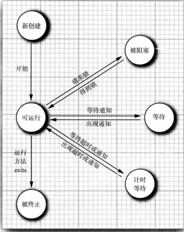

## Java 并发相关

### 中断线程

当线程的 `run()` 方法执行方法体中最后一条语句后，并经由执行 `return` 语句返回时，或者出现了在方法中没有捕获的异常时，线程将终止。在 Java 的早期版本中，还有一个 `stop` 方法，其他线程可以调用它终止线程。但，现在已经被弃用了。

没有可以强制线程终止的方法。`interrupt` 方法可以用来请求终止线程，当对一个线程调用 `interrupt` 方法时，线程的终端状态将被置位。这是每一个线程都具有的 `boolean` 标志。每个线程都应该不时检查这个标志，以判断线程是否被中断

要确定中断状态是否被置位，首先调用静态的 `Thread.currentThread` 方法获得当前线程，然后调用 `isInterrupted` 方法，但如果线程被阻塞，就无法检测中断状态。当在一个被阻塞的线程（调用 `sleep` 或 `wait`）上调用 `interrupt` 方法，阻塞调用将会被 `Interrupted Exception` 异常中断。

### 线程状态

线程有 6 类状态

* New (新创建)

* Runnable (可运行)

* Blocked (被阻塞)

* Waiting  (等待)

* Timed waiting (记时等待）

* Terminated (被终止)

  ​				*线程状态*

#### 新创建线程

当用 `new` 操作符创建一个新线程时，如 `new Thread(r)`，该线程还没有开始运行。这意味着它状态是 `new` 。当一个线程处于新创建状态时，程序还没有开始运行线程中的代码。在线程运行之前还有一些基础工作要做

#### 可运行线程

一旦调用 `start` 方法，线程处于 `runnable` 状态。一个可运行的线程可能正在运行也可能没有运行，这取决于操作系统给线程提供运行的时间。（Java 规范中，一个正在运行中的线程仍然处于可运行状态）

一旦一个线程开始运行，它不必始终保持运行。事实上，运行中的线程被中断，目的是为了让其他线程获得远行机会。线程调度的细节依赖于操作系统提供的服务。抢占式调度系统给每一个可运行线程一个时间片来执行任务。当时间片用完，操作系统剥夺该线程的运行权，并给另一个线程运行机会。当选择下一个线程时，操作系统考虑线程的优先级别

现在所有的桌面以及服务器操作系统都使用抢占式调度。但是，像手机这样的小型设备可能使用协作式调度。在这样的设备中，一个线程只有在调用 `yield` 方法，或者被阻塞或等待时，线程才失去控制权

在具有多个处理器的机器上，每一个处理器运行一个线程，可以有多个线程并行运行。当然，如果线程的数目多于处理器的数目，调度器依然采用时间片机制

#### 被阻塞线程和等待线程

当线程处于被阻塞或等待状态时，它暂时不活动。它不运行任何代码且消耗最少的资源。直到线程调度器重新激活它。细节取决于它是怎样达到非活动状态的

* 当一个线程试图获取一个内部的对象锁（而不是 `java.util.concurrent` 库中的锁），而该锁被其他线程持有，则该线程进入阻塞状态。当所有其他线程释放该锁，并且线程调度器允许本线程持有它的时候，该线程将变成非阻塞状态
* 当线程等待另一个线程通知调度器一个条件时，它自己进入等待状态。在调用 `Object.wait` 方法或 `Thread.join` 方法，或者是等待 `java.util.comcurrent` 库中的 `Lock` 或 `Condition` 时，就会出现这种情况。实际上，被阻塞状态与等待状态是有很大不同的
* 有几个方法有一个超时参数。调用它们导致线程进入计时等待状态。这一状态将一直保持到超时期满或者接收到适当的通知。带有超时参数的方法有 `Thread.sleep` 、`Object.wait`、`Thread.join` 、`Lock.tryLock` 以及`Condition.await` 的计时版

#### 被终止的线程

线程因如下两个原因之一被终止

* 因为 `run` 方法正常退出而自然死亡
* 因为一个没有捕获的异常终止了 `run` 方法而意外死亡

可以调用线程的 `stop` 方法杀死一个线程。该方法抛出 `ThreadDeath` 错误对象，由此杀死线程，但是，`stop` 方法已过时，不要在代码中调用这个方法

#### 线程优先级

在 Java 程序中，每一个线程有一个优先级。默认情况下，一个线程继承它的父线程的优先级。可以用 `setPriority` 方法提高或降低任何一个线程的优先级。可以将优先级设置为 `MIN_PRIORITY` （在 Thread 类中定义为 1）与 `MAX_PRIORITY` （定义为 10）之间的任何值。`NORM_PRIORITY` 被定义为 5

每当线程调度器有机会选择新线程时，它首先选择具有较高优先级的线程。但是，线程优先级是高度依赖于系统的。当虚拟机依赖于宿主机平台的线程实现机制时，Java 线程的优先级被映射到宿主机平台的优先级上，优先级个数也许会更多或更少

Oracle 为 Linux 提供的 Java 虚拟机中，线程的优先级被忽略，所有的线程具有相同的优先级，不要将程序构建为功能的正确性依赖于优先级

`t.setDaemon(true)`将线程转换为守护线程。守护线程的唯一用途是为其他线程提供服务。

线程的 `run()` 方法不能抛出任何受查异常，但是，非受查异常会导致线程终止。在这种情况下，线程就死亡了。但是，不需要任何 catch 子句来处理可以被传播的异常。相反，就在线程死亡之前，异常被传递到一个用于未捕获异常的处理器。该处理器必须属于一个实现 `Thread.UncaughtExceptionHandler` 接口的类。这个接口只有一个方法 `void uncaughtExcepion(Thread t, Throwable e)` 可以用 `setUncaughtExceptionHandler` 方法为任何线程安装一个处理器。也可以用 `Thread` 类的静态方法 `setDefaultUncaughtExceptionHandler` 为所有线程安装一个默认的处理器。替换处理器可以使用日志 `API` 发送未捕获异常的报告到日志文件。如果不安装默认的处理器，默认的处理器为空。但是，如果不为独立的线程安装处理器，此时的处理器就是该线程的 `ThreadGroup` 对象

线程组是一个可以统一管理的线程集合。默认情况下，创建的所有线程属于相同的线程组，但是，也可能会建立其他的组。现在引入了更好的特性同于线程集合的操作，建议不要在自己的程序中使用线程组

`ThreadGroup` 类实现 `Thread.UncaughtExceptionHandler` 接口。它的 `uncaughtException` 方法做如下操作：

* 如果该线程组有父线程组，那么父线程组的 `uncaughtException` 方法被调用
* 否则，如果 `Thread.getDefaultExceptionHandler` 方法返回一个非空的处理器，则调用该处理器
* 否则，如果 `Throwable` 是 `ThreadDeath` 的一个实例，什么都不做
* 否则，线程的名字以及 `Throwable` 的栈轨迹被输出到 `System.err` 上

### 同步

#### 锁对象

有两种机制防止代码块受并发访问的干扰。Java 语言提供 `synchronized` 关键字，`synchroinized` 关键字自动提供一个锁以及相关条件，对于大多数需要显式锁的情况，这是很便利的。

把解锁操作括在 `finally` 子句之内，如果在临界区的代码抛出异常，锁必须被释放。否则，其他线程将永远阻塞

#### 条件对象

线程进入临界区，却发现在某一条件满足之后它才能执行。要使用一个条件对象来管理那些已经获得了一个锁但是却不能做有用工作的线程

一个锁对象可以有一个或多个相关的条件对象。可以使用 `newCondition` 方法获得一个条件对象。等待获得锁的线程和调用 `await()` 方法的线程存在本质上的不同。一旦一个线程调用 `await` 方法，它进入该条件的等待集。当锁可用时，该线程不能马上解除阻塞。相反，它处于阻塞状态，直到另一个线程调用同一条件上的 `signalAll` 方法为止。

这一调用重新激活因为这一条件而等待的所有线程。当这些线程从等待集中移除时，它们再次成为可运行的，调度器将再次激活它们。同时，它们将试图重新进入该对象。一旦锁成为可用的，它们中的某个将从 `await` 调用返回，获得该锁并从被阻塞的地方继续执行

此时，线程应该再次测试该条件。由于无法确保该条件被满足。`signalAll` 方法仅仅是通知正在等待的线程：此时有可能已经满足条件，值得再次去检测该条件

至关重要的是最终需要某个其他线程调用 `signalAll` 方法。当一个线程调用 `await` 时，它没有办法重新激活自身。它寄希望于其他线程。如果没有其他线程来重新激活等待的线程，它就永远不再运行。这会导致死锁现象。如果所有其他线程被阻塞，最后一个活动线程在解除其他线程的阻塞状态之前就调用 `await` 方法，那么它也被阻塞。没有任何线程可以解除其他线程的阻塞，那么该程序就挂起了

调用 `signalAll` 不会立即激活一个等待线程，它仅仅解除等待线程的阻塞，以便这些线程可以在当前线程退出同步方法之后，通过竞争实现对对象的访问

`signal` 方法则是随机解除等待集中某个线程的阻塞状态。这比解除所有线程的阻塞更加有效，但也存在危险。如果随机选择的线程发现自己仍然不能运行，那么它再次被阻塞。如果没有其他线程再次调用 `signal` ，那么系统就死锁了

当一个线程拥有某个条件的锁时，它仅仅可以在该条件上调用 `await`、`signalAll` 、`signal` 方法

* 锁用来保护代码片段，任何时刻只能有一个线程执行被保护的代码
* 锁可以管理视图进入被保护代码段的线程
* 锁可以拥有一个或多个相关的条件对象
* 每个条件对象管理那些已经进入被保护的代码段但还不能运行的线程

#### synchronized 关键字

`Lock` 和 `Condition` 接口为程序设计提供了高度的锁定控制。大多数情况下，并不需要那样的控制，并且可以使用一种嵌入到 Java 语言内部的机制。Java 中的每一个对象都有一个内部锁。如果一个方法用 `synchronized` 关键字声明，那么对象的锁将保护整个方法。即，要调用该方法，线程必须获得内部的对象锁

内部对象锁只有一个相关条件。`wait` 方法添加一个线程到等待集中，`notifyAll/notify` 方法解除等待线程的阻塞状态。

