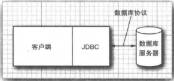
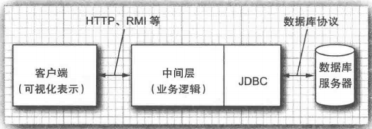

## 数据库编程

### JDBC 的设计

#### JDBC 驱动程序类型

JDBC 规范将驱动程序归结为以下几类

* 第一类驱动程序将 JDBC 翻译成 ODBC，然后使用一个 ODBC 驱动程序与数据库进行通信。较早版本 Java 包含了一个这样的驱动程序：`JDBC/ODBC` 桥，不过在使用这个桥接器之前需要对 `ODBC` 进行相应的部署和正确的设置。在 `JDBC` 面世之初，桥接器可以方便地用于测试，却不太适用于产品的开发。Java 8 不再提供 `JDBC/ODBC` 桥
* 第二类驱动程序由部分 Java 程序和部分本地代码组成的，用于与数据库的客户端API进行通信。在使用这种驱动程序之前。客户端不仅需要安装 Java 类库，还需要安装一些与平台相关的代码
* 第三类驱动程序是纯 Java 客户端类库，它使用一种与具体数据库无关的协议将数据库请求发送给服务器构件，然后该构件再将数据库请求翻译成数据库相关的协议。这简化了部署，因为平台相关的代码只位于服务器端
* 第四类驱动程序是纯 Java 类库，它将 JDBC 请求直接翻译成数据库相关的协议

JDBC 为了实现以下目标

* 通过使用标准的 SQL 语句，甚至专门的 SQL 扩展，程序员就可以利用 Java 语言开发访问数据库的应用，同时还依旧遵守 Java 语言的相关约定
* 数据库供应商和数据库工具开发商可以提供底层的驱动程序。因此可以优化各自数据库产品的驱动程序

#### JDBC 的典型用法

传统的客户端/服务器模型中，通常是在服务器部署数据库，而在客户端安装 GUI 程序。在此模型中，JDBC 驱动程序应该部署在客户端

​								*传统客户端、服务器应用*



三层模型，在三层应用模型中，客户端不直接调用数据库，而是调用服务器上的中间层，由中间件层完成数据库查询操作。三层模型的优点：它将可视化表示（位于客户端）从业务逻辑（位于中间层）和原始数据（位于数据库）中分离出来。客户端和中间层之间的通信在典型情况下是通过 HTTP 来实现的。JDBC 管理着中间层和后台数据库之间的通信

​				*三层结构的应用*

​				

### JDBC 配置

JDBC 使得我们可以通过 SQL 与数据库进行通信。桌面数据库通常都有一个图形用户界面；通过这种界面，用户可以直接操作数据。但是，基于服务器的数据库只能使用 SQL 进行访问

#### 数据库 URL

在连接数据库时，必须使用各种与数据库类型相关的参数，例如主机名，端口号和数据库名。JDBC 使用一种与普通 URL 相类似的语法来描述数据源。

```java
jdbc:derby://localhost:1527/COREJAVA;create=true
jdbc:postgresql:COREJAVA
```

上述 JDBC URL 指定了名为 COREJAVA 的一个 Derby 数据库和一个 `PostgreSQL` 数据库。JDBC URL 的一般语法为：

```java
jdbc:subprotocol:other sutff
```

其中，`subprotocol` 用于选择连接到数据库的具体驱动程序。`other stuff` 参数的格式随所使用的 `subprotocol` 不同而不同。

#### 驱动程序 JAR 文件

需要获得包含了所使用的数据库的驱动程序的 JAR 文件。在运行访问数据库的程序时，需要将驱动程序的 JAR 文件包括到类路径中（编译时并不需要这个 JAR 文件）。在从命令行启动程序时，只需要使用下面的命令

```java
java -classpath driverPath:. ProgromName
```

#### 注册驱动器类

许多 JDBC 的 JAR 文件会自动注册驱动器类。包含 `META-INF/services/java.sql.Driver` 文件的 JAR 文件可以自动注册驱动器类，解压缩驱动程序 JAR 文件可以检查其是否包含该文件。

如果驱动器程序 JAR 文件不支持自动注册，那么就需要找出数据库提供商使用的 JDBC 驱动器类的名字。典型的驱动器名字如下

```java
org.apache.derby.jdbc.ClientDriver
org.postgresql.Diriver
```

通过使用 `DriverManager` ，可以用两种方式来注册驱动器。一个方式是在 Java 程序中加载驱动器类

```java
Class.forName("org.postgresql.Driver");
```

这条语句将使得驱动器类被加载，由此将执行可以注册驱动器的静态初始化器

另一种方式是设置 `jdbc.drivers` 属性。可以用命令行参数来指定这个属性

```java
java -Djdbc.drivers=org.postgresql.Driver ProgramName
```

或者在应用中用下面这样的调用来设置系统属性

```java
System.setProperty("jdbc.drivers", "org.postgresql.Driver");
```

在这种方式中可以提供多个驱动器，用冒号将它们分隔开

```java
org.postgresql.Driver:org.apache.derby.jdbc.ClientDriver
```

#### 连接到数据库

在 Java 程序中，可以在代码中打开一个数据库连接

```java
String url = "jdbc:postgresql:COREJAVA";
String username = "dbuser";
String pssword = "secret";
Connection conn = DriverManager.getConnection(url, username, password);
```

驱动管理器遍历所有注册过的驱动程序，以便找到一个能够使用数据库 URL 中指定的子协议的驱动程序。`getConnection` 方法返回一个 `Connection` 对象。

### 使用 JDBC

#### 执行 SQL 语句

在执行 SQL 语句之前，首先需要创建一个 `Statement` 对象。要创建 `Statement` 对象，需要使用调用 `DriverManager.getConnection` 方法所获得的 `Connection` 对象

```java
Statement stat = conn.createStatement();
```

接着，把要执行的 SQL 语句放入字符串

```java
String command = "UPDATE Books" + " SET Price = Price - 5.00" + " WHERE Title NOT LIKE '%Introduction%';
```

然后，调用 `Statement` 接口中的 `executeUpdate` 方法

```java
stat.executeUpdate(command);
```

`executeUpdate` 方法将返回受 SQL 语句影响的行数，或者对不返回行数的语句返回 0。`executeUpdate` 方法既可以执行 DDL 语句也可以执行更新数据语句。但是执行 `SELECT` 查询时必须使用 `executeQuery` 方法。另外还有一个 `execute` 语句可以执行任意的 SQL 语句，此方法通常只用于由用户提供的交互式查询。

`executeQyery` 方法会返回一个 `ResultSet` 类型的对象，可以通过它来每次一行地遍历所有查询结果

```sql
Result rs = stat.executeQuery("SELECT * FROM Books");
```

分析结构集

```java
while (re.next()) {
    
}
```

`ResultSet` 接口的迭代协议于 `java.util.Iterator` 接口不同。对于 `ResultSet` 接口，迭代器初始化时被设定在第一行之前的位置，必须调用 `next` 方法将它移动到第一行。另外，它没有 `hasNext` 方法，需要不断地调用 `next`，直至该方法返回 `false`

结果集中行地顺序是任意排列地。除非使用 `ORDER BY` 子句指定行地顺序，否则不能为行序强加任何意义

查看每一行时，有许多访问器方法可以用于获取这些信息

```java
String isbn = rs.getString(1);
double price = rs.getDouble("Price");
```

不同地数据类型有不同地访问器，如 `getString` 和 `getDouble`。每个访问器都有两种形式，一种接受数字型参数，另一种接受字符串型参数。当使用数字型参数时，指的时该数字所对应地列。数据库列序号从 1 开始计算。当使用字符串参数时，指的是结果集中以该字符串为列名地列。使用数字型参数效率更高，但是字符串参数易于维护。

当 `get` 方法地类型和列地数据类型不一致时，每个 `get` 方法都会进行合理地转换。