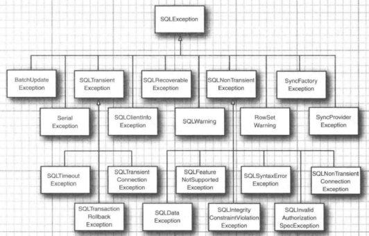
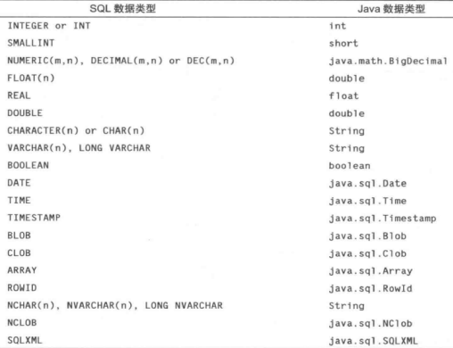

## 数据库编程

### JDBC 的设计

#### JDBC 驱动程序类型

JDBC 规范将驱动程序归结为以下几类

* 第一类驱动程序将 JDBC 翻译成 ODBC，然后使用一个 ODBC 驱动程序与数据库进行通信。较早版本 Java 包含了一个这样的驱动程序：`JDBC/ODBC` 桥，不过在使用这个桥接器之前需要对 `ODBC` 进行相应的部署和正确的设置。在 `JDBC` 面世之初，桥接器可以方便地用于测试，却不太适用于产品的开发。Java 8 不再提供 `JDBC/ODBC` 桥
* 第二类驱动程序由部分 Java 程序和部分本地代码组成的，用于与数据库的客户端API进行通信。在使用这种驱动程序之前。客户端不仅需要安装 Java 类库，还需要安装一些与平台相关的代码
* 第三类驱动程序是纯 Java 客户端类库，它使用一种与具体数据库无关的协议将数据库请求发送给服务器构件，然后该构件再将数据库请求翻译成数据库相关的协议。这简化了部署，因为平台相关的代码只位于服务器端
* 第四类驱动程序是纯 Java 类库，它将 JDBC 请求直接翻译成数据库相关的协议

JDBC 为了实现以下目标

* 通过使用标准的 SQL 语句，甚至专门的 SQL 扩展，程序员就可以利用 Java 语言开发访问数据库的应用，同时还依旧遵守 Java 语言的相关约定
* 数据库供应商和数据库工具开发商可以提供底层的驱动程序。因此可以优化各自数据库产品的驱动程序

#### JDBC 的典型用法

传统的客户端/服务器模型中，通常是在服务器部署数据库，而在客户端安装 GUI 程序。在此模型中，JDBC 驱动程序应该部署在客户端

​								*传统客户端、服务器应用*


三层模型，在三层应用模型中，客户端不直接调用数据库，而是调用服务器上的中间层，由中间件层完成数据库查询操作。三层模型的优点：它将可视化表示（位于客户端）从业务逻辑（位于中间层）和原始数据（位于数据库）中分离出来。客户端和中间层之间的通信在典型情况下是通过 HTTP 来实现的。JDBC 管理着中间层和后台数据库之间的通信

​				*三层结构的应用*

​				

### JDBC 配置

JDBC 使得我们可以通过 SQL 与数据库进行通信。桌面数据库通常都有一个图形用户界面；通过这种界面，用户可以直接操作数据。但是，基于服务器的数据库只能使用 SQL 进行访问

#### 数据库 URL

在连接数据库时，必须使用各种与数据库类型相关的参数，例如主机名，端口号和数据库名。JDBC 使用一种与普通 URL 相类似的语法来描述数据源。

```java
jdbc:derby://localhost:1527/COREJAVA;create=true
jdbc:postgresql:COREJAVA
```

上述 JDBC URL 指定了名为 COREJAVA 的一个 Derby 数据库和一个 `PostgreSQL` 数据库。JDBC URL 的一般语法为：

```java
jdbc:subprotocol:other sutff
```

其中，`subprotocol` 用于选择连接到数据库的具体驱动程序。`other stuff` 参数的格式随所使用的 `subprotocol` 不同而不同。

#### 驱动程序 JAR 文件

需要获得包含了所使用的数据库的驱动程序的 JAR 文件。在运行访问数据库的程序时，需要将驱动程序的 JAR 文件包括到类路径中（编译时并不需要这个 JAR 文件）。在从命令行启动程序时，只需要使用下面的命令

```java
java -classpath driverPath:. ProgromName
```

#### 注册驱动器类

许多 JDBC 的 JAR 文件会自动注册驱动器类。包含 `META-INF/services/java.sql.Driver` 文件的 JAR 文件可以自动注册驱动器类，解压缩驱动程序 JAR 文件可以检查其是否包含该文件。

如果驱动器程序 JAR 文件不支持自动注册，那么就需要找出数据库提供商使用的 JDBC 驱动器类的名字。典型的驱动器名字如下

```java
org.apache.derby.jdbc.ClientDriver
org.postgresql.Diriver
```

通过使用 `DriverManager` ，可以用两种方式来注册驱动器。一个方式是在 Java 程序中加载驱动器类

```java
Class.forName("org.postgresql.Driver");
```

这条语句将使得驱动器类被加载，由此将执行可以注册驱动器的静态初始化器

另一种方式是设置 `jdbc.drivers` 属性。可以用命令行参数来指定这个属性

```java
java -Djdbc.drivers=org.postgresql.Driver ProgramName
```

或者在应用中用下面这样的调用来设置系统属性

```java
System.setProperty("jdbc.drivers", "org.postgresql.Driver");
```

在这种方式中可以提供多个驱动器，用冒号将它们分隔开

```java
org.postgresql.Driver:org.apache.derby.jdbc.ClientDriver
```

#### 连接到数据库

在 Java 程序中，可以在代码中打开一个数据库连接

```java
String url = "jdbc:postgresql:COREJAVA";
String username = "dbuser";
String pssword = "secret";
Connection conn = DriverManager.getConnection(url, username, password);
```

驱动管理器遍历所有注册过的驱动程序，以便找到一个能够使用数据库 URL 中指定的子协议的驱动程序。`getConnection` 方法返回一个 `Connection` 对象。

### 使用 JDBC

#### 执行 SQL 语句

在执行 SQL 语句之前，首先需要创建一个 `Statement` 对象。要创建 `Statement` 对象，需要使用调用 `DriverManager.getConnection` 方法所获得的 `Connection` 对象

```java
Statement stat = conn.createStatement();
```

接着，把要执行的 SQL 语句放入字符串

```java
String command = "UPDATE Books" + " SET Price = Price - 5.00" + " WHERE Title NOT LIKE '%Introduction%';
```

然后，调用 `Statement` 接口中的 `executeUpdate` 方法

```java
stat.executeUpdate(command);
```

`executeUpdate` 方法将返回受 SQL 语句影响的行数，或者对不返回行数的语句返回 0。`executeUpdate` 方法既可以执行 DDL 语句也可以执行更新数据语句。但是执行 `SELECT` 查询时必须使用 `executeQuery` 方法。另外还有一个 `execute` 语句可以执行任意的 SQL 语句，此方法通常只用于由用户提供的交互式查询。

`executeQyery` 方法会返回一个 `ResultSet` 类型的对象，可以通过它来每次一行地遍历所有查询结果

```sql
Result rs = stat.executeQuery("SELECT * FROM Books");
```

分析结构集

```java
while (re.next()) {
    
}
```

`ResultSet` 接口的迭代协议于 `java.util.Iterator` 接口不同。对于 `ResultSet` 接口，迭代器初始化时被设定在第一行之前的位置，必须调用 `next` 方法将它移动到第一行。另外，它没有 `hasNext` 方法，需要不断地调用 `next`，直至该方法返回 `false`

结果集中行地顺序是任意排列地。除非使用 `ORDER BY` 子句指定行地顺序，否则不能为行序强加任何意义

查看每一行时，有许多访问器方法可以用于获取这些信息

```java
String isbn = rs.getString(1);
double price = rs.getDouble("Price");
```

不同地数据类型有不同地访问器，如 `getString` 和 `getDouble`。每个访问器都有两种形式，一种接受数字型参数，另一种接受字符串型参数。当使用数字型参数时，指的时该数字所对应地列。数据库列序号从 1 开始计算。当使用字符串参数时，指的是结果集中以该字符串为列名地列。使用数字型参数效率更高，但是字符串参数易于维护。

当 `get` 方法地类型和列地数据类型不一致时，每个 `get` 方法都会进行合理地转换。

#### 管理连接、语句和结果集

每个 `Connection` 对象都可以创建一个或多个 `Statement` 对象。同一个`Statement` 对象可以用于多个不相关的命令和查询。但是，一个 `Statement` 对象最多只能有一个打开的结果集。如果需要执行多个查询操作，且需要同时分析查询结果，那么必须创建多个 `Statement` 对象

使用 `DatebaseMetaData` 接口中的 `getMaxStatements` 方法可以获取 `JDBC` 驱动程序支持的同时活动的语句对象的总数

通常并不需要同时处理多个结果集。如果结果集相互关联，可以使用组合查询，这样只需要分析一个结果。对数据库进行组合查询比使用 Java 程序遍历多个结果集要高效的多

使用完 `ResultSet`，`Statement` 或 `Connection` 对象后，应立即调用 `close` 方法。这些对象都使用了规模较大的数据结果，它们会占用数据库存服务器上的有限资源

如果 `Statement` 对象上有一个打开的结果集，那么调用 `close` 方法将自动关闭该结果集。同样地，调用 `Connection` 类的 `close` 方法将关闭该连接上的所有语句

在 `Statement` 上调用 `closeOnCompletion` 方法，在其所有结果集都被关闭后，该语句会立即被自动关闭

如果所有连接都是短时的，那么无需考虑关闭语句和结果集。只需将 `close` 语句放在带资源的 `try` 语句中，以便确保最终连接对象不可能继续保持打开状态

应该使用带资源的 `try` 语句块来关闭连接，并使用一个单独的 `try/catch` 块处理异常。分离 `try` 程序块可以提高代码的可读性和可维护性

#### 分析 SQL 异常

每个 `SQLException` 都有一个由多个 `SQLException` 对象构成的链，这些对象可以通过 `getNextException` 方法获取。这个异常链式每个异常都具有的由  `Throwable` 对象构成的 “成因” 链之外的异常链。因此需要用两个嵌套的循环来完整枚举所有的异常。Java 6 改进了 `SQLException` 类，让其实现了 `Iterable<Throwable>` 接口，其 `iterator()` 方法可以产生一个 `Iterator<Throwable>` ，这个迭代器可以迭代这两个链，首先迭代第一个 `SQLException` 的成因链，然后迭代下一个 `SQLException` ，以此类推。可以直接使用下面的改进的 `for` 循环

```java
for (Throwable t : sqlException) {
    do
}
```

可以在 `SQLException` 上调用 `getSQLState` 和 `getErrorCode` 方法来进一步分析它，其中第一个方法将产生符合 `X/Open` 或 `SQL:2003` 标准的字符串（调用 `DatabaseMetaData` 接口的 `getSQLStateType` 方法可以查出驱动程序所使用的标准）。而错误代码是与具体的提供商相关的。

`SQL` 异常按照层次结构树的方式组织到一起。这使得可以按照与提供商无关的方式来捕获具体的错误类型。数据库驱动程序可以将非致命问题作为警告报告，可以从连接，语句和结果集中获取这些警告。`SQLWarning` 类是 `SQLException` 的子类（尽管 `SQLWarning` 不会被当作异常抛出）。可以调用 `getSQLState` 和 `getErrorCode` 来获取有关警告的更多信息

与 `SQL` 异常类似，警告也是串成链的。要获得所有的警告，可以使用下面的循环

```java
SQLWarning w = stat.getWarning();
while (w != null) {
    w = w.nextWarning();
}
```

​				*SQL异常类型*



当数据从数据库中读出并意外被截断时，`SQLWarning` 的 `DataTruncation` 子类就派上用户场了。如果数据截断发送在更新语句中，那么 `DataTruncation` 将会被当作异常抛出

### 执行查询操作

#### 预备语句

没有必要在每次开始一个这样的查询时都建立新的查询语句，而是准备一个带有宿主变量的查询语句，每次查询时只需为该变量填入不同的字符串就可以反复多次使用该语句。这一技术改进了查询性能，每当数据库执行一个查询时，它总是首先通过计算来确定查询策略，以便高效的执行查询操作。通过事先准备好查询并多次重用它，就可以确保查询所需的准备步骤只被执行一次

在预备查询语句，每个宿主变量都用 “?”  来表示。如果存在一个以上的变量，那么在设置变量值时必须注意 “?” 的位置。如果预备查询为如下形式：

```java
String publishQuery=
	"Select Books.Price, Books.Title" +
	" FROM Books, Publishers" + 
	" WHERE Books.Publisher_ID = Publishers.Publisher_ID AND Publishers.Name = ?";
PreparedStatement stat = conn.prepareStatement(publisherQuery);
```

在执行预备语句之前，必须使用 `set` 方法将变量绑定到实际的值上。和 `ResultSet` 接口中的 `get` 方法类似，针对不同的数据类型也有不同的 `set` 方法。

```java
stat.setString(1, publisher);
```

第一个参数是需要设置的宿主变量的位置，位置 1 表示第一个 “?”。第二个参数指的是赋予宿主变量的值。

如果想要重用已经执行过的预备查询语句，除非使用 `set` 方法或调用 `clearParameters` 方法，否则所有宿主变量的绑定都不会改变。在从一个查询到另一个查询的过程中，只需使用 `setXXX` 方法重新绑定那些需要改变的变量即可。

一旦为所有变量绑定了具体的值，就可以执行查询操作了

```java
ResultSet rs = stat.executeQuery();
```

通过连接字符串来手动构建查询显得非常枯燥乏味，而且存在潜在的危险。必须注意像引号这样的特殊字符，而且如果查询中涉及了用户的输入，那还需要警惕注入攻击。因此，只有查询涉及变量是，才应该使用预处理语句。

在相关的 `Connection` 对象关闭之后，`PreparedStatement` 对象也就变得无效了。不过，许多数据库通常都会自动缓存预备语句。如果相同的查询被预备两次，数据库通常会直接重用查询策略。因此，无需过多考虑调用 `prepareStatement` 的开销

#### 读写 LOB

除了数字、字符串和日期之外，许多数据库还可以存储大对象，例如图片或其他数据。在 SQL 中，二进制大对象称为 `BLOB`，字符型大对象称为 `CLOB`。

要读取 `LOB`，需要执行 `SELECT` 语句，然后在 `ResultSet` 上调用 `getBlob` 或 `getClob` 方法，这样就可以获得 `Blob` 或 `Clob` 类型的对象。要从 `Blob` 中获取二进制数据，可以调用 `getBytes` 或 `getBinaryStream` 

```java
// 获取一张图像
stat.set(1, isbn);
try (ResultSet result = stat.executeQuery()) {
    if (result.next()) {
        Blob coverBlob = result.getBlob(1);
        Image coverImage = ImageIO.read(coverBlob.getBinaryStream());
    }
}
```

类似的，如果获取了 `Clob` 对象，那么就可以通过调用 `getSubString` 或 `getCharacterStream` 方法来获取其中的字符数据

要将 `LOB` 置入数据库中，需要在 `Connection` 对象上调用 `createBlob` 或 `createClob` 然后获取一个用于该 `LOB` 的输出流或写出器，写出数据，并将该对象存储到数据库中

```java
Blob coverBlob = connection.createBlob();
int offset = 0;
OutputStream out = coverBlob.setBinaryStream(offset);
ImageIO.write(coverImage, "PNG", out);
PreparedStatement stat = conn.prepareStatement("INSERT INTO Cover VALUES (?, ?)");
stat.set(1, isbn);
stat.set(2, coverBlob);
stat.executeUpdate();
```

#### SQL 转义

转义语法是各种数据库普通支持的特性，但是数据库使用的是与数据库相关的语法变体，因此，将转义语法转译为特定数据库的语法是 JDBC 驱动程序的任务之一

转义主要用于下列场景

* 日期和时间字面常量
* 调用存储过程
* 外连接
* 在 LIKE 子句中的转义字符

日期和时间字面常量随数据库的不同而变化很大。要嵌入日期或时间字面常量，需要按照 ISO 8601 格式指定它的值，之后驱动程序会将其转译为本地格式。应该使用 d、t、ts 来表示 DATE、TIME、TIMESTAMP 值：

```java
{d '2008-01-24'}
{t '23:59:59'}
{ts '2008-01-24 23:59:59}
```

标量函数是指仅返回单个值的函数，在数据库中包含大量的函数，但是不同的数据库中这些函数名存在着差异。JDBC 规范提供了标准的名字，并将其转译为数据库相关的名字。要调用函数，需要像下面这样嵌入标准的函数名和参数

```java
{fn left(?, 20)}
{fn user()}
```

存储过程是在数据库中执行的用数据库相关的语言编写的过程。要调用存储过程，需要使用 call 转义命令，在存储过程中没有任何参数时，可以不用加上括号，应该用 = 来捕获存储过程的返回值

```java
{call proc1(?, ?)}
{cll proc2}
{call ? = proc3(?)}
```

两个表的外连接并不要求每个表的所有行都要根据连接条件进行匹配

#### 多结果集

在执行存储过程，或者在使用允许在单个查询中提交多个 `SELECT` 语句的数据库时，一个查询有可能会返回多个结果集。获取所有结果集的步骤

1.使用 `execute` 方法来执行 `SQL` 语句

2.获取第一个结果集或更新计数

3.重复调用 `getMoreResults` 方法以移动到下一个结果集

4.当不存在更多的结果集或更新计数时，完成操作

如果由多结果集构成的链中的下一项是结果集，`execute` 和 `getMoreResults` 方法将返回 `true` ，而如果在链中的下一项不是更新计数，`getUpdateCount` 方法将返回 -1

```java
// 循环遍历所有的结果
boolean isResult = stat.execute(command);
boolean done = false;
while (!done) {
    if (isResult) {
        ResultSet result = stat.getResultSet();
    } else {
        int updateCount = stat.getUpdateCount();
        if (updateCount >= 0) {
            
        } else {
            done = true;
        }
    }
    if (!done) {
        isResult = stat.getMoreResults();
    }
}
```

#### 获取自动生成的键

大多数数据库都支持某种在数据库中对行自动编号的机制。尽管 JDBC  没有提供独立于提供商的自动生成键的解决方案，但是它提供了获取自动生成键的有效途径。当向数据表中插入一个新行，且其键自动生成时，可以用下面的代码来获取这个键

```java
stat.executeUpdate(insertStatement, Statement.RETURN_GENERATED_KEYS);
ResultSet rs = stat.getGeneratedKeys();
if (rs.next()) {
    int key = rs.getInt(1);
}
```

### 可滚动和可更新的结果集

使用 `ResultSet` 接口中的 `next` 方法可以迭代遍历结果集中的所有行。对于一个只需要分享数据的程序来说，这一觉足够。但是如果是用于展示一张表或查询结果的可视化数据显示，通常会希望用户可以在结果集上前后移动。对于可滚动结果集而言，可以在其中向前或向后移动，甚至可以跳到任意位置

一旦向用户显示了结果集中的内容，他们就可能希望编辑这些内容。在可更新的结果集中，可以以编程方式来更新其中的项，使得数据库可以自动更新数据。

#### 可滚动的结果集

默认情况下，结果集是不可滚动和不可更新的。为了从查询中获取可滚动的结果集，必须使用下面的方法得到一个不同的 `Statement` 对象

`Statement stat = conn.createStatement(type, concurrency)`

如果要获得预备语句，要调用下面的方法

```java
PreparedStatement stat = conn.prepareStatement(command, type, concurrency);
```

* `ResultSet` 类的 `type` 值

  `TYPE_FORWARD_ONLY`		结果集不能滚动（默认值）

  `TYPE_SCROLL_INSENSITIVE`	结果集可以滚动，但对数据库变化不敏感

  `TYPE_SCROLL_SENSITIVE`		结果集可以滚动，且对数据库变化敏感

* `ResultSet` 类的 `Concurrency` 值

  `CONCUR_READ_ONLY`			结果集不能用于更新数据库（默认值）

  `CONCUR_UPDATEBLE`			结果集可以用于更新数据库

```java
// 只滚动遍历结果集，而不编辑它的数据
Statement stat = conn.createStatement(ResultSet.TYPE_SCROLL_INSENSITIVE, ResultSet.CONCUR_READ_ONLY);
// 获得的所有结果集都将是可滚动的
ResultSet rs = stat.executeQuery(query);
```

可滚动的结果集有一个游标，用以指示当前位置（使用 `DatabaseMetaData` 接口中的 `supportsResultSetType` 和 `supportsResultSetConcurrency` 方法，可以获知在使用特定的驱动程序时，某个数据库究竟支持哪些结果集类型以及哪些并发模式）

滚动结果集调用

```java
rs.relative(n)
```

如果 n 为正数，游标将向前移动。如果 n 为负数，游标将向后移动。如果 n 为 0，那么调用该方法将不起任何作用。如果试图将游标移动到当前行集的范围之外，即根据 n 值的正负号，游标需要被设置在最后一行之后或第一行之前，那么，该方法将返回 `false`，且不移动游标，如果游标位于一个实际的行上，那么该方法将返回 `true`

设置游标到指定的行号上

```java
rs.absolute(n);
```

返回当前行的行号

```java
int currentRow = rs.getRow()
```

结果集中第一行的行号为 1。如果返回值为 0，那么当前游标不再任何行上，它要么位于第一行之前，要么位于最后一行之后

`first`、`last`、`beforeFirst`、`afterLast` 这些简便方法用于将游标移动到第一行、最后一行、第一行之前或最后一行之后

`isFirst`、`isLast`、`isBeforeFirst`、`isAfterLast` 用于测试游标是否位于这些特殊位置上

使用可滚动的结果集是非常简单的，将查询数据放入缓存中的复杂工作是由数据库驱动程序在后头完成的

#### 可更新的结果集

如果希望编辑结果集中的数据，并且将结果集上的数据变更自动反映到数据库中，那么就必须使用可更新的结果集。可更新的结果集并非必须是可滚动的，但如果将数据提供给用户去编辑，那么通常也会希望结果集是可滚动的。

如果要获得可更新的结果集，应该使用以下方法创建一条语句

```java
Statement stat = conn.createStatement(ResultSet.TYPE_SCROLL_INSENSITIVE, ResultSet.CONCUR_UPDATABLE);
```

这样，调用 `executeQuery` 方法返回的结果集就将是可更新的结果集

并非所有的查询都会返回可更新的结果集。如果查询涉及多个表的连接操作，那么它所产生的结果集将是不可更新的。如果查询只涉及了一个表，或者在查询时是使用主键连接多个表的，那么它所产生的结果集将是可更新的结果集。可调用 `ResultSet` 接口中的 `getConcurrency` 方法来确定结果集是否是可更新的

所有对应于 SQL 类型的数据类型都配有 `updateXxx` 方法，比如 `updateDouble`、`updateString` 等。与 `getXxx` 方法相同，在使用 `updateXxx` 方法时必须指定列的名称和序号。在使用第一个参数为列序号的 `updateXxx` 方法时，这里的列序号指的是该列在结果集中的序号。它的值可以与数据库中的列序号不同

`updateXxx` 方法改变的只是结果集中的行值，而非数据库中的值。当更新完行的字段值后，必须调用 `updateRow` 方法，这个方法将当前行中的所有更新信息发送给数据库。如果没有调用 `updateRow` 方法就将游标移动到其他行上，那么对此行所做的所有更新都将被丢弃，而且永远不会被传递给数据库。还可以调用 `cancelRowUpdates` 方法来取消对当前行的更新

如果想在数据库中添加一条新的记录，首先需要使用 `moveToInsertRow` 方法将游标移动到特定的位置（插入行）。然后，调用 `updateXxx` 方法在插入行的位置上创建一个新的行。在上述操作全部完成后，还需要调用 `insertRow` 方法将新建的行发送给数据库。完成插入操作后，再调用 `moveToCurrentRow` 方法将游标移回到调用 `moveToInsertRow` 方法之前的位置

对于在插入行中没有指定值的列，将被设置为 SQL 的 NULL。但是，如果这个列有 `NOT NULL` 约束，那么将会抛出异常，而这一行也无法插入

删除游标所指的行

```java
rs.deleteRow();
```

`ResultSet` 接口中的 `updateRow`、`insertRow` 、`deleteRow` 方法的执行效果等同于 SQL 命令中的 `UPDATE`、`INSERT`、`DELETE`。

### 行集

可滚动的结果集虽然功能强大，却有一个重要的缺陷：在用户的整个交互过程中，必须始终与数据库保持连接。用户也许会离开电脑旁一段时间。而在此期间却始终占有数据库连接。这种方式存在很大的问题，因为数据库连接属于稀有资源。

行集`RowSet` 接口扩展自  `ResultSet` 接口，却无需始终保持与数据库的连接。行集适用于将查询结果移动到复杂应用的其他层，或者是诸如手机之类的其他设备中。因为它的数据结构非常庞大，且依赖于数据连接

#### 构建行集

`javax.sql.rowset` 包提供的接口，都扩展了 `RowSet` 接口

* `CacheRowSet` 允许在断开连接的状态下执行相关操作。
* `WebRowSet` 对象代表了一个被缓存的行集，该行集可以保存为 XML 文件。该文件可以移动到 `web` 应用的其他层中，只要该该层中使用另一个 `WebRowSet` 对象重新打开该文件即可
* `FiltereRowSet` 和 `JoinRowSet` 接口支持对行集的轻量级操作，它们等同于 SQL 中的 SELECT 和 JOIN 操作。这两个接口的操作对象是存储在行集中的数据，因此运行时无需建立数据库连接
* `JdbcRowSet` 是  `ResultSet` 接口的一个廋包装器。在  `RowSet` 接口中添加了有用的方法

#### 被缓存的行集

一个被缓存的行集中包含了一个结果集中所有的数据。`CachedRowSet` 是 `ResultSet` 接口的子接口，所以完全可以像使用结果集一样来使用被缓存的行集。被缓存的行集有一个非常重要的优点：断开数据库连接后仍然可以使用行集。

可以使用一个结果集来填充 `CachedRowSet` 对象

```java
ResultSet result = ....;
RowSetFactory factory = RowSetProvider.newFactory();
CachedRowSet crs = factory.createCachedRowSet();
crs.populate(result);
conn.close();
```

让 `CachedRowSet` 对象自动建立一个数据库连接

```java
// 设置数据库参数
crs.setURL("jdbc:derby://localhost:1527/COREJAVA");
crs.setUsername("dbuser");
crs.setPassword("secret");
// 设置查询语句和所有参数
crs.setCommand("SELECT * FROM Books WHERE Publisher_ID = ?");
crs.setString(1, publisherId);
// 将查询结果填充到行集中
crs.execute();
```

以上会建立数据库连接、执行查询操作、填充行集、最后断开连接

如果查询结果非常大，可以指定每一页的尺寸

```java
CachedRowSet crs = ...;
crs.setCommand(command);
crs.setPageSize(20);
crs.execute();
```

现在就只能获得 20 行了。要获取下一批数据，调用

```java
crs.nextPage();
```

可以使用与结果集中相同的方法来查看和修改集中的数据。如果修改了行集中的内容，那么必须调用以下方法将修改写回到数据库中：

```java
crs.acceptChanges(conn);
crs.acceptChanges();
```

只有在行集中设置了连接数据库所需的信息时，上述第二个方法调用才会有效。如果是使用结果集来填充行集，那么行集就无从获知需要更新数据的数据库表名。此时必须调用 `setTable` 方法来设置表名称

另一个导致问题复杂化的情况是：在填充了行集之后，数据库中的数据发生了改变，这显然容易造成数据不一致性。为了解决这个问题，参考实现会首先检查行集中的原始值（即，修改前的值）是否与数据库中的当前值一致。如果一致，那么修改后的值将覆盖数据库中的当前值。否则将抛出 `SyncProviderException` 异常，且不向数据库写回任何值。在实现行集接口时其他实现也可以采用不同的同步策略

### 元数据

JDBC 还可以提供关于数据库及其表结构的详细信息。在 SQL 中，描述数据库或其组成部分的数据成为元数据。可以获得三类元数据：关于数据库的元数据、关于结果集的元数据以及关于预备语句参数的元数据

如果要了解数据库的更多信息，可以从数据库连接中获取一个 `DatabaseMetaData` 对象。

```java
DatabaseMetaData meta = conn.getMetaData();
// 获取元数据,返回包含所有数据库表信息的结果集
DatabaseMetaData meta = conn.getMetaData();
```

该结果集中的每一行都包含了数据库中一张表的详细信息，其中，第三列是表的名称。下面的循环可以获取所有表名

```java
while (mrs.next()) {
    tableNames.addItem(mrs.getString(3));
}
```

`ResultSetMetaData` 则用于提供结果集的相关信息。每当通过查询得到一个结果集时，可以获得该结果集的行数以及每一列的名称、类型和字段宽度

```java
ResultSet rs = stat.executeQuery("SELECT * FROM " + tablename);
ResultSetMetaData meta = rs.getMetaData();
for (int i = 1; i <= meta.getColumnCount(); i++) {
    String columnName = meta.getColumnLabel(i);
    int columnWidth = meta.getColumnDisplaySize(i);
}
```

### 事务

#### 用JDBC对事务编程

默认情况下，数据连接处于自动提交模式。每个 SQL 语句一旦被执行便被提交给数据库。一旦命令被提交，就无法对它进行回滚操作。在使用事务时，需要关闭这个默认值

```java
// 关闭自动提交
conn.setAutoCommit(false);
```

现在可以使用通常的方法创建一个语句对象

`Statement stat = conn.createStatement()`

然后多次调用 `executeUpdate` 方法

```java
stat.executeUpdate(command);
stat.executeUpdate(command);
stat.executeUpdate(command);
```

如果执行了所有命令之后没有出错，则调用 `commit` 方法

```java
conn.commit();
```

如果出现错误，则调用

```java
conn.rollback();
```

此时，程序将自动撤销自上次提交以来的所有语句。当事务被 `SQLException` 异常中断的时，典型操作是发起回滚

#### 保存点

在使用某些驱动程序时，使用保存点可以更细粒度的控制回滚操作。创建一个保存点意味着稍后只需返回这个点，而非事务的开头

```java
Statement stat = conn.createStatement();
stat.executeUpdate(command);
Savepoint svpt = conn.setSavepoint();
stat.executeUpdate(command);
if (...) {
    conn.rollback(svpt);
}
conn.commit();
```

当不再需要保存点时，必须释放它

```java
conn.releaseSavepoint(svpt);
```

#### 批量更新

在使用批量更新时，一个语句序列作为一批操作将同时被收集和提交。使用 `DatabaseMetaData` 接口中的 `supportsBatchUpdates` 方法可以获知数据库是否支持这种特性

处于同一批中的语句可以是 `INSERT` 、`UPDATE`、`DELETE` 等操作，也可以是数据库定义语句，如 `CREATE TABLE` 和 `DROP TABLE`。但是，在批处理中添加 `SELECT` 语句会抛出异常

执行批处理，首先创建一个 `Statment` 对象

```java
Statement stat = conn.createStatement();
```

调用 `addBatch` 方法

```java
String command = "CREAT TABLE ..."
stat.addBatch(command);
while(...) {
    command = "INSERT INTO ...VALUES ("+...+")";
    stat.addBatch(command);
}
```

提交整个批量更新语句

```java
int[] counts = stat.executeBatch();
```

调用 `executeBatch` 方法将为所有已提交的语句返回一个记录数的数组。为了在批量模式下正确的处理错误，必须将批量执行的操作视为单个事务。如果批量更新在执行过程中失败，那么必须将它回滚到批量操作开始之前的状态

首先，关闭自动提交模式，然后收集批量操作，执行并提交该操作，最后恢复最初的自动提交模式：

```java
boolean autoCommit = conn.getAutoCommit();
conn.setAutoCommit(false);
Statement stat = conn.getStatement();
stat.executeBatch();
conn.commit();
conn.setAutoCommit(autoCommit);
```

### 高级 SQL 类型

*JDBC支持的SQL数据类型在Java语言中对应的数据类型*



SQL ARRAY （SQL 数组）指的是值的序列。从数据库中获得一个 LOB 或数组并不等于获取了它的实际内容，只有在访问具体的值时它们才会从数据库中被读取出来。

### Web中的连接管理

使用 `database.properties` 文件可以对数据库连接进行简单的设置。这种方法适用于小型的测试数据库，但是不适用于规模较大的应用。在 Web 或企业环境中部署 JDBC 应用时，数据库连接管理与 Java 名字和目录接口（JNDI）是集成在一起的。遍布企业的数据源的属性可以存储在一个目录中，采用这种方式使得我们可以集中管理用户名，密码，数据库名和 JDBC URL

在这样的环境中，可以使用下列代码来创建数据库连接

```java
Context jndiContext = new InitialContext();
DataSource source = (DataSource) jndiContext.lookup("java:comp/env/jdbc/corejava");
Connection conn = source.getConnection();
```

使用 JNDI 服务来定位数据源。数据源就是一个能够提供简单的 JDBC 连接和更多高级服务的接口，比如执行涉及多个数据库的分布式事务。`javax.sql` 标准扩展包定义了 `DataSource` 接口。在 Java EE 容器中，甚至不必编程进行 JNDI 查找，只需在 `DataSource` 域上使用 `Resource` 注解，当加载应用时，这个数据源引用将被设置

```java
@Resource(name="jdbc/corejava");
private DataSource source;
```

当然必须在某个地方配置数据源。如果编写的数据库程序将在 `Servlet` 容器中运行，如 `Apache Tomcat` ，或在应用服务器中运行，如 `GlassFish`，那么必须将数据库配置信息（包括 JNDI 名字、JDBC URL 、用户名和密码）放置在配置文件中，或在在管理员 GUI 中进行设置

JDBC 规范为实现者提供了用以实现连接池服务的手段。不过，JDK 本身并未实现这项服务，数据库供应商提供的 JDBC 驱动程序中通常也不包含这项服务。相反，`Web` 容器和应用服务器的开发商通常会提供连接池服务的实现

