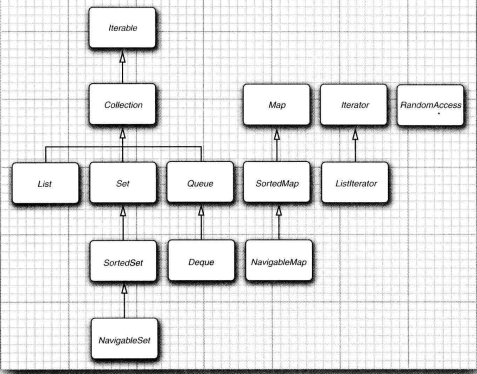
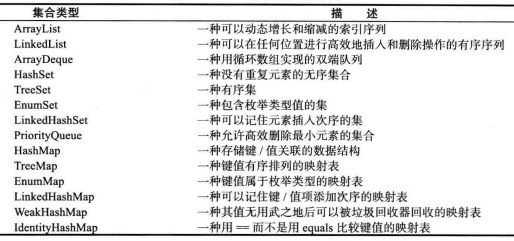
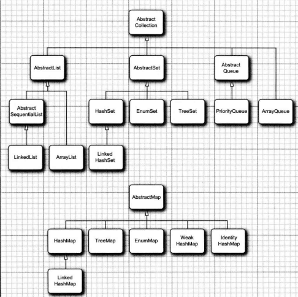

## Java 集合框架

### Collection

在 Java 类库中，集合类的基本接口是 `Collection` 接口。

*集合框架中的接口*



*java库中的具体集合*



*java集合框架中的类*



### 链表

在 Java 程序设计语言中，所有链表实际上都是双向链接的（每个结点还存放着指向前驱结点的引用）

链表与泛型集合之间有一个重要的区别。链表是一个有序集合，每个对象的位置十分重要。`LinkedList.add` 方法将对象添加到链表的尾部。

如果在某个迭代器修改集合时，另一个迭代器对其进行遍历，一定会出现混乱的情况。e.g. 一个迭代器指向另一个迭代器刚刚删除的元素前面，现在这个迭代器就是无效的，并且不应该再使用。链表迭代器的设计使它能够检测到这种修改。如果迭代器发现它的集合被另一个迭代器修改了，或者被该集合自身的方法修改了，就会抛出一个 `ConcurrentModificationException` 异常。为了避免发生并发修改的异常：可以根据需要给容器附加许多的迭代器，但是这些迭代器只能读取列表。另外，在单独附加一个既能读又能写的迭代器。集合可以跟踪改写操作（诸如添加或删除元素）的次数。每个迭代器都维护一个独立的计数值。在每个迭代器方法的开始处检查自己改写操作的计算值是否与集合的改写操作计数值一致。如果不一致，抛出一个 `ConcurrentModificationException` 异常

### 散列表

散列表为每个对象计算一个整数，称为散列码。散列码是由对象的实例域产生的一个整数。即：具有不同数据域的对象将产生不同的散列码。

在 Java 中，散列表用链表数组实现。每个列表称为桶。要想查找表中对象的位置，就要先计算它的散列码，然后与桶的总数取余，所得到的结果就是保存这个元素的桶的索引。如果桶被占满，这种现象被称为散列冲突。这时需要用新对象与桶中的所有对象进行比较，查看这个对象是否已经存在。如果散列码是合理且随机分布的，桶的数目也足够大，需要比较的次数就会很少（在 Java SE 8 中，桶满时会从链表变为平衡二叉树。如果选择的散列函数不当，会产生很多冲突）

如果想更多地控制散列表的运行性能，就要指定一个初始的桶数。桶数是指用于收集具有相同散列值的桶的数目。如果要插入到散列表中的元素太多，就会增加冲突的可能性，降低运行性能。

如果大致知道最终会有多少个元素要插入到散列表中，就可以设置桶数。通常，将桶数设置为预计元素个数的 75% ~ 150%。最好将桶数设置为一个素数，以防键的集聚。标准库使用的桶数是 2 的幂，默认值为 16 （为表大小提供的任何值都将被自动地转换为 2 的下一个幂）

如果散列表太满，就需要再散列。如果要对散列表再散列，就需要创建一个桶数更多的表，并将所有元素插入到这个新表中，然后丢弃原来的表。装填因子决定何时对散列表进行再散列。默认值为 0.75

散列表可以用于实现几个重要的数据结构。其中最简单的是 `set` 类型。`set` 是没有重复元素的元素集合。`set` 的 `add` 方法首先在集中查找要添加的对象，如果不存在，就将这个对象添加进去。Java 集合类提供的 `HashSet` 类，它实现了基于散列表的集。`contains` 方法已经被重新定义，用来快速地查看是否某个元素已经出现在集中。它只在某个桶中查找元素，而不必查看集合中的所有元素

散列集迭代器将依次访问所有的桶。由于散列元素分散在表的各个位置上，所以访问它们的顺序集合时随机的。只有不关心集合中元素的顺序时才应该使用 `HashSet`

### 树集合

`TreeSet` 与散列集十分相似，树集合时一个有序集合。可以以任意顺序将元素插入到集合中。在对树集合进行遍历时，每个值将自动地按照排序的顺序程序。要使用树集合，必须能够比较元素。这些元素必须实现 `Comparable` 接口，或者构造集时必须提供一个 `Comparator`

### 队列与双端队列

队列可以让人们有效地在尾部添加一个元素，在头部删除一个元素。有两个端头的队列，即双端队列，可以在头部和尾部同时添加或删除元素。不支持在队列中间添加元素。在 `Java SE 6` 中引入了 `Deque` 接口，并由 `ArrayDeque` 和 `LinkedList` 类实现。这两个类都提供了双端队列，而且必要是可以增加队列的长度。

### 优先级队列

优先级队列中的元素可以按照任意的顺序插入，却总是按照排序的顺序进行检索。即无论何时调用 `remove` 方法，总会获得当前优先级队列中最小的元素。然而，优先级队列并没有对所有的元素进行排序。如果用迭代的方式处理这些元素，并不需要对它们进行排序。优先级队列使用了堆（堆是一个可以自我调整的二叉树，对树执行添加和删除，可以让最小的元素移动到根，而不必花费时间对元素进行排序）。与 `TreeSet` 一样，一个优先级队列既可以保存实现了 `Comparable` 接口的类对象，也可以保存在构造器中提供的 `Comparator` 对象

### 映射

集时一个集合，它可以快速地查找现有的元素。但是，要查看一个元素，需要有要查找元素的精确副本。这不是非常通用的查找方式。通常，是使用键来查找与之对应的元素。映射数据结构即是如此。映射用来存放键、值对。如果提供了键，就能够查找到值。

Java 类库为映射提供了两个通用的实现：`HashMap` 和 `TreeMap`。这两个类都实现了 `Map` 接口。

散列映射对键进行散列，树映射用键的整体顺序对元素进行排序，并将其组织成搜索树。散列或比较函数只能作用于键。与键关联的值不能进行散列或比较

### 弱散列映射

`WeakHashMap` 类是为了解决：如果一个值，对应的键已经不再使用了，即，对某个键的最后一次引用已经消亡，不再有任何途径引用这个值的对象了。但是，由于在程序中的任何部分没有再出现这个键，所以，这个键/值对无法从映射中删除。但由于垃圾回收器是跟踪活动对象的，只要映射对象是活动的，其中的所有桶也是活动的，它们不能被回收。因此，需要由程序负责长期存活的映射表删除那些无用的值。

`WeakHashMap` 使用弱引用保存键。`WeakReference` 对象将引用保存到另外一个对象中，在这里，就是散列键。对于这种类型的对象，垃圾回收器用一种特有的方式进行处理。通常。如果垃圾回收器发现某个特定的对象已经没有他人引用了，就将其回收。然而，如果某个对象只能由 `WeakReference` 引用，垃圾回收器仍然回收它，但要将引用这个对象的弱引用放入队列中。`WeakReference` 将周期性地检查队列，以便找出新添加的弱引用。一个弱引用进入队列意味着这个键不再被他人使用，并且已经被收集起来。于是，`WeakHashMap` 将删除对应的条目

### 链接散列集与映射

`LinkedHashSet` 和 `LinkedHashMap` 类用来记住插入元素项的顺序。这样可以避免在散列表中的项从表面上看是随机排序的。当条目插入到表中时，就会并入到双向链表中。链接散列映射将用访问顺序，而不是插入顺序，对映射条目进行迭代。每次调用 `get` 或 `put` ，受到影响的条目将从当前的位置删除，并放到条目链表的尾部（只有条目在链表中的位置会受影响，而散列表中的桶不会受影响。一个条目总位于与键散列码对应的桶中）。要构造这样一个的散列映射表

```java
LinkedHashMap<K, V>(initialCapacity, loadFactor, true)
```

访问顺序对于实现高速缓存的“最近最少使用原则“十分重要。（可能希望将访问频率高的元素放在内存中，而访问频率低的元素则从数据库中读取。当在表中找不到元素项且表又满时，可以将迭代器加入到表中，并将枚举的前几个元素删除掉。这些是近期最少使用的几个元素）

构造一个 `LinkedHashMap` 的子类，然后覆盖下面这个方法：

```java
protected boolean removeEldestEnctry(Map.Entry<K, V> eldest)
```

每当方法返回 `true` 时，就添加一个新条目，从而删除导致 `eldest` 条目。

```java
Map<K, V> cache = new LinkedHashMap<>(128, 0.75F, true) {
    protected boolean removeEldestEntry(Map.Entry<K,V> eldest) {
        return size() > 100;
    }
}();
```

### 枚举集与映射

`EnumSet` 是一个枚举类型元素集的高效实现。由于枚举类型只有有限个实例，所以 `EnumSet` 内部用位序列实现。如果对应的值在集中。则相应的位被置为 1。

`EnumSet` 类没有公共的构造器。可以使用静态工厂方法构造这个集

### 标识散列映射

类 `IdentityHashMap` 有特殊的作用。在这个类中，键的散列值不是用 `hashCode` 函数计算的，而是用 `System.identityHashCode` 方法计算的。这是 `Object.hashCode` 方法根据对象的内存地址来计算散列码时所使用的方式。而且，在对两个对象进行比较时，`IdentityHashMap` 类使用 `==` ，而不使用 `equals`，即，不同的键对象，即使内容相同，也被视为是不同的对象。在实现对象遍历算法时，这个类可以用来追踪每个对象的遍历状况

### 属性映射

属性映射是一个类型非常特殊的映射结构

* 键与值都是字符串
* 表可以保持到一个文件中，也可以从文件中加载
* 使用一个默认的辅助表

实现属性映射的 `Java` 平台类称为 `Properties`，属性映射通常用于程序的特殊配置选项

