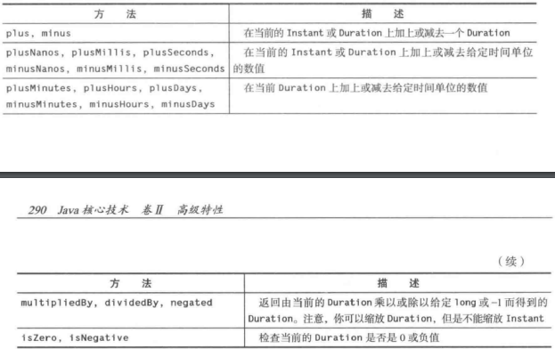
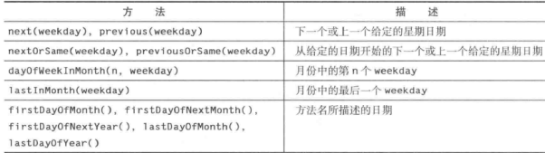
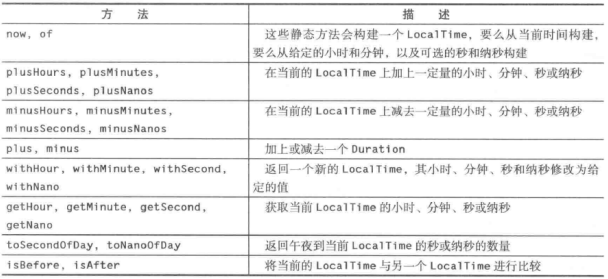
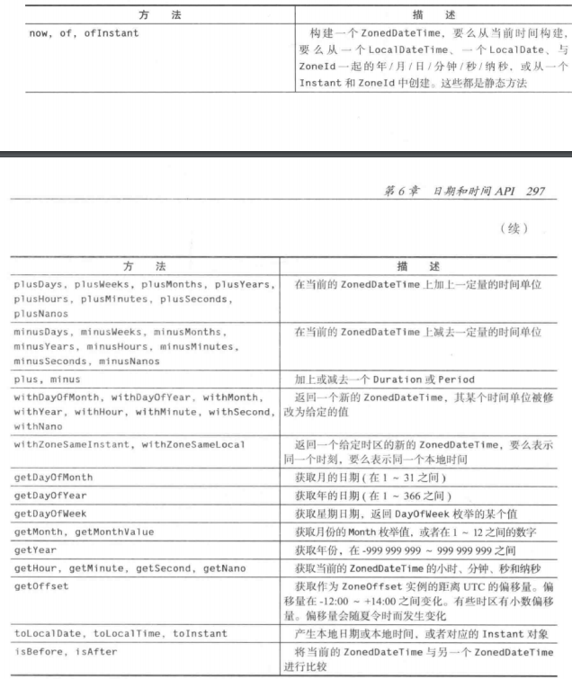
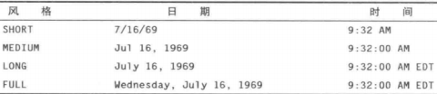
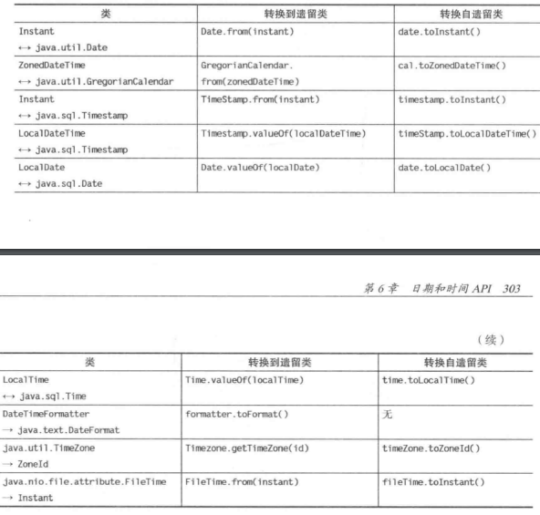

## Java 8 的日期和时间 API

### 时间线

Java 的 Date 和 Time API 规范要求 Java 使用的时间尺度为：

* 每天 86400 秒
* 每天正午与官方时间精确匹配
* 在其他时间点上，以精确定义的方式与官方时间接近匹配

在 Java 中，`Instant` 表示时间线上的某个点。被称为“新纪元”的时间线原点被设置为UNIX初始时间。从该原点开始，时间按照每天 86400 秒向前或向回度量，精确到纳秒。`Instant` 的值向回可追朔 10 亿年（`Instant.MIN`）。最大值 `Instant.MAX` 是公元 `1000000000` 年的 12 月 31 日

静态方法调用 `Instant.now()` 会给出当前的时刻。可以按照常用的方式，用 `equals` 和 `compareTo` 方法来比较两个 `Instant` 对象，因此可以将 `Instant` 对象用作时间戳

为了得到两个时刻之间的时间差，可以使用静态方法 `Duration.between` 

```java
	// 获取算法的运算时间
Instant start = Instant.now();
runAlgorithm();
Instant end = Instant.now();
Duration timeElapsed = Duration.between(start, end);
long millis = timeElapsed.toMillis();		
```

`Duration` 是两个时刻之间的时间量。可以通过调用 `toNanos` 、`toMillis`、`getSeconds`、`toMinutes`、`toHours` 和 `toDays` 来获得 `Duration` 按照传统单位度量的时间长度

`Duration` 对象的内部存储所需的空间超过了一个 `long` 的值，因此秒数存储在一个 `long` 中，而纳秒数存储在一个额外的 `int ` 中。如果想要让计算精确到纳秒级，那么实际上需要整个 `Duration` 的存储内容。如果不需要这么高的精度，可以用 long 的值来执行计算，然后调用 `toNanos`

​			*用于时间的Instant和Duration的算术运算*



`Instant` 和 `Duration` 类都是不可修改的类，所以 `multipliedBy` 和 `minus` 这样的方法都会返回一个新的实例

### 本地时间

在 Java API 中有两种人类时间，本地日期/时间和时区时间。本地日期/时间包含日期和当天的时间，但是与时区信息没有任何关联。1903 年 6 月 14 日就是一个本地日期的实例。因为这个日期既没有当天的时间，也没有时区信息，因此它并不对应精确的时刻。1969 年 7 月 16 日 09：32：00 EDT 是一个时区日期/时间，表示的是时间线上的一个精确的时刻

`LocalDate` 是带有年、月、日的日期。为了构建 `LocalDate` 对象，可以使用 `now` 或 `of` 静态方法：

```java
LocalDate today = LocalDate.now();
LocalDate alonzosBirthday = LocalDate.of(1903, 6, 14);
alonzosBirthday = LocalDate.of(1903, Month.JUNE, 14);
```

​		*LocalDate的方法*

​		

### 日期调整器

对于日程安排应用来说，经常需要计算诸如"每个月的第一个星期二"这样的日期。`TemporalAdjusters` 类提供了大量用于常见调整的静态方法。可以将调整方法的结果传给 `with` 方法

```java
// 获取某个月的第一个星期二
LocalDate firstTuesday = LocalDate.of(year, month, 1).with(TemporaAdjusters.nextOrSame(DayOfWeek.TUESDAY));
```

`with` 方法返回一个新的 `LocalDate` 对象，而不会修改原来的对象

​	*TemporalAdjusters类中的日期调整器*

​	

还可以通过实现 `TemporalAdjuster` 接口来创建自己的调整器。

```java
// 计算下一个工作日的调整器
TemporalAdjuster NEXT_WORKDAY = w -> {
    LocalDate result = (LocalDate) w;
    do {
        result = result.plusDays(1);
    }
    while (result.getDayOfWeek().getValue() >= 6);
    return result;
}
LocalDate backToWork = today.with(NEXT_WORKDAY);
```

`lambda` 表达式的参数类型为 `Temporal` ，它必须被强制转型为 `LocalDate`。可以用 `ofDateAdjuster` 方法来避免这种强制转型，该方法期望得到的参数是类型为 `UnaryOperator<LocalDate>` 的 `lambda` 表达式

```java
TemporalAdjuster Next_WORKDAY = TemporalAdjusters.ofDateAdjuster(w -> {
    LocalDate result = w;
    do {
        result = result.plusDays(1);
    }
    while (result.getDayOfWeek().getValue() >= 6);
    return result;
})
```

### 本地时间

`LocalTime` 表示当日时刻，如：15：30：30。可以用  `now` 或 `of` 方法创建其实例

`LocalTime rightNow = LocalTIme.now()`

`LocalTime bedtime = LocalTime.of(22, 30);`

​		*LocalTime的方法*

​		

还有一个表示日期和时间的 `LocalDateTime` 类。这个类适合存储固定时区的时间点。

### 时区时间

每个时区都有一个 ID，例如 `America/New_York` 和 `Europe/Berlin`。要找出所有可用的时区，可以调用 `ZoneId.getAvailableZoneIds`。

给定一个时区 ID，静态方法 `ZoneId.of(id)` 可以产生一个 `ZoneId` 对象。可以通过调用 `local.atZone(zoneId)` 用这个对象将 `LocalDateTime` 对象转换为 `ZoneDateTime` 对象，或者可以通过调用静态方法 `ZonedDateTime.of(year, month, day, hour, minute, second, nano, zoneId)` 来构造一个 `ZonedDateTime` 对象。

```java
ZonedDateTime apollolllaunch = ZonedDateTime.of(1969, 7, 16, 9, 32, 0, 0, ZonedId.of("America/New_York"));
```

这是一个具体的时刻，调用 `apollolllaunch.toInstant` 可以获得对应的 `Instant` 对象。反过来，如果有一个时刻对象，调用 `instant.atZone(ZoneId.of("UTC"))` 可以获得格林威治皇家天文台的 `ZonedDateTime` 对象，或者使用其他的 `ZoneId` 获得地球上其他地方的 `ZoneId`

`ZonedDateTime` 的许多方法都与  `LocalDateTime` 的方法相同，它们大多数都很直接，但在夏令时带来了一些复杂性

​		*ZonedDateTime的方法*

​		

当夏令时开始时，时钟要向前一个小时。当构建的时间对象正好落入了跳过去的一个小时内。

还有一个 `OffsetDateTime` 类，表示与 `UTC` 具有偏移量的时间，但是没有时区规则的束缚。这个类被设计用于专用于专用应用，这些应用特别需要剔除这些规则的约束，例如某些网络协议。对于人类时间，还是应该使用 `ZonedDateTime` 类

### 格式化和解析

`DateTimeFormatter` 类提供了三种用于打印日期、时间值的格式器

* 预定义的格式器

* `Locale` 相关的格式器

* 带有定制模式的格式器

  ​                   *预定义的格式器*

  

要使用标准的格式器，可以直接调用其 `format` 方法

```java
String formatted = DateTimeFormatter.ISO_OFFSET_DATE_TIME.format(apollolllaunch);
```

标准格式器主要是为了机器刻度的时间戳而设计的。为了向人类读者表示日期和时间，可以使用 `Locale` 相关的格式器。对于日期和时间而言，有 4 种与 `Locale` 相关的格式化风格，即 `SHORT`、`MEDIUM`、`LONG`、`FULL`

​	*Locale* 相关的格式化风格

​	

静态方法 `ofLocalizedDate`、`ofLocalizedTime` 、`ofLocalizedDateTime` 可以创建这种格式器

```java
DateTimeFormatter formatter = DateTimeFormatter.ofLocalizedDateTime(FormatStyle.LONG);
String formatted = formatter.format(apollolllaunch);
```

这些方法使用了默认的 `Locale` 。为了切换到不同的 `Locale` ，可以直接使用 `withLocale` 方法。

```java
formatted = formatter.withLocal(Locale.FRENCH).format(apollolllaunch);
```

`DayOfWeek` 和 `Month` 枚举都有 `getDisplayName` 方法，可以按照不同的 `Locale` 和格式给出星期日期和月份的名字

```java
for (DayOfWeek w: DayOfWeek.values()) {
    System.out.print(w.getDisplayName(TextStyle.SHORT, Locale.ENGLISH) + " ");
}
```

`java.time.format.DateTimeForMatter` 类被设计用来替代 `java.util.DateFormat` 如果为了向后兼容性而需要后者的示例，那么可以调用 `formatter.toFormat()`

可以通过指定模式来定制自己的日期格式

```java
formatter = DateTimeFormatter.ofPattern("E yyyy-MM-dd HH:mm");
```

会将日期格式化 `Wed 1969-07-16 09:32` 的形式。每个字母都表示一个不同的时间域，而字母重复的次数对应于所选择的特定格式

​	*常用的日期、时间格式的格式化符号*

​	

为了解析字符串中的日期、时间值，可以使用众多的静态 `parse` 方法之一。

```java
LocalDate churchsBirthday = LocalDate.parse("1903-06-14");
ZonedDateTime apollolllaunch = ZonedDateTime.parse("1969-07-16 03:32:00-0400", DateTimeFormatter.ofPattern("yyyy-MM-dd HH:mm:ss xx"))
```

第一个调用使用了标准的 `ISO_LOCAL_DATE` 格式器，而第二个调用使用的是一个定制的格式器

### 与旧API交互

作为全新的创造，`Java Date` 和 `Time API`  必须能够与已有类之间进行互操作，特别是无处不在的 `java.util.Date`、`java.util.GregorianCalendar` 、`java.sql.Date/Time/Timestamp`

`Instant` 类近似于 `java.util.Date` 。在 Java 8 中，这个类有两个额外的方法：将 Date 转换为 `Instant` 的 `toInstant` 方法，以及反方向转换的静态的 `from` 方法

类似的，`ZonedDateTime` 近似于 `java.util.GregorianCalendar` ，在 Java 8 中，这个类有细粒度的转换方法。`toZonedDateTime` 方法可以将 `GregorianCalendar` 转换为 `ZonedDateTime` ，而静态的 `from` 方法可以执行反方向的转换

另一个可用于日期和时间类的转换集位于 `java.sql` 包中。还可以传递一个 `DateTimeFormatter` 给使用 `java.text.Format` 的遗留代码

​	*java.time类与遗留类之间的转换*

​	

