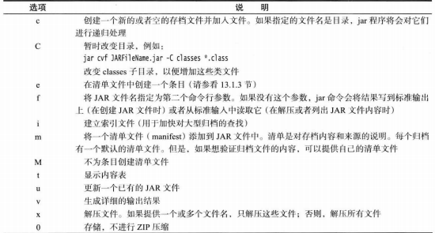

## 部署

### JAR 文件

Java 归档（JAR）文件既可以包含类文件，也可以包含诸如图像和声音这些其他类型的文件。

*JAR程序选项*



#### 清单文件

除了类文件，图像和其他资源外，每个 JAR 文件还包含一个用于描述归档特征的清单文件。清单文件被命名为 `MANIFEST.MF`，它位于 JAR 文件的一个特殊 `META-INF` 子目录中。最小的符合标准的清单文件是很简单的：

```java
Manifest-Version: 1.0
```

复杂的清单文件可能包含更多条目。这些清单条目被分成多个节。第一节被称为主节。它作用于整个 JAR 文件。随后的条目用来指定已命名条目的属性，这些已命名的条目可以是某个文件、包或者 URL。它们都必须起始于名为 Name 的条目。节与节之间用空行分开。

```java
Manifest-Version: 1.0 	// 描述这个归档文件的行

Name: Woozle.class		// 描述这个文件的行

Name: com/company/mypkg/     // 描述这个包的行
```

* 创建一个包含清单的 JAR 文件

  ```java
  jar cfm MyArchive.jar manifest.mf com/mycompany/mypkg/*.class
  ```

* 更新一个已有的 JAR 文件的清单，需要将增加的部分放置到一个文本文件中，然后执行

  ```jar
  jar ufm MyArchive.jar manifest-additions.mf
  ```

可以使用 JAR 命令中的 e 选项指定程序的入口点（通常需要在调用 Java 程序加载器时指定的类）：

```jar
jar cvfe MyProgram.jar com.mycompany.mypkg.MainAppClass files to add
```

或者咋清单中指定应用程序的主类，包括以下形式的语句：

```
Main-Class: com.mycompany.mypkg.MainAppClass   	// 不要将扩展名.class 添加到主类名中
```

清单文件的最后一行必须以换行符结束。否则，清单文件将无法被正确地读取。

启动应用程序：

```
java -jar MyProgram.jar
```

* 在 Windows 平台中，Java 运行时安装器将建立一个扩展名为 `.jar` 的文件与 `javaw -jar` 命令相关联来启动文件（与Java命令不同，`javaw`命令不打开shell窗口）
* 在 `Solaris` 平台中，操作系统能够识别 JAR 文件的魔法数格式，并用 `jara -jar` 命令启动它
* 在 Mac OS X 平台中，操作系统能够识别 `.jar` 扩展名文件。当双击 `JAR` 文件时就会执行 Java 程序可以运行

#### 密封

可以将 Java 包密封以保证不会有其他的类加入到其中。如果在代码中使用了包可见的类、方法和域，就可能希望密封包。如果不密封，其他类就有可能放在这个包中，进而访问包可见的特性

想要密封一个包，需要将包中的所有类放到一个 JAR 文件中。在默认情况下，JAR 文件中的包是没有密封的。可以在清单文件的主节中加入一行来改变全局的默认设定。对于每个单独的包，可以通过在 JAR 文件的清单中增加一节，来指定是否想要密封这个包

```java
Sealed: true 				// 全局设定

Name: com/mycompany/util/
Sealed: true					// 单个包设定

Name: com/mycompany/misc/
Sealed: false					// 单个包设定
```

### 应用首选项的存储

#### 属性映射

属性映射是一种存储键/值对的数据结构。属性映射通常用来存储配置信息

* 键和值是字符串

* 映射可以很容易地存入文件以及从文件加载

* 有一个二级表保存默认值


