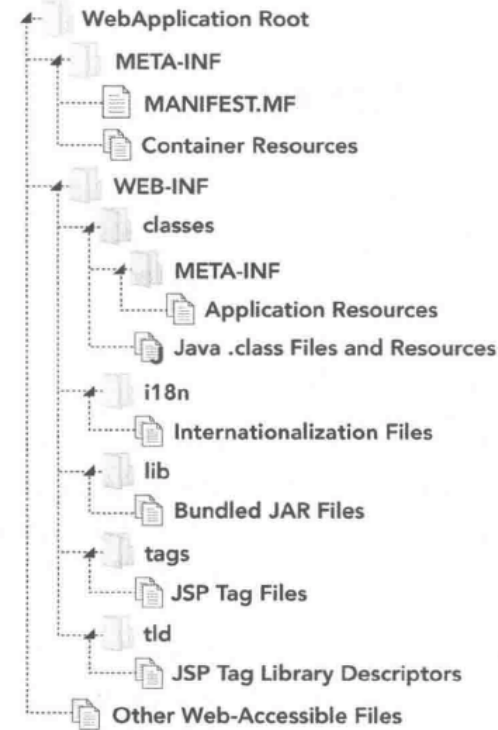

### 目录结构和 WAR 文件

标准 JavaEE Web 应用程序将作为 WAR 文件或者未归档的 Web 应用程序目录进行部署。JAR 文件只是一个简单的 ZIP 格式归档文件，其中包含了可悲 JVM 识别的标准目录结构。WAR 时 JavaEE Web 应用程序对应的归档文件

所有的 Java EE Web 应用程序服务器都支持 WAR 文件应用程序归档。大多数服务器还支持未归档的应用程序目录。无论是归档文件还是未归档文件，它们的目录结构约定都是相同的。

*war目录结构*

* 类文件存储在 `/WEB-INF/classes` 中。WEB-INF 目录存储了一些包含了信息和指令的文件，JavaEE Web 应用程序服务器使用它们决定如何部署和运行应用程序。它的 `classes`  目录被用作包的根目录。所有编译后的应用程序类文件和其他资源都被存储在该目录中

* 依赖文件存储在 `/WEB-INF/lib` 中。JAR 文件中所有在该目录中的类对于在应用程序类路径上的应用程序都是可用的

* `/WEB-INF/tags` 存储 JSP 标签文件

* `/WEB-INF/tld` 标签库描述符

* `/WEB-INF/i18n` 国际化和本地化 L10n 文件存储在该目录中

  

