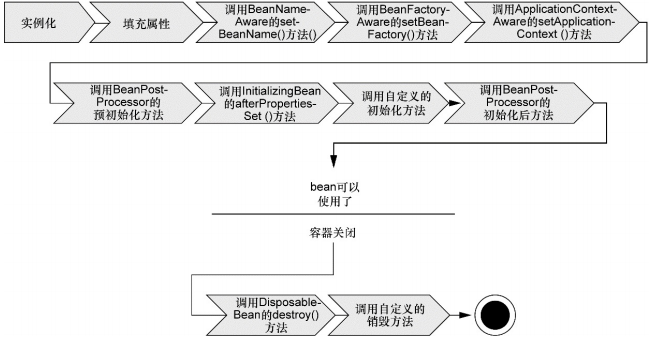
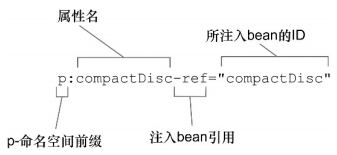
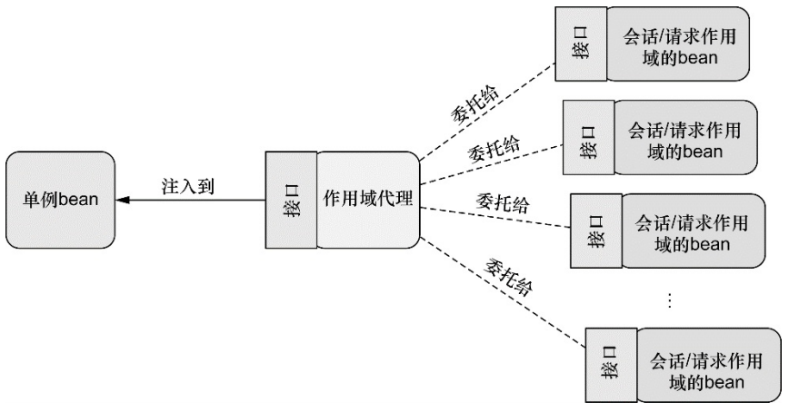

## Spring Bean

### bean 的生命周期

*Spring bean 生命周期*



每个阶段都可以针对 Spring 如何管理 bean 进行个性化定制

* Spring 对 bean 进行实例化
* Spring 将值和 bean 的引用注入到 bean 对应的属性中
* 如果 bean 实现了 BeanNameAware 接口，Spring 将 bean 的 ID 传递给 setBeanName() 方法
* 如果 bean 实现了 BeanFactoryAware 接口，Spring 将调用 setBeanFactory() 方法，将 BeanFactory 容器实例传入
* 如果 bean 实现了 ApplicationContextAware 接口，Spring 将调用 setApplicationContext() 方法，将 bean 所在的应用上下文的引用传入进来
* 如果 bean 实现了 BeanPostProcessor 接口，Spring 将调用它们的 postProcessBeforeInitialization() 方法
* 如果 bean 实现了 InitializingBean 接口，Spring 将调用它们的 afterPropertiesSet() 方法。如果 bean 使用 init-method 声明了初始化方法，该方法也会被调用
* 如果 bean 实现了 BeanPostProcessor 接口，Spring 将调用它们的 postProcessAfterInitialization() 方法
* 此时，bean 已经准备就绪，可以被应用程序使用了，它们将一直驻留在应用上下文中，直到该应用上下文被销毁
* 如果 bean 实现了 DisposableDean 接口，Spring 将调用它的 destroy() 接口方法。同样，如果 bean 使用 destroyMethod 声明了销毁方法，该方法也会被调用

### 装配 bean

在 Spring 中，对象无需自己查找或创建与其所关联的其他对象。容器负责把需要相互协作的对象引用赋予各个对象。创建应用对象之间协作关系的行为通常为**装配**，这是依赖注入的本质。当描述 bean 如何进行装配时，Spring 具有非常大的灵活性，提供了三种主要的装配机制：

* XML 中进行显式配置
* 在 Java 中进行显式配置
* 隐式的 bean 发现机制和自动装配

Spring 的配置风格是可以互相搭配的，建议尽可能地使用自动配置的机制。显示配置越少越好。当必须要显式配置 bean 时，推荐使用类型安全并且比 XML 更加强大的 JavaConfig。

#### 自动化装配 bean

Spring 从两个角度来实现自动化装配：

* 组件扫描（component scanning）

  Spring 会自动发现应用上下文中所创建的 bean

* 自动装配（autowiring)

  Spring 自动满足 bean 之间的依赖

`@Component` 注解，表明该类会作为组件类，并告知 Spring 要为这个类创建 bean。组件扫描默认不启用，需要显式配置 Spring

*配置类*

```java
import org.springframework.context.annotation.compoentScan;
import org.springframework.context.annotation.Con;
@Configuration
@ConponentScan
public class CDPlayerConfig() {}
```

`CDPlayerConfig` 类并没有显式地声明任何 bean，只不过它使用 `@ComponentScan` 注解，这个注解能够在 Spring 中启用组件扫描。如果没有其他配置，`@ComponentScan` 默认会扫描与配置类相同的包，查找带有 `@Component` 注解的类。可以使用 XML 来启用组件扫描，可以使用 Spring Context 命名空间的 

```xml
<?xml version="1.0" encoding="UTF-8"?>
<beans xmlns="http://www.springframework.org/schema/beans"
  xmlns:xsi="http://www.w3.org/2001/XMLSchema-instance"
  xmlns:Context="http://www.springframework.org/schema/context"
  xsi:schemaLocation="http://www.springframework.org/schema/beans"
	http://www.springframework.org/schema/beans/spring-beans.xsd
	http://www.springframework.org/schema/context>
	http://www.springframework.org/schema/context/spring-context.xsd"?
  <context:component-scan base-package="beanPackage"/>
</beans>
```

##### 为组件扫描的 bean 命名

Spring 应用上下文中所有的 bean 都会给定一个 ID。如果想为这个 bean 设置不同的 ID，可以将 ID 值传递给 `@Component` 注解。或者使用 Java 依赖注入规范（Java Dependency Injection）中提供的 @Named 注解来为 bean 设置 ID。Spring 支持将 @Named 作为 @Component 注解的替代方案。两者之间有一些差异，但大多数场景中，它们可以互相替换。

```java
@Component("lonelyHeartsClub")
public class SgtPeppers implements CompactDisc{}
@Named("lonelyHeartsClub")
public class SgtPeppers implements CompactDisc{}
```

##### 设置组件扫描的基础包

如果没有为 `@ComponentScan` 设置任何属性。按照默认规则，它会以配置类所在的包作为基础包来扫描组件。可以在 `@ComponentScan` 的 value 属性中指明包的名称：

```java
@Configuration
@ComponentScan("soundsystem")
public class CDPlayerConfig {}
@Configuration
@ComponentScan(basePackages={"soundsystem", "video"})
public class CDPlayerConfig {}
```

除了将包设置为简单的 String 类型外，@ComponentScan 还提供了另外一种方法，将其指定为包中所包含的类或接口

```java
@Configuration
@ComponentScan(basePackageClasses={CDPlayer.class, DVDPlayer.class})
public class CDPlayerConfig() {}
```

##### bean 自动装配

自动装配就是即是让 `Spring` 自动满足 bean 依赖的一种方法，在满足依赖的过程中，会在 Spring 应用上下文中寻找匹配某个 bean 需求的其他 bean。为了声明要进行自动装配，可以使用 Spring 的 `@Autowired` 注解。将 `@Autowired` 配置在方法上时，Spring 会尝试满足方法参数上所声明的依赖，假如有且只有一个 bean 匹配依赖需求的化，那么这个 bean 将会被装配进来。如果没有匹配的 bean，那么在应用上下文创建的时候，Spring 会抛出一个异常。为了避免异常的出现，可以将 `@Autowired` 的 `required` 属性设置为 false：

```java
@Autowired(required=false)
public CDPlayer(CompactDisc cd) {
	this.cd = cd;
}
```

将 `required` 属性设置为 false 时，Spring 会尝试执行自动装配，但是如果没有匹配的 bean，Spring 将会让这个 bean 处理未装配的状态。required 属性为 false 时，如果代码中没有进行 null 检查，这个处于未装配状态的属性可能会出现 `NullPointerException` 。如果有多个 bean 都能满足依赖关系，Spring 将会抛出异常，表明没有明确指定要选择那个 bean 进行自动装配

@Autowired 是 Spring 特有的注解。如果不愿意在代码中使用 Spring 的特定注解来完成自动装配任务，可以考虑将其替换为 `@Inject`。`@Inject` 注解来源于 Java 依赖注入规范，在自动装配中，Spring 同时支持 `@Inject` 和 `@Autowired` 。它们有一些差别，但多数场景下，可以互相替换

#### 通过 Java 代码装配 bean

如果要将第三方库中的组件装配到应用中，在这种情况下，是没有办法再它类上添加 `@Component` 和 `@Autowired` 注解的，因此不能使用自动化装配的方案。这种情况下，必须采用显式装配的方式：Java 和 XML。在进行显式配置时，JavaConfig 是更好的方案。JavaConfig 是配置代码，不应该包含任何业务逻辑，也不应该侵入到业务逻辑代码之中。一般建议将 JavaConfig 放到单独的包中。

创建 JavaConfig 类为其添加 `@Configuration` 注解，表明这是一个配置类，包含在 Spring 应用上下文中如何创建 bean 的细节

##### 声明 bean

要在 JavaConfig 中声明 bean，需要编写一个方法，这个方法会创建所需类型的实例，然后给这个方法添加 `@Bean` 注解，默认情况下，bean 的 ID 与带有 @Bean 注解的方法名一样的。可以通过 name 属性指定一个不同的名字

```java
@Bean(name="lonelyHeartsClubBand")
public CompactDisc sgtPeppers() {
    return new SgtPeppers();
}
```

#### 通过 XML 装配 bean

##### 声明一个简单的 <bean>

要在基于 XML 的 Spring  配置中声明一个 bean，使用 spring-beans 模式中的另外一个元素 `<bean>`，`<bean>` 元素类似于 JavaConfig 中的 `@Bean` 注解

```xml
<bean class="soubdsystem.SgtPeppers" />
```

声明一个很简单的 bean，创建这个 bean 的类通过 class 属性来指定的，并且要使用全限定的类名。因为没有明确给定 ID，所以这个 bean 将会根据全限定类名来进行命名。上面声明中，bean 的 ID 将会是 `soundsystem.SgtPeppers#0`。其中，`#0` 是一个计数的形式，用来区分相同类型的其他 bean。或者指定 id 属性

```xml
<bean id="compactDisc" class="soundsystem.SgtPeppers" />
```

#### 使用XML注入配置

在 Spring XML 配置中，只有一种声明 bean 的方式：使用 `<bean>` 元素并指定 class 属性。Spring 会从这里获取必要的信息来创建 bean。但在 XML 中声明 DI 时，会有多种可选的配置方案

##### 构造器注入

* `<constructor-arg>` 元素
* 使用 Spring3.0 所引入的 c- 命名空间

两者的区别在很大程度就是是否冗长及实现。

* 构造器注入 bean 引用，在 XML 中声明 bean 并通过 ID 引用

  ```xml
  <bean id="cdPlayer" class="soundsystem.CDPlayer">
  	<constructor-arg ref="compactDisc" />
  </bean>
  ```

  或 c- 命名空间

  ```xml
  <?xml version="1.0" encoding="UTF-8" ?>
  <beans xmlns="http://www.springframework.org/schema/beans"
    xmlns:c="http://www.springframework.org/schema/c"
    xmlns:xsi="http://www.w3.org/2001/XMLSchema-instance"
    xsi:schemaLocation="http://www.springframework.org/schema/beans"
    http://www.springframework.org/schema/beans/spring-beans.xsd
  </beans>
  <bean id="cdPlayer" class="soundsystem.CDPlayer" c:cd-ref="compactDisc" />
  ```

  装配字面量

  ```xml
  <bean id="compactDisc" class="soundsystem.CDPlay">
  	<constructor-arg value="The Params" />
  </bean>
  ```

  ```xml
  <bean id="compactDisc" class="soundsystem.BlankDisc" 
        // 构造器参数名称
        c:_title="Sgt.Pepper's Lonely Hearts Club Band"
        c:_artis="The Beatles"/>
  ```

  装配集合

  使用 c- 命名空间无法装配集合，只能使用 `<constructor-arg>` 装配集合

  ```xml
  <bean id="compactDisc" class="soundsystem.BlankDisc">
  	<constructor-arg value="Sgt.Pepper's"/>
      <constructor-arg value="The Beatles"/>
      <constructor-arg>
          <set>
              <value>hello</value>
              <value>world</value>
          </set>
      </constructor-arg>
  </bean>
  ```

##### 属性注入

* `<property>` 元素属性注入
* p- 命名空间注入

`<property>` 元素为属性的 Setter 方法提供注入。使用 `p-` 空间注入必须先声明

```xml
<bean id="cdPlayer" class="soundsystem.CDPlayer">
	<property name="compactDisc" ref="compactDisc"/>
</bean>
```

```xml
<bean id="cdPlayer" class="soundsystem.CDPlayer" p:compactDisc-ref="compactDisc" />
```

*p-命名空间*



属性的名字使用了 `p:` 前缀，表明这是一个属性。属性名以 `-ref` 结尾，表示引用，而不是字面量

属性字面量注入

使用 `<property>` 元素的 value 属性实现。或 p- 命名空间

#### 导入和混合配置

在 Spring 中，这些配置方案不是互斥的。可以将 JavaConfig 的组件扫描和自动装配和 XML 配置混合在一起。

##### 在 JavaConfig 中引用 XML 配置

* 使用 `@Import` 注解导入 Java 配置。

  ```java
  @Configuration
  @Import({CDPlayerConfig.class, CDConfig.class})
  public class SoundSystemConfig {}
  ```

* 使用 @ImportResource 注解导入 xml 配置，假定 `cd-config.xml` 文件位于根类路径下

  ```java
  @Configuration
  @Import(CDPlayerConfig.class)
  @ImportResource("classpath:cd-config.xml")
  public class SoundSystemConfig {}
  ```

##### 在 XML 配置中引用 JavaConfig

在 XML 中，可以使用 import 元素来拆分 XML 配置，但无法导入 JavaConfig 类。可以使用 `<bean>` 元素

```xml
<bean class="soundsystem.CDConfig" />
<bean id="cdPlayer">
	
</bean>
```

### 高级装配

#### 配置 profile bean

Spring 为环境相关的 bean 所提供的解决方案其实与构建时的方案没有太大的差别。在这个过程中需要根据环境决定该创建那个 bean 和不创建那个 bean。不过 Spring 并不是在构建的时候做出这样的决策，而是等到运行时再来决定。这样的结果就是同一个部署单元（可能会是 WAR 文件）能够适用于所有的环境，没有必要进行重新构建。

在 3.1 版本中，Spring 引入了 bean profile 的功能。要使用 profile，首先要将所有不同的 bean 定义整理到一个或多个 profile 之中，在将应用部署到每个环境时，要确保对应的 profile 处理激活状态。在 Java 配置中，可以使用 `@Profile` 注解指定某个 bean 属于哪一个 profile。

```java
import org.springframework.context.annotation.Bean;
import org.springframework.context.annotation.Configuration;
import org.springframework.context.annotation.Profile;
import org.springframework.jdbc.datasource.embedded.EmbeddedDatabaseBuilder;
import org.springframework.jdbc.datasource.embedded.EmbeddedDatabaseType;

@Configuration
@Profile("dev")
public class DevelopmentProfileConfig {
    @Bean(destroyMethod="shutdown")
    public DataSource dataSource() {
        return new EmbeddedDatabaseBuilder()
            .setType(EmbeddedDatabaseType.H2)
            .addScript("classpath:schema.sql")
            .addScript("classpath:test-data.sql")
            .build();
    }
}
```

上面 `@Profile` 注解应用了类级别上。即告诉 Spring 这个配置类中的 bean 只有在 dev profile 激活时才会创建。如果 dev profile 没有激活，那么带有 @Bean 注解的方法都会被忽略掉

在 Spring 3.1 中，只能在类级别上使用 @Profile  注解。不过，从 Spring 3.2 开始，可以在方法级别上使用 @Profile 注解，与  @Bean 注解一同使用。这样可以将这两个 bean 的声明放到同一个配置类中

```java
import javax.activation.DataSource;
import org.springframework.context.annotation.Bean;
import org.springframework.context.annotation.Configuration;
import org.springframework.context.annotation.Profile;
import org.springframework.jdbc.datasource.embedded.EmbeddedDatabaseBuilder;
import org.springframework.jdbc.datasource.embedded.EmbeddedDatabaseType;
import org.springframework.jndi.JndiObjectFactoryBean;

@Configuration
public class DataSourceConfig {
    @Bean(destroyMethod="shutdown")
    @Profile("dev")
    public DataSource embeddedDataSource() {
        return new EmbeddedDatabaseBuilder()
            .setType(EmbeddedDatabaseType.H2)
            .addScript("classpath:schema.sql")
            .addScript("classpath:test-data.sql")
            .build();
    }
    @Bean
    @Profile("prod")
    public DataSource jndiDataSource() {
        JndiObjectFactoryBean jndiObjectFactoryBean = new JndiObjectFactoryBean();
        jndiObjectFactoryBean.setJndiName("jdbc/myDS");
        jndiObjectFactoryBean.setResourceRef(true);
        jndiObjectFactoryBean.setProxyInterface(javax.sql.DataSource.class);
        return (DataSource) jndiObjectFactoryBean.getObject();
    }
```

没有指定 profile 的 bean 始终都会被创建，与激活那个 profile 没有关系

#### 在 XML 中配置 profile

可以通过 `<bean>` 元素的 profile 属性，在 XML 中配置 profile bean。

```xml
<?xml version="1.0" encoding="UTF-8" ?>
<beans xmlns="http://www.springframework.org/schema/beans"
  xmlns:xsi="http://www.w3.org/2001/XMLSchema-instance"
  xmlns:jdbc="http://www.springframework.org/schema/jdbc"
  xsi:schemaLocation="
    http://www.springframework.org/schema/jdbc
    http://www.springframework.org/schema/jdbc/spring-jdbc.xsd
    http://www.springframework.org/schema/beans
    http://www.springframework.org/schema/beans/spring-beans.xsd"
  profile="dev">
  <jdbc:embedded-database id="dataSource">
     <jdbc:script location="classpath:schema.sql" />
     <jdbc:script location="classpath:test-data.sql" />
  </jdbc:embedded-database>
</beans>
```

#### 激活 profile

Spring 在确定那个 profile 处于激活状态时，需要依赖两个独立的属性：`spring.profiles.active` 和 `spring.profiles.default` 如果设置了 `spring.profiles.active` 属性，那么它的值就会用来确定那个 profile 是激活的。如果没有设置 `spring.profiles.active` 属性，那么 Spring 将会查找 `spring.profiles.default` 的值。如果 `spring.profiles.active` 和 `spring.profiles.default` 均未设置，即没有激活的 profile，只会创建那些没有定义在 profile 中 bean

可使用以下方式设置 `spring.profiles.active` 和 `spring.profiles.default` 属性：

* 作为 DispatcherServlet 的初始化参数
* 作为 Web 应用的上下文参数
* 作为 JNDI 条目
* 作为环境变量
* 作为 JVM 的系统属性
* 在集成测试类上，使用 @ActiveProfiles 注解设置

*在 web.xml 文件中设置默认的 profile*

```xml
<?xml version="1.0" encoding="UTF-8" ?>
<web-app version="2.5"
  xmlns="http://java.sun.com/xml/ns/javaee"
  xmlns:xsi="http://www.w3.org/2001/XMLSchema-instance"
  xsi:schemaLocation="http://java.sun.com/xml/ns/javaee
      http://java.sun.com/xml/ns/javaee/web-app_2_5.xsd">
  <context-param></context-param>
  <context-param>
    <param-name>contextConfigLocation</param-name>
    <param-value>/WEB-INF/spring/root-context.xml</param-value>
  </context-param>
  <context-param>
    <param-name>spring.profiles.default</param-name> // 为上下文配置默认 profile
    <param-value>dev</param-value>
  </context-param>
  <listener>
    <listener-class>
      org.springframework.web.context.ContextLoaderListener
    </listener-class>
  </listener>
  <servlet>
    <servlet-name>appServlet</servlet-name>
    <servlet-class>
      org.springframework.web.servlet.DispatcherServlet
    </servlet-class>
    <init-param>
      <param-name>spring.profiles.default</param-name> // 为 Servlet 配置默认 profile
      <param-value>dev</param-value>
    </init-param>
  </servlet>
  <servlet-mapping>
    <servlet-name>appServlet</servlet-name>
    <url-pattern>/</url-pattern>
  </servlet-mapping>
</web-app>
```

Spring 提供了 @ActiveProfiles 注解，可以使用它来指定运行测试时要激活那个 profile。

```java
@RunWith(SpringJUnit4ClassRunner.class)
@ContextConfiguration(classes={PersisenceTestConfig.class})
@ActiveProfiles("dev")
public class PersistenceTest {}
```

#### 条件化的 bean

Spring 4.0 提供了一种更为通用的机制来实现条件化的 bean 定义，@Conditional 注解。它可以用到带有 @Bean 注解的方法上。如果给定的条件计算结果为 true，就会创建这个 bean，否则的化，这个 bean 会被忽略。

```java
@Bean
@Conditional(MagicExistsCondition.class)
public MagicBean magicBean () {
    return new MigicBean();
}
```

@Conditional 中给定了一个 Class，它指明了条件。@Conidtional 将会通过 Condition 接口进行条件对比

 ```java
public interface Condition {
	boolean matches(ConditionContext ctxt, AnnotatedTypeMetadata metadata);
}
 ```

设置给 @Conditional 的类可以是任意实现了 Condition 接口的类型。需提供 `matches()` 方法的实现即可。如果 `matches()` 方法返回 true，那么将会创建带有 @Conditional 注解的 bean。如果  `matches()` 方法返回 false，将不会创建这些 bean。

*ConditionContext 接口*

```java
public interface ConditionContext {
    // 检查 bean 定义
    BeanDefinitionRegistry getRegistry();
    // 检查 bean 是否存在，探查 bean 属性
    ConfigurableListableBeanFactory getBeanFactory();
    // 返回的 Environment 检查环境变量是否存在及获取值
    Environment getEnvironment();
    // ClassLoader 检查类是否存在
    ClassLoader getClassLoader();
}
```

*AnnotatedTypeMetadata*

```java
public interface AnnotatedTypeMetadata {
    // 判断带有 @Bean 注解的方法是否还有其他特定注解
    boolean isAnnotated(String annotationType);
    Map<String, Object> getAnnotationAttributes(String annotationType);
    Map<String, Object> getAnnotationAttributes(String annotationType, boolean classValuesAsString);
    MultiValueMap<String, Object> getAllAnnotationAttributes(String annotationType);
    MultiValueMap<String, Object> getAllAnnotationAttributes(String annotationType, boolean classValuesAsString);
}
```

#### 自动装配歧义性

使用自动装配让Spring完全负责将bean引用注入到构造参数和属性中。仅有一个 bean 匹配所需的结果时，自动装配才是有效的。如果不仅有一个 bean 能够匹配结果，这种歧义性会阻碍 Spring 自动装配属性、构造器参数、方法参数并抛出 `NoUniqueBeanDefinitionException` 

##### 标示首选 bean

在声明 bean 的时候，通过将其中一个可选的 bean 设置为首选（primary）bean 能够避免自动装配时的歧义性。当遇到歧义性的时候，Spring 将会使用首选的 bean，而不是其他可选的 bean。使用 `@Primary` 注解或在 XML 配置 bean 时，将 primary 属性设置为 true

```xml
<bean id="iceCream" class="com.dessertreater.IceCream" primary="true"/>
```

Spring 无法从多个首选的 bean 中做出选择。

##### 限定自动装配的 bean

Spring 的限定符号能够在所有可选的 bean 上进行缩小范围的操作，最终能够达到只有一个 bean 满足所规定的限制条件。如果将所有的限定符都用上后依然存在歧义性，可以继续使用更多的限定符来缩小选择范围。`@Qualifier` 注解是使用限定符的主要方式。它可以与 `@Autowired` 和 `@Inject` 协同使用，在注入的时候指定想要注入进去的是那个 bean。

```java
@Autowired
@Qualifier("iceCream")
public void setDessert(Dessert dessert) {
	this.dessert = dessert;
}
```

`@Qualifier("iceCream")` 所引用的 bean 要具有 String 类型的 "iceCream" 作为限定符。如果没有指定其他的限定符，所有的 bean 都会给定一个默认的限定符，这个限定符与 bean 的 ID 相同。因此，框架会将具有 “iceCream" 限定符的 bean 注入到 setDessert() 方法中。这恰好是 ID 为 iceCream 的 bean，它是 IceCream 类在组件扫描的时候创建的。以上使用会使 `setDessert()` 方法上所指定的限定符与要注入的 bean 的名称是紧耦合的。对类的名称的任意改动都会导致限定符失效。可以为 bean 设置自己的限定符，而不是依赖于将 bean ID 作为限定符。

```java
@Component
@Qualifier("cold") // 指定 cold 作为 IceCream bean 的限定符
public class IceCream implements Desset {}
```

当通过 Java 配置显式定义 bean 的时候，@Qualifier 也可以与 @Bean 注解一起使用

```java
@Bean
@Qualifier("cold")
public Dessert icrCream() {
	return new IceCream();
}
```

Java 不允许在同一个条目上重复出现相同类型的多个注解（Java 8 允许出现重复的注解，只要这个注解本身在定义的时候带有 @Repeatable 注解就可以），可以使用 @Qualifier 注解来标注自定义注解，可以使用多个限定符，不会再有 Java 编译器的限制，与此同事，相对于使用原始的 @Qualifier 并借助 String 类型来指定限定符，自定义的注解也更为类型安全

```java
@Target(ElementType.CONSTRUCTOR, ElementType.FIELD, ElementType.METHOD, ElementType.TYPE)
@Retention(RetentionPolicy.RUNTIME)
@Qualifier
public @interface Cold {}
```

使用自定义 @Cold 注解

```java
@Component
@Cold
public class IceCream implements Dessert {}
```

#### Bean 作用域

在默认情况下，Spring 应用上下文中所有 bean 都是作为单例（singleton）的形式创建的。即不管给定的一个 bean 被注入到其他 bean 多少次，每次所注入的都是同一个实例。Spring 定义了多种作用域，可以基于这些作用域创建 bean，包括：

* 单例（Singleton）

  在整个应用中，只创建 bean 的一个实例

* 原型（Prototype）

  每次注入或者通过 Spring 应用上下文获取的时候，都会创建一个新的 bean 实例

* 会话（Session）

  在 Web 应用中，为每个会话创建一个 bean 实例

* 请求（Request）

  在 Web 应用中，为每个请求创建一个 bean 实例

bean 默认作用域时单例，如果要选择其他的作用域，要使用 @Scope 注解，它可以与 @Component 或 @Bean 一起使用。

```java
@Component
@Scope(ConfigurableBeanFactory.SCOPE_PROTOTYPE)
public class Notepad {}
@Bean
@Scope(ConfigurableBeanFactory.SCOPE_PROTOTYPE)
public Notepad notepad() {
	  return new Notepad();
}
```

使用 `ConfigurableBeanFactory.SCOPE_PROTOTYPE` 或直接使用 `"prototype"` ，使用常量更安全。或使用 XML 来配置 bean

```xml
<bean id="notepad" class="com.myapp.Notepad" scope="prototype"/>
```

##### 会话与请求作用域

将会话或请求作用域的 bean 注入到单例 bean 时，需要配置代理，代理真正需要注入的 bean，因为被注入 bean  会在应用上下文加载时候创建，当它创建时，Spring 会试图将要注入的会话或请求 bean 注入，但由于此时请求或会话还未创建，因此注入的 bean 还不存在，Spring 此时会注入一个类或接口的代理，代理会暴露与注入 bean 相同的方法，当需要调用注入 bean 时，代理会对其进行懒解析并将调用委托给会话作用域内真正的 bean。

使用 @Scope 的 `proxyMode` 属性声明代理模式是接口还是类



*代理模式为接口*（理想情况）

```java
@Componet
@Scope(value=WebApplicationContext.SCOPE_SESSION,proxyMode=ScopedProxyMode.INTERFACES） 
public ShoppingCart cart() {}
```

*代理模式目标类扩展方式创建代理*

```java
@Componet
@Scope(value=WebApplicationContext.SCOPE_SESSION, proxyMode=ScopedProxyMode.TARGET_CLASS)
public ShoppingCart cart() {}
```

在 XML 声明会话或请求作用域的 bean，需要使用 Spring aop 命名空间的一个新元素 `<aop:scoped-proxy>`，它作用类似 @Scope 注解的 proxyMode 属性，它会告诉 Spring 为 bean 创建一个作用域代理。默认情况下，会使用 CGLib 创建目标类的代理。也可以将 proxy-target-class 属性设置为 false，要求它生成基于接口的代理

*基于 CGLib 创建目标类的代理*

```xml
<bean id="cart" class="com.myapp.ShoppingCart" scope="session">
  	<aop:scoped-proxy/>
</bean>
```

基于接口的代理

```xml
<bean id="cart" class="com.myapp.ShoppingCart" scope="session">
		<aop:scoped-proxy proxy-target-calss="false"/>
</bean>
```

要使用 `<aop:scopd-proxy>` 元素，需要在 XML 配置中声明 Spring 的 aop 命名空间

```xml
<beans xmlns:aop="http://www.springframework.org/schema/aop">
</beans>
```

#### 运行时值注入

当需要运行时求值进行注入时，Spring 提供了两种方式：

* 属性占位符（Property placeholder）
* Spring 表达式语言（SpEL）

##### 注入外部的值

在 Spring 中，处理外部值的最简单方式就是声明属性源并通过 Spring 的 Environment 来检索属性。使用 @PropertySource 注解和 Environment

```java
import org.springframework.beans.factory.annotation.Autowired;
import org.springframework.context.annotation.Bean;
import org.springframework.context.annotation.Configuration;
import org.springframework.context.annotation.PropertySource;
import org.springframework.core.env.Environment;

@Configuration
@PropertySource("classpath:/com/soundsystem/app.properties") // 声明属性源
public class ExpressiveConfig {
    @Autowired
    Environment env;
    
    @Bean
    public BlankDisc disc() {
        return new BlankDisc {
            // 检索属性值
            env.getProperty("disc.title");
            env.getProperty("disc.artist");
        }
    }
}
```

这个属性文件会加载到 Spring 的 Environment 中，运行时从这里检索属性。`Environment` 的 `getProperty()` 方法重载

```java
String getProperty(String key);
String getProperty(String key, String defaultValue);
T getProperty(String key, Class<T> type);
T getProperty(String key, Class<T> type, T defaultValue);
```

* 如果使用 `getProperty()` 方法的时候没有指定默认值，并且这个属性没有定义，则获得的值是 null。如果希望这个值必须要定义，使用 `getRequiredProperty()`，未定义会抛出 `IllegalStateException` 异常。检查属性是否存在可以调用 `containsProperty()` 方法。将属性解析为类 `getPropertyAsClass()` 。
* 返回激活 `profile` 名称的数组 `getActiveProfiles()`，返回默认 `profile` 名称的数组 `getDefaultProfiles()` ，如果 environment 支持给定 profile ，返回 true

在 Spring 装配中，占位符的形式 `${}` 包装的属性名称

```xml
<bean id="sgtPeppers" class="soundsystem.BlankDisc" c:_title="${disc.title}" c:_artis="${disc.artist}" />
```

如果依赖于组件扫描和自动装配来创建和初始化应用组件，则没有指定占位符的配置文件或类了。在这种情况下，可以使用 @Value 注解

```java
public BlankDisc(@Value("$(disc.title)") String title, @Value("$(disc.artist)") String artist) {
    this.title = title;
    this.artist = artist;
}
```

使用占位符，必须要配置一个 `PropertyPlaceholderConfigurer` bean 或 `PropertySourcesPlaceholderConfigurer` bean。推荐使用 `PropertySourcesPlaceholderConfigurer` ，它能基于 Spring  Environment 及其属性源来解析占位符

##### 使用 Spring 表达式语言进行装配

Spring 3 引入了 Spring 表达式语言，它能以一种强大和简洁的方式将值装配到 bean 属性和构造器参数中，在这个过程中所使用的表达式会在运行时计算得到值。SpEL 拥有很多特性：

* 使用 bean 的 ID 来引用 bean

* 调用方法和访问对象的属性

* 对值进行算术、关系和逻辑运算

* 正则表达式匹配

* 集合操作

  


