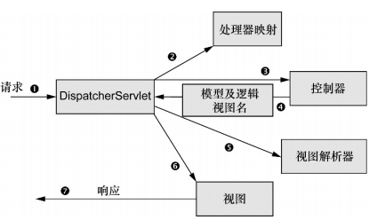

## Spring MVC

### Spring MVC

#### Spring MVC 请求处理



* 请求会先到达 Spring 的 DispatcherServlet。Spring MVC 所有请求都会通过一个前端控制器 (front controller) Servlet。前端控制器是常用的 Web 应用模式，在这里一个单实例的 Servlet 将请求委托给应用程序的其他组件来执行实际的处理。DispatcherServlet 即使前端控制器
* DispatcherServlet 查询一个或多个处理器映射，来确定请求的下一站，处理器映射会根据请求所携带的 URL 信息来进行决策
* 选择了合适的控制器，DispatcherServlet 会将请求发送给选中的控制器。到了控制器，请求会卸下其负载并等待处理器处理这些信息。（设计良好的控制器本身只处理很少甚至不处理工作，而是将业务逻辑委托给一个或多个服务对象进行处理）
* 控制器在完成逻辑处理后，通常会产生一些信息（模型 model），这些信息需要返回给用户并在浏览器上显式，这些信息需要以用户友好的方式进行格式化，一般会是 HTML，信息需要发送给一个视图（view），通常会是 JSP。控制器将模型数据打包，并且标示出用于渲染输出的视图名。将请求模型视图名发送回 DispatcherServlet
* DispatcherServlet 将会使用视图分析器（view resolver）来将逻辑视图名匹配为一个特定的视图实现。
* 视图将使用模型数据渲染输入，输出会通过响应对象传递给客户端

#### 搭建 Spring MVC

##### 配置 DispatcherServlet

DispatcherServlet 是 Spring MVC 的核心。传统会将该 Servlet 配置在 web.xml 文件中。Servlet3 规范可以使用注解配置

*配置 DispatcherServlet*

```java
package spittr.config;
import org.springframework.web.servlet.support.AbstractAnnotationConfigDispatcherServletInitializer;

public class SpittrWebAppInitializer extends AbstractAnnotationConfigDispatcherServletInitializer {
    @Override
    protected String[] getServletMapping() {
        return new String[] {"/"}; // 将 DispatcherServlet 映射到 '/'
    }
    @Override
    protected Class<?>[] getRootConfigClasses() {
        return new Class<?>[] { RootConfig.class};
    }
    @Override
    protected Class<?>[] getServletConfigClasses() {
        return new Class<?>[] { WebConfig.class }; // 指定配置类
    }
}
```

在 Servlet3.0 环境中，容器会在类路径中查找实现 `javax.servlet.ServletContainerInitializer` 接口的类，如果能发现。就会用它来配置 Servlet 容器。Spring 提供了这个接口的实现：`SpringServletContainerInitializer`，这个类又会查找实现 `WebApplicationInitializer` 的类并将配置的任务交给它，Spring3.2 引入了一个便利的 `WebApplicationInitializer` 的基础实现：`AbstractAnnotationConfigDispatcherServletInitializer`。任何扩展 `AbstractAnnotationConfigDispatcherServletInitializer` 的类都会自动配置 DispatcherServlet 和 Spring 应用上下文，Spring 的应用上下文会位于应用程序的 Servlet 上下文之中

当 DispatcherServlet 启动的时候，它会创建 Spring 应用上下文，并加载配置文件或配置类中所声明的 bean。重写的 `getServletConfigConfigClasses()` 方法中，要求 DispatcherServlet 加载应用上下文时，使用定义在 WebConfig 配置类中的 bean。

在 Spring Web 应用中，通常还会有另外一个应用上下文。这个应用上下文由  `ContextLoaderListener` 创建。实际上，AbstractAnnotationConfigDispatcherServletInitializer 会同时创建 DispatcherServlet 和 ContextLoaderListener。`GetServletConfigClasses()` 方法返回的带有 `@Configuration` 注解的类将会用来定义 DispatcherServlet 应用上下文中的 bean。`getRootConfigClasses()` 方法返回的带有 `@Configuration` 注解的类将会用来配置 ContextLoaderListener 创建的应用上下文中的 bean

##### 启用 SpringMVC

```java
package spittr.config;

import org.springframework.context.annotation.Configuration;
import org.springframework.web.servlet.config.annotation.EnableWebMvc;

@Configuration
@EnableWebMvc
public class WebConfig {
    
}
```

最简单的 Spring MVC 配置，但还有不少问题要解决

* 没有配置视图解析器，Spring 默认会使用 BeanNameViewResolver，这个视图解析器会查找 ID 与视图名称匹配的 bean，并且查找的 bean 要实现 View 接口，它以这样的方式来解析视图
* 没有启用组件扫描。Spring 只能找到显式声明在配置类中的控制器
* DispatcherServlet 会映射为应用的默认 Servlet，它会处理所有请求，包括静态资源

*最小但可用SpringMVC配置*

```java
package spittr.config;
import org.springframework.context.annotation.Bean;
import org.springframework.context.annotation.ComponentScan;
import org.springframework.context.annotation.Configuration;
import org.springframework.web.servlet.ViewResolver;
import org.springframework.web.servlet.config.annotation.DefaultServletHandlerConfigurer;
import org.springframework.web.servlet.config.annotation.EnableWebMvc;
import org.springframwork.web.servlet.config.annotation.WebMvcConfigurerAdapter;
import org.springframwork.web.servlet.view.InternalResourceViewResolver;

@Configuration
@EnableWebMvc
@ComponentScan("spitter.web")
public class WebConfig extends WebMvcConfigurerAdapter {
    @Bean
    public ViewResolver viewResolver() {
        InternalResourceViewResolver resolver = new InternalResourceViewResolver();
        resolver.setPrefix("/WEB-INF/views/");
        resolver.setSuffix(".jsp");
        resolver.setExposeContextBeansAsAttributes(true);
        return resolver;
    }
    @Override
    public void configureDefaultServletHandling (DefaultServletHandlerConfigurer configurer) {
       	configurer.enable();
    }
}
```

```java
package sprttr.config;
import org.springframework.context.annotation.ComponentScan;
import org.springframwwork.context.annotation.ComponentScan.Filter;
import org.springframework.context.annotation.Configuration;
import org.springframework.context.annotation.FilterType;
import org.springframwwork.web.servlet.config.annotation.EnableWebMvc;

@Configuration
@ComponentScan(basePackage={"spitter"}, excludeFilters = {@Filter{type=FilterType.ANNOTATION, value=EnableWebMvc.class}})
public class RootConfig {
    
}
```

##### mvc 中使用的注解

* `Controller`

  声明控制器，可用 `component` 代替，声明为 Spring 上下文中一个 bean

* `RequestMapping`

  value 属性指定请求路径（可使用数组映射多个路径），应用在类上则整个类都映射到该路径，可指定 method 属性限制请求方法

* 