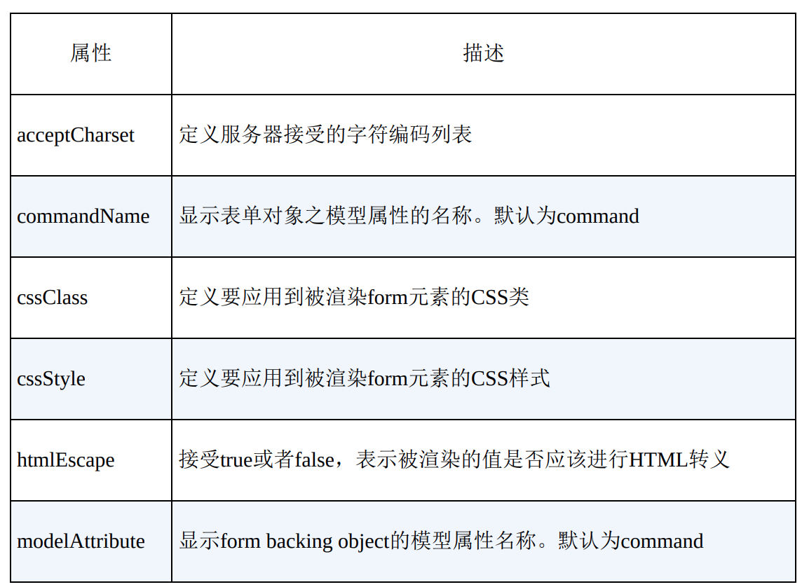
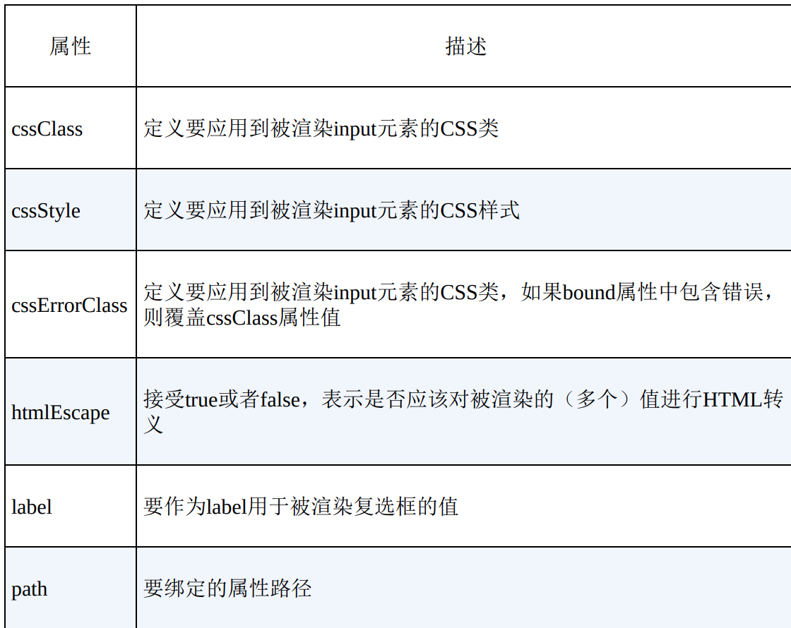
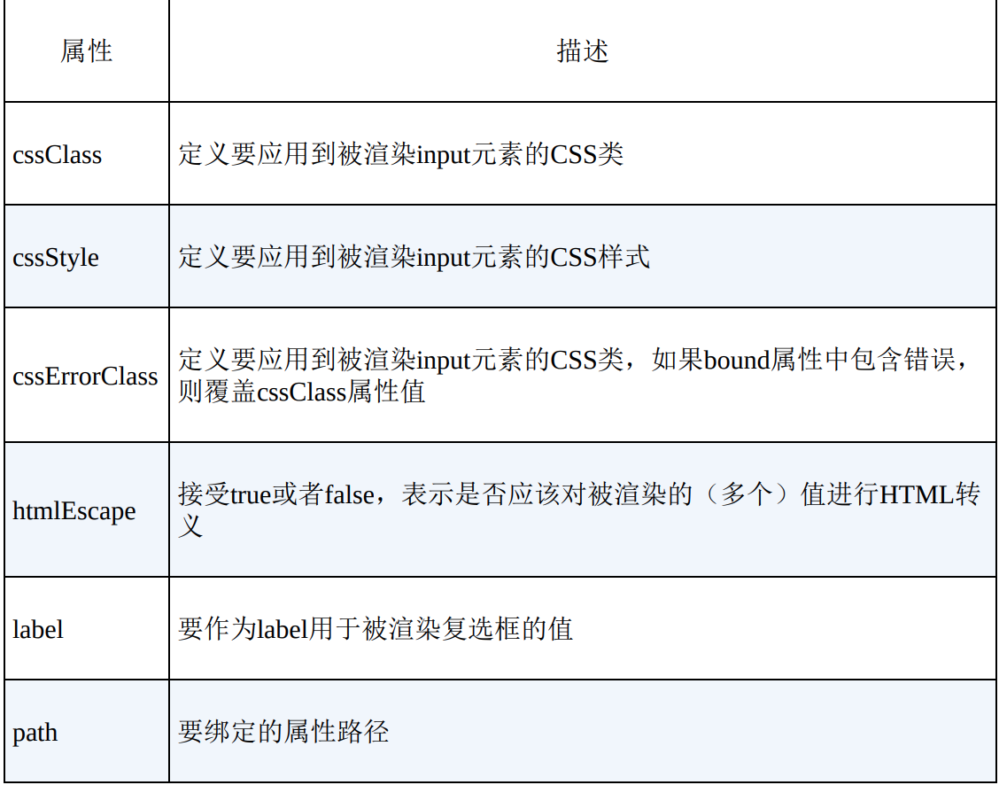
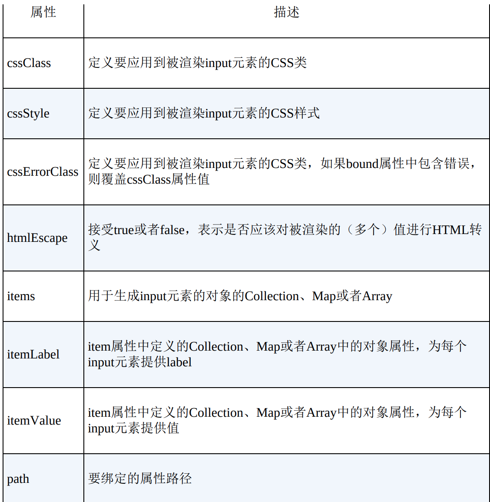
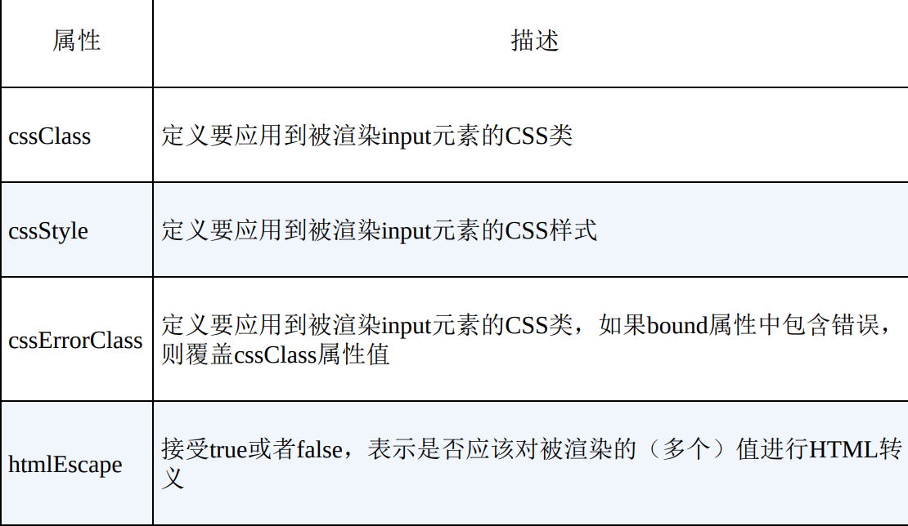
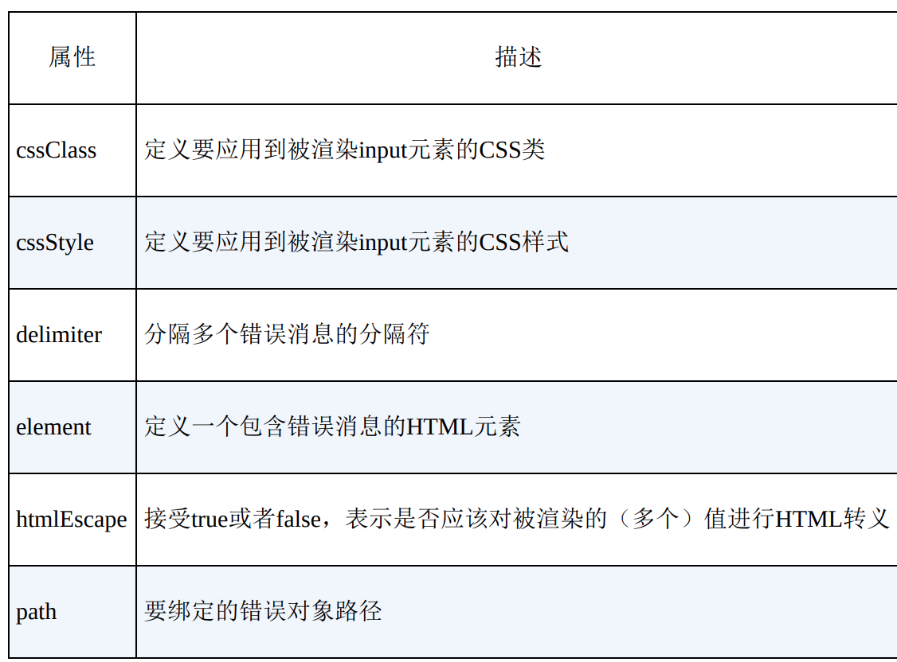

## 数据绑定和表单标签库

### 数据绑定

数据绑定是将用户输入绑定到领域模型的一种特性。有了数据绑定，类型总是为 String 的 HTTP 请求参数，可用于填充不同类型的对象属性。基于 HTTP 的特性，所有 HTTP 请求参数的类型均为字符串。当使用数据绑定时，当输入验证失败时，它会重新生成一个 HTML 表单。

### 表单标签库

表单标签库中包含了可用在 JSP 页面中渲染 HTML 元素的标签。为了使用这些标签，必须在 JSP 页面的开头处声明：

```java
<%@taglib prefix="form" uri="http://www/springframework.org/tags/form" %>
```

#### 表单标签库中的标签

* from

  渲染表单元素。form 标签必须利用渲染表单输入字段的其他任意标签。form 标签的属性：

  

* input

  渲染 `<input type="text"/>` 元素

  *input标签属性*

  

* password

  渲染 `<input type="password"/>` 元素

  Password 标签与 input 标签相似，多了一个 showPassword 属性

* hidden

  渲染 `<input type="hidden"/>` 元素，hidden 属性

  htmlEscape：接受 true 或者 false，表示是否应该对被渲染的值进行 HTML 转义

  path：要绑定的属性路径

* textarea

  渲染 textarea，属性类似 input 元素

* checkbox

  渲染一个 `<input type="checkbox"/>` 元素

  *checkbox标签的属性*

  

* checkboxes

  渲染一个多个 `<input type="checkbox"/>` 元素，与 checkbox 相比多了如下元素：

  `delimiter`：定义两个 input 元素之间的分隔符，默认没有分隔符

  `element`：给每个被渲染的 input 元素定义一个 HTML 元素，默认为 span

  `items`：用于生成 `input` 元素的对象 Collection、Map、Array

  `itemLabel`：item 属性中定义的 Collection、Map 或 Array 中的对象属性，为每个 input 元素提供 label

  `itemValue`：item 属性中定义的 Collection、Map 或 Array 中的对象属性，为每个 input 元素提供值

* radiobuttons

  渲染多个 `<input type="radio"/>` 元素

  *radiobutton标签的属性*

  

* Select

  渲染一个选择元素

  *select标签属性*

  

* option

  渲染一个可选元素

  *option标签的属性*

  

* options

  渲染一个可选元素列表，与 option 相比多了：

  `items` ：用于生成 input 元素的对象的 Collection、Map、Array

  `itemLabel`：item 属性中定义的 Collection、Map、Array 中对象属性，为每个 input 元素提供 label

  `itemValue`：item 属性中定义的 Collection、Map、Array 中的对象属性，为每个 input 元素提供值

* errors

  在 span 元素中渲染字段错误

  *errors标签属性*

  

