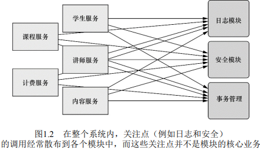
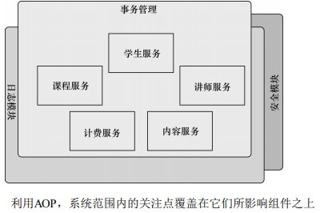

## 面向切面

### 切面示例

面向切面编程（`AOP`）允许把遍布应用各处的功能分离出来形成可重用的组件。面向切面编程往往被定义为促使软件系统实现关注点的分离一项技术。系统由许多不同的组件组成，每一个组件各负责一块特定功能。除了实现自身核心的功能之外，这些组件还经常承担着额外的职责。诸如日志、事务管理和安全这样的系统服务经常融入到自身具有核心业务逻辑的组件中去，这些系统服务通常被称为横切关注点，因为它们会跨越系统的多个组件

如果将这样关注点分散到多个组件中去，代码将会带来双重的复杂性

* 实现系统关注点功能的代码将会重复出现在多个组件中。这意味着如果要改变这些关注点的逻辑，必须修改各个模块中的相关实现。即使把这些关注点抽象为一个独立的模块，其他模块只是调用它的方法，但方法的调用还是会重复出现在各个模块中

* 组件会因为那些与自身核心业务无关的代码而变得混乱。一个向地址簿增加地址条目的方法应该只关注如何添加地址，而不应该关注它是不是安全的或者是否需要支持事务

  ​							*模块服务的复杂性*



左边的业务对象与系统级服务结合得过于紧密。每个对象不但要知道它需要记日志、进行安全控制和参与事务，还有亲自执行这些服务

`AOP` 能够使这些服务模块化，并以声明的方式将它们应用到它们需要影响的组件中去。所造成的结果就是这些组件会具有更高的内聚性并且会更加关注自身的业务，完全不需要了解涉及系统服务所带来复杂性。`AOP` 能够确保 `POJO` 的简单性。

​				*利用AOP，系统范围内的关注点覆盖在它们所影响组件之上*



可以把切面想象为覆盖在很多组件之上的一个外壳。应用是由那些实现各自业务功能的模块组成的。借助 AOP，可以使用各种功能层去包裹核心业务层。这些层以声明的方式灵活地应用到系统中，核心应用甚至根本不知道它们的存在。可以将安全、事务、日志关注点与核心业务逻辑相分离

Spring 的 `aop` 配置命名空间声明切面。首先需要把`Minstrel` 声明为一个 `bean`

```xml
<bean id="minstrel" class="com.springinaction.knights.Minstrel">
	<constructor-arg value="#{T(System).out}" />
<bean>
```

然后在 `<aop:aspect>` 元素中引用该 `bean`。为了进一步定义切面，声明（使用 `<aop:aspect>`）在 `embarkOnQuest()` 方法执行前调用 `Minstrel` 的 `singBeforeQuest()` 方法。这种方式被称为前置通知（`before advice`）。同时声明（使用 `<aop:after>`）在 `embarkOnQuest()` 方法执行后调用 `singAfterQuest()` 方法。这种方式被称为后置通知（`after advice`）

在这两种方式中，`pointcut-ref` 属性都引用了名字为 `embank` 的切入点。该切入点是在前边的 `<pointcut>` 元素中定义的，并配置 `expression` 属性来选择所应用的通知。表达式的语法采用的是 `AspectJ` 的切点表达式语言

```xml
<aop:config>
	<aop:aspect ref="minstrel">
		<aop:pointcut id="embark" expression="execution(* *.embarkOnQuest(...)) "/>
		<aop:before pointcut-ref="embark" method="singBeforeQuest"/>
		<aop:after pointcut-ref="embark" method="singAfterQuest" />
    </aop:aspect>
</aop:config>
```

此时，`Spring` 在骑士执行探险任务前后会调用 `Minstrel` 的 `singBeforeQuest()` 和 `singAfterQuest()` 方法

通过少量的 XML 配置，就可以把 `Minstrel` 声明为一个 `Spring` 切面。首先，`Minstrel` 仍然是一个 `POJO`，没有任何代码表明它要被作为一个切面使用。当按照上面那样进行配置后，在 `Spring` 的上下文中，`Minstrel` 实际上已经变成一个切面了。`Minstrel` 可以被应用到 `BraveKnight` 中，而 `BraveKnight` 不需要显式地调用它。实际上，`BraveKnight` 完全不知道 `Minstrel` 的存在

### 面向切面的 Spring

在软件开发中，散布于应用中多处的功能即为**横切关注点**（cross-cutting concern）。通常这些横切关注点从概念上是与应用的业务逻辑相分离的，但实际往往会直接嵌入到应用的业务逻辑中。把这些横切关注点与业务逻辑相分离正是**面向切面编程**（AOP）所解决的问题。DI 有助于应用对象之间的解耦，而 AOP 可以实现横切关注点与它们所影响对象之间的解耦

#### AOP 术语

AOP 常用术语有：通知（advice）、切点（pointcut）、连接点（join point）。

通知 Advice

在 AOP 中，切面的工作被称为通知，通知定义了切面是什么以及何时使用。除了描述切面要完成的工作，通知还解决了何时执行这个工作的问题。Spring 切面可以应用 5 种类型的通知

* 前置通知（Before）：在目标方法被调用之前调用通知功能
* 后置通知（After）：在目标方法完成之后调用通知，此时不会关系方法的输出是什么
* 返回通知（After-returning)：在目标方法成功执行之后调用通知
* 异常通知（After-throwing)：在目标方法抛出异常后调用通知
* 环绕通知（Around）：通知包裹了被通知的方法，在被通知的方法调用之前和调用之后执行自定义的行为

连接点Join point

连接点是在应用执行过程种能够插入切面的一个点。这个点可以是调用方法时、抛出异常时、甚至修改一个字段时。切面代码可以利用这些点插入到应用的正常流程之中，并添加新的行为。

切点 Pointcut

一个切面并不需要通知应用的所有连接点。切点有助于缩小切面所通知的连接点的范围。切点的定义会匹配通知所要织入的一个或多个连接点。通常使用明确的类和方法名称，或是利用正则表达式定义所匹配的类和方法名称来指定这些切点。有些 AOP 框架允许创建动态的切点，可以根据运行时的决策来决定是否应用通知

切面 Aspect

切面时通知和切点的结合。通知和切点共同定义了切面的全部内容

引入 Introduction

引入允许向现有的类添加新方法或属性。

织入 Weaving

织入是把切面应用到目标对象并创建新的代理对象的过程。切面在指定的连接点被织入到目标对象种。在目标对象的生命周期里有多个点可以进行织入：

* 编译期：切面在目标类编译时被织入。需要特殊的编译器。`AspectJ ` 的织入编译器就是以这种方式织入切面的
* 类加载期：切面在目标类加载到 JVM 时被织入。这种方式需要特殊的类加载器，它可以在目标类被引入应用之前增强该目标类的字节码。AspectJ5 的加载时织入（load-time weaving，LTW）就支持以这种方式织入切面
* 运行期：切面在应用运行的某个时刻被织入。一般情况下，在织入切面时，AOP 容器会为目标对象动态地创建一个代理对象。Spring AOP 就是以这种方式织入切面的

#### Spring 对 AOP 的支持

Spring 提供了 4 种类型的 AOP 支持：

* 基于代理的经典 Spring AOP；
* 纯 POJO 切面
* @AspectJ 注解驱动的切面
* 注入式 AspectJ 切面

前三种都是 Spring AOP 实现的变体，Spring AOP 构建在动态代理基础上，因此 Spring 对 AOP 支持局限于方法拦截。借助 Spring 的 aop 命名空间，可以将纯 POJO 转换为切面。实际上，这些 POJO 只是提供了满足切点条件时所要调用的方法。这种技术需要 XML 配置，这是声明式将对象转换为切面的简便方式。

Spring 借鉴了 AspectJ 的切面，以提供注解驱动的 AOP。本质上，它依然是  Spring 基于代理的 AOP，但是编程模型几乎与编写程数的 AspectJ 注解切面完全一致。这种 AOP 风格的好处在于能够不使用 XML 来完成功能。如果 AOP 需求超过了简单的方法调用（如构造器或属性拦截），那么需要考虑使用 AspectJ 来实现切面。在这种情况下，第四种类型能够帮助将值注入到 AspectJ 驱动的切面种。

##### Spring 通知是 Java 编写的

Spring 所创建的通知都是用标准的 Java 类编写的。这样的话，可以使用与普通 Java 开发一样的集成开发环境来开发切面。而且，定义通知所应用的切点通常会使用注解或在 Spring 配置文件里采用  XML 来编写

##### Spring 在运行时通知对象

通过在代理类中包裹切面，Spring 在运行期把切面植入到 Spring 管理的 bean 中。代理类封装了目标类，并拦截被通知方法的调用，再把调用转发给真正的目标bean

