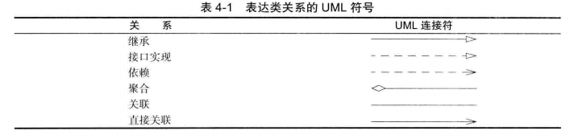

### 面向对象编程

#### 类与对象

##### 对象

###### 对象特性

对象的三个主要特性

* 对象的行为（behavior）

  可以对对象进行的操作

* 对象的状态（state）

  每个对象都保存着描述当前特征的信息。行为改变状态

* 对象的标识（identity）

  每个对象都有一个唯一的身份

* 对象使用 . 操作符操作

* 变量作用域

  实例变量和静态变量的作用域是整个类，如果一个局部变量和一个类变量具有相同的名字，那么局部变量优先，而同名的类变量将被隐藏

* this 引用

  关键字 this 引用对象自身，它也可以在构造方法内部用于调用同一个类的其他构造方法，关键字 this 是指向调用对象本身的引用名，可用 this 关键字引用对象的实例成员

###### 重载

如果多个方法有相同的名字、不同的参数，便产生了重载。编译器必须挑选出具体执行那个方法。它通过用各个方法给出的参数类型与特定方法调用所使用的值类型进行匹配来挑选出相应的方法。如果编译器找不到匹配的参数，编译时会错误。

###### 实例化

如果在编写一个类时没有编写构造器，那么系统就会提供一个无参数构造器。这个构造器将所有的实例域设置为默认值。如果类中提供了至少一个构造器，但是没有提供无参数的构造器，则在构造对象时如果没有提供参数就会被视为不合法。

- 构造方法必须具备和所在类相同的名字
- 构造方法没有返回值类型，连 void  也没有
- 构造方法可以重载，可以有多个同名的构造方法，但它们要签名不同，这样易用不同的初始数据值来构造对象
- 在构造方法中，使用 this 调用其他构造器，应在任何其他可执行语句之前出现
- 如果子类的构造器没有显示调用超类的构造器，则将自动调用超类无参的构造器。如果超类没有无参构造器，并且在子类的构造器中又没有显式地调用超类的其他构造器，则不能编译
- 构造方法链：构造方法可以调用重载的构造方法或父类的构造方法。如果它们都没有被显示地调用，编译器就会自动地将 super() 作为构造方法的第一条语句，在任何情况下，构造一个类的实例时，将调用沿着继承链的所有父类的构造方法。当构造一个子类的对象时，子类构造方法会在完成自己的任务之前，首先调用它的父类的构造方法，如果父类继承自其他类，那么父类构造方法又会在完成自己的任务之前，调用它自身的父类的构造方法。这个过程持续到沿着这个继承体系结构的最后一个构造方法被调用为止。

###### 静态初始化块

在一个类的声明中，可以包含多个代码块。如果对类的静态域进行初始化的代码比较复杂，那么可以使用静态的初始化块，在类第一次加载的时候，将会进行静态域的初始化。默认的初始值是 0、false、null。<u>所有的静态初始化语句以及静态初始化块都将按照类定义的顺序执行</u>

###### 对象析构与 finalize 方法

java 不支持析构器。可以为任何一个类添加 finalize 方法。finalize 方法将在垃圾回收器清除对象之前调用。在实际应用中，不要依赖于使用 finalize 方法回收任何短缺的资源，因为很难知道这个方法什么时候才能够调用。调用 *System*.runFinalizersOnExit(true) 能够确保 finalizer 方法在 java 关闭前被调用。不过这个方法并不安全，替代的方法是使用方法 *Runtime*.addShutdownHook 添加关闭钩（shutdown hook）。

###### 对象引用

* 对象是通过对象引用变量来访问的，该变量包含对对象的引用，从本质上来说，一个类是一个程序员定义的类型。类是一种引用类型对象引用变量中只包含了对该对象的引用，严格来说，对象引用变量和对象是不同的，但是大多数情况下，这种差异是可以忽略的
* 数组被看作是对象，数组是用 new 操作符创建的，一个数组变量实际上是一个包含数组引用的变量
* 给方法传递一个对象，是将对象的引用传递给方法

###### 对象数据域默认值

* 引用类型数据域的默认值是 null
* 数值类型域的默认值是 0
* Boolean 类型数据域默认值是 false
* char 类型的数据域的默认值是 \u0000

###### 基本类型变量和引用类型变量的区别

每个变量都代表一个存储值的内存位置。声明一个变量时，就是在告诉编译器这个变量可以存放什么类型的值。对基本类型变量来说。对应内存所存储的值是基本类型的值。对引用类型变量来说，对应内存所存储的值是一个引用，是对象的存储地址。

将一个变量赋值给另一个变量时，另一个变量就被赋予同样的值。对基本类型就是将一个变量的实际值复制一份赋给另一个变量。对引用变量就是将一个变量的引用赋给另一个变量

###### 可见性

| 类中成员修饰符 | 在同一类中可访问 | 在同一包中可访问 | 在子类内可访问 | 在不同包可访问 |
| :------------: | :--------------: | :--------------: | :------------: | :------------: |
|     public     |        是        |        是        |       是       |       是       |
|   protected    |        是        |        是        |       是       |   不同包子类   |
|    default     |        是        |        是        |       是       |       否       |
|    private     |        是        |        否        |       否       |       否       |

如果一个变量或方法依赖于类的某个具体实例，那就应该将它定义为实例变量或实例方法。如果一个变量或方法不依赖于类的某个具体实例，就应该将它定义为静态变量或静态方法

*对象成员修饰符*

|    修饰符    |  类   | 构造方法 | 实例方法 | 实例属性 | 静态块 | 静态方法 | 静态属性 |
| :----------: | :---: | :------: | :------: | :------: | :----: | :------: | :------: |
|   default    | true  |   true   |   true   |   true   |        |   true   |   true   |
|    public    | true  |   true   |   true   |   true   |        |   true   |   true   |
|  protected   | inner |   true   |   true   |   true   |        |   true   |   true   |
|   private    | inner |   true   |   true   |   true   |        |   true   |   true   |
|    static    | inner |          |   true   |   true   |  true  |   true   |   true   |
|    final     | true  |          |   true   |   true   |        |          |   true   |
|   abstract   | true  |          |   true   |          |        |          |          |
|    native    |       |          |   true   |          |        |   true   |          |
| synchronized |       |          |   true   |          |        |   true   |          |
|   strictfp   |       |          |   true   |          |        |   true   |          |
|  transient   |       |          |          |   true   |        |          |   true   |

###### 方法调用

虚拟机调用过程：

1. 获取所有可能被调用的候选方法

   编译器查看对象的声明类型和方法名，编译器将会一一列举所有类中同名方法和其超类中访问属性为 public 的同名方法

2. 重载解析（overloading resolution）

   查看调用方法提供的参数类型，从候选列表中选择一个与提供的参数类型完全匹配的方法。如果编译器没有找到与参数类型匹配的方法，或者发现经过类型转换后有多个方法与之匹配，就会报告一个错误。

3. 如果是 private 方法，static 方法，final 方法或者构造器，那么编译器将可以准确地知道应该调用那个方法

4. 当程序允许时，并且采用动态绑定调用方法时，虚拟机一定调用与 x 所引用对象的实际类型最适合的那个类的方法。每次调用方法都要进行搜索，时间开销相当大。因此虚拟机预先为每个类创建了一个方法表（method  table），其中列出了所有方法的签名和实际调用的方法。这样，在真正调用方法的时候，虚拟机仅查找方法表就可以。

##### 类

###### 静态成员

被类中的所有对象所共享，静态方法不能访问类实例成员，静态方法只能访问类静态成员，静态变量将变量值存储在一个公共的内存地址，如果某一个对象修改了静态变量的值，那么同一个类的所有对象都会受到影响。

###### 包

从编译器的角度来看，嵌套的包之间没有任何关系。java.util 包与 java.util.jar 包毫无关系。每一个都拥有独立的类集合。一个类可以使用所属包中的所有类，以及其他包中的公有类。导入包中类的关键字是 import，定义包的关键字是 package，如果没有在源文件中放置包，这个源文件的类就被放置在一个默认包中。

如果类在一个包里，包的名字也作为类名的一部分。

###### 导入

* 类导入

  一个类可以使用所属包中的所有类，以及其他包中的公有类，使用 import 关键字或类全名使用

* 静态导入

  使用 import static 导入静态方法和静态域来省略类名直接调用，但不建议

###### 类路径

<u>类存储在文件系统的子目录中，类的路径必须与包名匹配，否则可以编译，但不能运行，虚拟机找不到类</u>

类文件可以存储在 jar 文件中。在一个 jar 文件中，可以包含多个压缩形式的类文件和子目录，在程序中用到第三方的库文件时，通常会给出一个或多个需要包含的 jar 文件。jdk 也提供了许多的 jar 文件

类路径是所有包含类文件的路径的集合：

* UNIX 环境

  类路径中不同项目之间采用冒号 : 分隔

  ```shell
  java -classpath .:/path/to/thrid.jar Class
  // SE 6 开始，可以在 jar 目录使用 * 通配符
  java -classpath .:/path/to/'*' Class
  ```

* Windows 环境

  类路径中不同项目之间采用冒号 ; 分隔

为了使类能够被多个程序共享，需要做到下面几点：

1）把类放到一个目录中，这个目录是包树状结构的基目录。

2）将 jar 文件放在一个目录中

3）设置类路径（class path）。类路径是所有包含类文件的路径的集合

###### 设置类路径

首选使用 -classpath 或 -cp 选项指定类路径

```shell
java -Dfile.encoding=UTF-8 -classpath .:/Users/zhangyaowen/LearnJava/webapps/se-exercises/jar/'*' jdbc.mysql.CityCurd
```

可以通过设置 CLASSPATH 环境变量

* UNIX

  ```shell
  export CLASSPATH=.:/path/to/classdir/'*'
  ```

* Windows

  ```powershell
  set CLASSPATH=.;c:\path\to\classdir\*
  ```

不建议将 jar 或类文件放在 `jre/lib/ext` 路径

javac 编译器总是在当前的目录中查找文件，但 java 虚拟机仅在类路径中有 `.` 目录的时候才查看当前目录。如果没有设置类路径，那并不会产生什么问题，默认的类路径包含 . 目录。然而如果设置了类路径却忘记了包含 . 目录，则程序仍然可以通过编译，但不能运行

###### 类的关系

* 依赖（uses-a）

  如果一个类的方法操纵另一个类的对象，则一个类依赖于另一个类（应该尽可能地将相互依赖地类减少至最少。如果类 A 不知道 B 的存在，它就不会关心 B 的任何改变，意味着 B 的改变不会导致 A 产生任何 bug）

* 聚合（has-a）

  一个类对象包含一些另一个类的对象，也称为关联是一种常见的二元关系，描述两个类之间的活动，关系中涉及的每个类可以有一个角色表示，描述在该关系中担当的角色，关联中涉及的每个类可以给定一个多重性，多重性可以是一个数字或一个区间，决定在关系中涉及类的多少个对象

* 继承（is-a）

  用于表示特殊与一般关系的。

* 类关系的 UML 符号



###### super 关键字

关键字 super 指这个 super 关键字所在类的父类，可用于调用父类中的普通方法和构造方法。

* 调用父类方法时 super 必须出现在子类方法第一行，这是显式调用父类方法的唯一方法

##### 类与对象最佳实践

* 一致性：应该具有一致性的提供一个公共无参构造方法，用于构建默认实例。
* 依赖于类的具体实例的变量或方法必须是一个实例变量或方法如果一个变量被类的所有实例所共享，那么应该将它声明为静态的。如果方法不依赖与某个具体的实例，那就应该将它声明为静态方法。应该使用类名（而不是引用变量）引用静态变量和方法。不要从构造方法中传入参数来初始化静态数据域。最好使用 set 方法改变静态数据域
* 一个方法只需要访问类的静态域则应将它实现为静态方法
* 保证数据私有：绝对不要破坏封装性。有时候，需要编写一个访问器方法或更改器方法，但是最好还是保持实例域的私有性。
* 一定要对数据初始化：java 不对局部变量进行初始化，但是会对对象的实例域进行初始化。最好不要依赖于系统的默认值，而是应该显式地初始化所有的数据，具体的初始化方式可以是提供默认值，也可以是在所有构造器中设置默认值
* 不要在类中使用过多的基本类型：建议局部变量设置为基本类型，类数据域使用包装类
* 不是所有的域都需要独立的域访问器和域更改器：需要获得或设置域数据时才需要
* 将职责过多的类进行分解：类应该描述一个单一的实体，而所有的类操作应该在逻辑上相互配合，支持一个一致的目的
* 类名和方法名要能够体现它们的职责：与变量应该有一个能够反映其含义的名字一样，命名类名的良好习惯是采用一个名词如（Order）、前面有形容词修饰的名词（RushOrder）；对于方法来说，习惯是访问器方法用小写 get 开头，更改器方法用小写的 set 开头
* 优先使用不可变的类：更改对象的问题在于，如果多个线程试图同时更新一个对象，就会发生并发更改。其结果是不可预测的。如果类是不可变的，就可以安全地在多个线程间共享其对象

#### 继承

##### 继承特性

###### 继承关系

* 继承（extends）

  is-a 关系是继承的一个明显特征，关键字  extends 表示继承。在子类中可以增加域、增加方法或者覆盖超类的方法，然而绝对不能删除继承的任何域或方法。java 中的所有类都继承自 Object 类，如果定义一个类时，没有指定继承性，那么这个类的父类就被默认为是 Object

* 继承链（inheritance hierarchy）

  继承并不仅限于一个层次。由一个公共超类派生出来的所有类的集合被称为继承层次，在继承层次中，从某个特定的类到其祖先的路径为该类的继承链（inheritance chain）

###### final 关键字

使用 final 关键字修饰以阻止继承：

* 使用 final 修饰类，表示不允许扩展该类，其中方法自动成为 final，但不包括域
* 方法如果声明为 final，则子类不能覆写这个方法
* 域声明为 final，对于 final 域，赋值之后不容许修改

###### Object 始祖类

Object 类中的 equals 方法用于检测一个对象是否等于另外一个对象。在 Object 类中，这个方法将判断两个对象是否具有相同的引用。如果两个对象具有相同的引用，它们一定是相等的。在子类中定义 equals 方法时，首先调用超类的 equals。如果检查失败，则不可能相等。Java 语言规范要求 equals 方法具有下面的特性：

* 自反性

  对于任何非空引用 x，x.equals(x) 应该返回 true

* 对称性

  对于任何引用 x 和 y，当前仅当 y.equals(x) 返回 true，x.equals(y) 也应该返回 true

* 传递性

  对于任何引用 x、y、z，如果 x.equlas(y) 返回 true，y.equals(z) 返回 true，x.equals(z) 也应该返回 true

* 一致性

  如果 x 和 y 引用的对象没有发生变化，反复调用 x.equals(y) 应该返回同样的结果

hashCode 散列码是由对象导出的一个整数值。每个对象默认的散列码为对象的存储地址**如果重写定义 equals 方法，就必须重新定义 hashCode 方法**

ArrayList 是一个采用类型参数的泛型类。需要指定数组列表保存的元素对象类型

###### 方法重写

要重写一个方法，需要在子类中使用和父类一样的签名以及一样的返回值类型来对该方法进行定义，在子类的方法前面放一个 @Override 来重写标注 

* 仅当实例方法是可访问时，它才能被覆盖。因为私有方法在它的类本身以外是不能访问的，所以它不能被覆盖。如果子类中定义的方法在父类中是私有的，那么这两个方法完全没有关系
* 静态方法也能被继承，但是静态方法不能被覆盖。如果父类中定义的静态方法在子类中被重新定义，那么在父类中定义的静态方法将被隐藏，可使用 `父类名.静态方法名` `SuperClass.staticMethod` 调用隐藏的静态方法
* 方法重写发生在通过继承而相关的不同类中；方法重载可以发生在同一类中，也可以发生在由于继承而相关的不同类中，方法重写具有同样的签名和返回值类型；方法重载具有同样的名字，但是不同的参数列表

###### 多态

多态意味着定义为父类的变量可以指向子类对象，每个子类实例都是其父类的实例，但反过来不成立，使用父类对象的地方都可以使用子类的对象

###### 静态绑定

private 方法，static 方法，final 方法或者构造器，那么编译器将可以准确地知道应该调用那个方法，编译时确定如何调用

###### 动态绑定

调用的方法依赖于隐式参数的实际类型，并且在运行时实现动态绑定。一个对象变量可以指示多种实际类型的现象，在运行时能够自动地选择调用那个方法的现象为动态绑定（dynamic binding），动态绑定是默认的处理方式

方法可以在沿着继承链的多个类中实现，jvm 决定运行时候调用那个方法，jvm 会依次在本类及继承链查找方法的实现，一旦找到一个实现就停止查找，然后调用这个首先找到的实现。虚拟机预先为每个类创建了一个方法表，其中列出了所有方法的签名和实际调用的方法。这样，在真正调用方法的时候，虚拟机仅查找这个表就行了。

###### 对象转换和 instanceof 运算符

对象的引用类型可以转换为对另外一种对象的引用，使用 instanceof 测试对象类型，使用转换操作符转换

* 向上转型总能成功
* 在尝试转换之前确保该对象是目标类型的实例，如果 x 为 null，x instanceof C 不会产生异常，只是返回 false。因为 null 没有引用任何对象

* 基本类型值转换返回一个新值，而转换一个对象引用不会创建一个新的对象

###### 抽象类

* 抽象类不可以用于创建对象，抽象类可以包含抽象方法，这些方法将在具体的子类中实现
* 抽象方法不能包含在非抽象类中，如果抽象父类的子类不能实现所有的抽象方法，那么子类也必须定义为抽象的，在抽象类扩展的非抽象子类中，必须实现所有的抽象方法。抽象方法是非静态的。
* 抽象类不能使用 new 操作符来初始化。但是，仍然可以定义它的构造方法，这个构造方法在它的子类的构造方法中调用。
* 包含抽象方法的类必须是抽象的。但是，可以定义一个不包含抽象方法的抽象类，在这种情况下，不能使用 new 操作符创建该类的实例，这种类是用来定义新子类的基类
* 即使子类的父类是具体的，这个子类也可以是抽象的

##### 继承设计

* 将公共操作或域放在超类
* 不要使用受保护的域
* 使用继承实现 is-a 关系
* 除非所有继承的方法都有意义，否则不要使用继承
* 在覆盖方法时，不要改变预期行为
* 使用多态而非类型信息
* 不要过多使用反射

#### 接口

##### 接口特性

接口不是类，是对类的一组需求描述，这些类要遵从接口描述的统一格式进行定义

* 接口中所有方法自动属于 public abstract，在接口中声明方法时，不必提供关键字 public abstract

* 接口只包含常量和抽象方法，目的是指明相关或者不相关的多个对象的共同行为。不能使用 new 操作符创建接口的实例
* 一个类可以实现多个接口，但是只能继承一个父类
* 接口可以被扩展

##### 静态方法

SE 8 中，允许在接口中增加静态方法。

##### 默认方法

可以为接口方法提供一个默认实现。必须用 default 修饰符标记这样的的方法

###### 默认方法冲突

如果在接口中将一个方法定义为默认方法，然后又在超类或另一个接口中定义了同样的方法。对于此种二义性：

1. 超类优先

   如果超类提供了一个具体方法，接口的同名而且有相同参数类型的默认方法会被忽略

2. 接口冲突

   如果一个超接口提供了一个默认方法。另一个接口提供了一个同名而且参数类型（不论是否是默认参数）相同的方法，必须类中覆写这个方法来解决冲突

对于只有一个抽象方法的接口，需要这种情况的对象时，可以提供一个 `lambda` 表达式。这种接口即函数式接口

#### 内部类

##### 内部类特性

内部类是定义在另一个类中的类：

* 内部类方法可以访问该类定义所在的作用域中的数据，包括私有的数据
* 内部类可以对同一个包中的其他类隐藏起来
* 当想要定义一个回调函数且不想编写大量代码时，使用匿名内部类比较方便
* 内部类的对象有一个隐式引用，它引用了实例化该内部对象的外围类对象。通过这个引用，可以访问外围类的全部状态，static 内部类没有这种附加指针
* 内部类中声明的所有静态域名都必须是 final，内部类不能有 static 方法，除非是静态内部类

使用 *OuterClass*.this 表示外围类引用。

局部类不能用 public 或 private 访问说明符进行声明。它的作用域被限定在声明这个局部类的块中。局部类有一个优势，即对外部世界可以完成地隐藏起来。即使外部类中的其他代码也不能访问它。

与其他内部类比较，局部类不仅能够访问包含它们的外部类，还可以访问局部变量。不过那些局部变量必须事实上为 final

将局部内部类的使用再深入一步。假如只创建这个类的一个对象，就不必命名了。这种类即为匿名内部类

静态内部类

如果使用内部类只是为了把一个类隐藏在另外一个类的内部，并不需要内部类引用外围类对象。为此，可以将内部类声明为 static，以便取消产生的引用

#### Enum 类

##### 基本的 enum 特性

对于有限集合的变量取值，可以自定义枚举类型，枚举类型包括有限个命名的值，枚举只能存储声明的枚举值或 null 值。

```java
enum Size {SMALL, MEDIUM, LARGE, EXTRE_LARGE};
// 声明枚举变量
Size s = Size.MEDIUM;
```

###### *Enum* 

* values() 方法返回 enum 实例的数组，而且该数组中的元素严格保持其在 enum 中声明的顺序，values() 是由编译器添加的 static 方法
* 创建 enum 时，编译器会生成一个相关的类，这个类继承自 *java.lang.Enum*，可以使用 == 来比较 enum 实例，编译器会自动为 enum 提供 equal() 和 hashCode()，*Enum* 实现了 Comparable 和 Serializable 接口
* ordinal() 方法返回 enum 实例在声明时的次序，从 0 开始
* name() 方法返回 enum 实例声明时的名字，与 toString() 方法效果一样。
* valueOf() 根据给定的名字返回相应的 enum 实例
* 如果打算定义 enum 实例定义方法，那么必须在 enum 实例序列的最后添加一个分号，enum 实例之间用逗号分隔，必须先定义 enum 实例，如果在定义 enum 实例之前定义了任何方法或属性，会编译错误
* 只能在 enum 内部使用其构造器创建 enum 实例，一旦 enum 的定义结束，编译器就不允许使用构造器创建任何实例了

可以在接口的内部，创建实现该接口的枚举，以此将元素进行分组。

可以为 enum 实例编写方法，从而为每个 enum 实例赋予各自不同的行为，需要为 *Enum* 添加一个或多个 abstract 方法，然后为每个 enum 实例实现该方法

###### EnumSet

SE 5 引入了 EnumSet，是为了通过 enum 创建一种替代品，以替代传统的基于 int 的 『位标志』，这种标志可以用来表示某种『开关』信息。

EnumSet 中的元素必须来自一个 enum。EnumSet 的基础是 long，一个 enum 实例只需一位 bit 表示其是否存在，在不超过一个 long 的表达能力的情况下，EnumSet 可以应用于最多不超过 64 个元素的 enum，超过之后性能会下降。

enum 实例定义时的次序决定了其在 EnumSet 中的顺序

###### EnumMap

EnumMap 是一种特殊的 Map，它要求其中的键必须来自一个 enum，EnumMap 内部由数组实现，性能很高。可以使用 enum 实例在 EnumMap 中进行查找操作，只能将 enum 的实例作为键来调用 put()

enum 实例定义时的次序决定了其在 EnumMap 中的顺序

#### 常用对象类型

##### 数组

数组是对象，存储同一类型的值。通过整型下标访问数组中的值。数组初始化后不能改变大小。如果需要动态扩展数组，使用 *ArrayList*。数组传递采用引用传递

```java
int[] a = new int[100];
int[] smallPrimes = {2, 3, 5, 7, 11, 13};
// 不创建新变量的情况下重新初始化一个数组
smallPrimes = new int[]{17, 19, 23, 31, 37};
```

* 数组初始化

  创建一个整形数组时，所有元素都初始化为 0，boolean 数组的元素会初始化为 false，对象数组的元素会初始化为 null

* 遍历

  ```java
  // foreach 类型遍历
  for (type element: array) {
      ...
  }
  // for 遍历
  for (int i = 0; i < array.size; i++) {
  		...
  }
  ```

* 可以向导出类型的数组赋予基类型的数组引用。数组对象可以保留有关它们包含的对象类型的规则。因此在编译检查和运行时检查之间，不能滥用

##### 字符串

java 字符串就是 Unicode 字符序列（一个 Unicode 字符对应 Unicode 编码表中码点，可能需要1个或2个代码单元表示）。使用 + 拼接字符串。*String* 类实例不可变。

* 空串

  空串是一个 java 对象，有自己的串长度 0 和内容空。

* null

  *String* 变量可以存放一个特殊的值 null，表示目前没有任何对象与该变量关联

使用索引访问用 String 的 split 方法得到的数组时，需做最后一个分隔符后有无内容的检查，否则会有抛 *IndexOutOfBoundsException* 的风险

##### BigDecimal

为了防止精度损失，禁止使用构造方法 BigDecimal(double) 的方式把 double 值转化为 BigDecimal 对象

BigDeciaml(double) 存在精度损失风险，再精确计算或值比较的场景中可能会导致业务逻辑异常。

优先推荐入参数为 String 的构造方法，或使用 BigDecimal 的 valueOf 方法