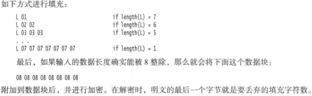

### java 安全领域组成部分

Java 安全领域分为：

* JCA（Java Cryptography Architecture，Java 加密体系）

  提供基本的加密框架、证书、数字签名、消息摘要、密钥对产生器

* JCE（Java Cryptography Extension，Java 加密扩展包）

  扩展了 JCA，提供了各种加密算法、消息摘要和密钥管理（DES、AES、RSA）实现包是：`javax.crypto.*` 及子包

* JSSE（Java Secure Sockets Extension，Java 安全套接字扩展包）

  基于 SSL（安全套接字）的加密功能

* JAAS（Java Authentication and Authentication Service，Java 鉴别与安全服务）

  Java 平台进行身份鉴别的功能

JCA 和 JCE 是 Java 平台提供的用于安全和加密服务的两组 API（只定义接口，具体实现由第三方厂商提供）JDK 1.4 版本后包含了上述扩展包。安全提供者实现了两个概念的抽象：引擎（具体操作：加解密）和算法（定义了操作如何执行），一个算法可以理解为一个引擎的具体实现，一个算法可以有多种引擎的实现方式。 

#### 消息摘要

*java.security.MessageDigest*（提供核心消息摘要实现）、*DigestInputStream*，*DigestOutputStream*（提供以 *MessageDigest* 为核心的消息摘要流实现）、*javax.crypto.Mac*（提供基于密钥的安全消息摘要实现与 *MessageDigest* 无任何依赖关系） 类均是消息认证引擎类。

```java
MessageDigest messageDigest = MessageDigest.getInstance(algorithm);
byte[] hashString = messageDigest.digest(origin);
StringBuilder hBuilder = new StringBuilder();
int n;
for (byte b : hashString) {
    n = b;
    if (n < 0) {
        n += 256;
    }
    if (n < 16) {
        hBuilder.append("0");
    }
    hBuilder.append(Integer.toHexString(n));
}
return hBuilder.toString();
```

#### 加密

##### key

key 接口是所有密钥接口的顶层接口，一切加解密都需要 key 接口。密钥：

* 算法

  密钥的算法，如 DES、DSA，`getAlgorithm()` 得到算法名

* 编码形式

  密钥的外部编码形式（X.509 SubjectPublicKeyInfo 或 PKCS#8），`getEncode()` 获得编码格式

* 格式

  已编码密钥的格式名称，`getFormat()` 方法获取

*javax.crypto.SecretKey* 接口是对称密钥顶层接口（*javax.crypto.spec.SecretKeySpec* 为其实现，*javax.crypto.interface.PBE* 接口继承该接口并提供 PEB 算法）。DES、AES 等对称算法密钥可通过该接口提供。

*java.security.interfaces.PublicKey* 和 *java.security.interfaces.PrivateKey* 定义了非对称加密相关接口（*javax.crypto.interfaces.DH*、*java.security.interfaces.RSA*、*java.security.interfaces.DSA*、*java.security.interfaces.EC*s 等继承了该接口）

#### 消息签名

如果消息改变了，那么改变后的消息的指纹与原消息的指纹将不匹配。如果消息和它的指纹是分开传送的，那么接收者就可以检查消息是否被篡改过。但是，如果消息和指纹同时被截获了，对消息进行修改，再重新计算指纹，就是一件很容易的事情。比较，消息摘要算法是公开的，不需要使用任何密钥。在这种情况下，假消息和新指纹的接收者永远不会知道消息已经被篡改。

公共密钥加密技术是基于公共密钥和私有密钥这两个基本概念的。它的设计思想是可以将公共密钥告诉给任何人，但是只有自己才持有私有密钥。这些密钥之间存在一定的数学关系，但几乎不可能用一个密钥去推算出另一个密钥。

#### 校验签名

`JDK` 配有一个 `keytool` 程序，该程序是一个命令行工具，用于生成和管理一组证书 。`keytool` 程序负责管理密钥库、证书数据库和私有/公有密钥对。密钥库中的每一项都有一个别名。

```shell
// 创建一个密钥库
keytool -genkeypair -keystore alice.certs -alias alice
```

当新建或者打开一个密钥库时，系统将提示输入密钥库口令。`keytool` 工具使用 `X.500` 格式的名字，它包含常用名，机构单位，机构，地点，州，和国家，以确定密钥持有者和证书发行者的身份。

导出证书文件：

```shell
keytool -exportcert -keystore alice.certs -alias alice -file alice.cer
```

打印证书：

```shell
keytool -printcert -file alice.cer
```

导入证书到密钥库中

```shell
keytool -importcert -keystore bob.certs -alias alice -file alice.cer
```

绝对不要将并不完全信任的证书导入到密钥库中。一旦证书添加到密钥库中，使用密钥库的任何程序都会认为这些证书可以用来对签名进行校验

`jarsigner` 工具负责对 `JAR` 文件进行签名和校验

使用 `jarsigner` 工具将签名添加到文件中，必须指定要使用的密钥库、JAR 文件和密钥的别名

```shell
jarsigner -keystore alice.certs document.jar alice
```

使用 `jarsigner` 对文件进行校验

```shell
jarsigner -verify -keystore bob.certs document.jar
```

#### 认证问题

任何人都可以生成一对公共密钥和私有密钥，再用私有密钥对消息进行签名，然后把签名好的消息和公共密钥发送给你。这种确定发送者身份的问题称为认证问题。解决这个认证问题的通常做法是，中间人证明，将受信任中间人的私有签名应用于陌生人的公共密钥文件之上即可。当你拿到公共密钥文件之后，就可以检验中间人签名是否真实。

### 加密

当信息通过认证之后，该信息本身是直白可见的。数字签名只不过负责检验信息有没有被篡改过。相比之下，信息被加密后，是不可见的，只能用匹配的密钥进行解密

#### 对称密码

「Java密码扩展」包含了一个 `Cipher` 类，该类是所有加密算法的超类。通过调用 `getInstance` 方法可以获得一个密码对象

`JDK` 中是由名为 `SunJCE` 的提供商提供密码的，如果没有指定其他提供商，则会默认为该提供商。如果要使用特定的算法，而对该算法 `Oracle` 公司没有提供支持，那么也可以指定其他的提供商。算法名称是一个字符串，比如 `AES` 或 `DES/CBC/PKCS5Padding`

DES，即数据加密标准，是一个密钥长度为 56 位的古老分组密码。DES 加密算法在现在可以用穷举法将它破译。更好的选择是采用它的后续版本，即高级加密标准（AES）。

```java
Cipher cipher = Cipher.getInstance(algorithName);
// 或者
Cipher cipher = Cipher.getInstance(algorithName, providerName);
// 一旦获得了一个密码对象，就可以通过设置模式和密钥来对它初始化
// 模式有: Cipher.ENCRYPT_MODE 、Cipher.DECRYPT_MODE、Cipher.WRAP_MODE、Cipher.UNWRAP_MODE。wrap 和 unwrap  模式会用一个密钥对另一个密钥进行加密。
cipher.init(Cipher.ENCRYPT_MODE, new SecretKeySpec(Crypt.key.getBytes(StandardCharsets.UTF_8), "AES"));
// 加密
byte[] result = cipher.doFinal(content.getBytes(StandardCharsets.UTF_8));
            // return byte2hex(result);
return (java.util.Base64.getEncoder()).encodeToString(result);
```

反复调用 `update` 方法来对数据块进行加密

```java
int blockSize = cipher.getBlockSize();
byte[] inBytes = new byte[blockSize];
int outputSize = cipher.getOutputSize(blockSize);
byte[] outBytes = new byte[outputSize];
int outLength = cipher.update(intBytes, 0, outputSize, outBytes);
```

完成上述操作后，还必须调用一个 `doFinal` 方法。如果还有最后一个输入数据块（其字节数小于 `blockSize`)，那么就要调用：

```java
outBytes = cipher.doFinal(inBytes, 0, inLength);
```

如果所有的输入数据都已经加密，则用下面的方法调用来代替:

```java
outBytes = cipher.doFinal();
```

对 `doFinal` 的调用是必须的，因为它会对最后的块进行“填充“。对于 `DES` 密码来说，它的数据块的大小是 8 字节。假设输入数据的最后一个数据库少于 8 字节，可以将其余的字节全部用 0 填充，从而得到一个 8 字节的最终数据块，然后对它进行加密。但是，当对数据块进行解密时，数据块的结尾会附加若干个 0 字节，因此它与原始输入文件之间会略有不同。需要一个填充方案来避免这个问题。常用的填充方案是 `PKCS5`。在该方案中，最后一个数据块不是全部用填充值 0 进行填充，而是用等于填充字节数量的值作为填充值进行填充。

在该方案中，最后一个数据块不是全部用填充值 0 进行填充，而是用等于填充字节数量的值作为填充值进行填充。

*pkcs5填充规则*



#### 密钥生成

为了加密，需要生成密钥。每个密码都有不同的用于密钥的格式，需要确保密钥的生成是随机的。这需要遵循下面的步骤

1）为加密算法获取 `keyGenerator`

2）用随机源来初始化密钥发生器。如果密码块的长度是可变的，还需要指定期望的密码块长度

3）调用 `generateKey` 方法

```java
KeyGenerator keygen = KeyGenerator.getInstance("AES");
SecureRandom random = new SecureRandom();
keygen.init(random);
Key key = keygen.generateKey();
```

或者，可以从一组固定的原生数据中生成一个密钥，这是可以使用如下的 `SecretKeyFactory`

```java
byte[] keyData = ...; // 16 bytes for aes
SecretKey key = new SecretKeySpec(keyData, "AES");
```

如果要生成密钥，必须使用 “真正的随机” 数。如在 `Random` 类中的常规的随机数发生器。是根据当前的日期和时间来产生随机数的，因此它不够随机。假设计算机时钟可以精确到 1 / 10 秒，那么，每天最多存在 864000 个种子。如果攻击者知道发布密钥的日期（通常可以由消息日期或证书有效日期推算出来），那么就可以很容易地产生那一天所有可能的种子。

`SecureRandom` 类产生的随机数，远比由 `Random` 类产生的那些数字安全得多。仍然需要提供一个种子，以便在一个随机点上开始生成数字序列。

```java
SecureRandom secrand = new SecureRandom();
byte[] b = new byte[20];
secrand.setSeed(b);
```

如果没有为随机数发生器提供种子，那么它将通过启动线程，使它们睡眠，然后测量它们被唤醒的准备时间，以此来计算自己的 20 个字节的种子

#### 密码流

`JCE` 库提供了一组使用便捷的流类，用于对流数据进行自动加密或解密。

```java
// 对文件数据进行加密的方法
Cipher cipher = ...;
cipher.init(Cipher.ENCRYPT_MODE, key);
CipherOutputStream out = new CipherOutputStream(new FileOutputStream(outputFileName), cipher);
byte[] bytes = new byte[BLOCKSIZE];
int inLength = getData(bytes);
while (inLength != -1) {
    out.write(bytes, 0, inLength);
    inLength = getData(bytes);
}
out.flush();
```

使用 `CipherInputStream` ，对文件的数据进行读取和解密

```java
Cipher cipher = ...;
cipher.init(Cipher.DECRYPT_MODE, key);
CipherInputStream in = new CipherInputStream(new FileInputStream(inputFileName), cipher);
byte[] bytes = new byte[BLOCKSIZE];
int inLength = in.read(bytes);
while (inLength != -1) {
    putData(bytes, inLength);
    inLength = in.read(bytes);
}
```

密码流类能够透明地调用 `update` 和 `doFinal` 方法

#### 公共密钥密码

`AES` 密码是一种对称密码，加密和解密都使用相同的密钥。对称密码的致命缺点在于密码的分发。公共密钥密码技术解决了这个问题。在公共密钥密码中，一个密钥对，包括一个公共密钥和一个相匹配的私有密钥。所有已知的公共密钥算法的操作速度都比对称密钥算法慢得多。最常见的公共密钥算法是 `RSA` 算法.

```java
// 使用 keyPairGenerator 生成公共私有密钥
KeyPairGenerator pairgen = KeyPairGenerator.getInstance("RAS");
SecureRandom random = new SecureRandom();
pairgen.initialize(KEYSIZE, random);
KeyPair keyPair = pairgen.generateKeyPair();
Key publicKey = keyPair.getPublic();
Key privateKey = keyPair.getPrivate();
```

