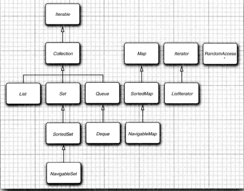

### 容器

#### Collection

##### 原始容器

java 最初版本只为最常用的数据结构提供了很少的一组类：*Vector*、*Stack*、*Hashtable*、*BitSet* 和 Enumeration 接口，Enumeration 接口提供了访问任意容器中各个元素的抽象机制。

###### *Vector*

所有方法都是同步的

###### Enumeration

旧版迭代器，比 Iterator 接口小，只有 hasMoreElements() 和 nextElement()。

###### *Hashtable*

类似 *HashMap*

###### *Stack*

永远不应用使用，使用 list 代替

###### *BitSet*

如果想要高效存储大量『开关』信息是很好选择，它的效率仅对于空间，如果需要高效的访问时间，比本地数组慢。最小容量是 long 64 位

##### List

**按照插入的顺序保存元素**

###### LinkedList

使用链表实现，适合插入和删除操作的有序集合。在 java 程序设计语言中，所有链表都是双向链表

链表与泛型集合之间有一个重要的区别。链表是一个有序集合，每个对象的位置十分重要。

如果在某个迭代器修改集合时，另一个迭代器对其进行遍历，一定会出现混乱的情况，链表迭代器的设计使它能够检测到这种修改。如果迭代器发现它的集合被另一个迭代器修改了，或者被该集合自身的方法修改了，就会抛出一个 *ConcurrentModificationException* 异常。

为了避免发生并发修改的异常：可以根据需要给容器附加许多的迭代器，但是这些迭代器只能读取列表。另外，在单独附加一个既能读又能写的迭代器。集合可以跟踪改写操作（诸如添加或删除元素）的次数。每个迭代器都维护一个独立的计数值。在每个迭代器方法的开始处检查自己改写操作的计算值是否与集合的改写操作计数值一致。如果不一致，抛出一个 ConcurrentModificationException 异常

在 subList 场景中，对原集合元素的增加或删除，均会导致子列表的遍历，增加，删除产生 *ConcurrentModificationException*

###### ArrayList

使用数组实现的有序集合，适合随机访问。

* ArrayList 的 subList 结果不可强转成 ArrayList，否则会抛出 *ClassCastException*

    subList 返回的是 ArrayList 的内部类 SubList，并不是 ArrayList 而是 ArrayList 的一个视图，对于 SubList 子列表的所有操作最终都会反映到原列表上。

##### Set

**不能有重复元素**

散列表为每个对象计算一个整数，称为散列码。散列码是由对象的实例域产生的一个整数。即：具有不同数据域的对象将产生不同的散列码。

在 java 中，散列表用链表数组实现。每个列表称为桶（bucket）。要想查找表中对象的位置，就要先计算它的散列码，然后与桶的总数取余，所得到的结果就是保存这个元素的桶的索引。如果桶被占满，这种现象被称为散列冲突。这时需要用新对象与桶中的所有对象进行比较，查看这个对象是否已经存在。如果散列码是合理且随机分布的，桶的数目也足够大，需要比较的次数就会很少（在 SE 8 中，桶满时会从链表变为平衡二叉树）

如果想更多地控制散列表的运行性能，就要指定一个初始的桶数。桶数是指用于收集具有相同散列值的桶的数目。如果要插入到散列表中的元素太多，就会增加冲突的可能性，降低运行性能。

如果大致知道最终会有多少个元素要插入到散列表中，就可以设置桶数。通常，将桶数设置为预计元素个数的 75% ~ 150%。最好将桶数设置为一个素数，以防键的集聚。标准库使用的桶数是 2 的幂，默认值为 16 （为表大小提供的任何值都将被自动地转换为 2 的下一个幂）

如果散列表太满，就需要再散列。如果要对散列表再散列，就需要创建一个桶数更多的表，并将所有元素插入到这个新表中，然后丢弃原来的表。装填因子决定何时对散列表进行再散列。默认值为 0.75

###### HashSet

它实现了基于散列表的集，散列集迭代器将依次访问所有的桶。由于散列元素分散在表的各个位置上，所以访问它们的顺序集合时随机的。不关心集合中元素的顺序时使用

###### TreeSet

散列集十分相似，是一个有序集合。可以以任意顺序将元素插入到集合中。在遍历时，每个值将自动地按照排序的顺序迭代。要使用树集合，必须能够比较元素。这些元素必须实现 Comparable 接口，或者构造集时提供一个 Comparator

###### LinkedHashSet

使用双向链表实行顺序次序的集，会记住插入元素项的顺序

###### EnumSet

是一个枚举类型元素集的高效实现。由于枚举类型只有有限个实例，所以内部用位序列实现。如果对应的值在集中，则相应的位被置为 1。类没有公共的构造器。使用静态工厂方法构造这个集

##### Queue

按照排队规则来确定对象产生的顺序

队列可以让人们有效地在尾部添加一个元素，在头部删除一个元素。有两个端头的队列，即双端队列，可以在头部和尾部同时添加或删除元素。不支持在队列中间添加元素。在 SE 6 中引入了 *Deque* 接口，并由 *ArrayDeque* 和 *LinkedList* 类实现。这两个类都提供了双端队列，而且必要时可以增加队列的长度

###### ArrayDeque

用数组实现的双端队列

###### PriorityQueue

优先级队列中的元素可以按照任意的顺序插入，却总是按照排序的顺序进行检索。即无论何时调用 remove 方法，总会获得当前优先级队列中最小的元素。优先级队列并没有对所有的元素进行排序，使用堆（堆是一个可以自我调整的二叉树，对树执行添加和删除，可以让最小的元素移动到根，而不必花费时间对元素进行排序）。优先级队列既可以保存实现了 Comparable 接口的类对象，也可以保存在构造器中提供的 Comparator 对象

#### Map

一组成对的键值对对象

##### 集合接口

集合框架将接口与实现分离

###### Iterator

Iterator 是泛型接口的 next 和 hasNext 方法与 Enumeration 接口的 nextElement 和 hasMoreElements 方法的作用一样。

集合框架中的迭代器与其他类库中的迭代器在概念上有着重要的区别。在传统集合类库中（如 C++ 的标准模版库，就像知道数组索引 i 就可以查看数组元素 a[i] 一样，不需要查找元素，就可以将迭代器向前移动一个位置。与不需要执行查找操作就可以通过 i++ 将数组索引向前移动一样）。集合框架迭代器中，查找操作与位置变更是紧密相连的。查找一个元素的唯一方法是调用 next，而在执行查找操作的同时，迭代器位置向前移动（迭代器位于两个元素之间，当调用 next 时，迭代器就越过下一个元素，并返回刚刚越过的那个元素的引用）

可以将 *Iterator*.next 与 *InputStream*.read 看作为等效的。从数据流中读取一个字节，就会自动地『消耗掉』这个字节，下一次调用 read 将会消耗并返回输入的下一个字节。

Iterator 接口的 remove 方法将会删除上次调用 next 返回的元素。必须先调用 next 才能调用 remove，否则会抛出 *IllegalStateException* 

###### Collection

Collection 接口是泛型接口，是集合框架的基本接口，提供了很多功能，*AbstractCollection* 提供了实现

###### Map

Map 接口是泛型接口，描述键值对的基本接口

###### List

List 是一个有序集合，元素会增加到容器中的特定位置，可以使用迭代器访问，或者使用整数索引来访问

###### Set

Set 接口等同于 Collection 接口，不过其方法的行为有更严谨的定义，不允许存储相同的元素

*集合框架中的接口关系*

##### 具体集合类

集合框架中的类关系

##### Collections

*Collections* 类返回的对象，如 emptyList()/singletionList() 等都是 immutablelist，不可对其进行添加或删除元素，会抛出 *UnsupportedOperationException* 如果查询无结果，返回 Collections.emptyList() 空集合对象。

<u>使用集合转数组的方法，必须使用集合的 toArray(T[] array)，传入的是类型完成一致，长度为 0 的空数组</u>，集合转数组后修改数组或集合不会改变对应集合或数组

使用无参 toArray() 会泛型丢失，若强转其他类型数组将 *ClassCastException* 错误。对于 toArray 带参数方法，数组空间大小的 length：等于 0，动态创建于 size 相同的数组，性能最好，大于 0 但小于 size，重新创建大于等于 size 的数组，增加 GC 负担，等于 size，在高并发情况下，数组创建完成后，size 正在变大的情况下，会增加 GC 负担。大于 size，空间浪费，且在 size 处插入 null 值，存在 NPE 隐患。

<u>数组转集合的过程中，注意是否使用了视图方式直接返回数组中的数据。Arrays.asList() 返回集合不能对其使用修改集合元素个数的相关方法，会抛出 *UnsupportedOperationException*，但可以进行赋值操作</u>，修改源数组的值会映射到转换集合，修改转换集合中元素的值会映射到转换源数组

asList() 返回对象是一个 Arrays 内部类，并没有实现集合的修改方法。Arrays.asList 体现的是适配器模式，只是转换接口，后台的数据仍是数组

在使用 Collection 接口任何实现类的 addAll() 方法时，都需要对输入的集合参数进行 NPE 判断。

在无泛型限制定义的集合赋值给泛型限制的集合时，在使用集合元素时，需要进行 instanceof 判断，避免抛出 *ClassCastException* 异常

##### Map

主要的 Map 类集合

|    Map 集合类     |      Key      |     Value     |    Super    | JDK  |             说明              |
| :---------------: | :-----------: | :-----------: | :---------: | :--: | :---------------------------: |
|     Hashtable     | 不允许为 null | 不允许为 null | Dictionary  | 1.0  |       线程安全（过时）        |
| ConcurrentHashMap | 不允许为 null | 不允许为 null | AbstractMap | 1.5  |   锁分段技术或 CAS（JDK 8）   |
|      TreeMap      | 不允许为 null |  允许为 null  | AbstractMap | 1.2  |      线程不安全（有序）       |
|      HashMap      |  允许为 null  |  允许为 null  | AbstractMap | 1.2  | 线程不安全（resize 死链问题） |

使用键来查找与之对应的元素，映射用来存放键、值对，如果提供了键，就能够查找到值。使用视图访问映射中键集、值集、实体集，现在可以直接使用 forEach() 的 lambda 来实现实体集访问

使用 Map 的方法 keySet()、values()、entrySet() 返回集合对象时，不可以对其进行添加元素操作，否则会抛出 *UnsupportedOperationException* 异常

使用 entrySet 遍历 Map 类集合 KV，如果是 JDK 8 使用 Map.forEach()

###### HashMap

*HashMap* 实现了 Map 接口，对键进行散列。

###### TreeMap

*TreeMap* 实现了 Map 接口，用键的整体顺序对元素进行排序，并将其组织成搜索树。 

###### WeakHashMap

*WeakHashMap* 类是为了解决：如果一个值，对应的键已经不再使用了，即，对某个键的最后一次引用已经消亡，不再有任何途径引用这个值的对象了。由于垃圾回收器是跟踪活动对象的，只要映射对象是活动的，其中的所有桶也是活动的，它们不能被回收。因此，需要由程序负责长期存活的映射表删除那些无用的值。

WeakHashMap 使用弱引用（WeakReference）保存键。 弱引用对象将引用保存到另外一个对象中，在这里，就是散列键。对于这种类型的对象，垃圾回收器用一种特有的方式进行处理。通常。如果垃圾回收器发现某个特定的对象已经没有他人引用了，就将其回收。然而，如果某个对象只能由 WeakReference 引用，垃圾回收器仍然回收它，但要将引用这个对象的弱引用放入队列中。WeakHashMap 将周期性地检查队列，以便找出新添加的弱引用。一个弱引用进入队列意味着这个键不再被他人使用，并且已经被收集起来。于是，WeakHashMap 将删除对应的条目

###### LinkedHashMap

顺序映射表

<u>链接散列映射将用访问顺序，而不是插入顺序，对映射条目进行迭代。每次调用 get 或 put ，受到影响的条目将从当前的位置删除，并放到条目链表的尾部</u>（只有条目在链表中的位置会受影响，而散列表中的桶不会受影响。一个条目总位于与键散列码对应的桶中）

访问顺序对于实现高速缓存的『最近最少使用原则』十分重要。（可能希望将访问频率高的元素放在内存中，而访问频率低的元素则从数据库中读取。当在表中找不到元素项且表又满时，可以将迭代器加入到表中，并将枚举的前几个元素删除掉。这些是近期最少使用的几个元素）

###### EnumMap

枚举类型的映射表，用一个值数组实现，在使用时，需要在构造器中指定键类型

###### IdentityHashMap

标识散列映射有特殊的作用。在这个类中，键的散列值不是用 hashCode 函数计算的，而是用 *System*.identityHashCode 方法计算的。这是 *Object*.hashCode 方法根据对象的内存地址来计算散列码时所使用的方式。在对两个对象进行比较时，*IdentityHashMap* 类使用 == 而非 equals，即：<u>不同的键对象，即使内容相同，也被视为是不同的对象</u>在实现对象遍历算法时（如串行化），这个类可以用来追踪每个对象的遍历状况

