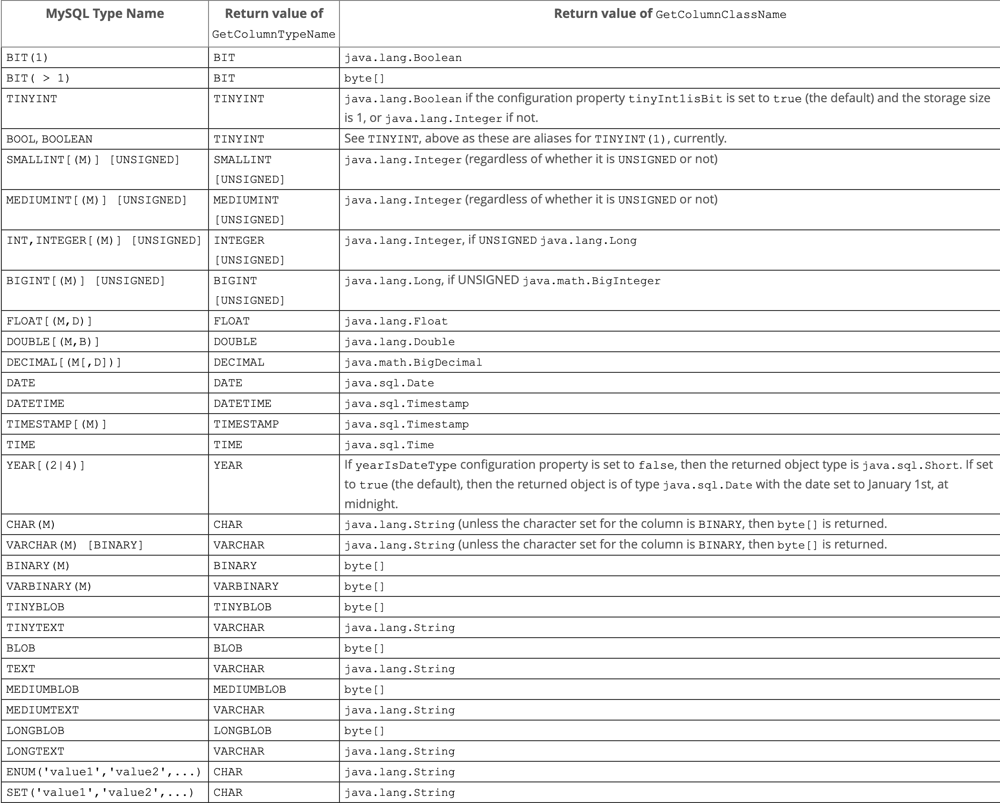
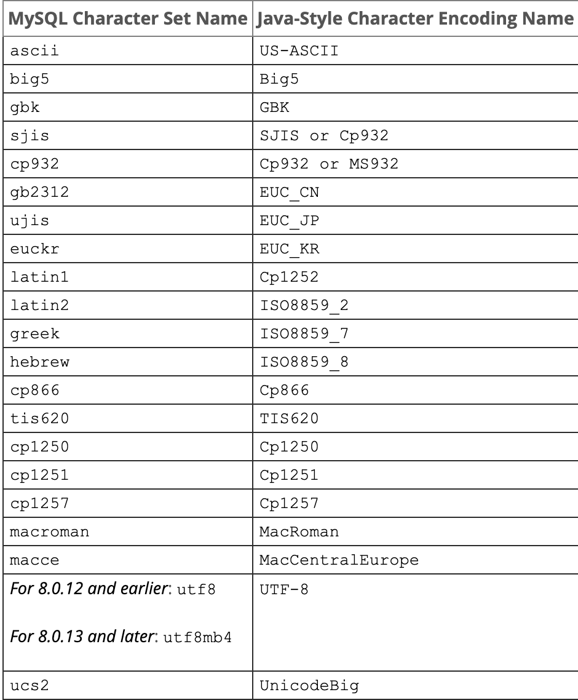

### MySQL Connector/J

#### install using maven

```xml
<dependency>
	<groupId>mysql</groupId>
  <artifactId>mysql-connector-java</artifactId>
  <version>x.y.z</version>
</dependency>
```

#### 连接器

强烈建议使用 MySQL Connector/J 8.0 与 MySQL Server 8.0、5.7、5.6 一起使用。

Connector/J 不支持使用 Unix 域连接到 MySQL 服务器，可以使用通过可插拔套接字工厂提供功能的第三方库，这样的定制工厂应该实现 Connector/J 的 `com.mysql.cj.protocol.SocketFactory` 或旧版本的 `com.mysql.jdbc.SocketFactory` 接口。当此类自定义套接字工厂用于 Unix 套接字时：

* 必须使用系统变量 `--socket`（对于使用 JDBC API 的本机协议连接）或 `--mysqlx-socket`（对于使用 X DevAPI 的 X 协议连接）配置 MySQL 服务器，该系统变量必须包含 unix 套接字路径

* 定义工厂的类全名应通过连接属性 `socketFactory` 传递给 Connector/J，如使用 `junixsocket` 库

  ```java
  socketFactory = org.newsclud.net.mysql.AFUNIXDatabaseSocketFactory;
  // 设置套接字文件路径
  junixsocket.file=path_to_socket_file;
  ```

* 当使用 X 协议时，须设置连接属性 `xdevapi.useAsyncProtocol=false` (Connector/J 8.0.12 默认值)，异步套接字通道不支持 Unix 套接字。对于 X 协议，使用自定义套接字工厂用于 Unix 套接字连接仅适用于 Connector/J 8.0.12 及更高版本

##### 驱动类名

`java.sql.Driver` 在 MySQL Connector/J 中实现的类的名称为：`com.mysql.cj.jdbc.Driver`

##### 连接 URL 语法

```url
protocol//[hosts][/database][?properties]
```

对于 URL 任何保留字符必须转义

###### protocol

有可能的连接协议：

* jdbc:mysql

  用于普通和基本的 JDBC 连接

* jdbc:mysql:loadbalance

  用于负载均衡 JDBC 连接

* jdbc:mysql:replication

  用于 JDBC 复制连接

* mysqlx

  用于 X DevAPI 连接

* jdbc:mysql+srv

  用于使用 DNS SRV 记录的普通和基本的 JDBC 连接

* jdbc:mysql+srv:loadbalance

  用于使用 DNS SRV 记录的负载均衡 JDBC 连接

* jdbc:mysql+srv:replication

  用于使用 DNS SRV 记录的复制 JDBC 连接

* mysqlx+srv

  用于使用 DNS SRV 记录的 X DevAPI 连接

###### hosts

Hosts 部分可以仅由主机名组成，也可以是由各种元素组成的复杂结构（主机名，端口号，特定于主机的属性和用户凭据）

单主机连接不添加特定于主机的属性：

* 该 _hosts_ 部分的格式为 _host:port_ 

  ```http
  jdbc:mysql://host:33060/sakila
  ```

  Host 可以是 IPv4 或 IPv6（必须将其放在方括号内） 地址或主机名字符串，未指定 host 时，默认 localhost，port 是标准端口号，普通 MySQL 连接的默认端口号是 3306，使用 X 协议的连接默认端口号是 33060。未指定则使用相应协议默认值

单主机连接添加了主机特定的属性

* 在这种情况下，主机被定义为连续对，密钥用于标识主机，端口以及任何特定于主机的属性。

  地址等于形式：

  ```http
  address=(host=host_or_ip)(port=port)(key1=value1)(key2=value2)...(keyN=valueN)
  
  jdbc:mysql://address=(host=myhost)(port=1111)(key1=value1)/db
  ```

  键值形式：

  ```http
  (host=host,port=port,key1=value1,key2=value2,...,keyN=valueN)
  
  jdbc:mysql://(host=myhost,port=1111,key1=value1)/db
  ```

多台主机

* 以逗号分隔列表列出主机

  ```http
  host1,host2,...,hostN
  
  jdbc:mysql://myhost1:1111,myhost2:2222/db
  jdbc:mysql://address=(host=myhost1)(port=1111)(key1=value1),address=(host=myhost2)(port=2222)(key2=value2)/db
  jdbc:mysql://(host=myhost1,port=1111,key1=value1),(host=myhost2,port=2222,key2=value2)/db
  jdbc:mysql://myhost1:1111,(host=myhost2,port=2222,key2=value2)/db
  mysqlx://(address=host1:1111,priority=1,key1=value1),(address=host2:2222,priority=2,key2=value2)/db
  ```

* 用逗号分隔列表列出主机，然后用方括号将列表括起来

  ```http
  [host1,host2,...,hostN]
  
  jdbc:mysql://sandy:secret@[myhost1:1111,myhost2:2222]/db
  jdbc:mysql://sandy:secret@[address=(host=myhost1)(port=1111)(key1=value1),address=(host=myhost2)(port=2222)(key2=value2)]/db
  jdbc:mysql://sandy:secret@[myhost1:1111,address=(host=myhost2)(port=2222)(key2=value2)]/db
  ```

用户凭证

可以在连接 URL 外部设置用户凭证

* 单主机用户凭证

  ```
  user:password@host_or_host_sublist
  
  mysqlx://sandy:secret@[(address=host1:1111,priority=1,key1=value1),(address=host2:2222,priority=2,key2=value2))]/db
  ```

* 使用密钥 user 并 password 为每个主机指定凭据

  ```
  (user=sandy)(password=mypass)
  
  jdbc:mysql://[(host=myhost1,port=1111,user=sandy,password=secret),(host=myhost2,port=2222,user=finn,password=secret)]/db
  jdbc:mysql://address=(host=myhost1)(port=1111)(user=sandy)(password=secret),address=(host=myhost2)(port=2222)(user=finn)(password=secret)/db
  ```

当指定了多个用户凭据时，将使用左至左优先级，即，在连接字符串中从左向右移动，发现适用于主机的第一个凭据时所使用的凭据

###### database

要打开的默认数据库或目录。如果未指定数据库，则在没有默认数据库的情况下进行连接。在这种情况下，应该连接实例上调用 `setCatalog()`，或者 SQL 语句中使用数据库名表名。

```java
# 始终使用方法来指定所需数据库，而不是使用语句 use database
Connection.setCatalog()
```

###### properties

适用于所有主机的一系列全局属性，以符号 ？开头的 _key=value_ 以 & 分隔

```
jdbc:mysql://(host=myhost1,port=1111),(host=myhost2,port=2222)/db?key1=value1&key2=value2&key3=value3
```

##### 配置属性

配置属性定义 Connector/J 如何与 MySQL 服务器建立连接。可以为一个 DataSource 对象或一个 Connection 对象设置属性。设置配置属性：

* 在 MySQL 实现（`java.sql.DataSource`）调用 `set*()` 方法

  ```java
  com.mysql.cj.jdbc.MysqlDataSource
  com.mysql.cj.jdbc.MysqlConnectionPoolDataSource
  ```

* 作为 `java.util.Properties` 实例中的健值对传递给 `DriverManager.getConnection` 或 `Driver.connect()`

* 作为给定的 URL 的 JDBC URL 参数指定配置属性（如果在 URL 中指定属性而未提供值，则不会设置任何内容，如果用于配置 JDBC URL 的机制是基于 XML 的，须使用 XML 字符文字 &amp 来分隔配置参数，& 是 XML 的保留字符

##### JDBC API 实现说明

MySQL Connector/J 作为 JDBC API 的严格实现，JDBC 规范在应如何实现某些功能方面具有灵活性：

* BLOB

  通过将属性 `emulateLocators=true` 添加到 JDBC URL，可以使用定位器来模拟 BLOB。将延迟加载 BLOB 数据直至在 BLOB 数据流上使用检索方法（`getInputStream()`，`getBytes()` 等）

  表必须有主键，还必须为 BLOB 列指定别名，且 select 必须覆盖主键与别名

  ```sql
  SELECT id, 'data' as blob_data from blobtable
  ```

  BLOB 实现不允许就地修改，须使用 `PreparedStatement.setBlob()` 或 `ResultSet.updateBlob()` 在（可更新的结果集的情况下）方法将更改保存回数据库

* Connection

  `isClosed()` 方法不对服务器执行 ping 操作以确定服务器是否可用。根据 JDBC 规范，只有 `closed()` 在连接上被调用时，它才返回 true。如果需要确定连接是否仍然有效，可以使用一个简单查询如 `select 1`，如果连接不再有效，驱动程序将引发异常

* DatabaseMetaData

  外键信息仅在 InnoDB 表中可用。驱动程序用于 `SHOW CREATE TABLE` 检索此信息。

* PreparedStatement

  Connector/J 实现了预处理语句的两种变体，即客户端和服务器端的预处理语句。默认使用客户端的预处理语句，要启用服务器预处理语句，设置 `useServerPrepStmts=true`

  大写设置的参数 `setBinaryStream()`、`setAsciiStream()`、`setUnicodeStream()`、`setCharacterStream()`、`setNCharacterStream()`、`setBlob()`、`setClob()`、`setNCLob()`。若要将任何参数更改为非大写参数来重新执行该语句，须先调用 `clearParameters()` 并设置所有参数

  在服务器端/客户端准备好后，数据仅在 `PreparedStatement.execute()` 被调用时才交换。完成此操作后，将关闭用于读取客户端数据的流（根据 JDBC 规范），并且无法再次读取该流

* ResultSet

  默认情况下，完全检索结果集并将其存储在内存中，如果正在使用具有大量行或较大值的 ResultSet，并且无法在 JVM 中为所需的内存分配堆空间，则可以让驱动程序一次将结果流回一行，启用此功能：

  ```java
  stmt = conn.createStatement(java.sql.ResultSet.TYPE_FORWARD_ONLY, java.sql.ResultSet.CONCUR_READ_ONLY);
  stmt.setFetchSize(Integer.MIN_VALUE);
  ```

  还可以使用基于游标的流每次检索固定数量的行。使用 JDBC 连接 URL 属性 `useCursorFetch=true`，然后调用 `setFetchSize(int)` ：

  ```java
  conn = DriverManager.getConnection("jdbc:mysql://localhost/?useCursorFetch=true", "user", "secret");
  stmt = conn.createStatement();
  stmt.setFetchSize(100);
  rs = stmt.executeQuery("SELECT * FROM table_name"); 
  ```

* Statement

  Connector/J 同时支持 `Statement.cancel()` 和 `Statement.setQueryTimeout()`。两者都需要单独的连接才能发出 `KILL QUERY` 语句。对于 `setQueryTimeout()` 实现将创建一个附加线程来处理超时功能。

  未能取消 `setQueryTimeout()` 的语句的失败可能会显示为 RuntimeException 而不是默默地失败，因为当前无法取消阻塞正在执行的线程（由于超时到期而被取消）的执行，而是抛出异常。

  MySQL 不支持 SQL 游标，并且 JDBC 驱动程序不模拟它们，`setCursorName()` 无效。

  `setLocalInfileInputStream()` 设置一个 `InputStream` 实例，该实例将用于将数据发送到 MySQL 服务器以获取一条 `LOAD DATA LOCAL INFILE` 语句，它代表作为该语句的参数给出的路径。该流将在执行一条[`LOAD DATA LOCAL INFILE`](https://dev.mysql.com/doc/refman/8.0/en/load-data.html)语句后读取到完成状态，并且将被驱动程序自动关闭，因此需要在每次调用之前将其重置`execute*()`，以使MySQL 服务器请求数据来满足的要求 [`LOAD DATA LOCAL INFILE`](https://dev.mysql.com/doc/refman/8.0/en/load-data.html)。

  如果将此值设置为`NULL`，则驱动程序将根据需要使用`FileInputStream`或 还原 `URLInputStream`为。

  `getLocalInfileInputStream()` 返回 `InputStream` 将用于发送数据以响应 `LOAD DATA LOCAL INFILE` 语句的实例。如果未设置此流，则返回 null

  ##### Java、JDBC、MySQL 类型

  MySQL Connector/J 在处理 MySQL 数据类型和 Java 数据类型之间的转换非常灵活。通常任何 MySQL 数据类型都可以转换为 `java.lang.String`，任何数值类型都可以转换为 Java 数值类型中的任何一种，尽管可能会发生舍入，溢出或精度损失

  所有 TEXT 类型为 `Types.LONGVARCHAR`，对应 `getPrecision()` 值为 65535，255，16777215，2147483647，`getColumnType()` 返回 -1，即使 `getColumnType()` 返回 `Types.LONGVARCHAR`，`getColumnTypeName()` 也会返回 `VARCHAR`，`VARCHAR` 是此类型的指定列的数据库特定名称

  Connector/J 会发出 JDBC 规范要求的警告或抛出 DataTruncation 异常。除非设置连接属性 `jdbcCompliantTruncatio=false`

  |                        MySQL 数据类型                        |                 始终可以转换为这些 Java 类型                 |
  | :----------------------------------------------------------: | :----------------------------------------------------------: |
  |             CHAR、VARCHAR、BLOB、TEXT、ENUM、SET             | java.lang.String、java.io.InputStream、java.io.Reader、java.sql.Blob、java.sql.Clob |
  | FLOAT、REAL、DOUBLE、PRECISION、NUMBERIC、DECIMAL、TINYINT、SMALLINT、MEDIUMINT、INTEGER、BIGINT | java.lang.String、java.lang.Short、java.lang.Integer、java.lang.Long、java.lang.Double、java.math.BigDecimal |
  |               DATA、TIME、DATETIME、TIMESTAMP                |     java.lang.String、java.sql.Date、java.sql.Timestamp      |

  如果要转换的数据类型容量不一致，可能导致溢出或精度损失

  *MySQL Types and Return Values for ResultSetMetaData.GetColumnTypeName()and ResultSetMetaData.GetColumnClassName()*

  

##### 字符集

从 JDBC 驱动程序发送到服务器的所有字符串都是从 java 本地的 Unicode 格式自动转换为客户端字符编码，包括 ：`Statement.execute()`、`Statement.executeUpdate()`、`Statement.executeQuery()`，以及所有的 `PreparedStatement` 和 `CallableStatement` 参数，但不包括参数的使用设置：`setBytes()`、`setBinaryStream()`、`setAsciiStream()`、`setUnicodeStream()`、`setBlob()`

Connector/J 支持客户端和服务器之间的单一字符编码，以及在 ResultSets 中服务器返回给客户端的数据的任意数量字符编码

当未设置连接属性 `characterEncoding` 和 `connectionCollation` 时，会自动检测客户端和服务器之间的字符编码。驱动程序自动使用服务器指定的编码，如果要使用 4 字节的 UTF-8 字符集，只需在 MySQL 服务端设置系统变量 `character_set_server=utf8mb4`，且不设置 `characterEncoding` 和 `connectionCollation`，Connector/J 将自动检测并设置为 UTF-8

*Mysql to Java Encoding Name Translations*



对于 Connector/J 8.0.12 及之前版本，为了使用 utf8mb4 字符集连接，服务器必须配置为 `character_set_server=utf8mb4`，如果未在服务器配置，仅在连接 URL 字符串中指定 `characterEncoding=UTF-8`，则将映射为 MySQL 字符集 `utf8`（它是`utf8mb3`的别名）

对于 Connector/J 8.0.13 及更高版本：当连接字符串配置 `characterEncoding=UTF-8` 时，映射到 MySQL 的字符集为 `utf8mb4`；如果连接选项 `connectionCollation` 也与 `characterEncoding` 一起设置并且与之不兼容，则 `characterEncoding` 将被与 `connectionCollation` 对应的字符编码覆盖（使用 `show collation` 查看对应编码）；没有 `utf8mb3` 的 Java 样式字符集名称可与连接选项 `charaterEncoding` 一起使用，所以设置 `utf8mb3` 的唯一方法是设置连接属性 `connectionCollation=utf8_general_ci`

不要使用 Connector/J 查询`set names`，因为驱动程序将不会检测到查询已更改了字符集，并且将继续使用首次建立连接时配置的字符集

#### use Connector/J

##### Connection

`DriverManager` 类管理连接的建立。指定 `DriverManager` 类的 JDBC 驱动程序，最简单的方法是 `Class.forName()` 导入实现 `java.sql.Driver` 接口的类，对于 `Connector/J` 为 `com.mysql.cj.jdbc.Dirver`

```java
import java.sql.Connection;
import java.sql.DriverManager;
import java.sql.SQLException;
Connection conn = null;
try {
    Class.forName("com.mysql.cj.jdbc.Driver");
   	conn = DriverManager.getConnection("jdbc://mysql://localhost/test?", "user", "password");
} catch (ClassNotFoundException | SQLException e) {
    
}
```

一旦 Connection 建立起来，它可以被用来创建 Statement 和 PreparedStatement 对象，以及检索有关数据库的元数据。

##### Statement

Statement 对象允许执行基本的 SQL 查询并通过 ResultSet 类检索结果。要创建 `Statement` 实例，使用 `connection.createStatement()`。在 `Statement` 对象通过 `executeQuery(String SQL)` 执行 SQL 查询。要更新数据库中的数据，使用 `executeUpdate(String SQL)`，返回与 update 语句匹配的行数，而不是被修改的行数

如果事先不知道 SQL 语句是 SELECT 还是 UPDATE/INSERT，则可以使用 `execute(String SQL)` 方法。如果是 SELECT，则此方法返回 true， `getResultSet()` 来检索结果。如果是 UPDATE、INSERT、DELETE 语句，返回 false，调用 `getUpdateCount()` 获取受影响行数

```java
CREATE PROCEDURE demoSp(IN inputParam VARCHAR(255), INOUT inOutParam INT)
Statement stmt = null;
ResultSet rs = null;
try {
	  stmt = conn.createStatement();
    rs = stmt.executeQuery("SELECT foo FROM bar");
    // or alternatively, if you don't know ahead of time that
    // the query will be a SELECT...
    if (stmt.execute("SELECT foo FROM bar")) {
        rs = stmt.getResultSet();
    }
}
```

##### Execute CallableStatement

1. 通过使用准备可调用语句 Connection.prepareCall()，必须使用 JDBC 转义语法，并且参数占位符周围的括号不是可选的

   ```java
   import java.sql.CallableStatement;
   CallableStatement cStmt = conn.prepareCall("{call demoSp(?, ?)}");
   cStmt.setString(1, "paramter")
   ```

2. 注册输出参数（如果存在）

   要检索输出参数的值（在创建存储过程时 out 或 inout 在创建存储过程时指定的参数），在执行语句之前注册参数 `registerOutputParameter()`

   ```java
   import java.sql.Types;
   // 第二个参数。类型为 INTEGER
   cStmt.registerOutParameter(2, Types.INTEGER);
   // 指定参数名为 inOutParam, 类型为 Types.INTEGER
   cStmt.registerOutParameter("inOutParam", Types.INTEGER);
   ```

3. 设置输入参数（如果存在）

   ```java
   // 根据索引设置参数
   cStmt.setString(1, "abcs");
   // 根据参数名称
   cStmt.setString("inputParam", "abcs");
   // 根据索引设置 INOUT 参数
   cStmt.setInt(2, 1);
   // 根据名称设置 INOUT 参数
   cStmt.setInt("inOutParam", 1);
   ```

4. 执行，检索结果集

   CallableStatement 支持任何 Statement 执行方法

   ```java
   boolean hadResults = cStmt.execute();
   while (hadResults) {
       ResultSet rs = cStmt.getResultSet();
       //process result set
       ...
       hadResults = cStmt.getMoreResults();
   }
   int outputValue = cStmt.getInt(2); // index-based
   outputValue = cStmt.getInt("inOutParam"); // name-based
   ```

##### PreparedStatement

```java
 preparedStatement = connection.prepareStatement("update books set sale_amount = sale_amount + ? where id = ?");
     preparedStatement.setInt(1, quantity);
		 preparedStatement.setString(2, bookId);
     preparedStatement.executeUpdate();
// resultsets
 PreparedStatement preparedStatement = connection.prepareStatement("select * from books");
      ResultSet resultSet = preparedStatement.executeQuery()) {
        while (resultSet.next()) {
          BookDetails bookDetails1 = new BookDetails.Builder(resultSet.getString("id"))
            .author(resultSet.getString("author"))
            .title(resultSet.getString("title"))
            .price(resultSet.getFloat("price"))
            .online(resultSet.getInt("online"))
            .description(resultSet.getString("description"))
            .saleAmount(resultSet.getInt("sale_amount"))
            .build();
          bookDetails.add(bookDetails1);
        }
 // sigleResultset
        if (resultSet.next()) {
          return new BookDetails.Builder(resultSet.getString("id"))
            .author(resultSet.getString("author"))
            .title(resultSet.getString("title"))
            .price(resultSet.getFloat("price"))
            .online(resultSet.getInt("online"))
            .description(resultSet.getString("description"))
            .saleAmount(resultSet.getInt("sale_amount"))
            .build();
        }
```

